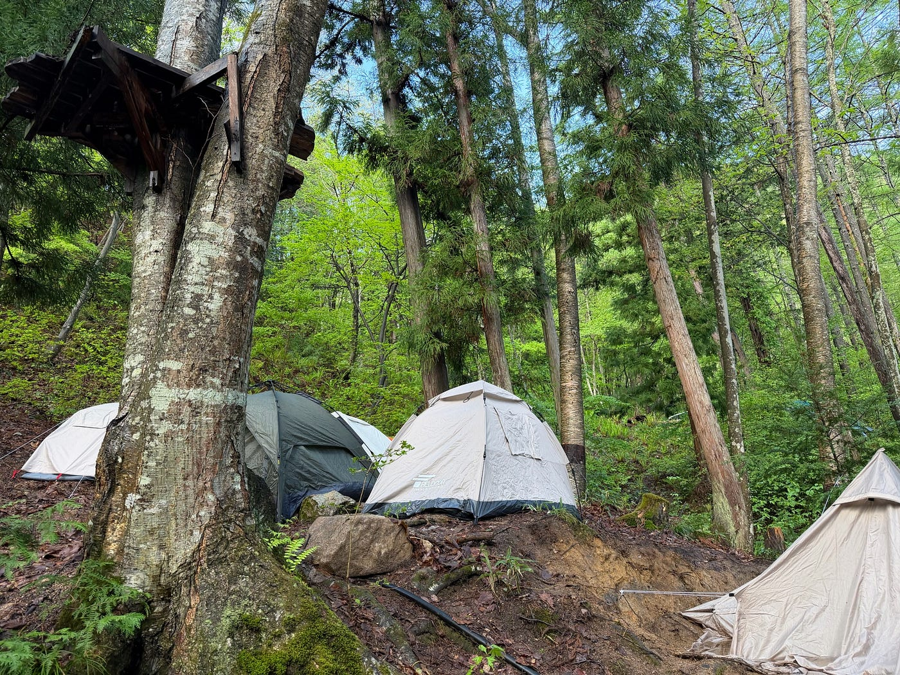
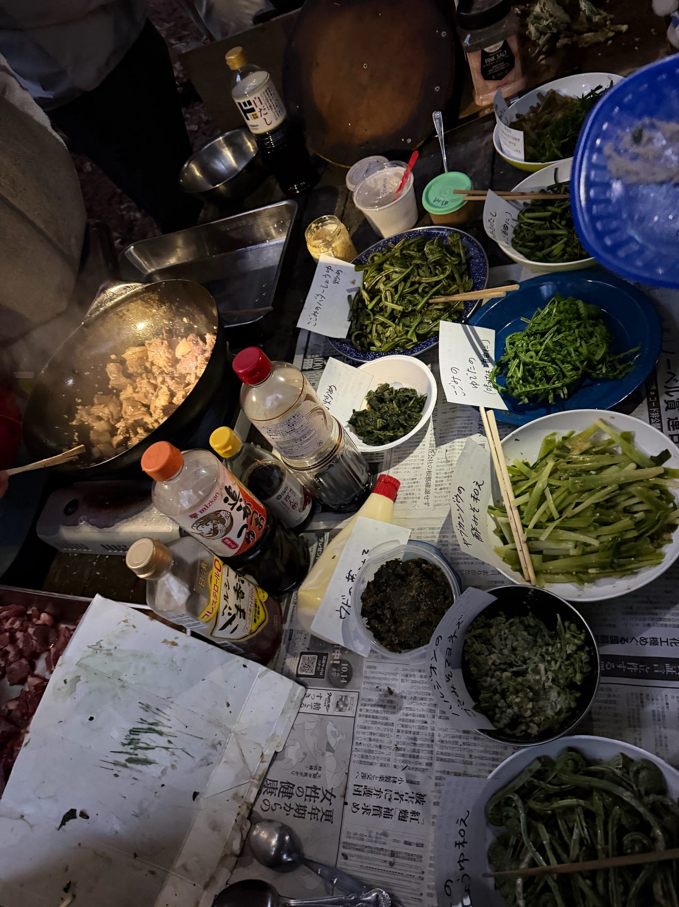
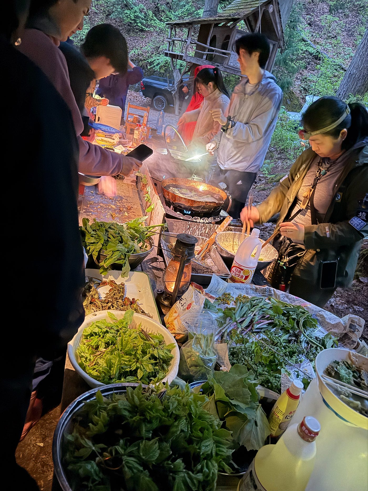
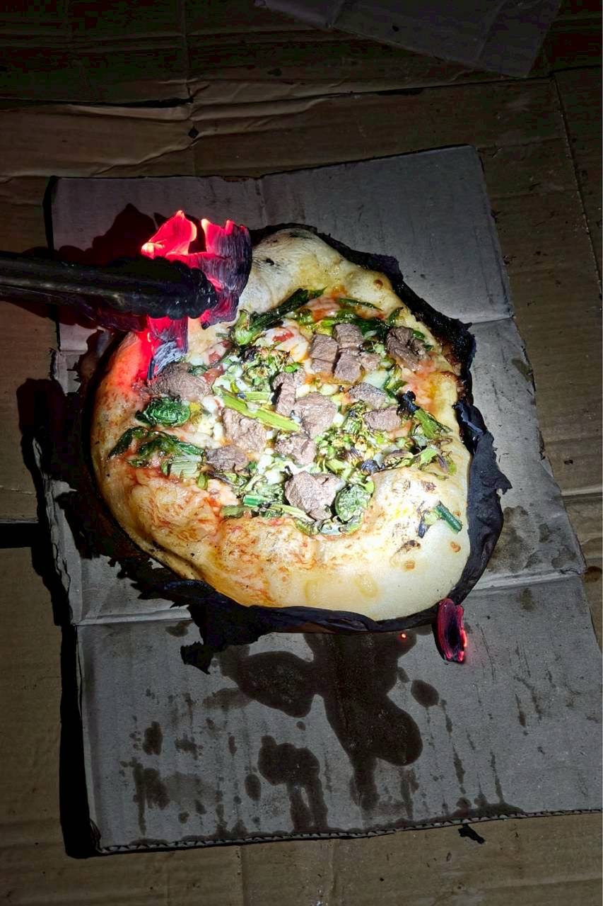
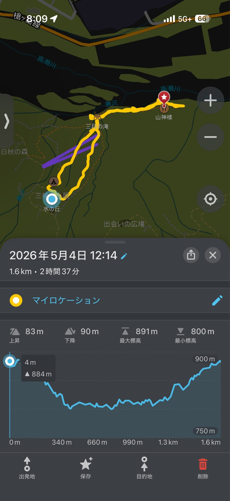
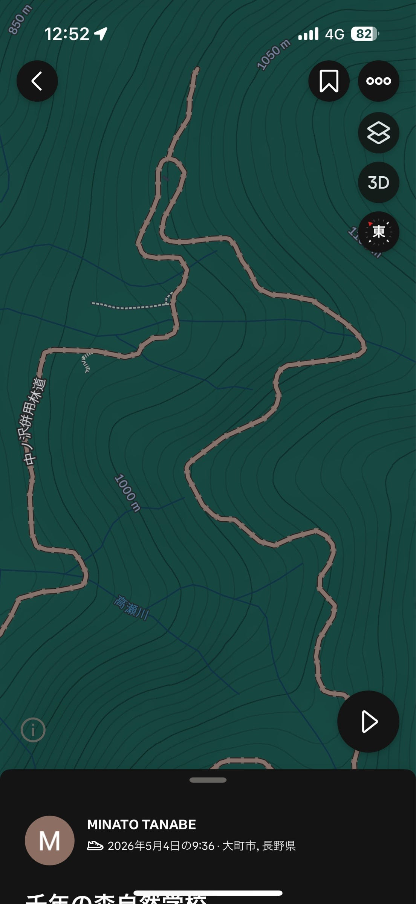
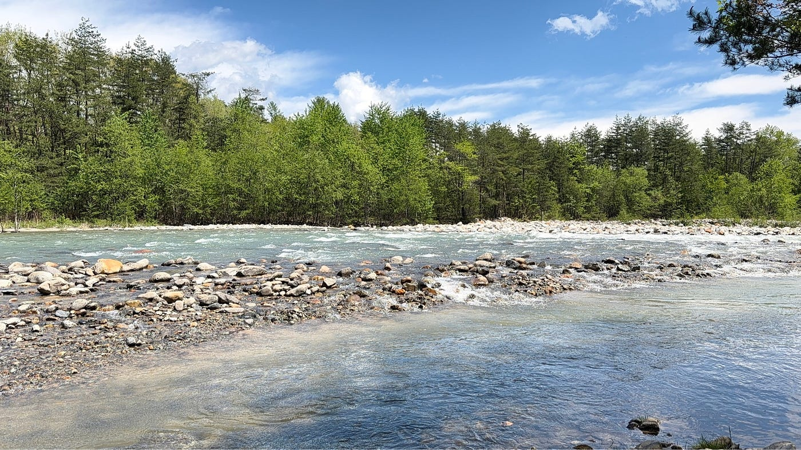
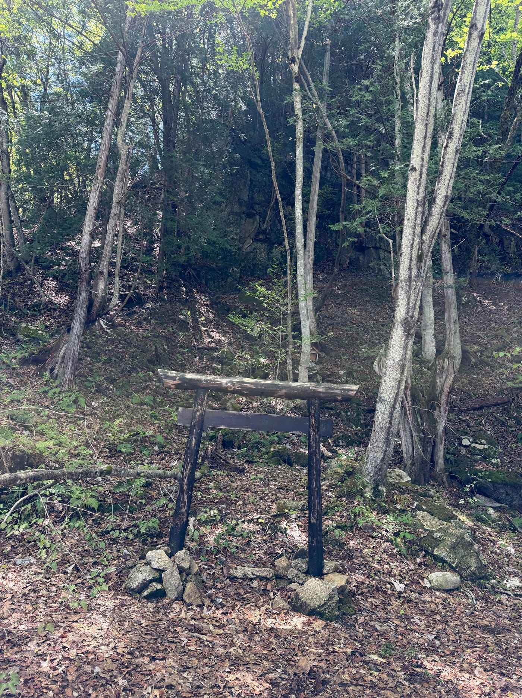
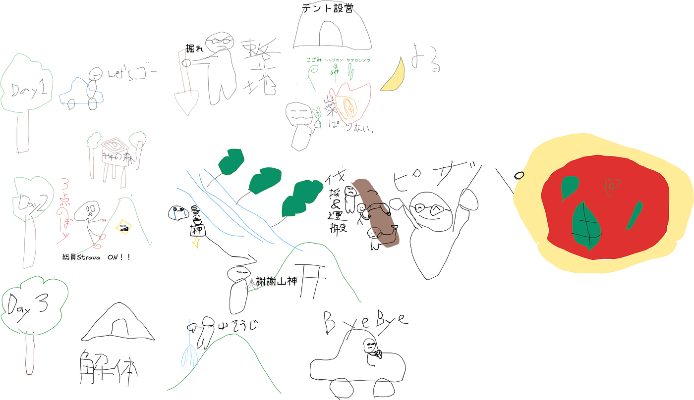

ツリーハウス合宿振り返り

3年の田邊です！古橋ゼミ毎年恒例のツリーハウス合宿のレポートです。

5/3から5/5にかけて、長野県の｢千年の森自然学校｣を舞台としたフィールドワークと、キャンプなどの自然体験をしました。

僕はキャンプ自体ほとんど経験がない上に、千年の森自然学校という場所に対する知識の無さから、行く前に想像していたことと実際の合宿の違いに驚きました。行く前は、合宿には運営スタッフ数人と古橋ゼミの生徒しかいないと考えていた上に、グランピング施設のようにお風呂やトイレやキッチンなどが使えると思っていました。しかし実際は、想像以上に自然のど真ん中での生活でしたし、多くの参加者がいて古橋ゼミとして活動する時間が少なく、自然学校の参加者全員で調理、飲食、清掃などを助け合っていました。

活動内容としては、初日は、わっぱらやという蕎麦屋に各々11時に集合して昼食を摂った後、千年の森自然学校へ移動してテント設営とそのための整地をしました。薪割りや食事準備、火起こしが毎日のようにあって、2日目には古橋ゼミの活動として、森の神サマへの挨拶のために、尾根を歩き、同時にStravaと｢Organic Maps｣に記録を録りました。最終日にはテントの解体やトイレ掃除など、山を元の状態に近づける作業をしました。

### ＜整地＞

テント設営のための整地では、剣先と角型スコップの2種類を用いて、切土と盛土を意識した平地作りをしました。剣先は硬い土を掘る際や土を掘る作業全般に対する使い勝手が良く、角型は盛土の均しや掘った土の運搬に使い勝手が良いと感じました。切土と盛土の地面では、切土の方がより頑丈な印象を受け、実際に雨が降ったあと、盛土は切土に比べて流されやすく、その上に置いていた丸太も移動していて不安定さを感じました。盛土を安定させるためには土の間の空気を抜いたりそこで植物を育て、根をはらして安定させることなどが効果的だと考えました。実際、整地区域には木が生えていて、その根っこは硬く、地面に起伏をもたらすためにかなり厄介な存在でした。

掘った場所から黄色っぽい土や黒い土が出てきて、断層になっていたのも印象的でした。また、土の断面に縦線が多く入っていて、それを地表に向かって伝っていくと小石があるのがわかりました。それらの小石によっておおよそ鉛直下向きの力を持つ水がコントロールされて、小地形を生み出していることに驚きました。もしこれがより長い年月をかけ、より強い水流によって風化し、より大規模な自然であれば、縦に岩が割れた岩石地形を形成するのかと思い、その実例がある地に行ってみたいと思いました。また、それが寒い場所であれば、水が凍り、岩を砕くなどの作用をもたらすことも予想できるのでその場合にはどのような地形ができるのか気になりました。

### ＜食事＞

自然学校での食事は、ちょうど山菜祭りが開催されていたこともあり、コシアブラやコゴミなどの10種類弱の山菜を中心とした山の食材を使った料理がほとんどでした。

料理は、山菜の天ぷらや猪肉を使ったおこわ、山菜の和え物などがあり、想像以上に料理数が多く、どれも山菜の味を活かした味付けで最高でした！個人的には山菜の中だと、コシアブラがお気に入りです。

そして、2日目の夕食では古橋先生が参加者に山菜ピザを振る舞いました。参加者の中には小学生や幼稚園生も多く居て、子どもたちが自分でピザを楽しそうに作っていました！大人たちも山菜やチーズを大量に使ったピザを作っていて、参加者の山菜とピザに対する想いが伝わってきました。古橋先生のピザに対する熱量はInstagramの投稿で少し感じていたのですが、目の前でピザ作りを見ると、小麦粉や水分量など細部までこだわっていることがわかりました。他の山菜料理を食べなかった子も山菜ピザを食べていたので驚きました。古橋先生のピザが持つパワー恐るべし

### ＜神サマへの挨拶マッピング＞

2日目には｢太陽の広場｣から｢山神様｣への道のりをStravaと、Organic Mapsでマッピングと、山神様に挨拶をしに行きました。山神様までの道のりは、行きは｢りんごの尾根｣沿いに歩き、｢大岩｣と呼ばれる地点や高瀬川を通りました。帰りは尾根ではなく、ツリーハウスが建設されている地点を多く通るルートを使いました。尾根に登るのとそこから下りるのに体力を使いましたが、1度尾根に登れば高低差や足腰への負担が少なく目的地に向かうことができました。

[https://strava.app.link/Rx3uMXdX72b](https://strava.app.link/Rx3uMXdX72b)

Stravaの記録を見てみると、尾根が等高線の丸みを帯びた部分を繋いだ直線とは少しズレがあることに気がつきました。知識として、尾根は等高線の山頂から丸みを帯びて出っ張っている部分を繋いだ線だと思っていたので、新たな発見となりました。また、小川が知識としての尾根沿いに流れていたため、今後新しい土地で川を見つける、水を得る際には地図を見ることも役立つと分かりました。また、それに対し、人間が使う道のほとんどが高低差が少なくなるように等高線に沿って轢かれていました。地図上では高低差が少なく思えますが、実際はそれでもかなりの坂でしたし、等高線の間隔からは想像できないほどの斜面が周りにあったのでこの知識と実際の地理情報の差に気づくことができるフィールドワークの楽しさに気づきました。また、林道が標高1000m地点を通っているものがあり、そこで等高線の間隔の狭い谷を避けて、間隔の広い部分で高低差に変化をつけている部分がありました。ただ、尾根を通り過ぎて谷の部分に道がある上、谷を一度に登りきらず、少し登って迂回してまた登ってるのでなぜそのような道になるのかあまり分からず、気になりました。

また、航空図を見てもツリーハウスが見つけにくいので、OpenStreetMapでのマッピングで見落とされがちなものの一つだと思い、Stravaなどのアプリ上にツリーハウスらしき建物が記録されているのは誰かが直接足を運んで登録したのか、そこの管理者や建設者が申請をしたりするのか疑問に思いました。

↓高瀬川

↓山神様

個人的に今回の合宿は楽しかった点とそうでない点をかなりはっきり感じました。いつの間にかスマホを手放せていたり、自然好きの人々と生活ができたり、山の食事ができたり、薪割りや整地ができたことなど自然に囲まれた環境での生活が特に楽しかったです。しかし、毎日降る雨でテント内が浸水したり、帰りの高速道路の渋滞に巻き込まれたこと、先輩たちから聞いていた、動物の解体ができなかったことが残念でした。それでもあれだけ自由に山に手を加えたり、山の食べ物を使うことができる経験はとても貴重だと大人たちが言っていたので今後のキャンプ経験を通してツリーハウス合宿の価値を高めていきたいです。

今回の合宿の2日目はテント内の浸水が酷かったため、車中泊をしたので、次のキャンプからはグラウンドシートの耐水、防水性能を高いものへと変え、テント内での生活をより快適なものにしたいです。また、調理道具や火起こしの道具などのほとんどを用意されているものに頼ってしまい、自由度が少なかった上に使い方に困ったり、共有財産として扱わなければならなかったので、次回からはガジェットを少しずつ揃え、不自由さを減らし、自分でできることを増やしていきたいです。あとは運転技術を向上させたいです。今回がほぼ初運転で往復500km走り、危ない場面に遭遇したり、千年の森自然学校で鹿の群れと遭遇したり、運転の難しさも楽しさも知った合宿でした。

