### 風景で1番目立つ広告の特徴について【デザイン2】

こんにちは！4年デザイン部の稲田です。今週私たちは街を歩いて何枚か写真を撮り、それぞれの中で一番目立っている広告や電子掲示板はどんなデザインか見ていくテーマを考えました。

#### ⭕️広告比べのポイント

目立っていた広告の色や形、大きさ、フォントなどを一番気づくのに時間がかかった広告と比較し、特徴の違いをまとめました。また、昼と夜で比較したら面白そうという萌の意見をもとに、複数時間での比較をしてみました！グラレコやポスターを描く際の参考にもできそうですᝰ✍🏻

#### ゆうか

私は溝の口の駅前や駅周辺の風景を撮影しました。撮ったあとで、溝の口は渋谷や新宿とは異なり電子の広告がかなり少ないように感じたため、他の街でも比較してみたいと思いました。

①駅前 昼← →夜

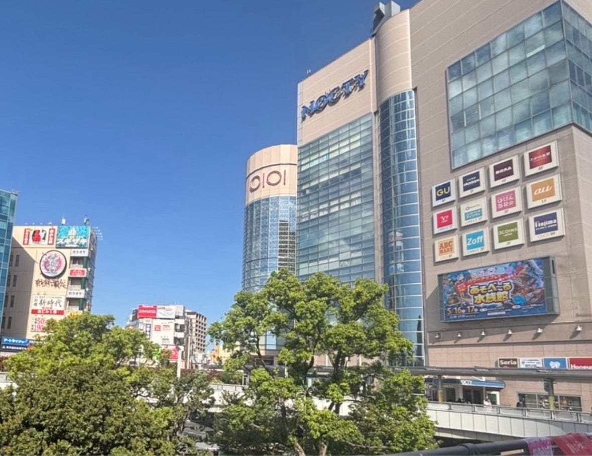

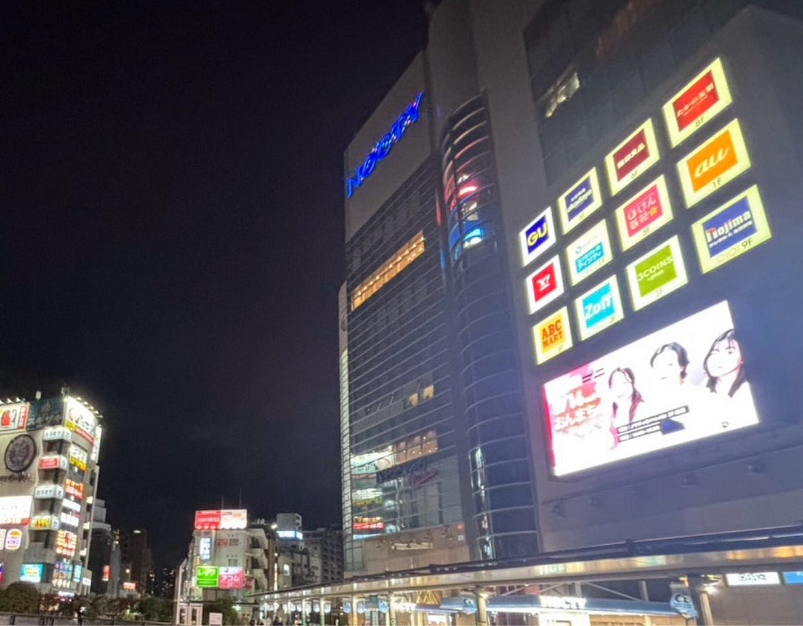

特に目立っていたのはNOCTYプラザの店舗名表示や電子広告でした。昼も夜もよく目立っていましたが、夜はライトアップされて白縁が目立ち、より見やすく感じました。文字数の少ないGUやY!mobileは、似たような色の店舗がある中でも特に目立っているように感じました。また、遠目から見ると、黄色地に赤文字で目立ちそうなABC MARTより、上段の背景が紺色や赤色の広告の方が目立っているように感じたのも驚きでした。背景は濃い色の方が良いのかもしれません。

②駅周辺 昼← →夜

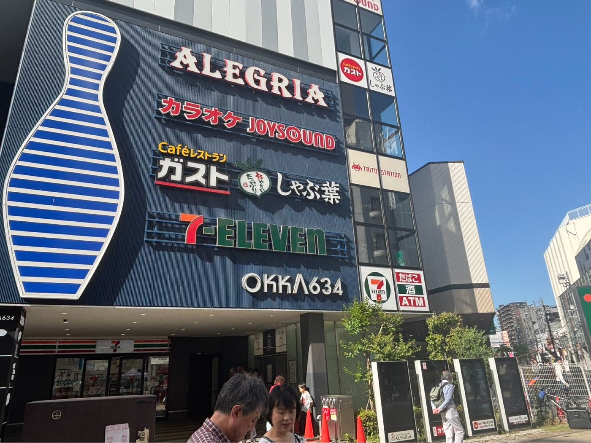

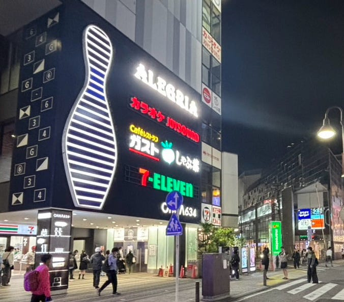

広告は文字だけではないと感じました。大きな絵はムサシボウルというボウリング屋さんのものですが、昼も夜もご飯屋の名前より先にボウリングの絵が目に入ります。また、夜になると広告の上や横・下など、周りにライトを散りばめているところもよく見かけました。

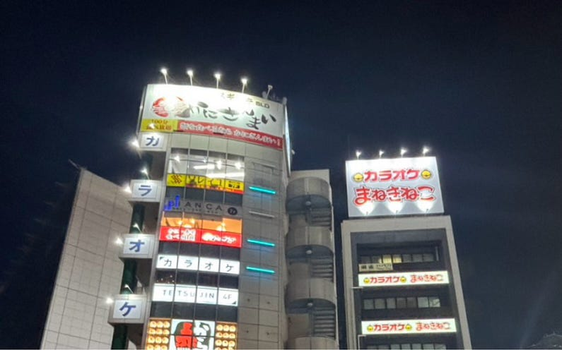

粒のような点でも、縁取ると広告の文字が目立つと分かりました。グラレコの文字の縁としても応用できそうです。

#### もえ

私は淵野辺駅周辺の風景を撮影し、昼夜で比較してみました。

①

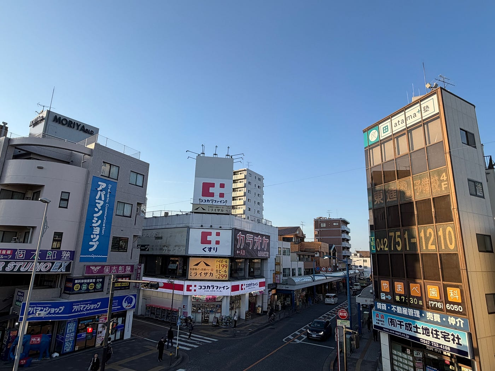

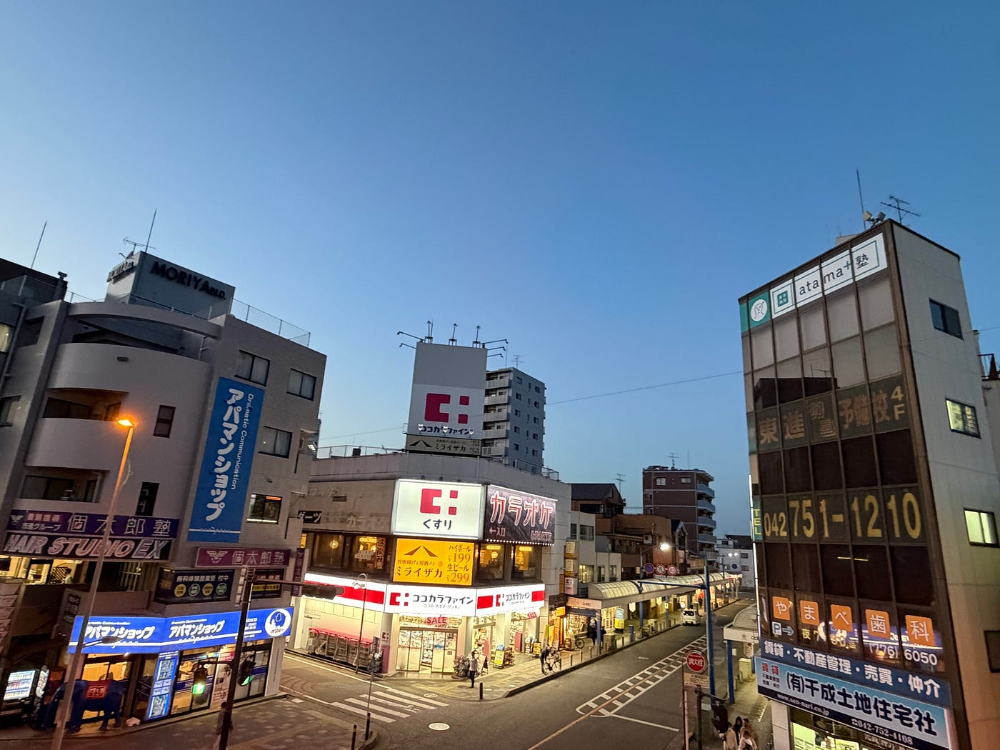

夜になると、発光している看板が強く目立って見えました。特にココカラファインの赤と白の看板や、アパマンショップの青と白の看板は、背景と文字の色のコントラストが強く、遠くからでも認識しやすかったです。
また、ミライザカの黄色い看板は、周囲であまり使われていない色だったため、広告の中でも特に目立って見えました。発光していることで周囲の暗さとの対比も強まり、夜は光を持つ広告が景観の中心になっているように感じました。

②

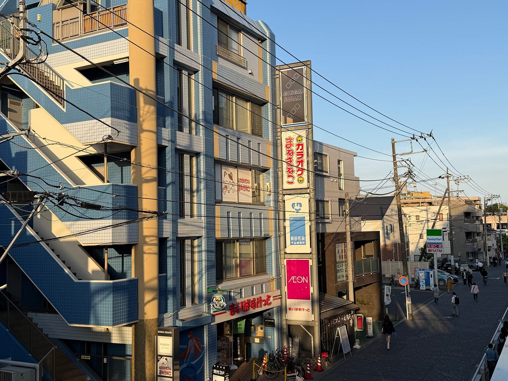

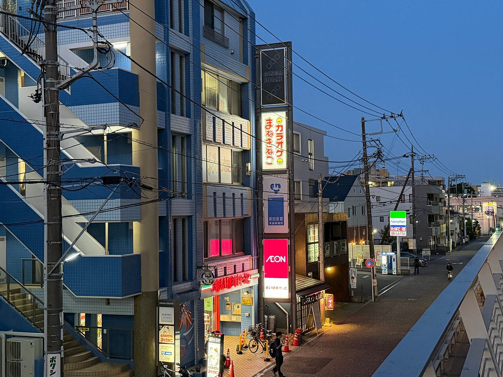

日中でもAEONのピンク色やカラオケ店の赤い文字など、色の強い広告は目立って見えました。また、夜になると発光していることでさらに視線を引きやすくなっていました。特に遠くにあるファミリーマートの蛍光緑の看板は、昼はそこまで目立ちませんでしたが、夜は発光によって強く認識できました。
また、AEONの看板のように、文字が細めでも背景色が濃い色だったり、強く発光していると目立ちやすいと感じました。特にこの場所では、建物と看板の色のコントラストが強い広告ほど視線を引いていました。一方で、新田医院の青と白の看板は建物の色と近く、周囲に同化して見えたため、他の広告より目立ちにくかったです。色のコントラストや光の有無が、広告の視認性に大きく関係していると感じました。

#### みわ

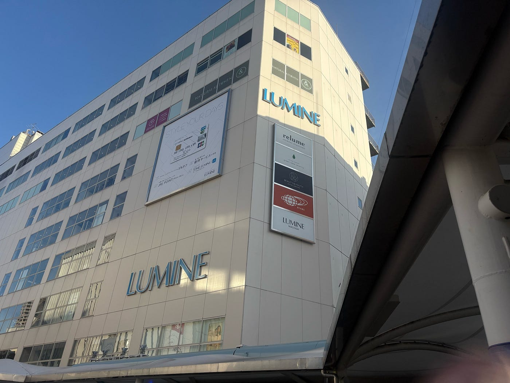

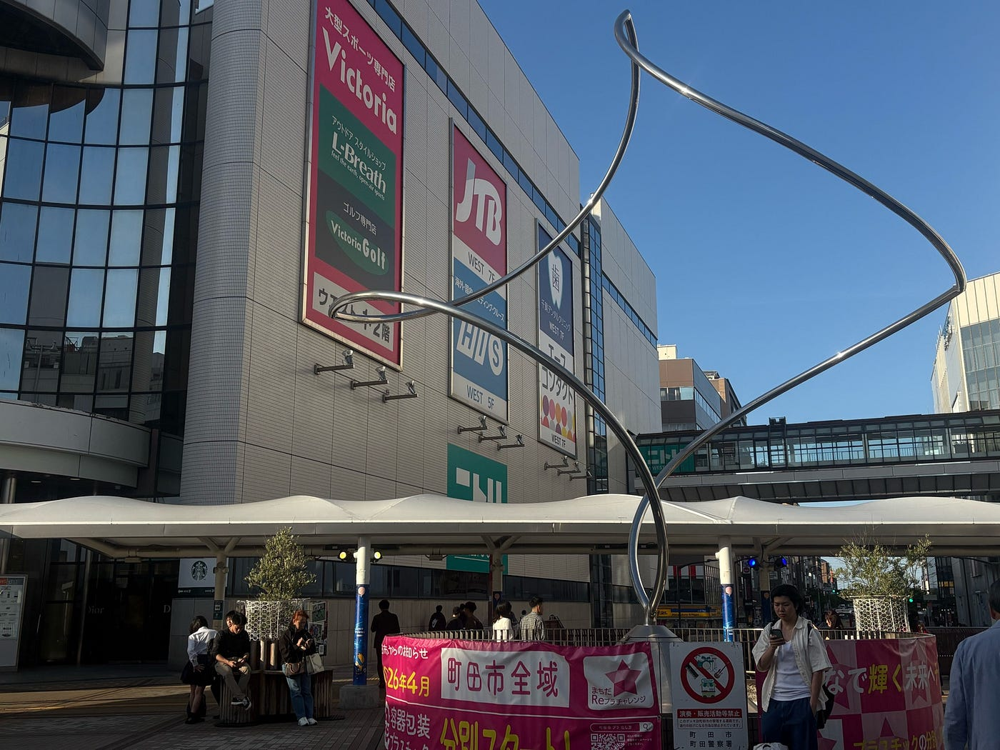

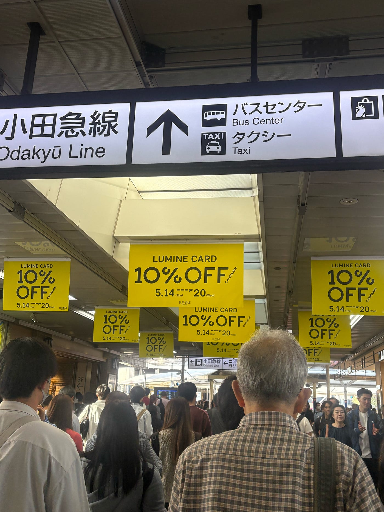

私は今回町田で昼頃の風景を撮ってみました。

町田は夜、早めに閉まることが多いため、昼頃に見てもらえる広告にフォーカスしている気がしました。特にルミネはキャンペーンを目立たせるため、広告を1枚にするのではなく、3枚を1列で並べ、それを何列か作ることでより視点を向けさせていると感じました。また、単色でまとめたのも工夫を感じました。

私はいつも渋谷や新宿などの都会に出る度、大きな広告を無意識に見ている気がします。そうした広告から得られる情報はいつも自分の購買意欲に繋がっているので、消費者を増やすための様々な工夫が施されているのだと改めて感じました。シンプルな広告ほど適当に作られてるわけではなく、人を惹きつけるためのマーケティング戦略から作られたものなのだと思いました。

#### 全体感想

普段街を歩いている時には何気なく景色や広告を見ていましたが、様々な風景を見る中で、複数の広告の中でも広告の色味やライトの有り無しによって、薄い色や細い文字でも目立つものと気づきにくいものがあったり、文字ではなく絵だけで表す広告があったりと、一瞬で目を引くデザインを作るには様々な工夫がいると分かりました。

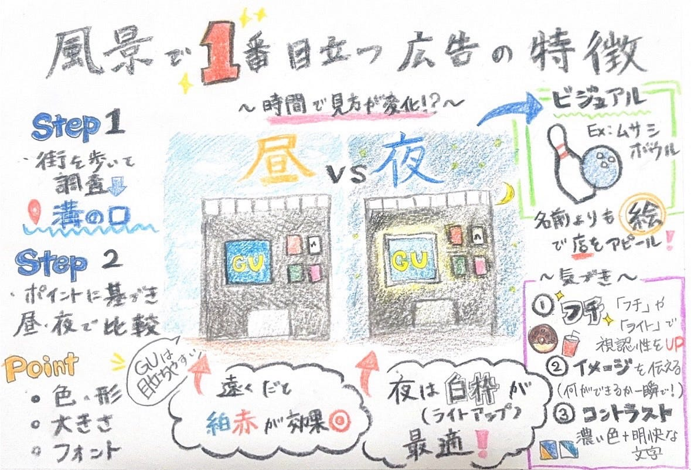
