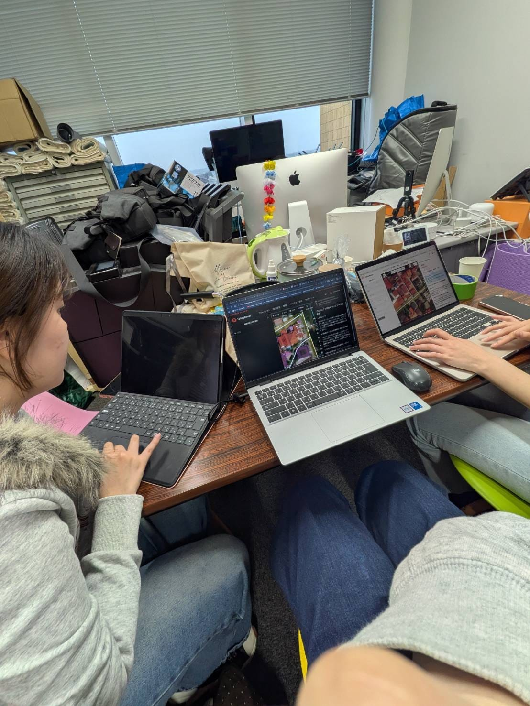
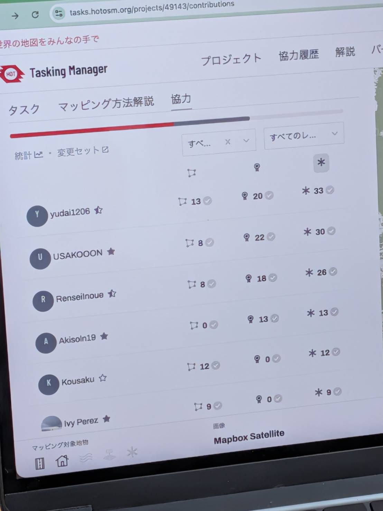
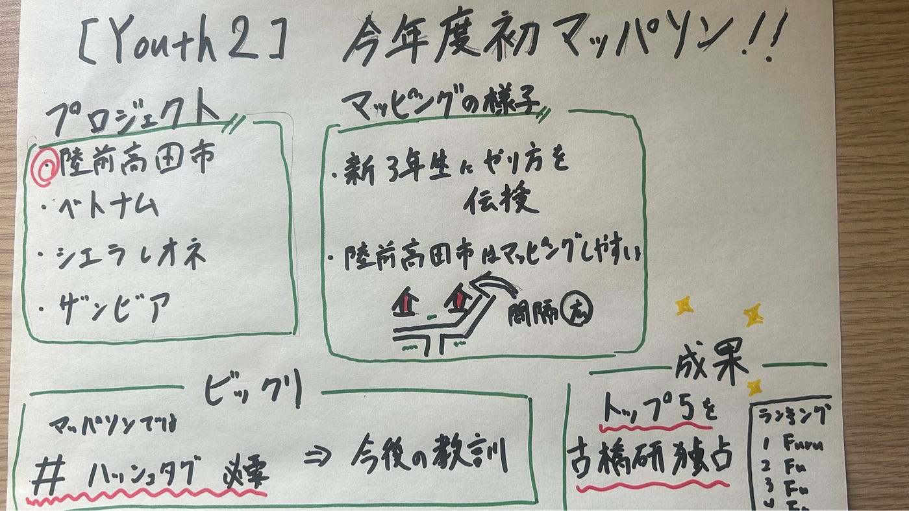

### 【Youth2】今年度初めてマッパソンに参加してみた

こんにちは、4年の井上です。ついに四年生になってしまったことをこの週報を書きながら改めて気づいてしまい驚きです...引き続きゼミ活動を頑張ろうと思います！

さて、本日は先日行われた2026 International Humanitarian Mapathonの活動報告になります。おそらくYouth1も同じような週報を書きそうな気がするけどこっちの週報も見てくれると嬉しいです。

私たちが今回取り組んだプロジェクトは以下の4つです。

・[東日本大震災からの復興更新マッピング | 陸前高田市, 岩手県](https://tasks.hotosm.org/projects/49143)

・[Vientiane Historic Core & Chao Anouvong Studium — Walkability & Inclusion](https://tasks.hotosm.org/projects/44787)

・[シエラレオネ：フリータウン東部 建物・道路マッピング](https://tasks.hotosm.org/projects/44589/)

・[Zambia Floods response 2026: Chambeshi priority 2](https://tasks.hotosm.org/projects/48780)

今回私は陸前高田市のマッピングをメインに行いました。

> _マッピングの様子_

今回のマッパソンは新3年生に建物や道路のマッピング方法について教えながら取り組みました。Youth2の3年生れあらもひなこ先輩に優しく教えてもらいながら頑張っていました！

陸前高田市のマッピングは普段取り組むことが多い東南アジアに比べて簡単な印象でした。東南アジアほど住宅が密集しておらず建物と建物の境界線が分かりやすいため建物の区別がつきやすかったです。

その結果今回はかなり実績を積むことができ、貢献ランキングでもトップ5を古橋研究室が独占することができました！（おめでとう）

しかし、ここで衝撃の事実に気づきます。このマッパソンでの古橋研究室の貢献度をカウントするためには、特定のハッシュタグをつけないといけないのですが、誰一人として付けてなかったのです...

残念ではありますが、今後の教訓にしたいと思います。

> _まとめ_

今年度初のマッパソンはプチハプニングもありましたが、新3年生に教えるという一番の目的は果たせたと思うので結果的には良いマッパソンになったと感じています。

実際にれあらにこのマッパソンの感想を聞いてみました。

「最初はどれが建物なのか見分けることすら難しかったですが、2日目のマッパソンの時には１４タスク完了していました。
このようにして地図は日々更新されていることを実感しました。
今回は建物マッピングメインだったけど、道路マッピングなどもできるようにして中級マッパーを目指していきたいと思います！！」

とのことで、マッパソンを十分楽しんでくれたかなと思います。

今後もYouth一丸となって頑張っていきたいところです。

最後にグラレコです

