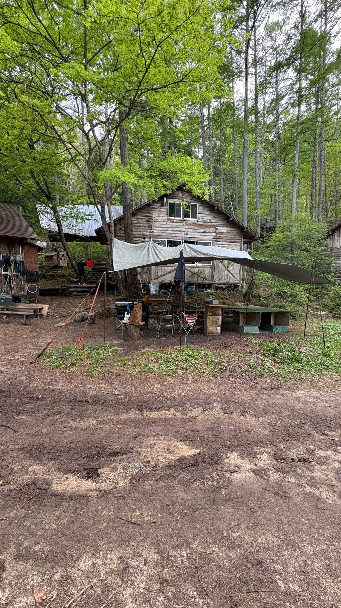
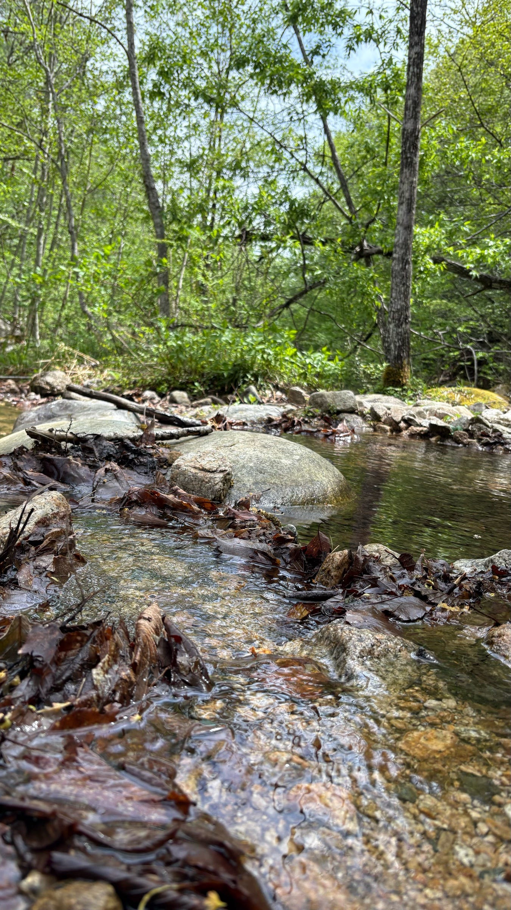
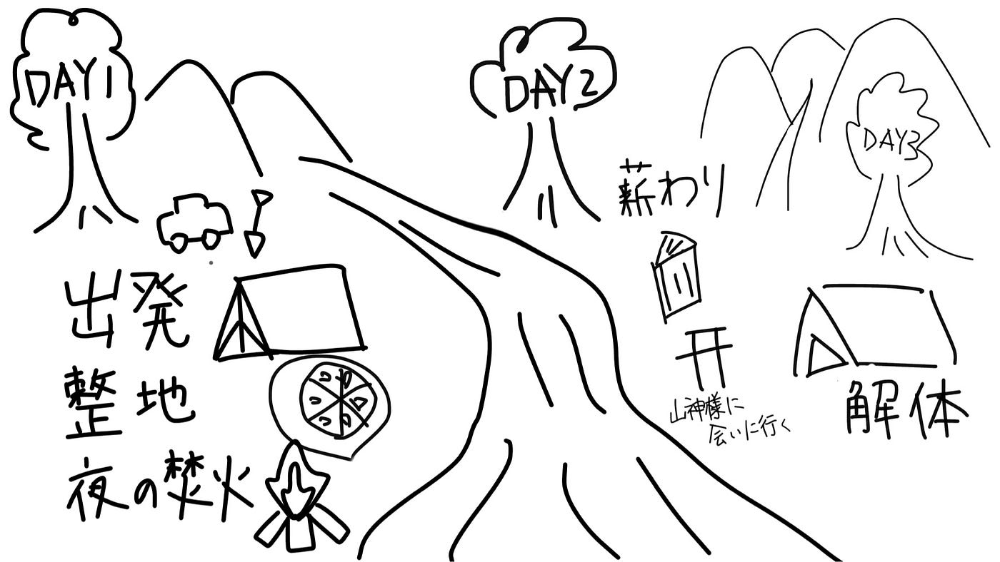

## ゴールデンウィークの挑戦：

こんにちは！新緑が目に鮮やかで、風が心地よい季節になりましたね。

今回は、今年のゴールデンウィーク（5/3〜5/5）を利用して訪れた長野県大町市にある「千年の森自然学校」での体験をまとめようと思います。2泊3日という限られた時間ではありましたが、スマホの電波やコンビニが当たり前にある日常から切り離された環境での「ツリーハウス合宿」は、想像以上に刺激的で、多くの気づきを与えてくれるものでした。

始まりは快適なドライブから

今回の長野への旅は、親の車を出してもらい、現地まで送ってもらう形での移動でした。

ゴールデンウィークの混雑を避けながら、高速道路を走り、窓の外がビル群から徐々に深い緑へと変わっていく景色を眺める時間は、これから始まる「非日常」への期待を高めてくれるひとときでした。エアコンの効いた快適な車内。この時はまだ、数時間後には泥だらけになるとは、少しも想像していませんでした。

活気あふれる自然の中での共同生活

現地に到着して車を一歩降りると、そこには都会とは明らかに違うひんやりと生命力に満ちた空気が流れていました。

驚いたのは、その「活気」です。私たちのゼミ生だけでなく、地元の団体や小さなお子さんを連れた親子連れなど、多様なバックグラウンドを持つ人々が同じ場所に集まっていました。聞こえてくるのは鳥のさえずりだけでなく、薪を割る音や子供たちの歓声、そして焚き火を囲んで談笑する人々の声など。自然学校全体が、一つの生命体のように賑やかなエネルギーに満ち溢れていました。

1日目：雨と岩との格闘、そして山の恵み

初日のメインミッションは、寝床の確保、つまり「テント設営のための土台作り」でした。

しかし、ここでのキャンプは、オートキャンプ場のような平らで整備された区画を借りるのとは訳が違います。私たちが割り当てられた場所は、木々が立ち並ぶ急な斜面。「まずはここを平らにするところからだ」という先生の言葉に、最初は耳を疑いました。

スコップを手に取り、慣れない手つきで土を掘り進めますが、一筋縄ではいきません。土の下には、何十年、何百年とそこにあったであろう巨大な岩がいくつも眠っていました。スコップが岩に当たるたび、手に痺れるような衝撃が走ります。

「これは終わらないかもしれない……」

そんな不安がよぎる中、ゼミの仲間と「ここはもっと掘れる」「そこに石を詰めて土台を固めよう」と声を掛け合い、試行錯誤を繰り返しました。泥だらけになりながら数時間。なんとか11人分のテントが収まる土台を完成させた時の達成感は、これまでの学生生活で味わったことのないものでした。

その日の夕食は、他の団体の方々が山を歩いて採ってきてくださった採れたての「山菜」をいただきました。口に含んだ瞬間に広がる独特の苦味と爽やかな香りは、今までにない感覚でとても新鮮でした。

しかし、山の洗礼はこれで終わりませんでした。夜になると、無情にも雨が降り始めました。

初めて体験する本格的なテント泊。雨音がキャンバス地を叩く音は予想以上に大きく、気温の低下が追い打ちをかけてきました。寝袋に潜り込んでも伝わってくる地面の冷たさに、正直「早く家に帰りたい……」と心が折れかけましたが、仲間と「寒いね」と苦笑いしながら過ごす夜もまた、フィールドワークにおける貴重な経験なのだと自分に言い聞かせ、就寝しました。

2日目：泥だらけのハイキングと林業体験

2日目は一転して、雲一つない快晴でした。

濡れた森が太陽の光を浴びてキラキラと輝く中、周辺のハイキングに出かけました。しかし、このハイキングもまた険しい道を行くハードなものでした。

私はこの日、あろうことか「白Tシャツ」で挑んでしまうという痛恨のミスを犯してしまいました。案の定、アップダウンの激しいコースで足を取られ、気づけばTシャツは泥だらけ。「終わった……」と絶望しましたが、不思議と自然の中にいると、そんな些細な汚れはどうでもよくなってくるものでした。

> 太陽の光を全身に浴びながら、急な斜面を踏み締め、冷たい川を渡る。途中で見つけた河原で「水切り」に熱中し、子供の頃のような時間が、何よりも心地よく感じられました。

午後は「林業」についての学習に充てられました。

現地の林業専門の方からは、木を伐採する際に向きや重心を計算する高度な技術や一歩間違えれば命を落としかなない林業の厳しさについてお話を聞きました。

夜の贅沢：山菜ピザとキャンプファイヤー

2日目の夜は、合宿のハイライトとも言える豪華な時間でした。

先生による特製「山菜ピザ」を堪能した後は、近くのスーパーまで買い出しに行き、夜のメインイベントである「キャンプファイヤー」を囲みました。

火を囲むのは、思えば小学生の林間学校以来のことです。暗闇の中で揺らめく炎をじっと見つめていると、自然と心が開放され、普段の大学生活では話さないような深い話題や将来への不安、希望について仲間と語り合うことができました。

最後に

最終日、再び親の車に乗り込み、帰路につきました。車内の柔らかいシートに座ったときに、日常がいかに快適で恵まれているかを再確認しました。

2泊3日という旅は、私に「不便さの中にこそ、真の豊かさがある」ということを教えてくれました。スイッチ一つで暖かくなり、蛇口をひねれば水が出る。そんな当たり前の日常の裏側にあるものを少しだけ肌で感じることができた気がしました。

今回学んだのは、単なるキャンプのスキルだけでなく、自分の目で見て、手で触れ、五感を使ってキャンプ生活を感じることができました。この経験を糧に、これからの大学生活においても、現場を大切にする姿勢を持ち続けたいと思います。

[strava.app.link](https://strava.app.link/BXKO3Pwv42b)

