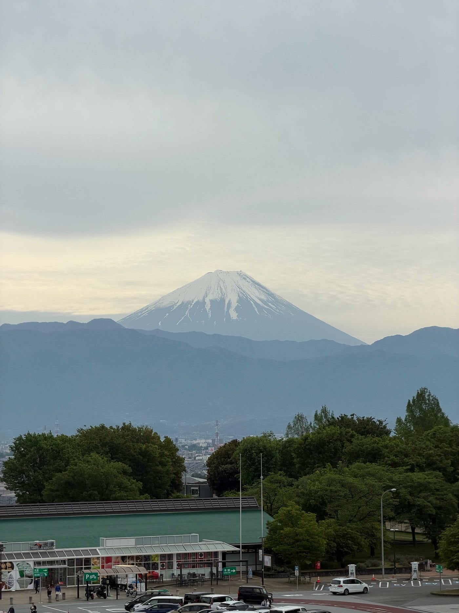
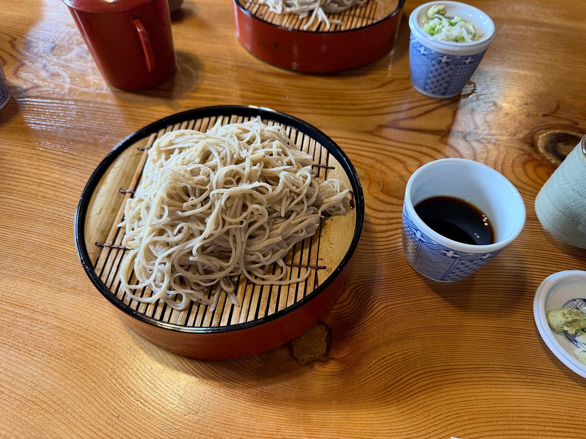
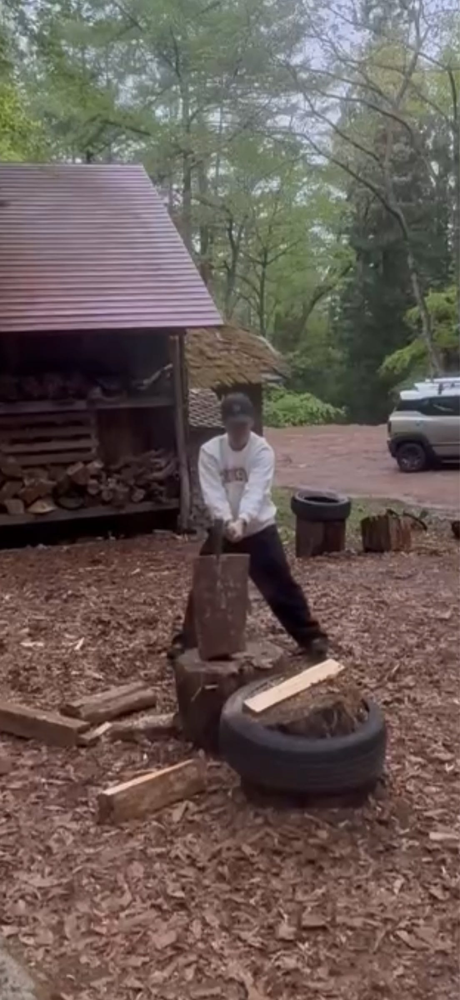
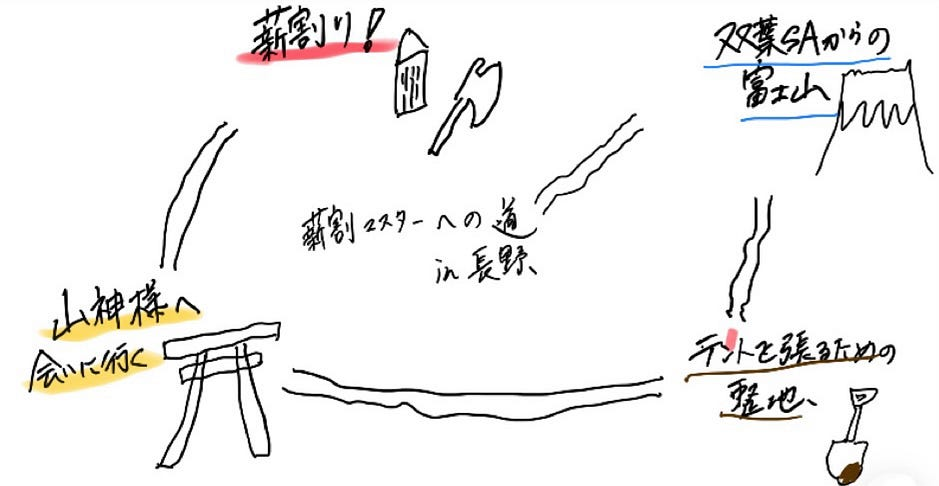

## 薪割りマスターへの道～長野ツリーハウス合宿～

こんにちは！3年の松本です、今回は長野へツリーハウス合宿に行ってきたのでそのことについて話していこうかなと

今回、3年生は２つのグループで長野へ向かいました。自分の班は深夜発で双葉SAへ向かい、朝まで仮眠を取りました。朝起きた後には双葉SAから綺麗な富士山を見ることができて眠たい目を一気に覚ませてくれました。

朝食を食べて少ししたら、昼食として先生オススメのそばを食べに行きました。寝不足の体に染みる美味しいそばで、今回は冷たいそばを食べたので、次は温かいそばを食べたいなと思いました。自分的には温かいそばが好きなのですがみんなはどっちが好みなのでしょう。

さて、そばを食べ終えた後は千年の森へ向かいました。思った以上に山道が長く、最初運転していて少し怖かったのを覚えています。

千年の森に着いた後、僕らはテントを建てるために土ならしをしました。地面深くに埋まっている石を取るために奮闘してあと一歩のところまで掘り進めてトイレ休憩に行った時に、まさかの他の人に石を掘り起こされてしまいました。まぁまぁしゃーないね。

意外にも女子が整地がうまくてびっくりしました。なんか偏見だけどやっぱりこういうのは男子が上手いのかなと思っていたので。

整地を行い、テント張りを始めました。テント張りは自分にとって初だったのですが意外とノリと勢いでいけるようで安心しました。

テントを建てた後に薪割りへチャレンジしました。自分にとって初めての経験だったのですが瞬時にコツを掴み、薪を割る快感に目覚めてキャンプ中、暇があれば薪割りしていました。個人的には回転割りの方が割っていて楽しいです。そんな感じでどんどん薪を割っていて、気づいたら割るための薪は俺とみなとでほとんど消化してしまいました。のちに一回転割も無事習得し、薪割りマスターになりました。

1日目の夜は雨が降りテント内に自然の涙の音が聞こえて非常に寝心地が良くなかったです。２時間に一回は起こされてまともに寝られなかったです。まぁこれも人生経験だなぁと夜にしみじみ感じながら目を閉じました。

二日目には山神様に会いに、山の中を散策しました。思っていた以上に山神様へルートは遠く、川を渡る時もあり、長く絶妙な太さの竹が非常に役に立ちました。

さらに木の伐採方法も本業の人に教えてもらいました。実際に木を切る時には思ったよりも複雑な工程があること知り、現在でも死傷者が出るという事実を知り、林業のイメージが一気に変わりました。今回は天候が悪く、地面の状態も良好ではなかったため体験ができなかったのですが、いつか実際に自分で伐採する工程を挑戦してみたいと思っています。

また、今回は山菜パーティーだったので常に山菜が食事に出ていました。自分は舌バカなのでそれぞれの山菜の種類があったそうですが、味はほとんど変わらなかったけど美味しかったです。最終日には先生が山菜ピザを作ってくれました。ピザの味が強くて美味しかったです。

最後に、今回のキャンプを通して意外と自分はサバイバルでも生きていけそうっていう謎の自信がつきました。ここは普段のありがたみを感じましたって書くところだと思うんですけど、ありきたりで面白くないかなって思ったんでやめました。薪割りの習得の速さとか直感でテント立てられたりとか意外とノリと勢いでなんとかなるかなぁと希望的観測で感じました。

ちなみに薪割りをやりすぎたせいで、途中から「この薪はどう割れば綺麗に割れるのか」ばかり考えるようになっていました。最初は普通に割っていたのですが、だんだん回転割りとか一回転割りみたいな変な方向に進化し始めて、気づいたら完全に薪割りがメインになっていました。多分あの場にもっと薪があったら最後までずっと割っていたと思います。

https://omaps.app/w3gv98e0xO/2026年5月4日_15%3A28

om://w3gv98e0xO/2026年5月4日_15%3A28

