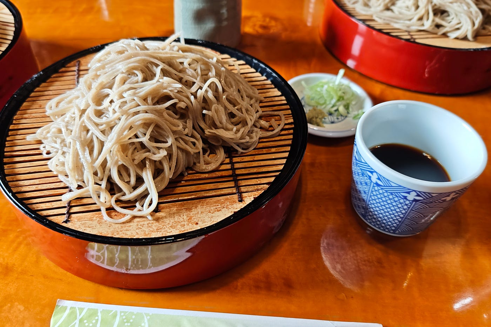
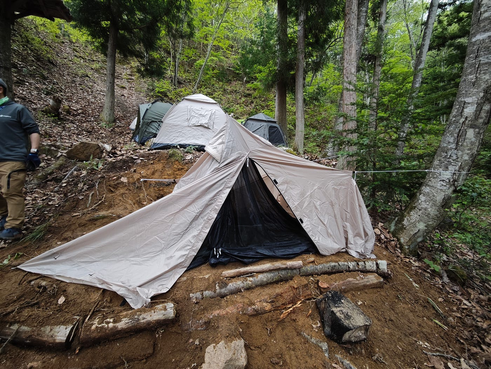
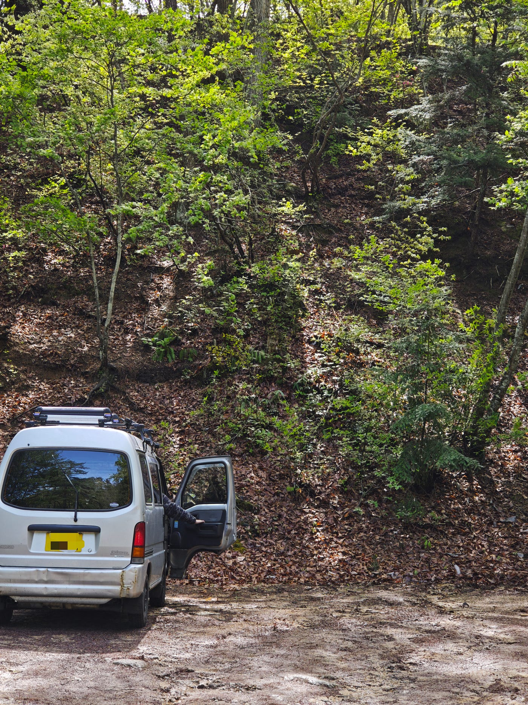
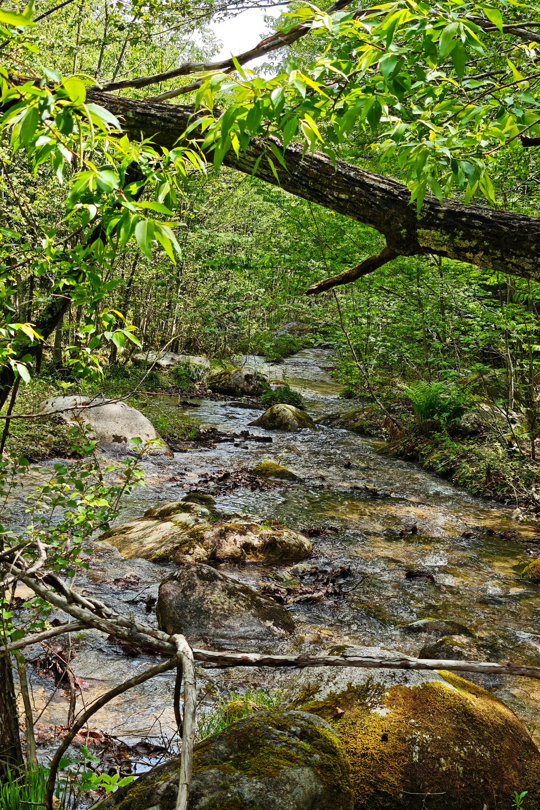
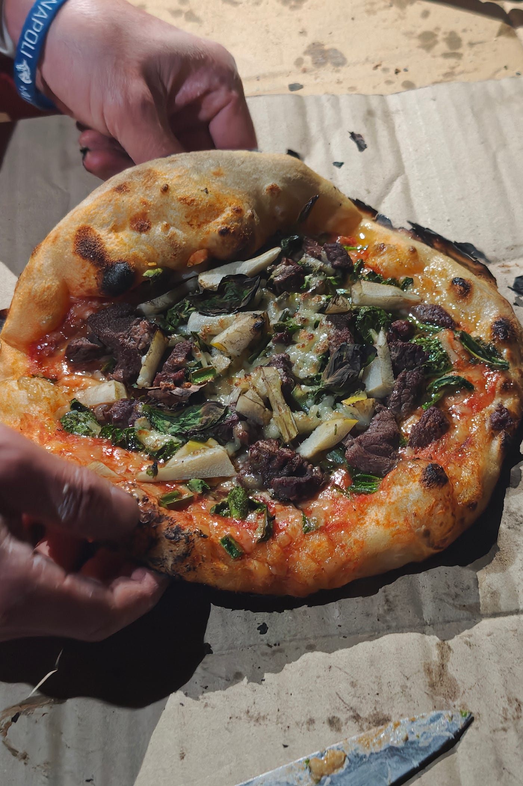
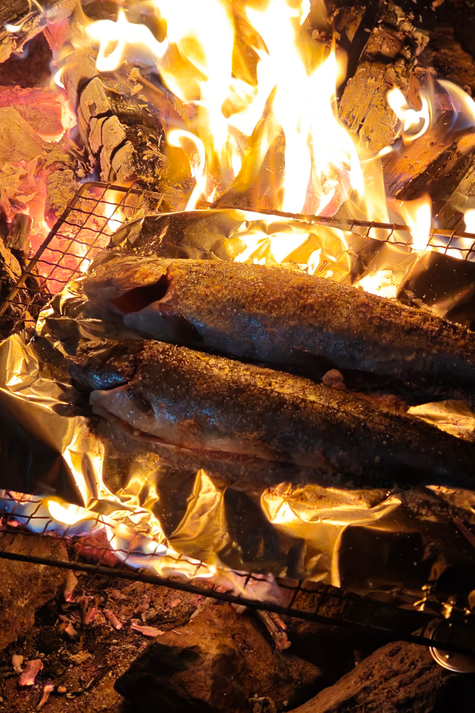
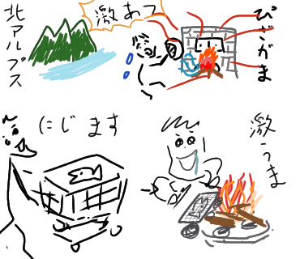
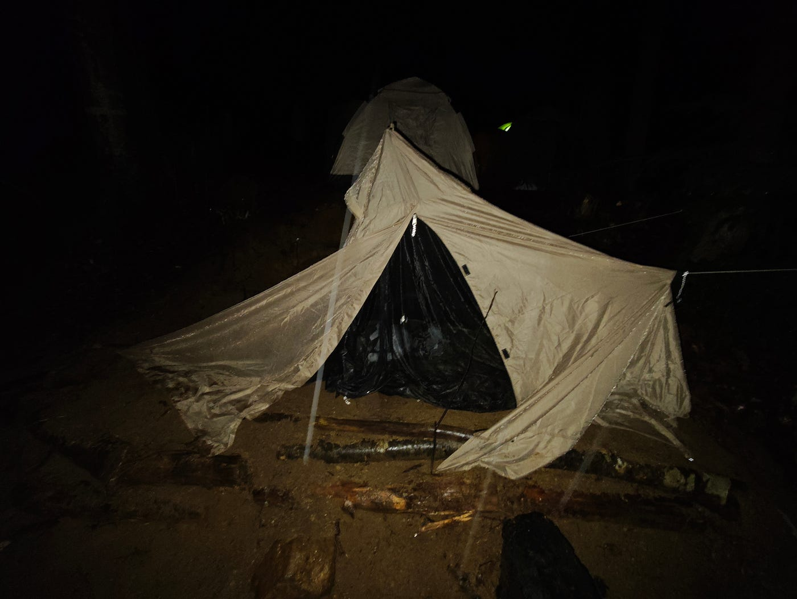

### 長野の自然 奥深く デジタルから束の間の休息

こんにちは！渡辺優斗です。

古橋ゼミに所属して早１ヶ月が経ちました。気づけば太陽に照らされ半袖の季節に。つい先日ゼミに応募したというのに、時の流れの速さに焦らされます。

さて、今回は初のゼミ合宿・フィールドワークとなる、「ツリーハウス合宿」について、得た学びや所感をまとめていきます。

### ツリーハウス合宿とは

長野県大町市に位置する「1000年の森 自然学校」にて行われる2泊3日のフィールドワークです。

1000年の森は、300haの広大さに、30のツリーハウス、7つの沢に、20の滝があり、まさに大自然という言葉がピッタリの場所です。

参考資料 1000年の森 ホームページ

[千年の森自然学校 in 北アルプス森のくらしの郷　LET'Sキャンプ！ - 僕らの森は、３００ｈａの広大な森！　日帰りイベントもあるけど　やっぱりキャンプしゃなきゃ！　３０のツリーハウス、７つの沢、２０の滝、標高差７００ｍ、カモシカが約２０頭、そして自由な仲間たち。静かに森を楽しむもよし、みんなで森を歩き出せば発見があり、いつのまにか遊びが始まる！ちょっとかわってるけど手ぶらでもOK　飛び込んでおいでよ！(年中無休：完全予約制）
僕らの森は、３００ｈａの広大な森！　日帰りイベントもあるけど　やっぱりキャンプしゃなきゃ！　３０のツリーハウス、７つの沢、２０の滝、標高差７００ｍ、カモシカが約２０頭、そして自由な仲間たち。静かに森を楽しむもよし、みんなで森を歩き出せば発見があり、いつのまにか遊びが始まる！ちょっとかわってるけど手ぶらでもOK　飛び込んでおいでよ！(年中無休：完全予約制）
morikura.com](https://morikura.com/)

### 1日目 出発〜到着

まずは、辿り着かなければ始まりません。車で向かう3年生9名は、その居住地によって2つの車に配車されました。Googleマップによると順調に行けば3時間半程で着くとのことでしたが、ドライバーが全員初心者、加えてゴールデンウィーク中ということで、私たち淵野辺住組は当日朝 6時に集合し、集合予定時刻の11時に5時間の猶予を持って出発した訳です。

これが今思い返せば好判断で、最悪道を間違えたり、渋滞に巻き込まれたとしても大丈夫だろうと、時間の余裕が精神的余裕に繋がり、まさかの高速を走るのは教習所以来というドライバーの拙い運転ながらも、無事11時15分頃に集合場所へ到着しました。（ドライバー、ありがとう！）

余談ですが、もうひとつの車、東京組は前日夜遅くに出発し、途中車内で仮眠をとったとかとってないとか、、、なんとも過酷な旅ですね。
ともかく、無事全員、集合予定地であるお蕎麦屋さんに集まることができ、美味しいお蕎麦と長野の澄み渡る空気に旅の疲れが癒されました。

### 1日目 テント設営

お蕎麦屋さんからすぐ近く、古橋先生の車に先導され1000年の森にものの数分で到着。まず全身で感じたのは、自然すぎるということです。

勿論、自然なのは分かっていましたが、想像より自然・自然というか森でした。当然、駐車場なんてものはなく、舗装されていない悪路の中、車を停めるのにも一苦労。

そしてお次は前々から聞いていた通り、「山を削る」作業です。

これが大変。親切にテント設営地などが整備されている筈もなく、自分たちのテントを立てるのに、自分たちで山をスコップで切り崩し、基礎となる土台をつくらないといけません。

とはいえ、これは古橋ゼミの生徒に代々受け継がれてきた試練だそうで、その積み重ねにより、ある程度は棚田のようになっており、僕たちの仕事は落ち葉を掃除するだけ、、、だったら苦労はしなかったのですが、1年も放置されれば土砂が流され堆積し、かつての平面なんて見る影もありません。

必死に掘って掘って掘りまくり、滴り落ちる汗にも構わず地層が露出するまで掘って、木の根っこたちとノコギリで格闘しながら、なんとか人が寝れなくもない地面となりました。
この時はまだ気づいていなかったのですが、若干土台が斜めになっており、寝る時に体勢によっては気を抜くとコロコロ転がっちゃうという痛恨のミスを犯してしまいました。
来年以降の3年生達は、掘ることに夢中で、土を盛り、水平を整えることを疎かにしないように気をつけてくださいね。

土台らしきものができたところで、お待ちかねのテント設営です。

ここで私は、コロコロ転がる土台なんて比にならない、最大の失敗を犯してしまいます。なんと、リユースショップで購入したテント、完品のはずがペグ（テントを地面に固定する器具）が入っていなかったのです。
お店のせいにしたいところですが、全ては一度設営してみるという予習を怠った私の責任。もう雑魚寝するしかないと諦めかけたその時、救世主はいました。

古橋先生と友人が余分なペグを貸して下さるというのです。一命を取り留めました。これでもう大丈夫と安心したのですが、次は予習していないのが祟り、説明書を読んでも設営が上手くいかないのです。
どうやら、私が選んだ「ワンポールテント」はその性質上、狭いところや傾斜地には不向きなようで、ペグを固定したりロープを結ぶところが木であったり地面であったり様々で、綺麗に設営することが難しかったのです。

それでもう途中から手順通りの設営や、綺麗なテントなんてものはどうでもよくなり、予報では夜は悪天であったので、ただ雨風を凌げる空間を作れるかどうかということだけをひたすらに憂慮していました。

私なりに試行錯誤を重ねますがどうも上手くいかず、もうシナシナのテントを掛け布団のようにして寝ることで、我慢して諦めようかとしていたその時、古橋先生が巧みなロープ使いでまたしても私のテントを救って下さいました。（本当にありがとうございます、猛省しております）
なんとかテントらしきものが出来上がり、見た目こそ悪いですが、と言いたかったですが、中身も相応に劣悪です。

左右にテントを引っ張り過ぎたのか、テント前面の開閉部が常に全開となっているのです。それで雨ざらしになることを憂い、気が気でなかったのですが、結果として森の中は雨足が弱かったためか、特に就寝時に横からの雨が気になることもなく、1日目は度重なる疲れが良い方向に作用し、まさかの快眠でした。
ということで私のテント騒動は一件落着です。
完成したテントはイカ焼きみたいで愛着が湧きましたが、2000円だったので諦めて新しいテントをお迎えすることにします。

### 2日目 更なる深みへ

急斜面を登ったのは小学生以来です。まさか20を超えてこんな山（山道ではなくて山）を登ることになるとは、びっくりです。
2日目の朝、東京方面の3年生（朝食用意当番ジャンケンに敗北した）と現地の方が用意してくれた朝食を終えると、古橋先生から聞き間違いかと思うような一言。「あの崖を登って貰います」と指さす先には、ほぼ垂直の壁と見紛うような傾斜が。

なんだかんだ言って、中学・高校で行われていたようなフィールドワークは安全に配慮したものであり怪我の心配なんて大抵は無用でしたが、ここでは違うのだとすぐに理解できました。

古橋ゼミでは自己責任で全力で自然に触れるのだと、そう、1番楽しいやつです。

山肌に近づいてみると、遠くから見たのとは異なり、案外登れそうです。とはいえ、十分に滑落できる斜面であることに違いは無いので、教わったとおり、上りの基本姿勢「3点支持」を保ちながらなんとか登頂。

そこからは尾根に沿って奥に進んでいきます。山の中を歩くのは久しぶりで、童心にかえり、かっこいい枝なんかや、杖代わりになる木を探しながら、どんどん奥へ進みます。

ふと視界がひらけ、目の前には綺麗な沢が。辿り着くまでの苦労も相まって、その神秘性は格別。

### 2日目 夜 焚き火を囲んで

2日目の夕食は、その準備から大変です。私は友人らと3人でピザ窯の番人を任されました。

薪を絶え間なく投入し、空気を送りこむことで、来たる古橋ピザの為に窯を暖めるのです。

それから、ピザを焼く際には時間管理に加え、誰のピザかをも把握しないといけないため、なかなかに骨の折れる仕事でした。

しかし、ピザ窯の前は灼熱で、比喩ではなくズボンは溶け、合宿が終わって1週間の今も、煙と乾燥のせいか喉は酷く荒れています。

そんな耐え難きを耐えて、ご褒美は古橋ゼミ名物の古橋先生特製ピザです。

これまで食べてきたピザは、パンだったのかと思ってしまうほどの美味しさで、小麦より白飯派の普段好んでピザを食さない私もこれには流石に唸ってしまいました。

夕食を終え、2日目も夜が更けてきました。地元の温泉で汗を流した後は、皆で揃ってスーパーに。

海鮮やお菓子、アルコールをこれでもかとカゴに放り込む。やることは1つ、焚き火を囲んで飲み食い語り、親睦を深めるのです。

私は友人とこっそりニジマスを購入し、薪火で焼いて食べたのですが、これが美味しすぎる。

あまりの美味しさにみんなに取られないよう二人で隠れて食べたほどです。環境が最高のスパイスとなったのか、もしくはただただ美味しいニジマスだったのかは分かりませんが、この地域の人はこんなお手頃な値段で良い魚が帰るのかと心から羨んでしまいました。

時刻は4時を周り、朝まで語り明かすという気概も連日の疲れと夜の寒さには勝てず、片付けをしたのち、寝床に。

私のテントは雨水と泥に侵されてしまい、とても寝れる状況ではなかったため、同じくテントが浸水した友人と共に車中泊を余儀なくされました。

普段出来ない貴重な体験の連続で、その時楽しいだけで留まらず、いつかふと、あれ楽しかったよなと思い出されるような、そんな素敵な時間を過ごしました。

### 3日目 別れ〜地獄の渋滞

3日目の朝食当番は、私がジャンケンに負けたことで淵野辺組が担当することに。

朝食の用意のため7時に起きなければならず、前日に就寝したのが4時頃だったので約3時間の睡眠。それで疲れが抜けるはずもなく、重い瞼を擦りながら40人分の朝ごはんを準備することに。

朝食当番といっても、現地の方が作るのを、調味料を運んだり配膳したりといった具合かと思ったら、まさかの大量の白ご飯を渡され、「これでおかゆっぽいのい良い感じに作って」と丸投げ。まじか。
味付けは薄い方がいいとアドバイスくれた方と、もっと味を濃くしたらとアドバイスくれた方に挟まれ、丁度いい塩梅を探りながらなんとか完成。しかし食パンとスクランブルエッグが強敵で、具が卵しか入っていない私のおかゆの売れ行きは不振。とはいえ、自分の作ったものを知らない方に振る舞うことはそうそうないので、新鮮で楽しい体験でした。

予期せぬ渋滞に備えて、午前中に長野を発つこととなりました。重い腰をあげ泥まみれのテントを片付け、お世話になった方達に別れの挨拶を。

しかしここからが勝負、無事に帰るまでが合宿です。レンタカーの返却期限22時に間に合わせるには、潜在的な渋滞リスクを鑑みると遅くとも午前には出た方が良いという古橋先生の読みは正しく、案の定渋滞が発生します。
1、2時間の渋滞だったら良かったのですが、記憶が確かであれば約5時間の渋滞が発生してしまいます。

幸運にも私たちは巻き込まれる前にサービスエリアに入れたため、渋滞の解消を待ちながら昼食を取ることに。渋滞のニュースを逐一追っていたのですが、徐々に緩和し、遂には20分の渋滞に！
これは余裕で帰れるぞと、16時頃にサービスエリアを再出発。ところが事故が5つ発生したらしく、待った甲斐虚しくまたしても発生した大渋滞に巻き込まれてしまいます。

そうしている間にも到着予想はどんどん延び、ついには21時に。

初日に長野までの運転を担当した初心者ドライバーの彼が、運転練習にとモチベーション高く帰りのドライバーにも立候補してくれたので、ドライバー予備軍の私は助手席でゆっくりできて、睡眠不足での運転を避けることができ本当に助かりました。
自分の足で走った方が速いんじゃないかというような渋滞を抜け、高速を降りると時刻は21時を過ぎており、この時点で22時の返却は叶わないことが確定したので泣く泣く延長の電話を。

淵野辺駅で全員を降ろせば、返却時間に間に合う道も残っていたのですが、皆疲労困憊で家までテントと重い荷物を担いで帰る気力は残されておらず、全員の家を車で回ることに。私は最後に降ろして貰い、無事帰宅。
そのまま寝てしまいたかったのですが、炭まみれの服と汚れた寝袋をお風呂で洗うというひと仕事だけは後回しにできず、気絶しながらやり遂げました。
これにて、2泊3日ツリーハウス合宿が、終了しました。

### ツリーハウス合宿を終えて

ゼミが始まって間も無いため、3年生同士の親睦が深まったことはとても良かったです。何も身なりを整えずぼさぼさの髪で朝顔を合わせることで絆が深まったのではないでしょうか。

また、タイトルにデジタルを離れてとあるように、都会の喧騒を離れ、全身で自然を感じるという機会は、新鮮でありつつも昔山で走り回っていた子供の頃の自分を思い出させてくれるような、どこか懐かしい体験でもありました。

新しい環境に触れる機会というのは年々減ってしまっているように思いますが、ほんのすこしの行動力・発想力でいくらでも新たな場所に飛び込んでいくことはでき、その中で好奇心を持って様々なことに接することで人生を豊かにできると、そう強く思える体験でした。

以下stravaにて移動経路を記録したPermanent Link を添付します。

Strava でライドしました。https://strava.app.link/4wAN5r1vj3b
