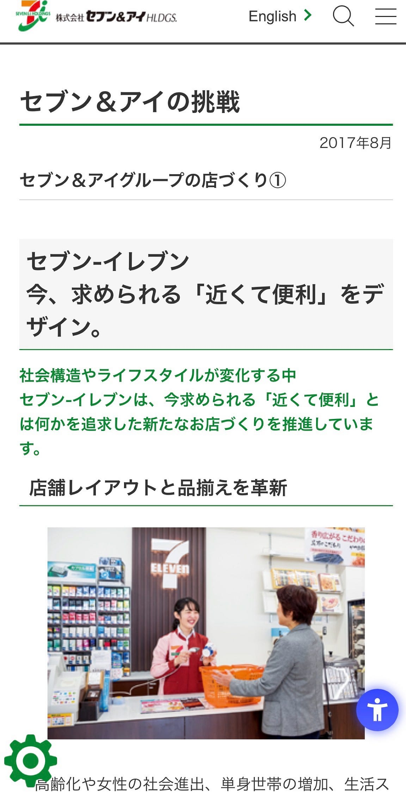
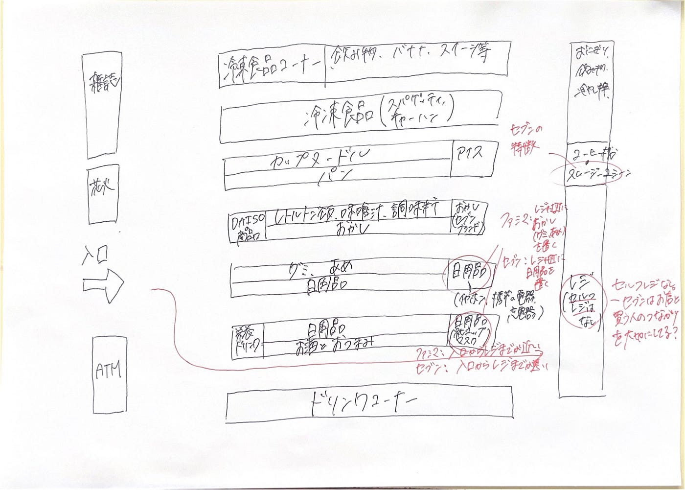
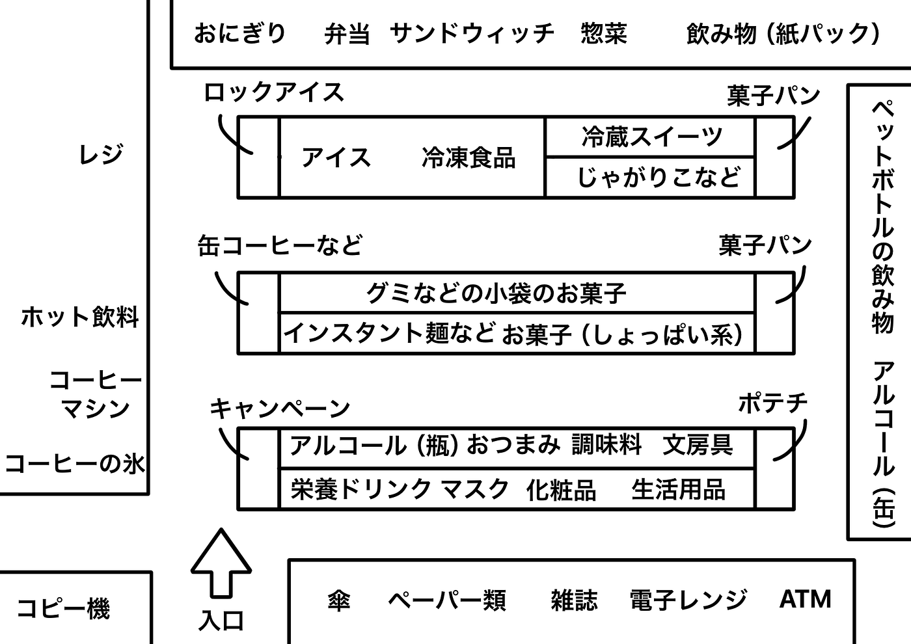
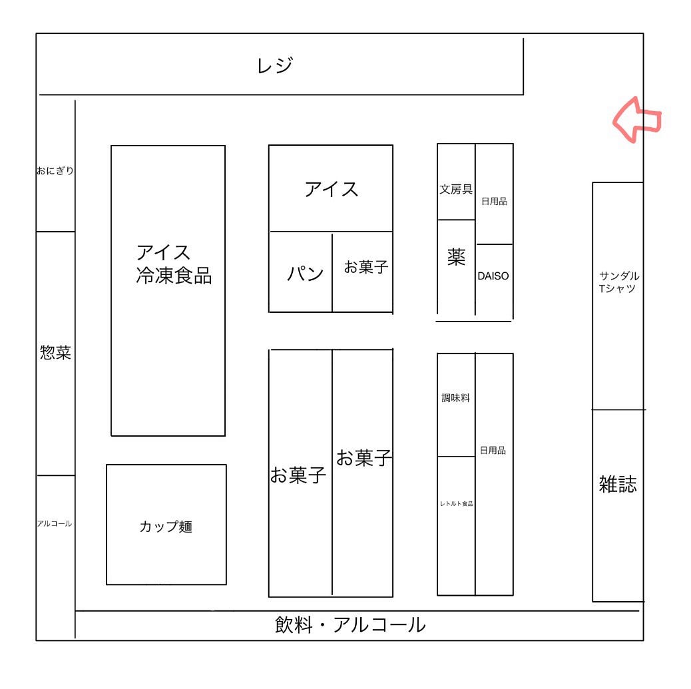
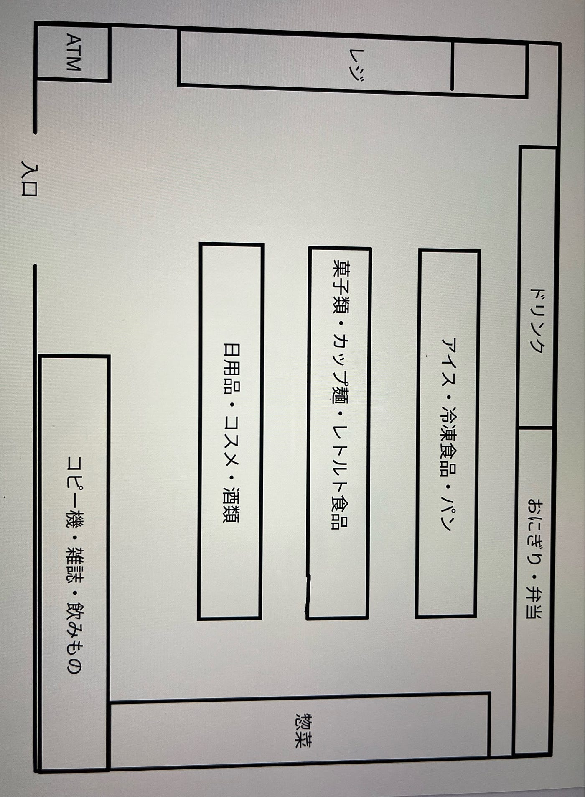
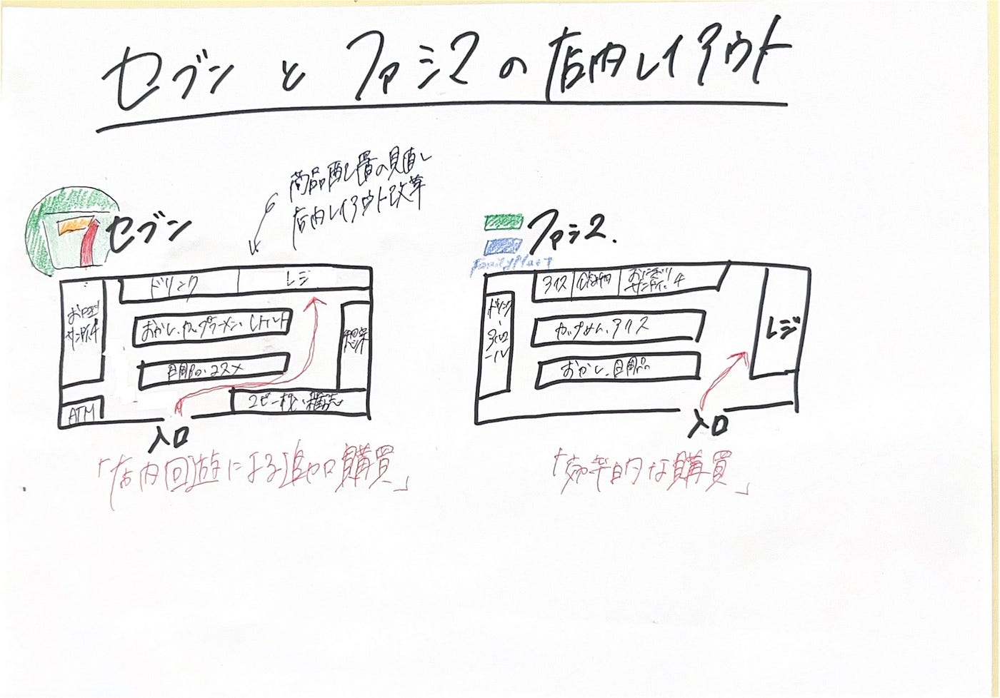

## 商品配列はコンビニによってどのような違いがあるのかを比較してみた［デザイン1週報］

こんにちは。3年の藤原かのこです。

今週は先週に引き続き、コンビニの商品配列について今回はセブンイレブンの商品配列を調べ、前回調べたファミリーマートとはどのような違いがあるのかそれぞれが実際に調査をし、比較・分析を行いました。また、前回アドバイス頂いた先行研究についても調べてみました。

https://www.7andi.com/company/challenge/2751/2.html

ちなみに先行研究はこちらの実際にセブン&アイ・ホールディングス公式から発表された商品配列の見直しやレイアウト改革の記事を参考にしました。

さあ、コンビニの商品配列はコンビニごとにどのように異なり、工夫がされているのかをみていきましょう。

#### みひろ

百草園駅近くのセブンイレブンの店内レイアウトを観察して、図におこしてみました。店内図はこちらです。↓

前回調査した、ファミリーマートの店内レイアウトと比較して分かったことを以下に記します。

①レジの位置

ファミリーマート:入り口付近に配置

セブンイレブン:店奥側に配置

▶︎ファミリーマートはレジが入口付近にある店舗が多く、目的の商品を短時間で購入しやすい構造になっている。一方、セブンイレブンは、レジを店内奥側に配置することで、来店客が店内を回遊しながら商品を見る導線になっていたと考えられる。

②セルフレジの有無

ファミリーマート:あり

セブンイレブン:なし

▶︎これは一概には言えないが、ファミリーマートにはセルフレジが多く、セブンイレブンにはセルフレジが少ないまたはないと仮定すると、セブンイレブンは支払いの効率化よりも、消費者との対面つながりを大切にしているのか？と考えた。

③ レジ周辺の商品

ファミリーマート:グミ、飴など、小さくてすぐに食べ出るお菓子が配置されていた。

セブンイレブン:お菓子はあるが、全てセブンブランドのもの。その他は、イヤホン、充電器、マスクなど日用品が配置されていた。

▶︎ ファミリーマートでは、手軽についで買いしやすい特徴が見られ、会計待ちの時間にも商品へ目が向くようになっていた。一方セブン-イレブンでは、お菓子よりも単価の高いものが置かれており、必要なものを思い出して買う行動も狙っていると感じた。

#### ちはな

今回私は家の近くにあったセブンイレブンに行きました。

店内図はこちらです。

前回調査したファミリーマートとの共通点として奥の方に飲み物があり、レジに並ぶ場所にグミなどのお菓子が置いてあること、コーヒーマシンがレジから入口の間にあることが挙げられます。

セブンイレブンでもやはり導線を意識して商品を置いているようです。

ファミリーマートと違う点としては、缶コーヒーや栄養ドリンク、アイスコーヒー用の氷などが入り口から見えやすい場所に置いてあることが挙げられると思います。

売れ行きが良い商品は分かりやすい位置に置くようになっているのでしょうか……？

後は菓子パンの位置が棚の側面にあるのが珍しいと感じました。

単に置く場所が無かったか、菓子パンにはあまり力をいれていない可能性もあると考えました。

#### みあ

今回私は、七里ヶ浜という江ノ島の近くにある海岸付近のセブンイレブンに行きました！

前回見たファミリーマートとは場所も全然違うので単純な比較はできませんが、セブンイレブンの方がオリジナルブランドの商品が多かったような気がします。

また、店内には「飲料」「お菓子」「日用品」など、売り場の場所を示す案内表示が設置されていました。どこに何が置かれているのかが一目で分かるため、初めて訪れる利用者でも商品を探しやすい工夫がされていると感じました。こうした表示によって店内を効率よく回ることができ、利用者目線の配慮がされている点も印象的でした

#### かのこ

私は今回も家の近くにあるセブンイレブンに行きました。

まず、初めにファミリーマートとの共通点としては店の奥側に飲み物やおにぎり、お弁当などの惣菜が置かれていることやレジ横にホットスナックが置いてあることです。そして、飲み物、惣菜も奥に置くことは変わりなかったように感じます。

異なったこととしては、ファミリーマートでは入り口からすぐのところにレジがあったのに対して、セブンイレブンの方が比較的奥に入れられている感じがしました。

また、レジ前にあまりチョコレートやスナックなどの商品が置いてなく、ファミリーマートのついで買い戦略とは異なった配列を感じました。

#### まとめ

どうでしたでしょうか。

考察の結果、セブン-イレブンの公式資料では、近年「商品配列の見直し」や「店内レイアウト改革」が行われていることが示されていたが、特に、従来は入口付近に配置されていたカウンターを店内奥側へ移動させるなど回遊性を高める工夫が見られました。これは、来店客を店内奥まで誘導し、購買機会を増やす効果を期待した戦略だと考えられます。

実際にセブンの現在の店内レイアウトを図に起こして分析したところ、来店客が自然に店内を回遊しやすい導線になっていることが分かった。また、レジへ向かうまでに複数の商品棚を通過する構造になっており、ついで買いを促進する工夫が見られた。

また一方で、ファミリーマートの店内レイアウトは、セブンの旧レイアウトに近く、比較的入口付近にカウンターが配置されている傾向がある。そのため、来店客が短時間で目的の商品を購入しやすい反面、店内奥まで回遊しにくい構造になっているとも考えられる。

このように、ファミリーマートのレイアウトと現在のセブンのレイアウトを比較すると、セブンは「効率的な購買」よりも「店内回遊による追加購買」を重視する戦略へ変化していることが、消費者目線から読み取れると思います。

そして観察の結果、ファミリーマートでは新商品や話題性のある商品が目立つ場所に配置し、衝動買いやついで買いを促す傾向が見られました。しかし、セブンイレブンでは定番商品が分かりやすい場所に配置されていることが多く、効率的な買い物を重視しているように感じられました。

#### グラレコ

