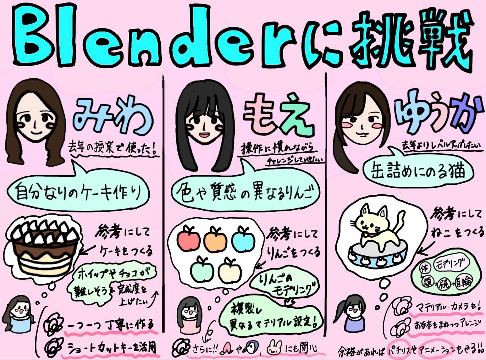

## Blenderで何つくる？

こんにちは！4年の安生です。
今週のデザイン部2では、これからBlenderで制作していく作品について、それぞれがつくりたいものや参考にしたい動画を調べながら、今後の計画を立てました。

どんなものをつくりたいかだけでなく、どんな手順で作るかも考えながら調べることで、完成イメージを少しずつ具体化することができました。

参考動画を見ながら、Blenderでできる表現の幅広さも改めて感じ、これからの制作が楽しみになる時間でした。

ここから3人の計画を紹介していきます〜

#### 【ゆうか】

去年はデザイン部やドローン部でBlenderを使ってきましたが、クマのキャラクターやPhantom 4を作った際に見本通りの形にできなかったこともあったため、今回は見本やお手本を忠実に再現しつつも少しアレンジできるくらいになりたいです。

去年のデザイン部で、こうな先輩に教えてもらってお手本にしていたビビさんの動画から選んでみました。今回は猫だけではなく缶詰に乗っているため難易度が上がったような気がします。缶詰にもたくさんの猫の柄が着いてきて出来るか少し怪しいため、とりあえずは猫のモデリングから頑張っていこうと思います。

まずは猫の体→顔→尻尾→首輪の順で作ります。次に缶詰を作り、マテリアルやカメラ・レンダリングの設定、光を当てて完成です！

探す途中で他にも作ってみたいものを見つけたため、余裕を持って完成した場合にこれらの動画も見て作ってみようと思います。また、去年クマを作った時は動かすところまでできなかったため、今回はアニメーションのやり方も学びたいです！

#### 【みわ】

去年授業で1度Blenderを使ったことがあるのですが、自分的に納得が出来るようなものを作れず本当に苦戦したので、今回はその失敗を活かして、一つ一つ丁寧に作っていきたいと思います。

今回はチョコケーキの動画を参考にして、自分なりのケーキを作りたいと思います。ホイップの部分やチョコが垂れてる部分が少し難しそうなので、出来る限り完成度を上げたいです。ショートカットキーを未だに活用できてないので、そうした基本的な部分からまずは学んでいきたいです。

#### 【もえ】

私はまだBlender初心者なので、まずはシンプルな形のものから練習していきたいと考えています。

参考動画

最初はりんごをモチーフにして、色や質感の異なるモデルをいくつか制作してみたいと思っています。マットな質感や透明感のあるもの、発光しているものなど、動画を参考にしながら自分なりのものをつくってみたいです。

参考動画をみると、同じ形でも色や質感によって印象が大きく変わるため、自分でも上手く表現できるように頑張りたいです。

まずは基本操作やショートカットキーについて学びながら、Blenderの操作に慣れていきたいと考えています。その後、りんごのモデリングを行い、複製したモデルにそれぞれ異なるマテリアル設定を加えることで、色や質感の違いを表現してみたいです。

他にもつくってみたいものをいくつかみつけたので、今後は操作に慣れながら、桃やぺんぎんなどのもう少し難しいものにもチャレンジしていきたいです。どんなものをつくろうか動画を色々みているなかで、最終的にはアニメーションのようなものにも挑戦してみたいな～と思ったりしました。

桃

ぺんぎん

うさぎのアニメーション

今回は実際の制作に入る前に、参考動画を探したり、今後の進め方を整理したりしながら準備を進めました。

Blenderはできることが多い分、最初に方向性を考えておくことの大切さも感じました。今後みんなの作品がどんなふうにできあがっていくのか楽しみです！

また、今回を含めて週報5回分ほどを目安に完成を目指しているため、これからは今回立てた計画をもとに、少しずつ制作を進めていきたいと思います。

グラレコ

