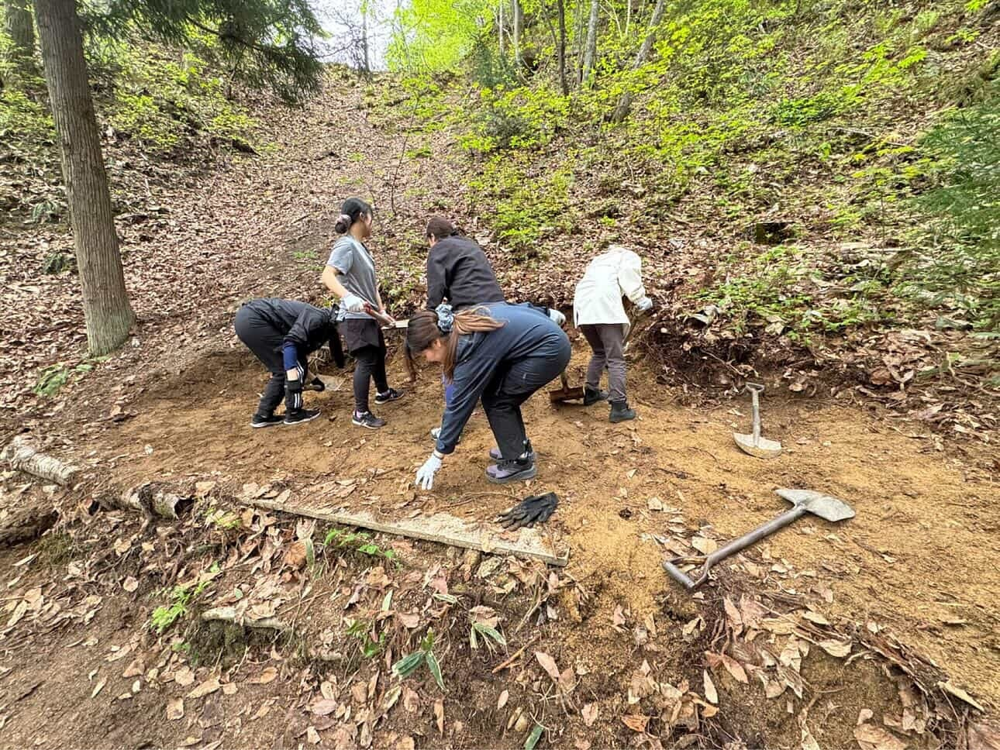
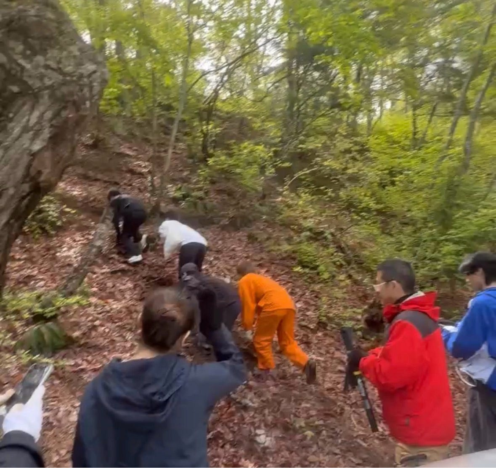
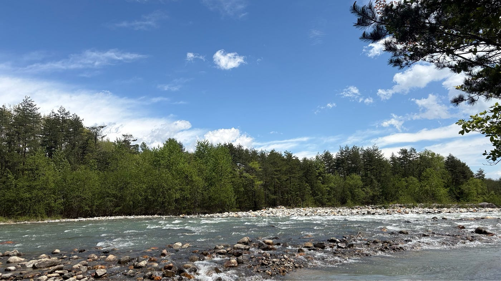
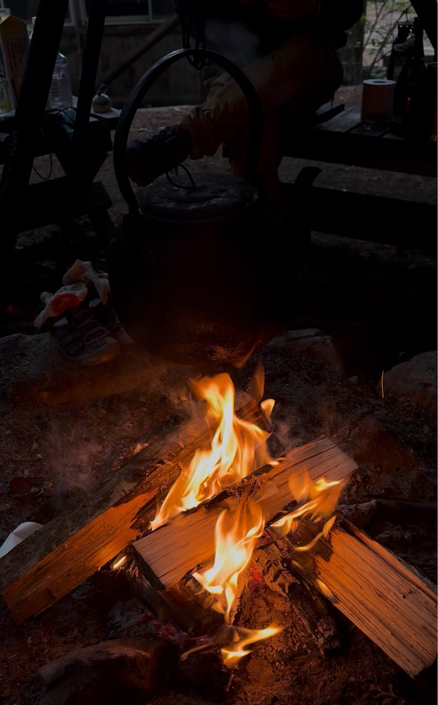
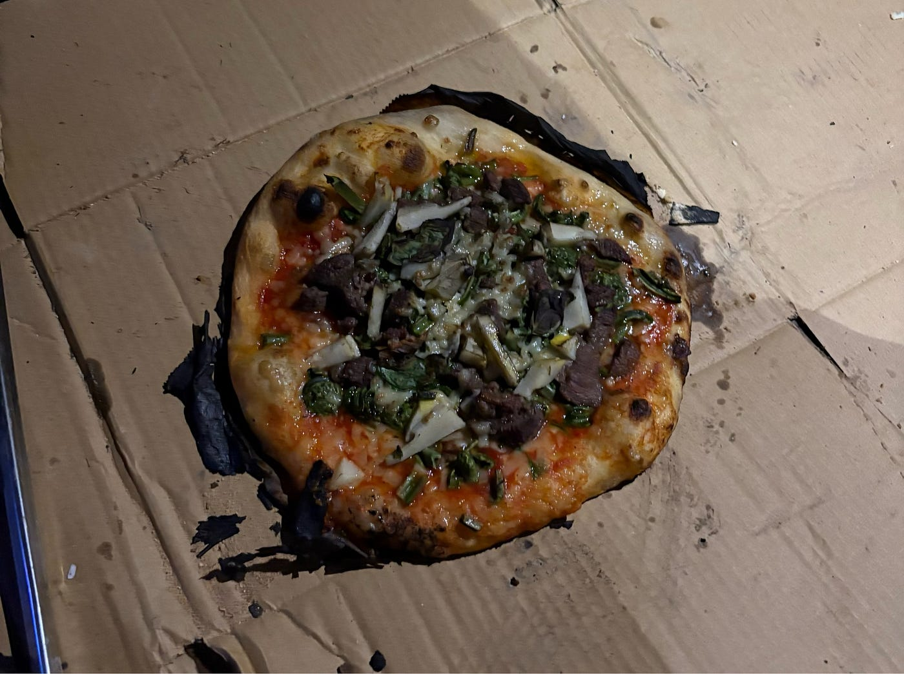
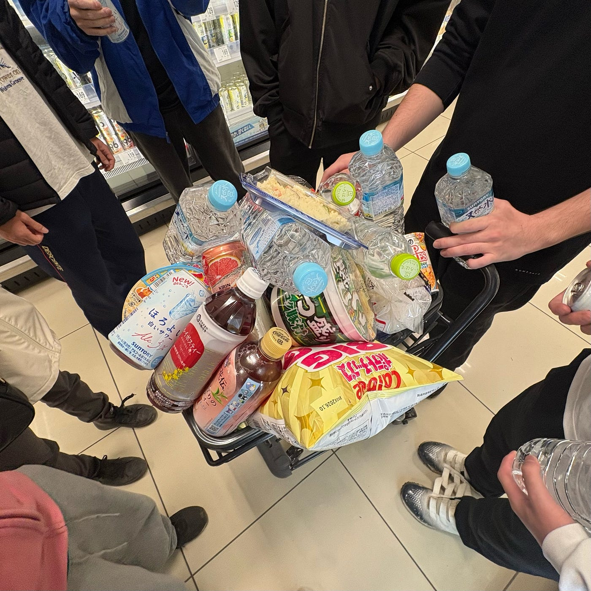
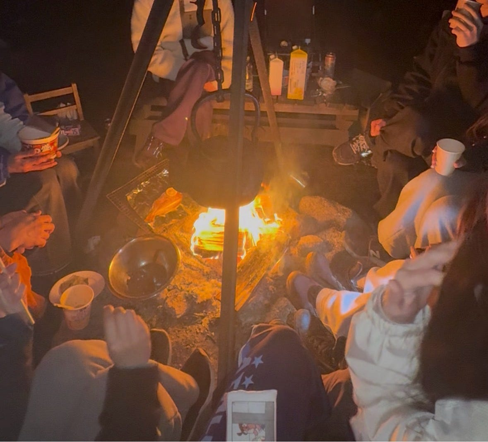
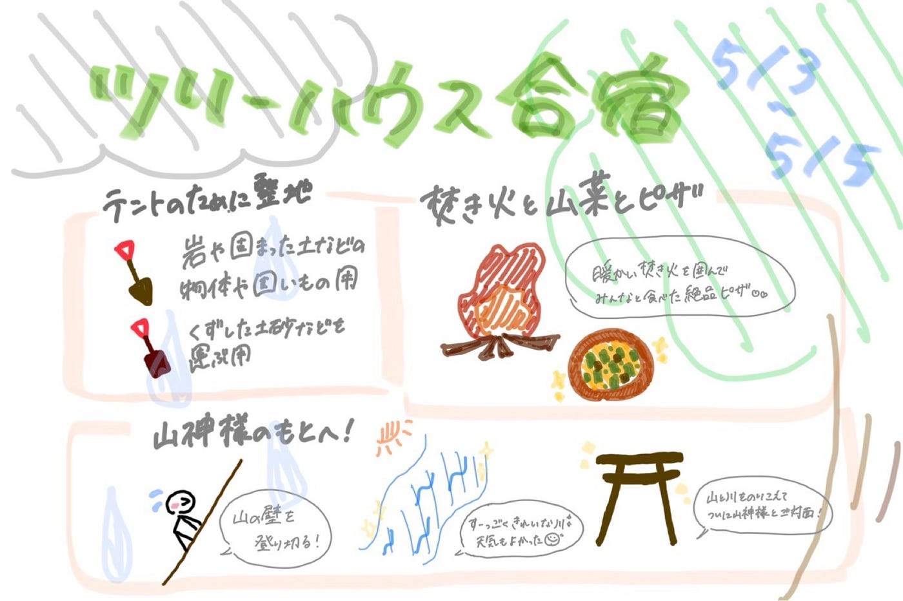

## 3日間のサバイバル生活🌳⛺️🪏

こんにちは！3年の野中です。

ゴールデンウィークの5月3日から5日にかけて長野県の大町で2泊3日のツリーハウス合宿を行いました！

#### #自分たちの力で寝床作り🪏

まず初めに行ったことは、テントを貼る場所を確保するための整地です。

スコップを使って、土を掘って地面を平らにしたり、石や木の枝を組み合わせてそこに土をのせて地面を広げたりしました。自分たちの力で整地をするというのは初めての経験だったためとても大変でした。

最初は道具の使い方や力の入れ方が難しくて苦労しましたが、地面が平らになっていき土地が広くなっていくのをだんだんと実感できたのが楽しかったです。

#### #山神様ハイキング⛰️💨

2日目はハイキングを行いました。

今回お邪魔した山の神様、通称’’山神様’’に会いに行きました。

最初に先生から｢まずはここを登ります！｣と言われて視線を向けた先には、山道なんてものは当然のように存在せず、山の斜面というよりか山の壁と呼んだ方が正しいような場所でした︎、、！

先生から登り方をレクチャーして頂き、みんなで四つん這いになりながら1列で山の壁を登り、山神様に会うためのハイキングがスタートしました。

前日に雨が降った影響もあり、土がどろどろで落ち葉なども滑りやすくなっていたため、周りにある木を支えにしたり、自分たちで歩きやすい道を見つけたりと慎重に歩を進めていきました。☔️

しばらく山の中を歩いていると川が現れました。ハイキング中は天気もよく、川の水が今まで見てきた中でもトップレベルの透明度でとてもいいリフレッシュになりました！☀️

山を登ったり降りたり、川を渡ったり、木を跨いだりくぐったりしながら最終的には無事に山神様のもとに辿り着くことができました！

#### #山菜パーティー🌱

今回のツリーハウス合宿の目玉は山菜でした。普段の生活で山菜を食べる機会は無いし、一人暮らしをしている私はそもそも野菜を食べる頻度も低いのでとても新鮮でした。

ツリーハウス合宿では暖を取るのはもちろんのこと、料理をするためにも火起こしを何度も行いました。初めは、マッチ棒の火を直接薪に移せばいいと思っていましたが、火起こしにもきちんとした手順があることを知りました。

①マッチ棒の火を枯れた松の葉に移す。

松の葉は天然の油分を豊富に含んでいるため着火剤として役立つそうです。

②松の葉が燃えてきたらその上から細かい木の枝を重ねて、だんだん火を大きくしていく。

③小さめ･細めの薪を空気が通るように重ねていく。

④大きめの薪を重ねて、焚き火完成🔥

3日間毎食山菜を食べましたが、天ぷらやおひたし、スープ、山菜ごはん、山菜焼きそばなど様々なメニューがあって飽きることなく楽しめました！2日目の夕食には、古橋先生特製の山菜ピザも頂きました。ピザ窯の火起こしは古橋ゼミのみんなで協力して約2時間ほどかけて行いました。手作りの山菜ピザはゼミ生はもちろんのこと、他団体として参加していた子どもたちや大人の方々も大満足している様子でした💮

#### #焚き火を囲んで

2日目の夜、温泉の帰りに3年生みんなでスーパーに寄り道しました。2日間大自然の中で頑張ったご褒美として、お菓子やカップラーメン、お酒などをたくさん買いました。

今回のツリーハウス合宿を通して、3年生同士の壁も無くなったのではないかなと感じます。

焚き火の日で焼きマシュマロをしたり、スーパーで買った魚を焼いたりしました。焚き火の火で焼かれた魚はとても絶品でした。

美味しい食べ物でお腹は満たされ、雨が降る山の中で暖かい焚き火を囲んで仲間たちとたくさん話をして心も満たされました。そんな楽しい時間も惜しく、朝4時がやって来てみんなで寝床に向かいました。

自分たちの力で整地をした山の中にテントを張って、薪を割って暖を取って、山から取れた山菜を食べて、、、

神奈川にいたら経験することのない非日常な体験をすることができました。

非日常な空間だったからこそ、仲間との絆も生まれたのではないかなと思います。

大変なこともたくさんありましたが、それも含めて思い出に残る3日間でした！！

以下、2日目ハイキングのStrava記録です✍️

https://strava.app.link/B5pe09LF32b

#### グラレコ

