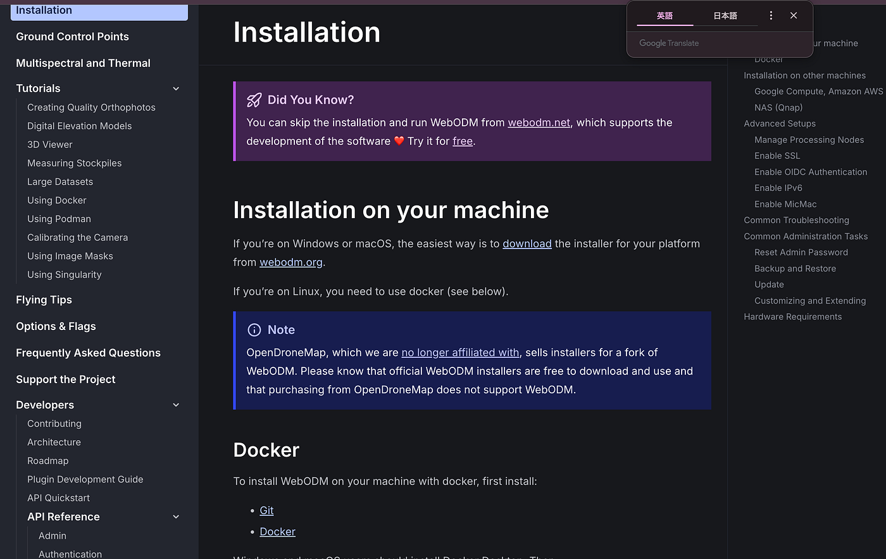
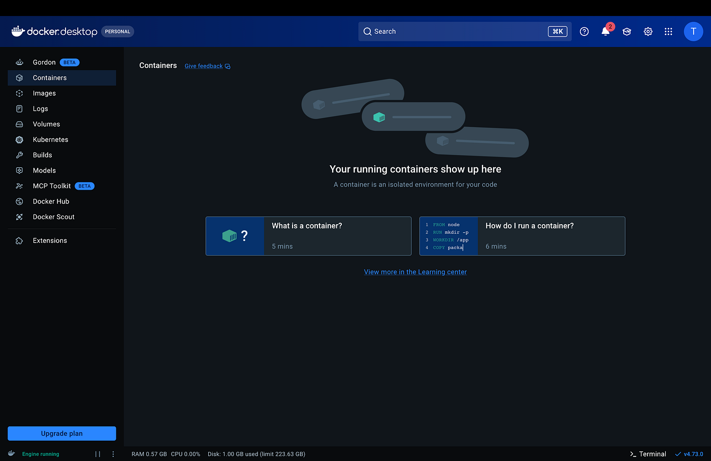
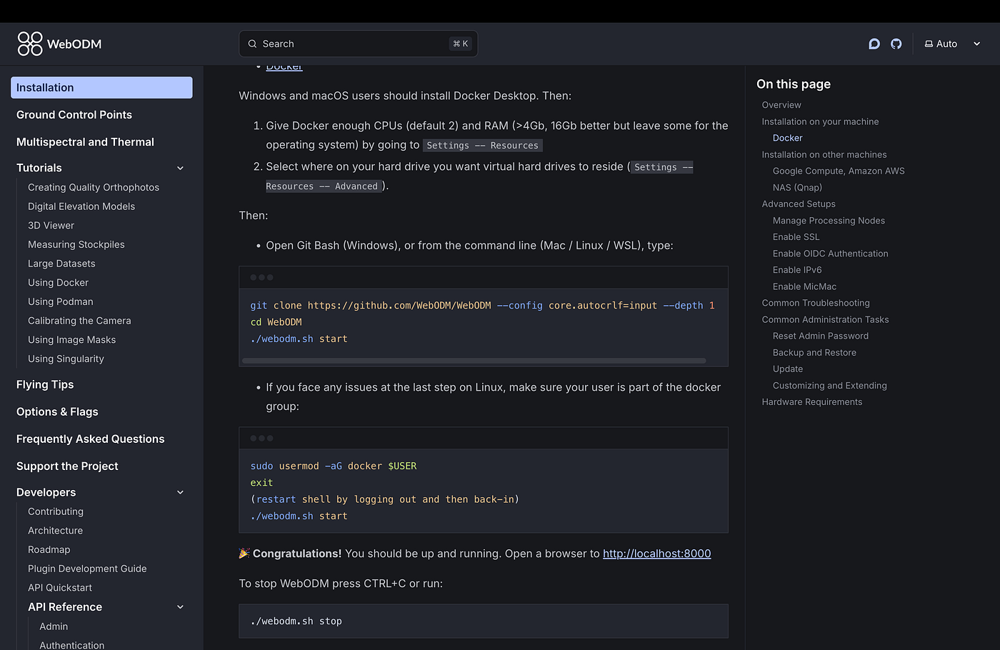
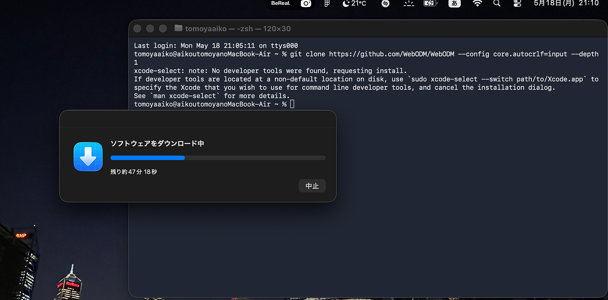
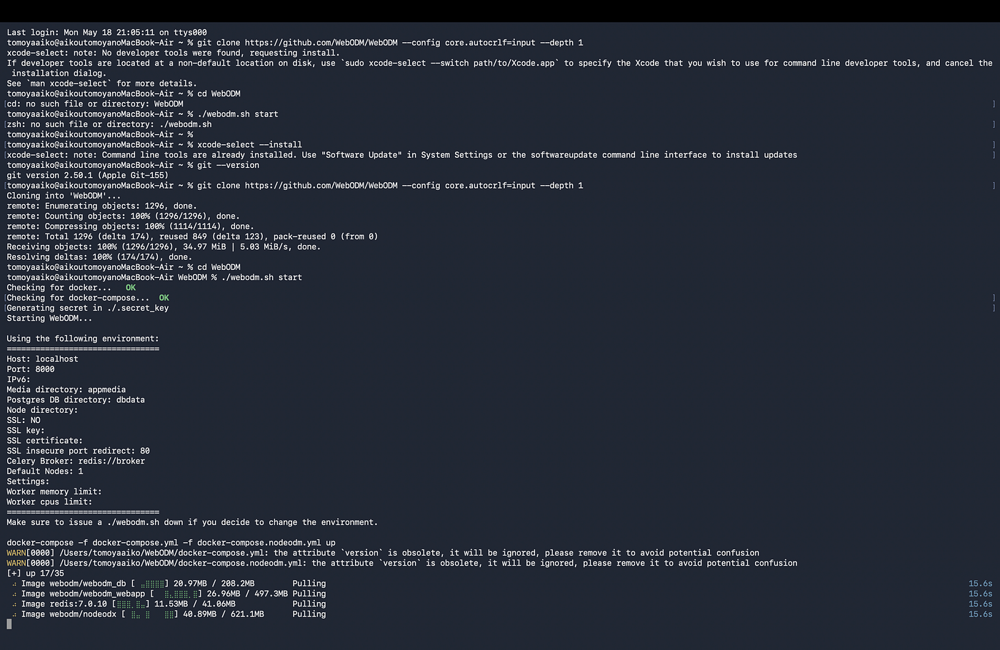
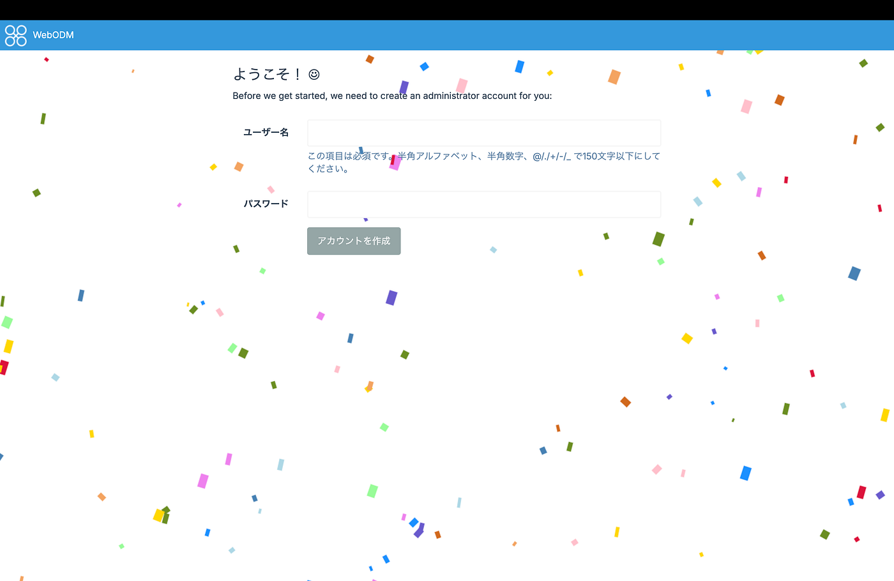
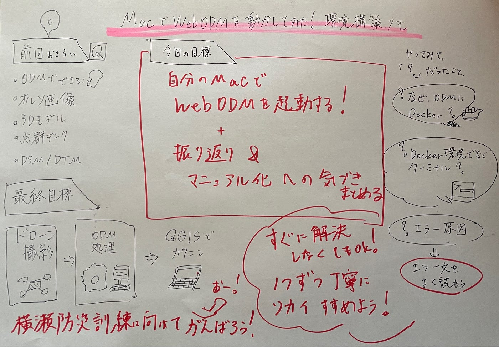

### 5/19ドローン部２週報：ODMを動かすためにMacと格闘した

こんにちは、ドローン部3年の愛甲です。

前回の週報では、ドローンで撮影した画像をODM（OpenDroneMap）で処理すると、オルソ画像や点群データ、3Dモデル、DSM/DTMなどを作成できることを学びました。

今回はその続きとして、実際に自分のMacでODMを動かしてみることを目標に、環境構築を行いました。

先週までは「ODMとは何か」「どのような成果物が作れるのか」というインプットが中心でしたが、今回は実際に手を動かしてみる回です。

### まずはWebODMの公式ドキュメントへ

最初に、WebODMの公式ドキュメントを開き、インストール方法を確認しました。
MacでWebODMを使うには、まずDocker Desktopをインストールする必要があることが分かりました。最初はWebODMを普通のアプリのようにダウンロードすればすぐに使えると思っていましたが、実際にはDockerという実行環境を用意する必要がありました。

↑WebODMの公式ドキュメント。MacではDocker Desktopを使って環境構築を行うことが分かった。

### Docker Desktopをインストール

次に、Docker DesktopをMacにインストールしました。

インストール後、Docker Desktopを開くと、ContainersやImages、Volumesなどのメニューが表示されました。画面左下には「Engine running」と表示されていたので、Docker自体は正常に起動している状態でした。

しかし、ここで早速つまずきました。

Dockerの画面を開いても、どこからWebODMを起動すればよいのか分かりませんでした。
 初心者の自分には、「Containersとは何か」「Imagesとは何か」もよく分からず、Dockerの画面上で何かをクリックして進めるものだと思っていました。

Docker Desktopは起動できたものの、この画面から何をすればよいのか分からず一度停止。

### 実際にはターミナルで操作する必要があった

調べていくと、Dockerの画面上で直接WebODMを操作するのではなく、ターミナルからコマンドを入力してWebODMを起動する必要があることが分かりました。

公式ドキュメントには、以下のような手順が書かれていました。

1. GitHubからWebODMをダウンロードする

1. WebODMフォルダに移動する

1. `./webodm.sh start` を実行する

この時点で、Docker、WebODM、GitHub、ターミナルが一気に登場し、正直かなり混乱しました。

↑ 公式ドキュメントに書かれていた起動手順。ここでターミナル操作が必要だと分かった。

### ターミナルでエラー発生

次に、ターミナルを開き、公式ドキュメントに書かれていたコマンドを入力しました。

しかし、最初にコマンドを打った時には、MacのCommand Line Toolsに関するエラーが出ました。
 そのため、WebODMのフォルダが作成されず、次の手順である `cd WebODM` や `./webodm.sh start` を実行しても、「そのようなファイルやディレクトリはありません」というエラーが出てしまいました。

最初はWebODMの起動に失敗しているのだと思いましたが、よく見ると、そもそもWebODMのファイルがまだダウンロードできていませんでした。

つまり、起動に失敗したのではなく、起動するためのファイルが存在していない状態でした。

最初のつまずき。WebODMを起動しようとしたが、そもそもファイルがダウンロードできていなかった。

### Gitを確認して、再度ダウンロード

その後、Gitが使える状態になっているかを確認しました。

ターミナルで `git --version` を入力すると、Gitのバージョンが表示されたため、Git自体は使えることが分かりました。そこで、もう一度WebODMのダウンロードコマンドを実行しました。

すると、今度はGitHubからWebODMのファイルを取得することができました。
 ターミナル上に「Cloning into ‘WebODM’」や「Receiving objects: 100%」と表示され、WebODMフォルダのダウンロードが完了しました。

この瞬間、ようやく一歩進めた感じがしました。

GitHubからWebODMのダウンロードに成功。ここでようやくWebODMフォルダが作成された。

### WebODMを起動

WebODMフォルダのダウンロードが完了した後、`cd WebODM` でフォルダに移動し、`./webodm.sh start` を実行しました。

すると、Docker上でWebODMの起動が始まりました。
 ターミナルには英語のログが大量に表示され、WebODMに必要なイメージがダウンロードされていきました。

この時点でも、何が起きているのか完全には理解できていませんでしたが、少なくともDockerが裏側でWebODMを動かす準備をしていることは分かりました。

### WebODMの画面が表示された

しばらく待つと、ブラウザ上でWebODMの画面を開くことができました。

最初に管理者アカウントを作成する画面が表示され、その後、WebODMのダッシュボード画面まで進むことができました。

今回は実際に画像を処理するところまでは進めませんでしたが、WebODMの画面を表示するところまで到達できました。

ここまで来るまでにかなり格闘しましたが、環境構築の流れを実際に体験できたのは大きかったです。

WebODMの初期画面に到達。管理者アカウントを作成する画面が表示された。

### やってみて「？」だったところ

今回やってみて、分からなかったことはたくさんありました。

まず、ODMを使うためにDockerが必要になること自体が最初は分かりにくかったです。
 さらに、Dockerをインストールした後も、Dockerの画面上で何かを操作するのではなく、ターミナルからコマンドを打つ必要がある点に戸惑いました。

また、エラーが出た時に、それがDockerの問題なのか、Gitの問題なのか、Macの設定の問題なのかを判断するのが難しかったです。

特に今回は、WebODMを起動できない原因が「起動に失敗した」のではなく、「そもそもWebODMのファイルがまだダウンロードできていなかった」ことだったので、エラー文をよく読む大切さを感じました。

### まとめ・感想

今回は、ODMで実際に画像を処理するところまでは進めませんでしたが、Docker Desktopのインストール、公式ドキュメントの確認、ターミナルでの操作、WebODMの起動まで行うことができました。

最初は「ODMをダウンロードして画像を入れればすぐに処理できる」と思っていました。しかし実際に進めてみると、Docker、GitHub、ターミナル、Command Line Toolsなど、普段あまり触れないものが一気に出てきて、環境構築の段階から多くのつまずきがありました。

特に、エラーが出た時に、それがDockerの問題なのか、Gitの問題なのか、Mac側の設定の問題なのかを判断するのが難しかったです。今回のように、起動に失敗していると思っていたら、そもそもWebODMのファイルがダウンロードできていなかった、ということもありました。

そのため、今後は自分たちが実際につまずいた点も含めて、**ビギナーの視点からWebODM導入の手順をマニュアル化していきたいと思います。** 成功した手順だけでなく、「どこで迷ったのか」「どんなエラーが出たのか」「どう解決したのか」まで記録することで、次に取り組む人が同じところで止まらずに進めるような資料にしていきたいです。

今回の活動を通して、ドローン画像を活用するには、撮影技術だけでなく、その後のデータ処理環境を整える力も必要だと感じました。次回は、WebODMに実際の画像を読み込ませ、オルソ画像や3Dモデルなどの成果物を作成するところまで進めたいです。
最終的には、横瀬防災訓練に向けて、

**ドローン撮影 → ODM処理 → QGISで確認**

という流れを自分たちでできるようにしたいと思います。

今回の環境構築では、公式ドキュメントだけで理解するのが難しい部分も多かったため、ChatGPTも併用しながら作業を進めました。
 特に、エラー文の意味や、次にどのコマンドを入力すればよいのかを確認する際に活用しました。
使用したのは、**ChatGPT ProプランのGPT-5.5 Thinking**です。
 公式ドキュメントや実際の画面に表示されたエラー内容をもとに、手順を一つずつ確認しながら進めることで、初心者でも作業の流れを追いやすくなりました。
ただし、ChatGPTの回答をそのまま信じるのではなく、WebODMの公式ドキュメントや自分の画面に表示されている内容と照らし合わせながら進めることが重要だと感じました。
 今回のような環境構築では、AIを「答えを出す道具」として使うというより、エラーの意味を一緒に整理する補助ツールとして使うのが有効だと思いました。

### グラレコ

佐藤愛妃作成
