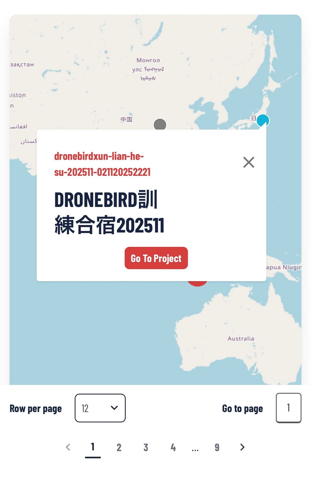
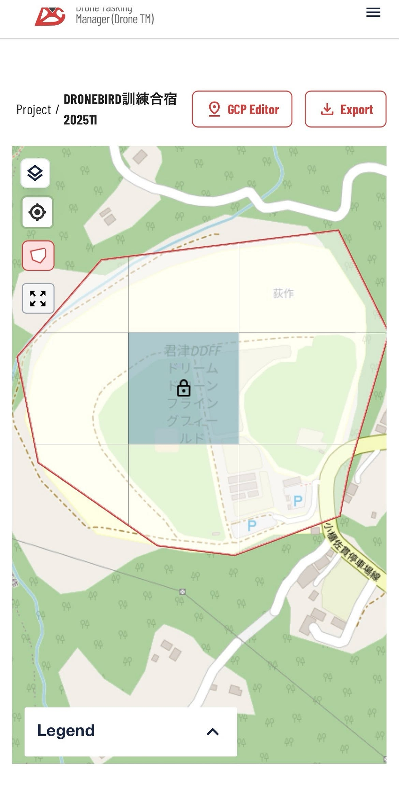
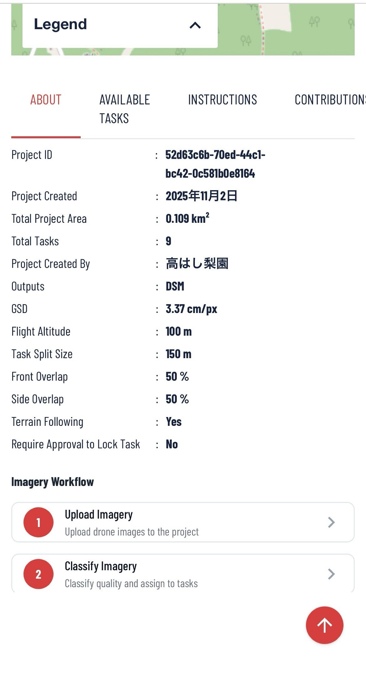
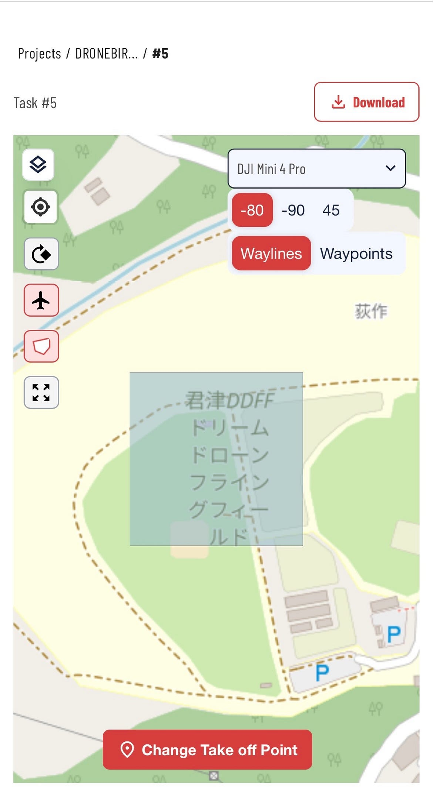
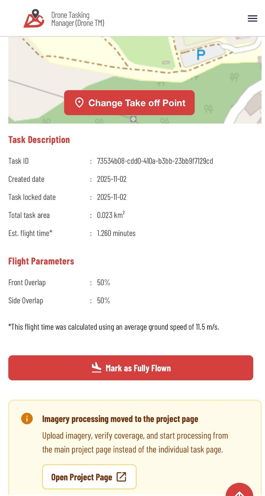
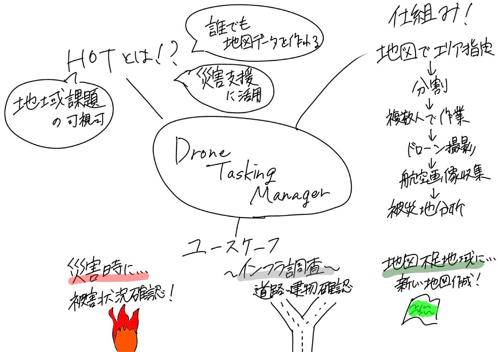

### Drone Tasking Manager って何？［ドローン①］

こんにちは。3年の藤原かのこです。

今回の週報では、Humanitarian OpenStreetMap Team（HOT）が提供している「Drone Tasking Manager」について調査してみました！

そして実際にモバイルアプリをダウンロードして操作を行いました。

#### HOTってどんなもの？

そもそもHOTは、「誰でもデータの作成・収集・分析を行える環境をつくる」という目的のもと災害支援や地域支援に活用できるさまざまなマッピングツールを提供しています。その中でもDrone Tasking Managerは、ドローンを用いた空撮やデータ収集を効率的に行うためのツールであり、特に災害時やインフラ調査などで活用されています。

### Drone Tasking Managerとは

Drone Tasking Managerは、ドローンによる撮影計画やタスク管理を行うための基盤となります。

ユーザーは地図上で撮影エリアを指定し、その地域を複数のタスクに分割することで、複数人で効率よくデータ収集を進めることができる。また、収集された航空画像は地図作成や被災地分析などにも使われます。

特に災害時には、被災地域の状況を短時間でDrone Tasking Managerは、ドローンによる撮影計画やタスク管理を行うためのプラットフォームです。

ユーザーは地図上で撮影エリアを指定し、その地域を複数のタスクに分割することで、複数人で効率よくデータ収集を進めることが可能になります。

また、収集された航空画像は地図作成や被災地分析などにも活用されます。

特に災害時には、被災地域の状況を短時間で把握する必要があるため、ドローンによる空撮とデータ共有の仕組みが重要になります。その際にDrone Tasking Managerを利用することで、どの地域を誰が撮影するのかを整理しながら活動できる点が特徴です。把握する必要があるため、ドローンによる空撮とデータ共有の仕組みがkeyとなってきます。その際にDrone Tasking Managerを利用することで、どの地域を誰が撮影するのかを整理しながら活動できる点が特徴です。

#### UC（Use Case）の分析

Drone Tasking Managerの主な活用例としては、災害時の被害状況確認、インフラ調査、地図データの作成などが挙げられます。

特に災害発生時には、ドローンで広範囲を短時間で撮影できるため、現地状況の把握や支援活動の効率化につながると考えられます。

また、地図情報が不足している地域では、空撮データを活用することで地域課題の可視化にも役立つ点が特徴だと感じました。

#### 実際にアプリを触ってみた感想

今回、実際にDrone Tasking Managerのモバイルアプリをダウンロードし、基本的な操作を体験してみました。

地図ベースで操作できるため視覚的に分かりやすく、どのエリアを対象としているのかを直感的に把握しやすかったです。

また、タスクが整理されて表示されるため、複数人での作業にも向いていると感じました。

一方で、英語表記が多く、初めて利用する人にとってはかなり操作が難しい部分もありました。そのため、今後さらに普及させるには、日本語対応や初心者向けの説明機能が充実すると、より使いやすくなるのではないかと考えました。

https://drone.hotosm.org/projects

#### まとめ

今回の活動を通して、Drone Tasking Managerはドローンによる撮影だけでなく、災害支援や地域課題の把握にも活用できるツールであることを学びました。

実際にアプリを操作したことで、データ収集やタスク管理の仕組みについて理解を深めることができた。今後は他のHOT関連ツールについても調査し、活用方法を学んでいきと感じました。

#### グラレコ

