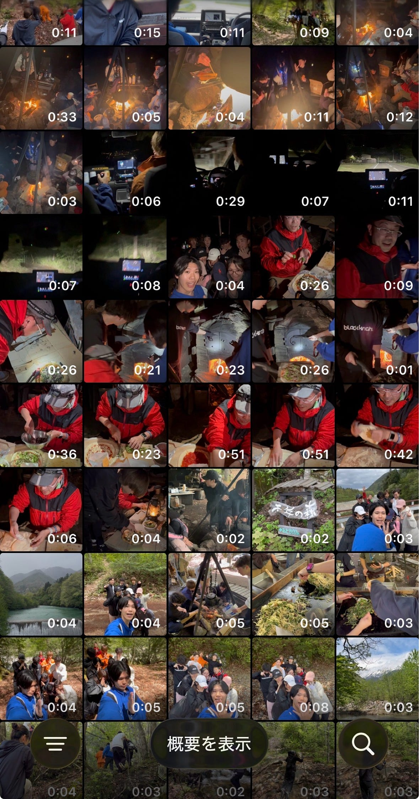

### VF週報 ツリーハウス合宿での動画撮影🌳

こんにちは！VF3年の野中です。

今年度も、SNSを通して古橋研究室の魅力をたくさん発信できるようにVF一同頑張っていきます！

Tiktokの更新頻度目標が１週間に１本に決定しました！

イベントなどのVlogやTikTokの流行に乗りつつ古橋研究室の魅力を発信していきたいと思います。

今回は、ツリーハウス合宿でVFとして行った活動についてお話していきます。

#### ツリーハウス合宿

ツリーハウス合宿での目標はTikTokの動画を最低1本投稿することでした。

今回は、TikTokで流行っている音源を使って、今回の合宿で訪れた場所を順番に映していくというものを作成しました。

同じテンプレートの動画を8個程撮影してそれらを繋げました。

動画の工夫した点としては、同じテンプレートを何個も繋げるため、各動画の繋ぎが綺麗になるように、できるだけ同じ画角から撮影するようにしたところです。

3年生全員と先生の協力のおかげで、無事動画を完成させることができました！

ツリーハウス合宿の動画はTiktokに投稿済みです。ぜひチェックしてください！

[https://vt.tiktok.com/ZSx6hWhPq/](https://vt.tiktok.com/ZSx6hWhPq/)

#### 今回の学び

初のTiktok動画制作を通して学んだことは、どんな動画を作成したいのかあらかじめ決めておいた方がいいということです。

今回投稿したものは合宿前から撮影すると決めていたので無事完成しましたが、他にも沢山の動画がアルバムに残っています。とりあえずカメラに収めておこうという気持ちで撮影しましたが、いざ動画にするとなると、構成を考えるのが難しかったり、もっとこういう動画を撮影しておけば良かったということが起きてしまいました。

↑ 大量の動画素材

次回からは、活動前にどんなものを作りたいのかを考えてから動画撮影をしようと思います。

今後も、様々な動画制作を通して失敗と学びを繰り返しながら良い動画を生み出していきたいです！

#### グラレコ

