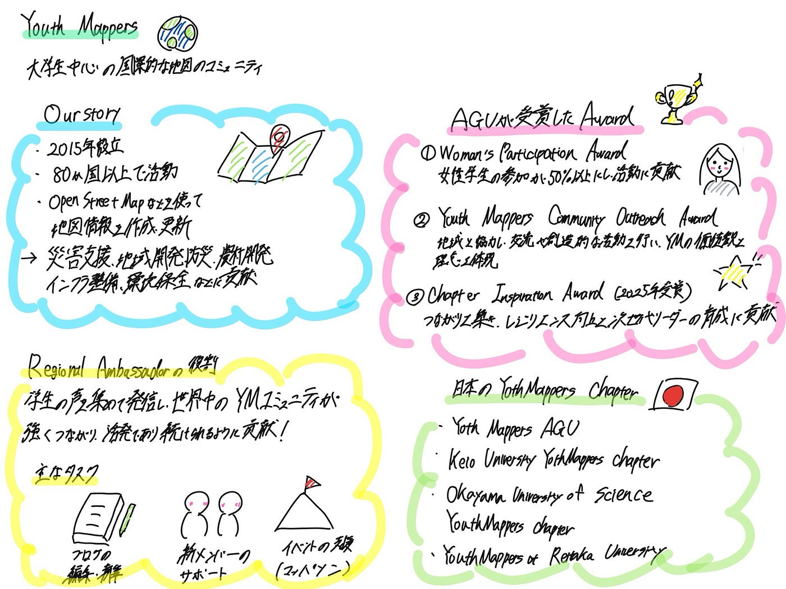

## 【Youth①】地図×学生！？Youth Mappers を知ろう！！

こんにちは！中溝です。今回の週報では、Youth Mappers のホームページのカテゴリーをまとめました。

### Our Story

YouthMappersは、大学生を中心に活動する国際的な地図作成コミュニティです。学生たちはOpenStreetMapなどを活用して世界中の地図情報を作成・更新し、災害支援や地域開発、防災、農村開発、インフラ整備、環境保全など、さまざまな社会課題の解決に取り組んでいます。2015年に設立され、現在では80か国以上に活動が広がっています。また、地図作成を通して技術や実践力を身につけ、社会に貢献できる若いリーダーを育成することも大きな目的としています。

### Aoyama Gakuin Universityが受賞したAwardについて

青山学院大学は、2021年から2025年にかけて、Women’s Participation Award※1 や YouthMappers Community Outreach Award※2 を受賞しています。さらに、2025年には Women’s Participation Award に加え、Chapter Inspiration Award※3 も受賞しています。

※1 Women’s Participation Award

包摂的なマッピングコミュニティの実現を目指し、所属するYouthMappersチャプターにおいて、メンバーシップやリーダーシップを通じて女性学生マッパーを過半数（50％以上）参加させ、さらに大学・地域コミュニティネットワーク・国内活動の発展に貢献したチャプターに贈られる賞です。

※2 YouthMappers Community Outreach Award

地域コミュニティと協力しながら交流や創造的な取り組みを行い、相互の関心や利益を支援するとともに、グローバルにつながる学生主導型ネットワークであるYouthMappersの価値観と理念を体現したチャプターに贈られる賞です。

※3 Chapter Inspiration Award

地域コミュニティ内外で有意義なつながりを築きながら、コミュニティのレジリエンス（回復力・強靭性）の向上に取り組む次世代リーダーの育成というYouthMappersの使命を推進した、模範的で人々に刺激を与えるチャプターに贈られる賞です。

### YouthMappersのRegional Ambassadorの役割

Ambassador の役割は、地域のファシリテーター（進行・支援役）として、オープンマッピングに対する学生たちの貢献や意見を広く吸い上げ、世の中へ発信することや、世界中のYouthMappersコミュニティが強くつながり、活発であり続けられるように貢献することです。実務タスクとしては、ブログの編集・執筆、データ検証（validation）、各チャプター（支部）が行う独自活動やマッパソンなどのイベント支援、新メンバーのサポート、OSM Teams等の機能のレクチャー支援などがあります。

日本のYouthMappers Chapterは以下の通りです。

- YouthMappersAGU

- YouthMappers at Reitaku University

- University of Tsukuba

### 今回の学び

YouthMappersについて詳しく知ることができてよかったです。地図作成を通して災害支援や地域開発など、さまざまな社会課題の解決に取り組んでいることが分かりました。また、学生が世界中とつながりながら活動している点がとても印象的でした。今回調べたことで、YouthMappersの活動の意義や魅力について理解を深めることができ、自分も積極的に活動していきたいと思いました。

### グラレコ

### 参照元

https://share.google/pyKnau4aDOO7RCjZ3

https://www.youthmappers.org/regional-ambassadors
