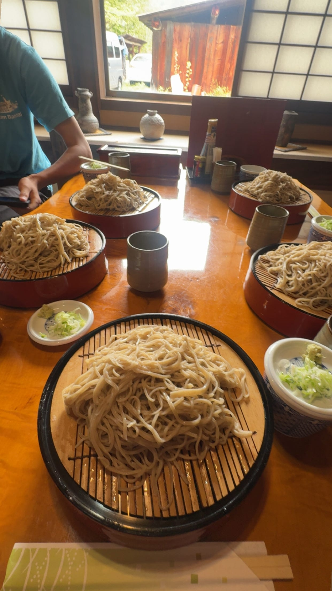
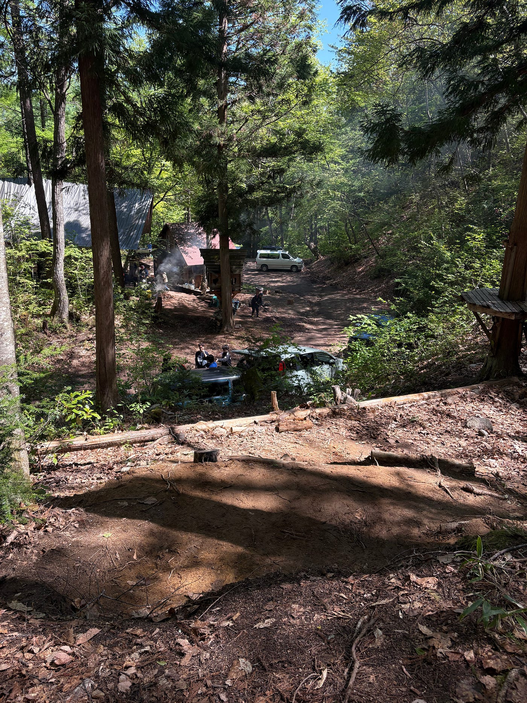
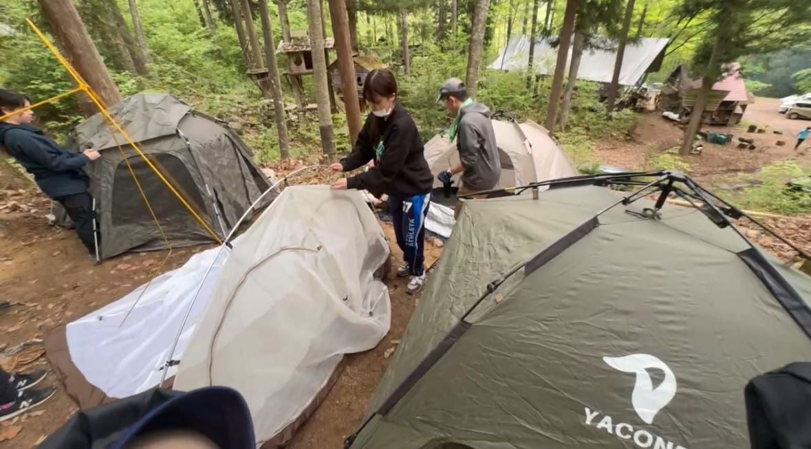
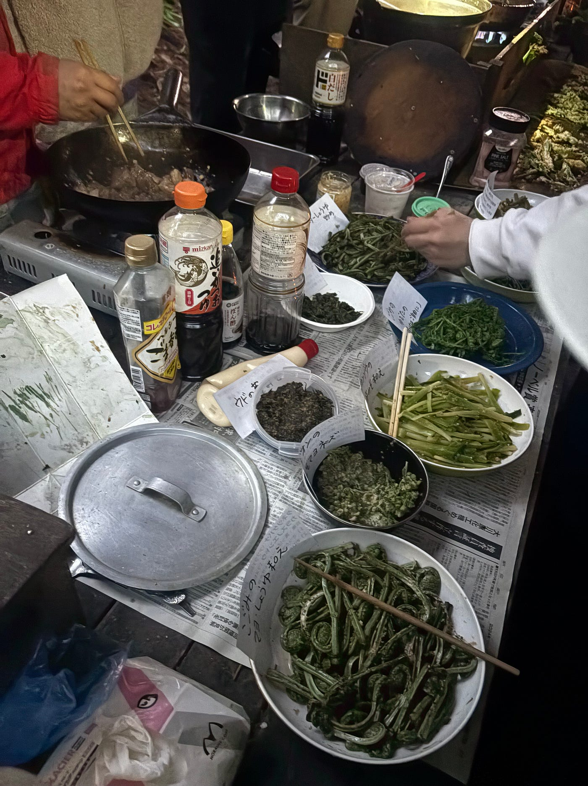
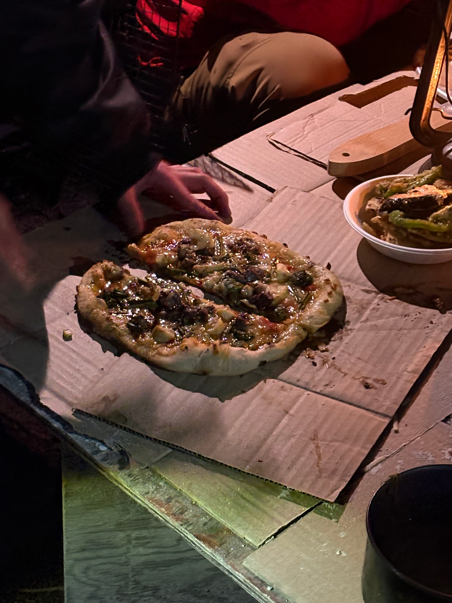
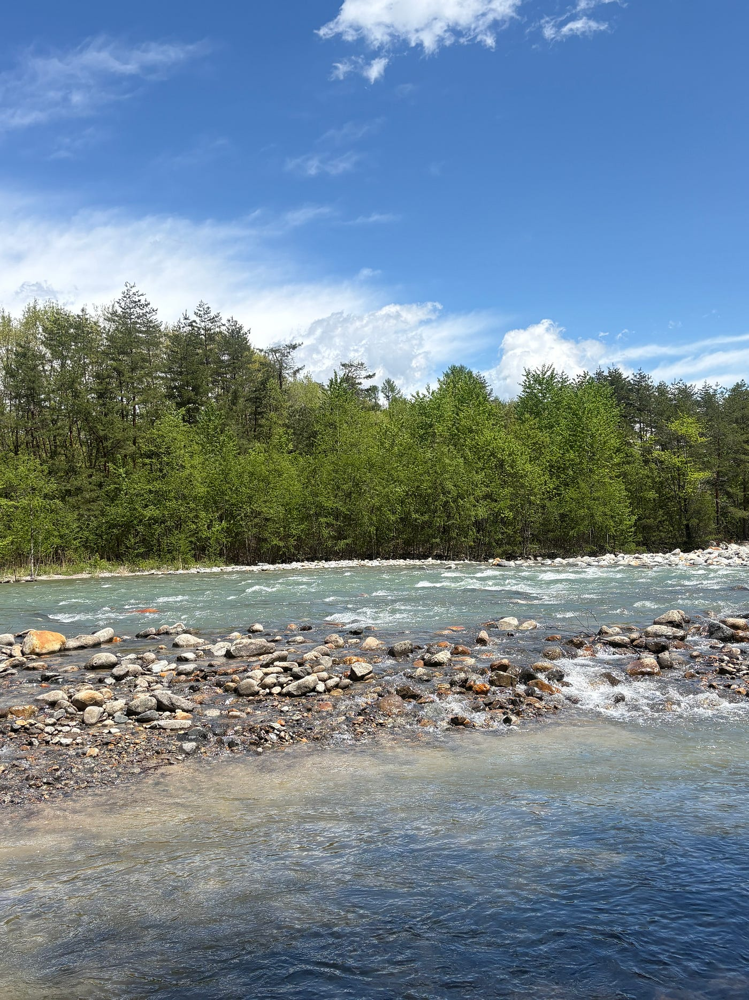
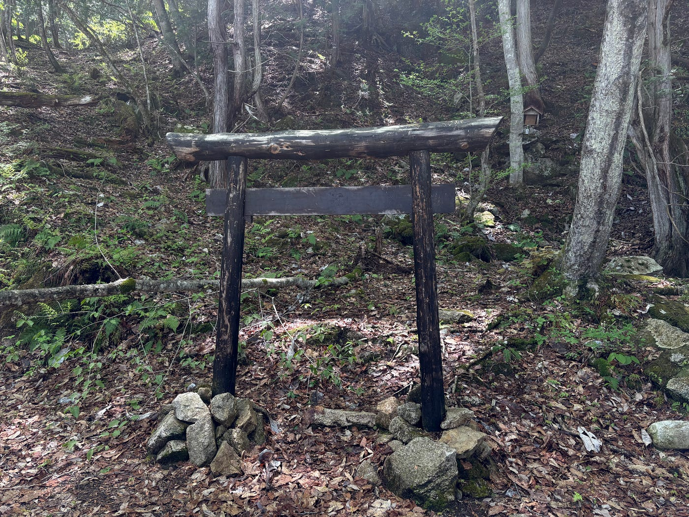
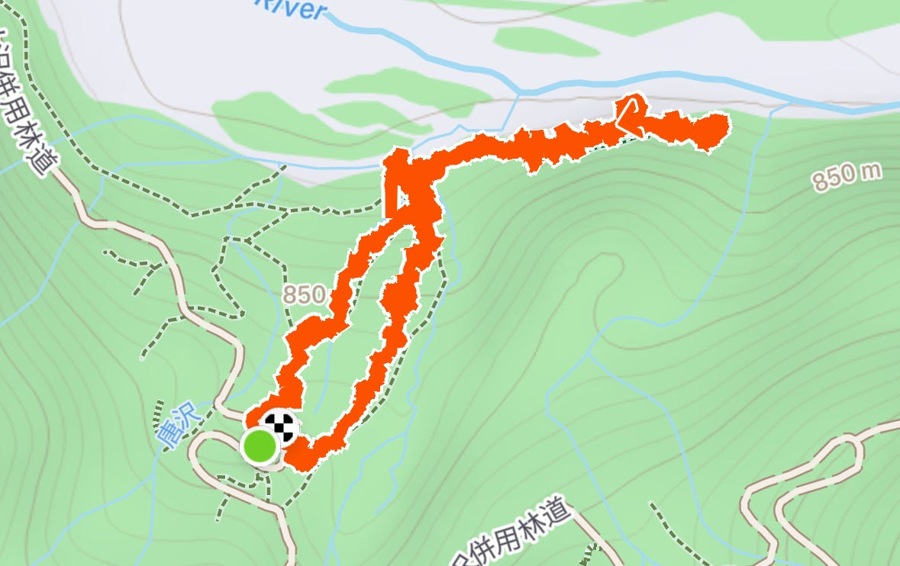
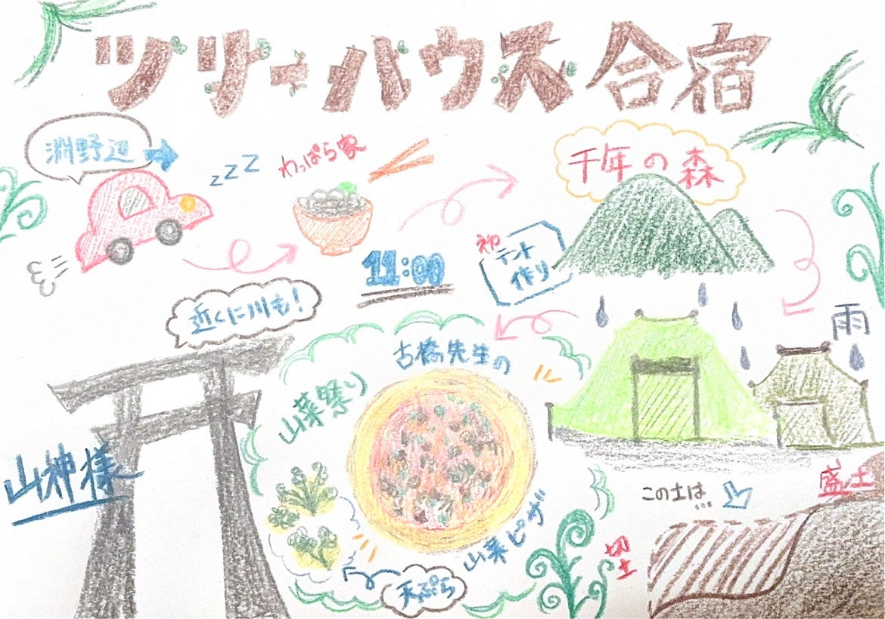

_ツリーハウスで新たな土地を開拓_

こんにちは、3年の米久保です。留学フィールドワーク以来のMedium投稿で少し緊張しています。

今回は5/3–5に長野県大町市にある「千年の森自然学校」で経験したことやその感想を自分なりにまとめてみました。

> 大町までの長い道のり🚗

まずは長野までの長い道のりをどう行くかで、沢山話し合いました。

女子は１人しか免許を持っていなかったため、新幹線で行こうか本気で迷っていたところ、男の子達が手分けして配車してくれることに！（本当にありがとう！）

ドライバーは朝からずっと運転してくれていたのに、私たちは初めから爆睡してしまい頭が上がりません。本当にごめんなさい。これが今回１番の反省点です。なので３年生の間に免許を取り切ることを心に誓い、次の配車で役に立ちたいと思います。

１１時ぴったり集合は叶わずでしたが、無事にみんなで集まれました。

このわっぱら家というお蕎麦屋さんが本当に人気で、１１時丁度に来ないと満席になってしまう程の名店でした。味も凄く美味しくて長野の方にも愛されている雰囲気でした。また行きたいです。

> 自分の土地を手に入れるまで⛺️

今回の合宿は、普段当たり前のように使用しているものが最低限しかない状態で始まりました。食材や食器もなければ、お風呂もない。そんな中で１番過酷だったのが、**寝床作り**でした。

本来崖のような場所をこれまでの先輩方が少しづつ平面にしてくださっていて、今回は私たちがその場所をより快適に使えるよう必死に掘りました。

土を掘るという作業をほとんどしたことがなかったため、最初は抵抗がありました。しかし切土と盛土の手法を使い自分たちの土地を開拓していたら、なんと才能を開花。私たちの代は皆、１度始めると無我夢中で続けてしまうタイプなのかもしれません。少しだけ広げるつもりだった場所もできる限り広く平面にしたくなってしまい、気づいたら約2時間ぶっ通しで掘り続けていました。本当に良い思い出です。

土地を勝手に掘って自分たちのしたいように出来るという環境が今までなかったし、これからもあまり無いような機会だったので、とても有意義な時間でした。

なぜかここで自分達の特技を見つけられたのも今回の合宿のおかげですね。

自分たちで掘った場所にテントを建てる作業も時間がかかりました。５人で１列にして寝るはずが、ギリギリ入らず。隙間を無くしてくっつけながら立てました。

１日目の夜は大雨で、風も強く寝るのが困難でした。同期の中には雨で浸水してしまった子もいて、本格的なサバイバル生活を送ることになりました。２日目は、雨は降らなかったものの風が強く極寒でした。温泉に行ったは良いものの、温めたはずの体が一瞬で冷えてしまい、何度も起きてしまいました。テントで寝たのも初めてだったので、もっと厚着を持ってくるべきだったなと少し反省しました。それでもテント生活は案外楽しく、温泉にみんなで行けたのも良い思い出です。

来年の３年生はツリーハウス作りになるかもしれないという話になっていたので、それもまた楽しみです！

> 山菜祭り🥬✨

今回の合宿中、「千年の森自然学校」では山菜をメインとした活動を行っていました。GWだからか子ども達が多く、とても賑やかな山菜パーティーになりました。いつも山で見かけるような山菜を実際に食べる機会なんてなかったので、色んな種類の山菜を一気に食べれたのはすごく良い経験でした。どんな山菜にも少しずつ違った苦味があり、そのちょっとした違いを今回の山菜料理で感じました。個人的には山菜の天ぷらが凄く美味しかったです。味付けはシンプルなものが多く、自然の味を生かした料理でした。

２日目に先生が作ってくださった山菜のピザも絶品で、２時間ひたすらピザ窯を温めてくれた３人も感謝です！

火起こしも子供の時以来でやり方を忘れていましたが、燃えやすい油分の多い葉を見つけたり、うちわで仰ぎながら火を大きくさせる作業は学びになりました。

> 急斜面を登って山神様に会う。

2日目の朝は、前日の夜とは違って晴天だったので皆で山神様に会いに行きました。急斜面というよりは崖に近いような場所を登ったり、川で足を水没させてしまったり、たった数時間だったのに色んな体験をした気がします。

そんな中でとっておきの一枚がこちら。

山神様に会う途中に見つけた川です。透き通った水を見て凄く癒されました。都会では感じられない空気の綺麗さと、水の流れに圧倒され、気持ちが浄化されました。　ここで撮ったVFもよく撮れていたので何度も見返してしまいます。

山神様の場所へは大体１時間ほどで到着しました。この山を守ってくださっている山神様のもとに辿り着けた時は凄く達成感がありました。テントを立ててご飯を作るだけでなく、こうして山を登ったり散策する楽しさをしれたのもこの合宿の醍醐味な気がします。

> 最後に

今回の合宿では、自分が今までの人生で触れてこなかった経験を多く出来ました。テントで寝泊まりしたことさえなかった私が、土を掘って土地を作り、火を起こし薪を割ったりと、キャンプならではの体験ができたこと、そして山菜を通して自然の食材の有り難みを知れたことは、本当に貴重な時間でした。いつもよりも長くて濃い2泊3日でしたが、今までゼミの時しか話せなかった人とも話せたり、より仲を深められたので確実に行って良かった合宿でした。これからのゼミ合宿も今回の経験や反省を活かして楽しみたいと思います。

最後にstravaとグラレコを載せておきます。

[https://strava.app.link/hhFRHLiiv3b](https://strava.app.link/hhFRHLiiv3b)

[strava.app.link](https://strava.app.link/oQ21XV7ve3b)

