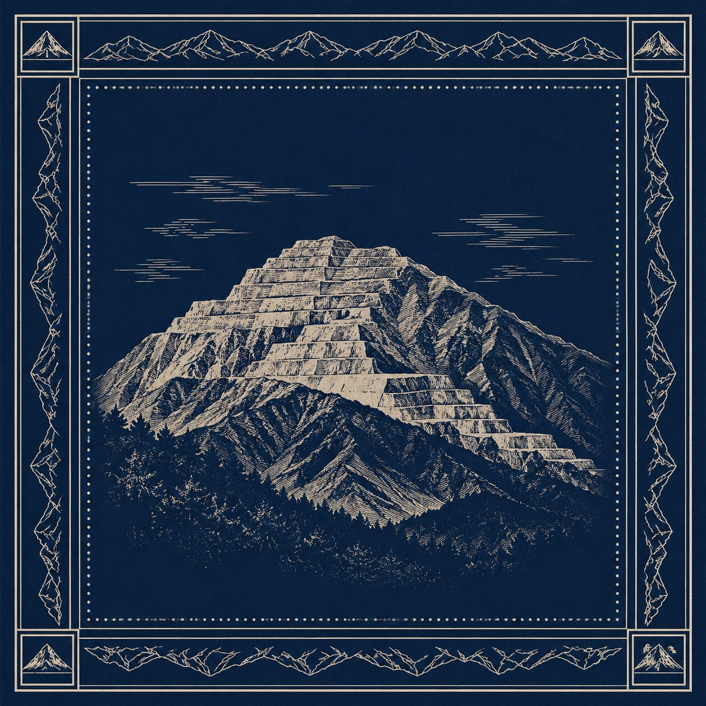
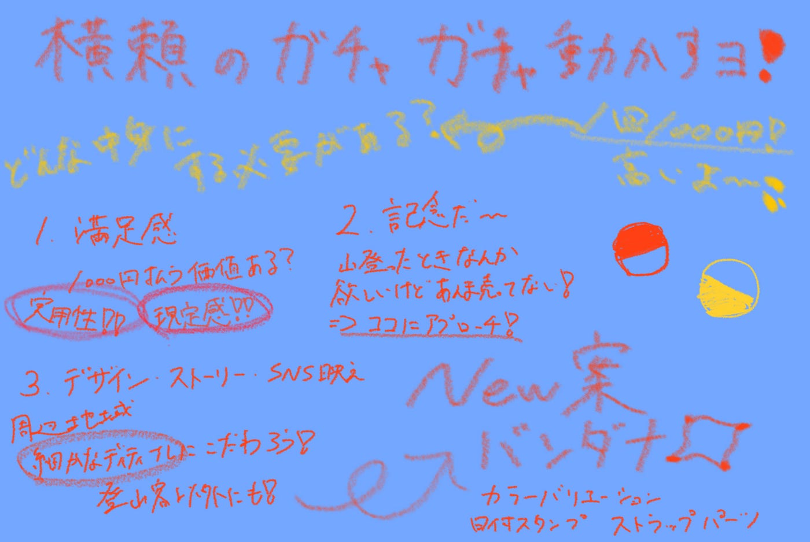

### 古橋研ってジオ展だけでガチャガチャやるわけじゃないのよ‼！

こんにちは！古橋研究室横瀬部の荒川がお送りいたします。ちょっと話変わりますけど、私動画編集のバイト受かったのではじめます！なんかバイトなのに1時間半面接されて疲れちゃったわよ。しかも帰り土砂降りだったし。梅雨入りいつになりますかねー。ツーリングの予定が立てにくいのが梅雨の時期の大変な点ですねー。

ハイ今回は！西武鉄道芦ヶ久保駅、駅前にあるA_Sta.Baに設置するガチャガチャの中身を考えます。以前みんなで考えた案もあるのですが、1回3Dプリンターから離れた案も考えてみます。

### そもそもどんな商品にしなきゃなの？

このガチャガチャ、1000円なんですね1回。高いですね普通に。世の中に1000円で流通してるガチャガチャを少し調べてみたら、かなりクオリティの高いフィギュアが多かったです。やっぱり1000円となると、相当な完成度が求められますね。

そんなガチャガチャに求められるのは何か。まずはそこから考え直します。

1.満足感

まずここだと思います。1000円払う価値があるのか。実用性が高いことが大前提として、サイズ感であったり「ここでしか手に入らない」という限定感も必須です。

2.記念

私もよく山登る人で、毎回思うのですが、「この山登ったぜ！」というお土産的なのがほしい！でも売ってないことが多い！ただのガチャガチャではなく、普通に記念品・お土産までクオリティを上げるのが1000円ガチャに求められていると思います。同じデザインでも、色のバラエティを持たせるなどしてコレクション性も持たせます。

3.デザイン・ストーリー・SNS映え

ただ武甲山や周辺地域にちなんだデザインにするのではなく、例えば等高線にこだわるだったり、細かなディテールまでこだわります。また、思わず写真を撮りたくなるようなデザイン性を持たせることで登山客だけではなく、その他の一般客にもアプローチする商品に仕上げます。

他にも挙げれば沢山あるのですが、300–500円のガチャガチャとは違って、「気になる」という理由だけで手を出しにくいのが1000円ガチャだと思います。記念品感やデザイン性に加えて、実用性まで考えた商品を作ることが必要です！

### New案

以前のハッカソンで議論した、3Dプリント案も考えつつ、1度入浴剤から離れた案も考えてみました。

### 1.バンダナ

ついこの間先生が研究室のチャットに投げていた写真を見て、あーいいかも！と思いました。バンダナって、汗を拭いたり、ご飯食べる時に下に置いたり、ちょっとした目印になったりと色んな使い方ができるものだと思います。私は結構バンダナ集めるの好きで、普段もファッションとして持ち歩いたりするので、デザイン次第ではファッションアイテムとしても売り出せそうです。([参考サイト](https://www.prismacreative.jp/item/3215))

肝心な値段ですが、過去の例を見ると1枚700–800円で発注できるみたいです(印刷代金込)。また、このバンダナ案に関してはガーメントプリンター使えるかもです。もし使えるとなったら、バンダナ自体は1枚300円以内で購入出来るみたいなので、それなりの利益も見込むことができます。

しかし、バンダナに1000円出せるかという次の議題があります。正直ギリギリかなーと思っていて個人的には。やっぱり1000円出すからには値段以上の満足度を持ってもらいたいので、何か追加の要素が必要だと思います。実現可能かはひとまず置いておいて、私の案を喋ります。

### ①日付スタンプ

日付クルクル変えられるスタンプを常設しておいて、バンダナにポンッて押せるようなデザインにするなんてどうでしょうか。この日に登ったんだぜ！ここに来たんだぜ！って記念感は結構嬉しいかなーと思います。一枚持ってるから今回はいいやーって思う層にもアプローチできそうです。綺麗に転写できるのかーだったり、インクの管理といった問題はありますが。

### ②ストラップパーツ

2つ目のプラス案として、ストラップ用パーツを同入するというものです。こちらは予算的な問題がありそうですが、[こんな感じ](https://amzn.asia/d/07t82bLZ)でストラップ風に付けられると商品としての価値は上がるのかなと思いました。

イラストのイメージです。いくつか色をそろえてコレクション性を出したいと思います！

#### その他案

バンダナ以外にも、カラビナ・ワッペンなんかもどうかなと思っています。デザインや売り方次第ですが、満足感を考えると少し劣るのかなという印象です。

参考までに、サイトを載せておきます。

カラビナ：[オリジナル名入れカラビナを製作します。スポーツイベント向けノベルティに最適。小ロット50個より](https://hotmobily.jp/products/carabiner/)

ワッペン：[オリジナルワッペン | ワッペンで.com](https://wappende.com/original/)

#### まとめ

前回のハッカソンでもこれだ！という案が決まらなかったため、もう一度横瀬部内で真剣に検討して6月中には稼働開始させたい！夏に間に合わせたい！スピード感を意識していきますよお！今年は！

