## 目指せ山ガール⛰️👧🏻2泊3日のキャンプ生活🏕️

こんにちは！中溝です。今回は5月3日から5日の2泊3日で行ってきた、長野県大町市に位置する千年の森自然学校でのゼミ合宿について報告します。

以前、サークルの合宿でキャンプをした時は、もともと平地だった場所で全部、先輩にテントを設営してもらいました。なので、今回の2泊3日のキャンプ泊とても実は心配でした‥。

### 到着後

1日目は集合時間より早く到着したので、先生と蕎麦屋さんの周りをお散歩しました。先生と初めて一緒にBeRealを取ることできて、さらに先生とBeralも交換できてうれしかったです。

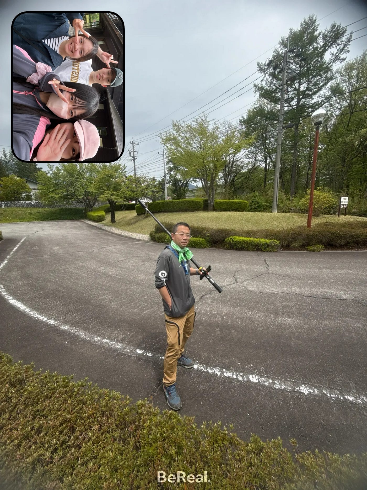

お昼ご飯は、もり蕎麦を食べました。山菜蕎麦と迷っていたら、先生に山でたくさん食べれるよって教えていただき、もり蕎麦を選びました。普段食べているお蕎麦とは味や風味が違っていて、とても美味しかったです。特に麺の香りが良く、自然の中で食べたこともあって、いつも以上に美味しく感じました。みんなで移動の疲れを癒しながら食事をすることができ、これから始まるキャンプへの気合いを入れることができました。

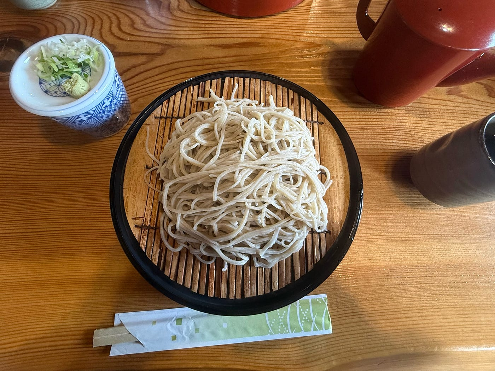

### 1000年の森自然学校到着！！

まず着いたら整地をしました。最初は、斜面の上にあって本当にこんなところに泊まるのかと思いましたが、後戻りはできないので気合いを出すことにしました。意外にも整地にするのがとても楽しくて、夢中になってしまいました。女子の担当部分が終わったので、男子の担当部分も整地部分も手伝いました。石をどかしたり地面をならしたりして、テントを建てやすい環境を作るコツを学ぶことができました。山ガールへの第一歩を踏み出すことができてよかったです。

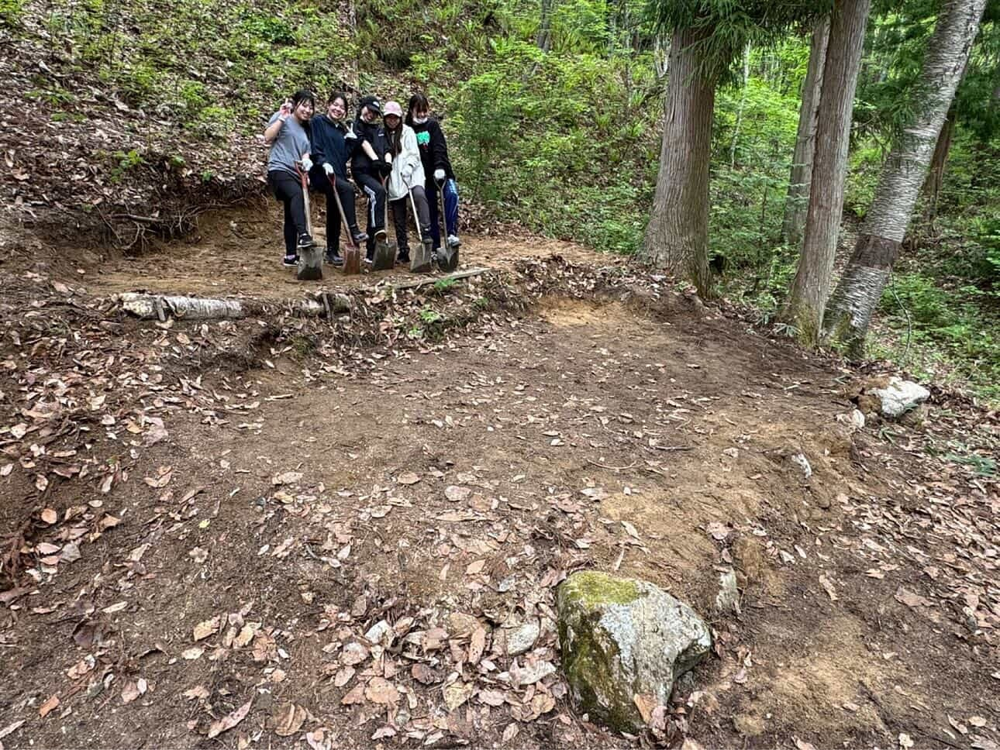

### テントの設営🏕️

その後にテントを設営しました。雨が降る前に設営を開始することができて安心しました。前回のキャンプでは先輩に全て設営を任して、焚き火の周りで休憩してたので、1人でテントを設営できるかとても心配でした。だけど、家でたくさん練習してきたのでなんとか1人でテントを立てることができました。テントの立て方など、キャンプで必要なこともたくさん学び、以前より色々できるようになって嬉しかったです。今年もサークルでキャンプがあると思うので、次は率先して動いていきたいと思いました。

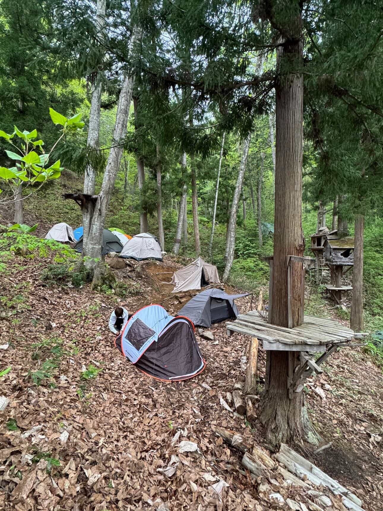

### 1日目の夕食

夕食は、他のキャンプをしていた人たちと一緒にご飯を食べました。普段はあまり関わることのない人たちとも交流することができ、みんなで話しながら食べる時間はとても楽しかったです。また、山菜をたくさん食べる機会はあまりないので新鮮でした。普段はお肉ばかり食べてしまうことが多いため、今回のキャンプでは野菜や山菜をしっかり食べることができて良かったです。

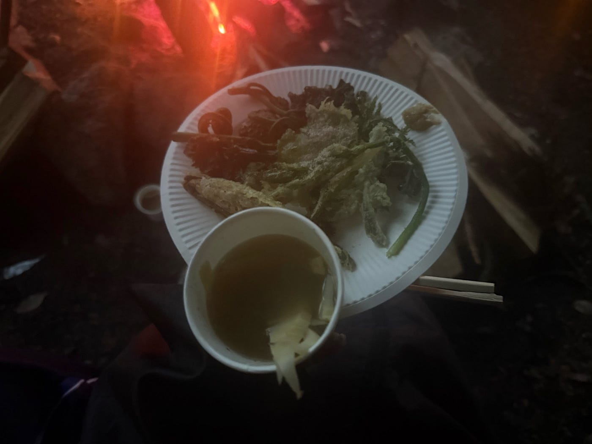

### 1日目の夜

その後、温泉に行き、1日の疲れを癒しました。でも、夜は大雨だったので、テントに帰りたくなくて、みんなでコンビニで時間を潰したのも良い思い出になりました。実際にテントへ行ってみると浸水していなかったので安心しました。また、前回は薄い寝袋で寝たため寒かったですが、今回は暖かい寝袋で寝ることができ、とても快適でした。今回使用したテントを貸してくれた親戚には、とても感謝しています。

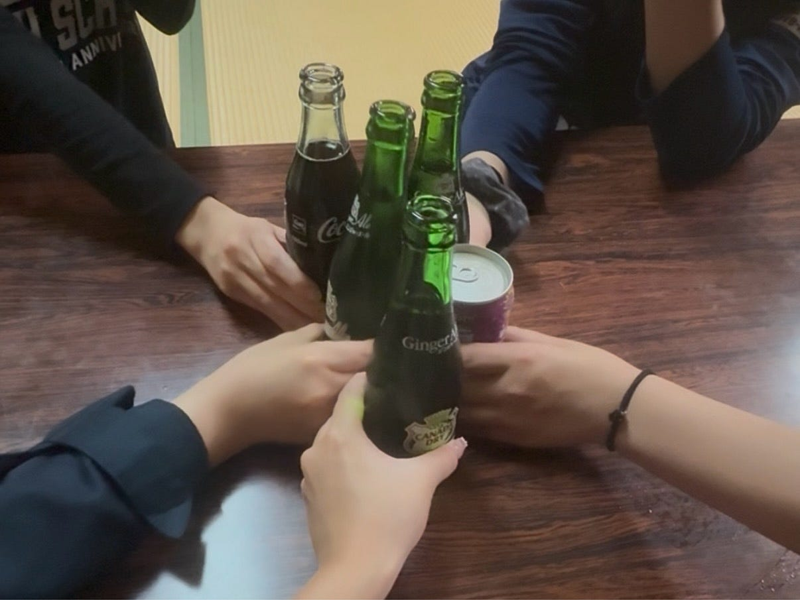

### 山神様への挨拶

2日目は山神様に挨拶をしに行きました。最初は「登るよ」と言われたので普通の山道を想像していたけれど、実際は整備された道ではなく、斜面を直接登っていったので驚きました。3点支持を意識して、転ばないように頑張りました。1週間前に山登りをした時、10回以上転んで泥まみれになったのがトラウマだったので、今回は一回も転ばなくてうれしかったです。それ以上に難しかったのが川渡りでした。石の上をバランスを取りながら進みましたが、足場が不安定で片足がびしょびしょになってしまいました。冷たかったけれど、それも自然の中ならではの体験だと感じました。みんなで声を掛け合いながら進んだので、無事に渡り切ることができて安心しました。

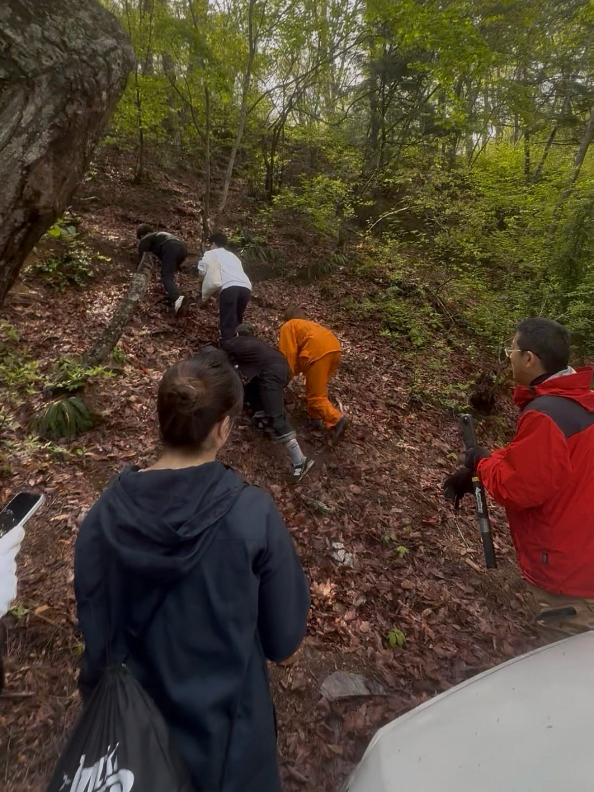

山神様にはお酒をお供えしてご挨拶をしました。山の中の静かな場所で手を合わせる時間は、普段なかなか経験できない特別な雰囲気があり、自然への感謝や山を大切にする気持ちを感じることができました。また、みんなでVFの動画も撮影し、とても良い思い出になりました。撮影ではみんながたくさん協力してくれてうれしかったですし、一緒に活動する中で仲も深まったと感じました。

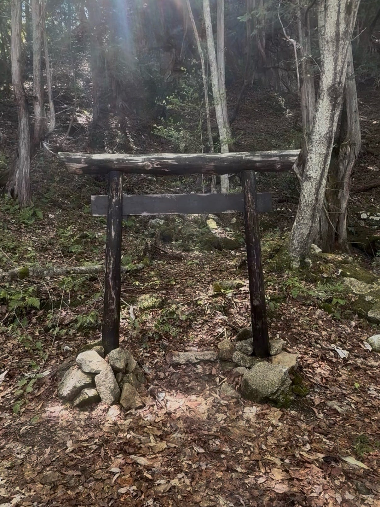

### 2日目の夜ご飯

夜は先生が作ってくれた山菜ピザがとても美味しく、自然の中で食べることでさらに特別に感じました。先生がイタリアで修行して、作ったピザの味はとても美味しく、サガ祭でも出してみたら人気が出そうだと思いました。

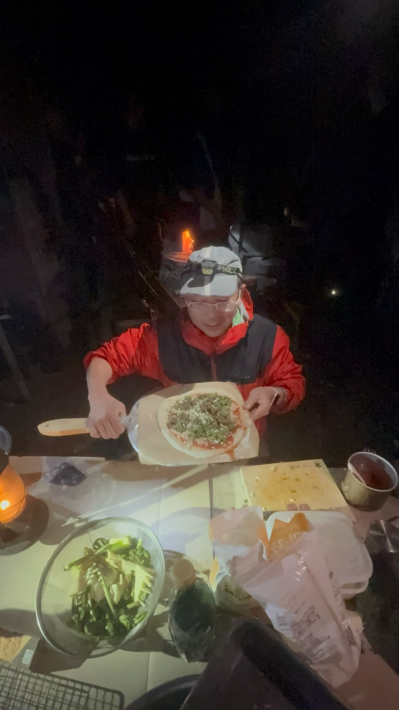

### 2日目の夜

2日目の夜は、最終日だったので、みんなでスーパーに寄って買い出しをし、夜食をたくさん買いました。

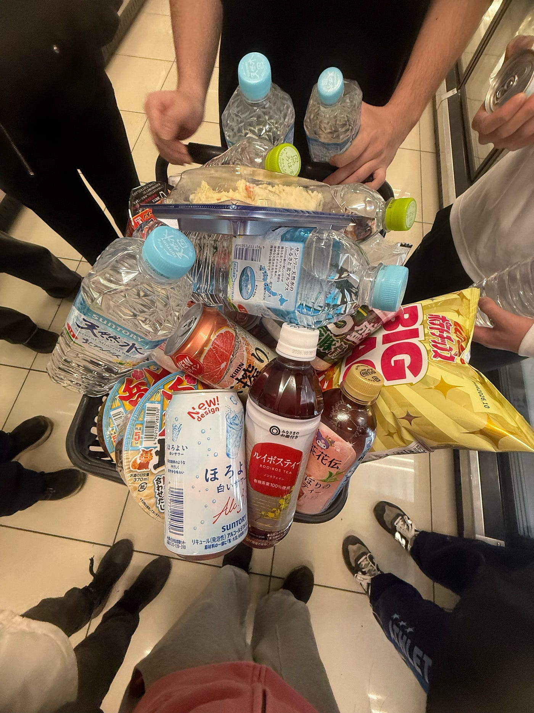

1日目の夜とはテンションがかなりみんな違くて面白かったです。最後の夜だったので、みんなで夜食を食べながら人狼ゲームをして盛り上がりました。みんな人狼のレベルが高く、表情や話し方だけでは全然分からなくて驚きました。普段あまり話さない人ともたくさん交流することができて楽しかったです。

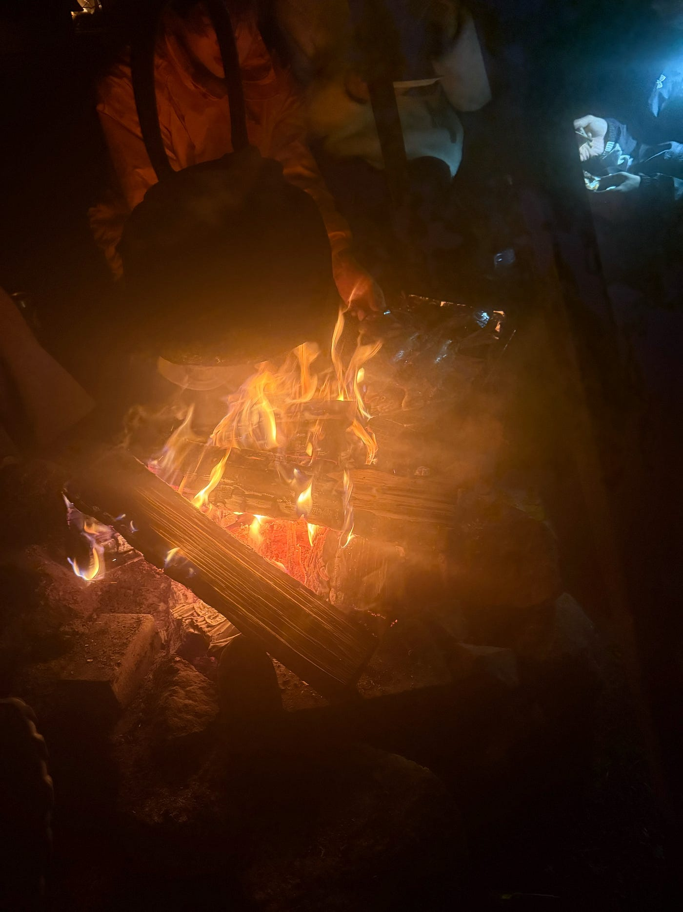

### 感想

今回のキャンプを通して、自然の中で過ごす大変さだけでなく、協力することの大切さや、みんなで活動する楽しさを改めて感じることができました。山ガールにもなれたのでよかったです！！

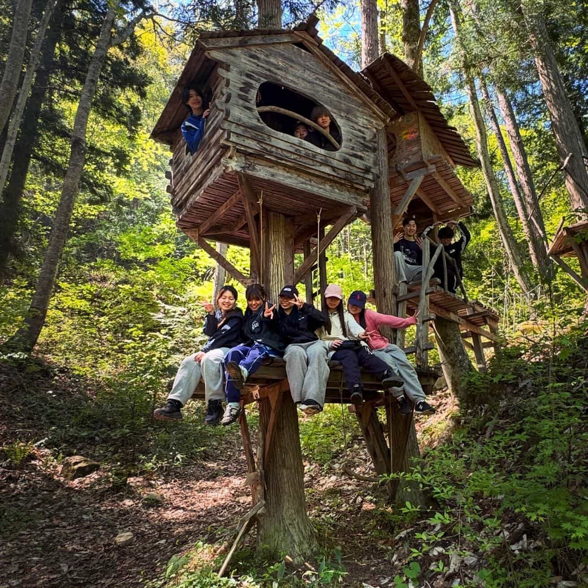

### Strava の記録

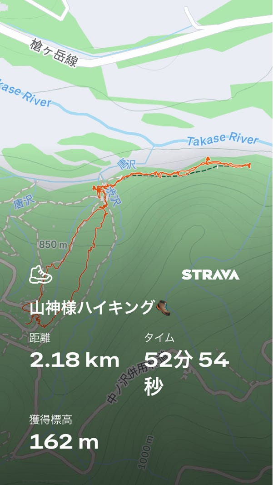

https://strava.app.link/n9g1q9j0e3b

### グラレコ

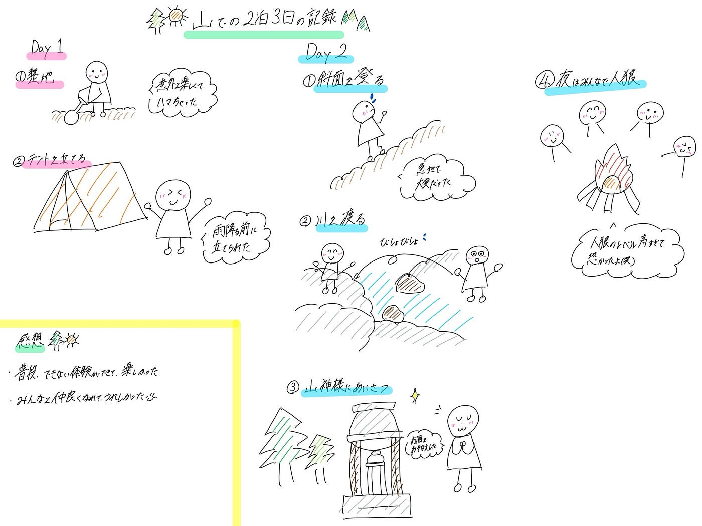
