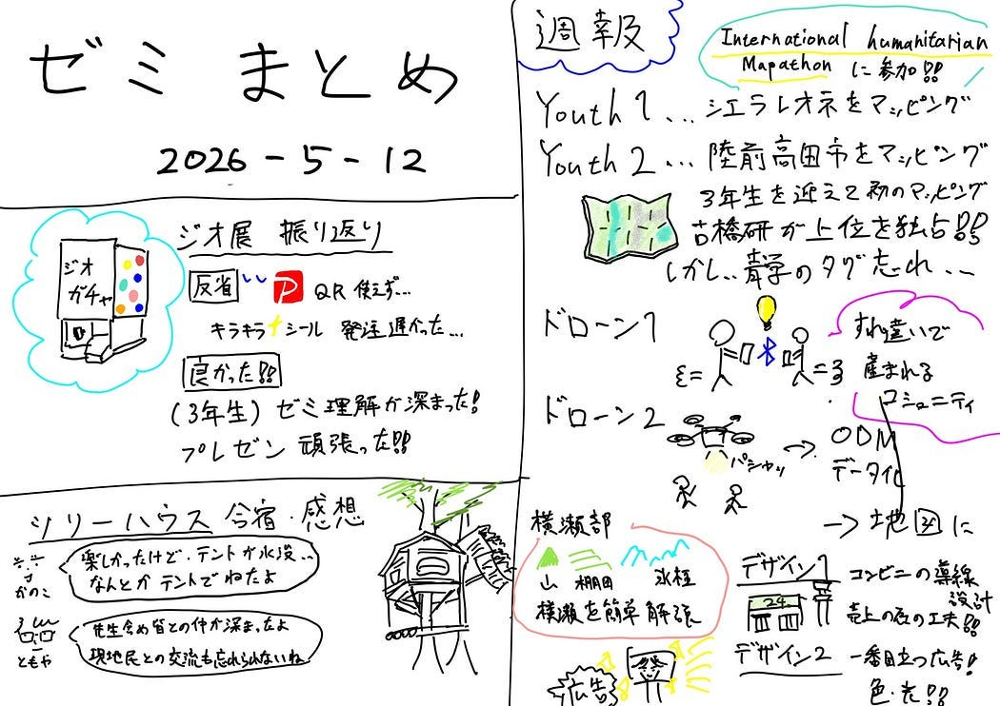

### 2026 5 12 古橋研ゼミまとめ

こんにちは。渡辺優斗です。

今回は欠席した5月12日のセミナーをグラレコにてまとめてみました。

思いがけずこれが初のグラレコへの挑戦となったのですが、なかなかうまくいきませんでした。

以下に主な反省点２つを述べます。

・スペース配分

聴きながら描き始めると、後々出てくるコンテンツがどの程度のボリュームかが分からないため、1度スルーで聞いてコンテンツを把握する必要がありました。

・絵と文章の成分比

グラレコはイラストを用いて視覚的に見るものにもかかわらず、私のグラレコは文章で説明してイラストはかなりに付けているだけのような気がします…

見やすさを向上するためには、練習あるのみだと思いますので、上手い人のグラレコを参考にしつつ、回数を重ねて上達していきたいと思います。

以下セミナー講義のグラレコです。

2026 5 12 古橋研講義内容 グラレコ
