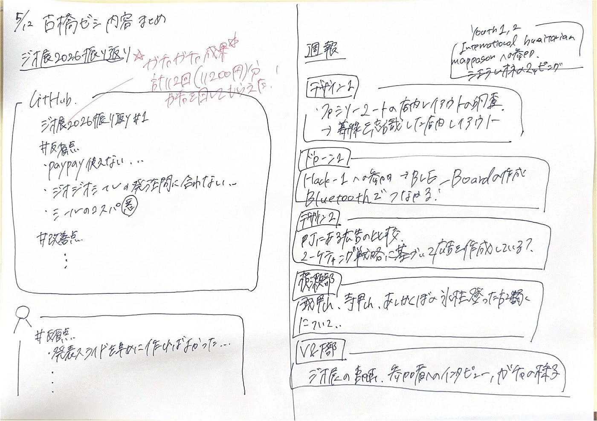

## ５/12ゼミの内容

こんにちは

デザイン部4年の滝沢です。

5/12古橋ゼミに欠席したので、授業動画を参考に、内容をグラレコにまとめてみました。

ジオ展2026振り返り、レポートの書き方の確認、各サークルの週報を行いました。、

1️⃣ジオ展2026振り返り

GitHubにて振り返りを行う。1人1つはコメントする

#反省点と#改善点に分けて、反省を行いました。

#反省点

▶︎PayPayのQRコードが使えない…ジオジオシールの発注が間に合わない…シールのコスパが悪い…シフトを守れなかった…発表スライドを早めに作ればよかった…などさまざまな声がありました。

#改善点

#よかった点

▶︎名刺を作ることができた…

2️⃣レポートの書き方

・レポートが完了したら自分のSNS(X,Instagram, Facebook…)に上げること。

・グラレコを1枚上上げること

等…

3️⃣各サークルの週報

Youth1

・4/23–4/24international humanitarian mappsonnへの参加

シエラレオネのマッピング.

ドローン1

・Hack-1＝デザイナーやエンジニアを志す学生がアプリやサービスを作るイベント

すれ違い通信的な、BLE_Boardを作成した。

これはBluetoothで繋がることのできる掲示板。ネットが使えない災害時でも情報を共有できることを目指す。

デザイン1

・各々がファミリーマートの店内レイアウトを調査

消費者が商品をついでがえするような、導線を意識した店内レイアウトであった

△先生のアドバイス

→先行事例を調べて、それに基づいて調査するのなおよし。

デザイン2

・町にある広告を比較してみた。目を引く広告にはどのような特徴があるのか。

看板の発光有無、色の種類など、人を惹きつけるためのマーケティング戦略があることがわかった。

横瀬部

・武甲山、寺甲山、あしがくぼの氷柱登ったよ、、の報告

Youth2

・・4/23–4/24international humanitarian mappsonnへの参加

シエラレオネのマッピング.

V&F部

・4/28のジオ展2026を動画にしてみた

参加者へのインタビュー、ジオガチャでの様子

