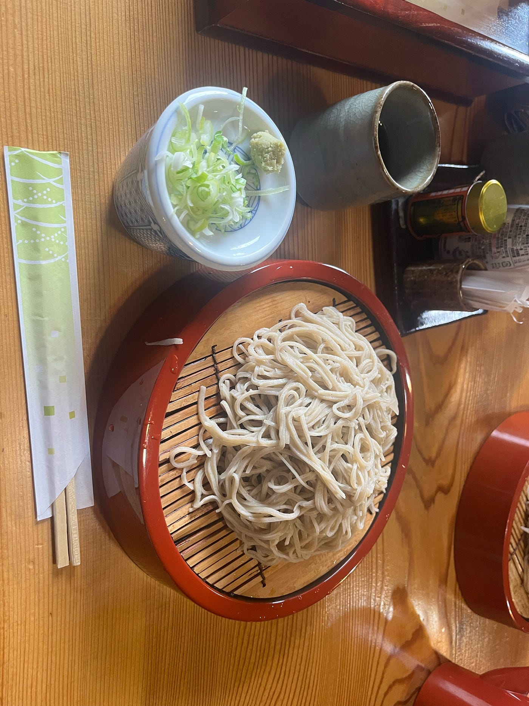
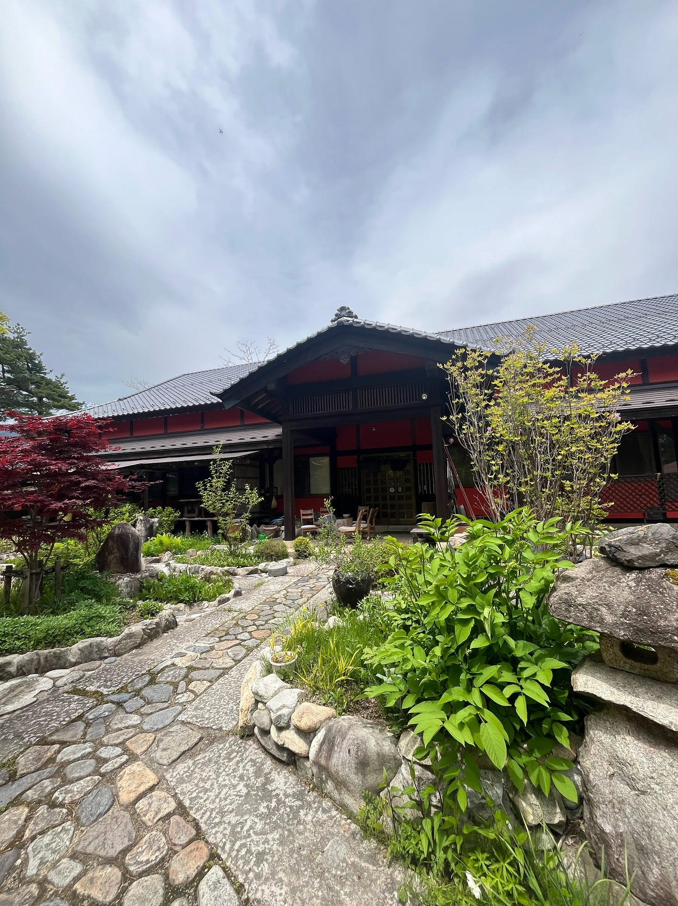
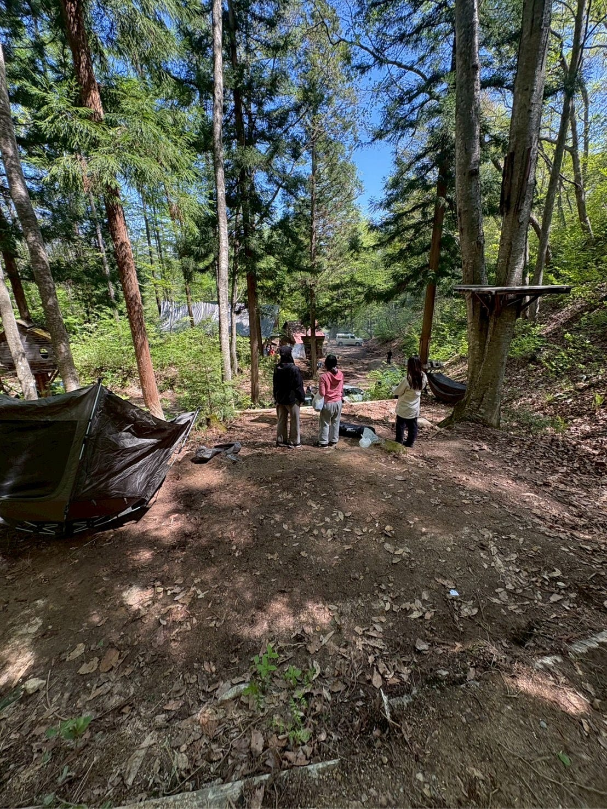
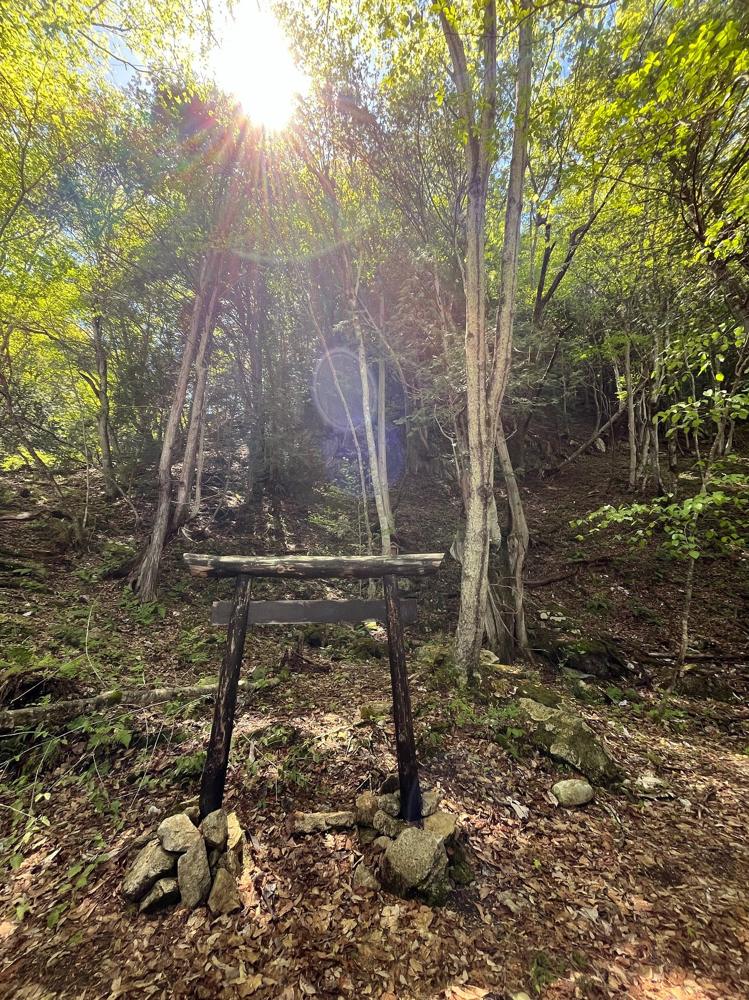
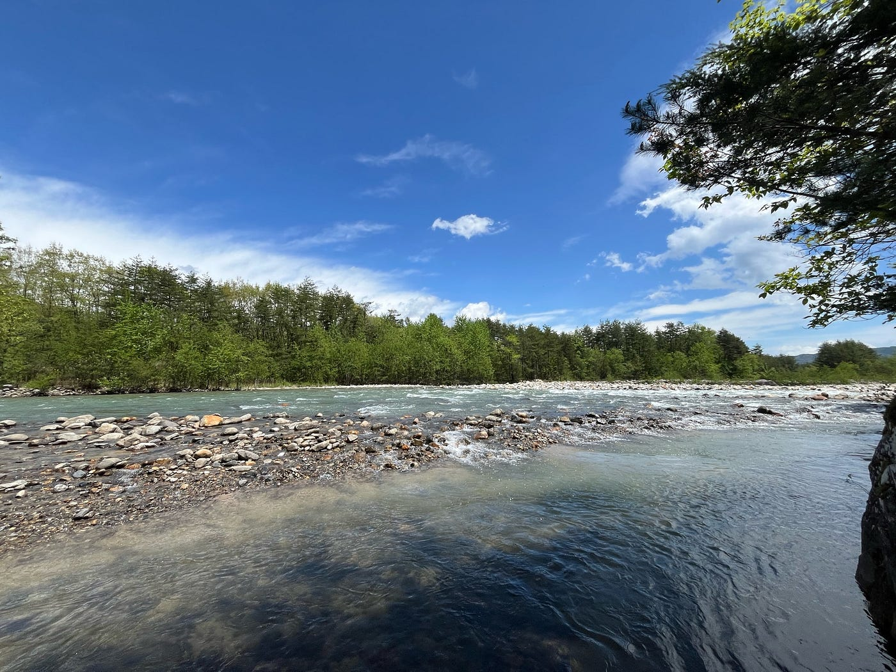
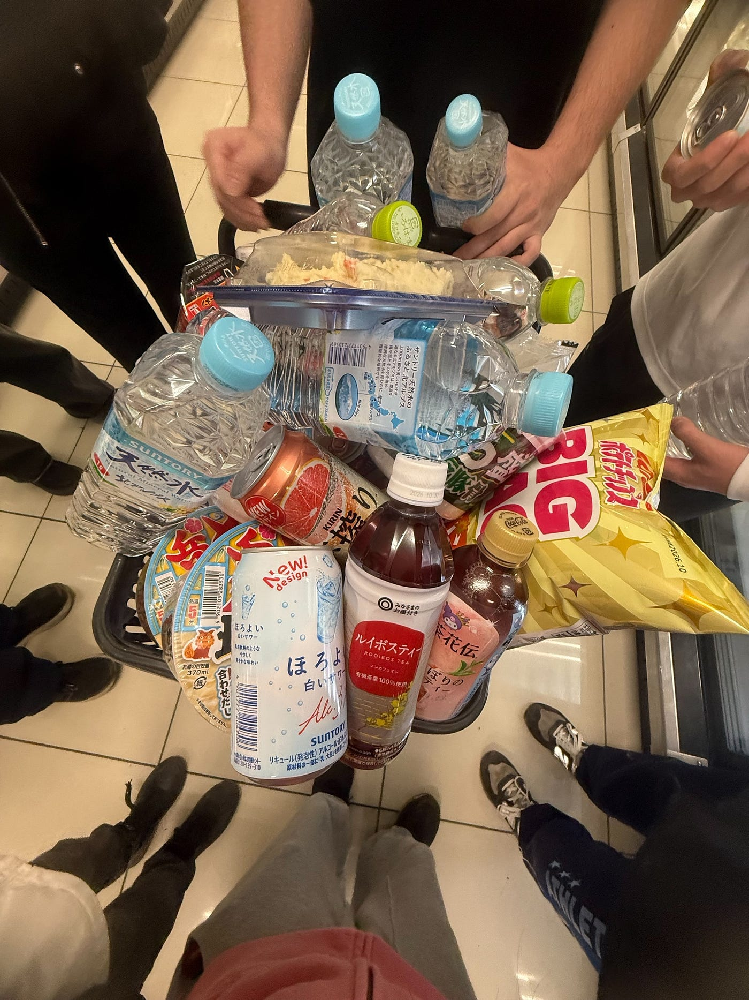
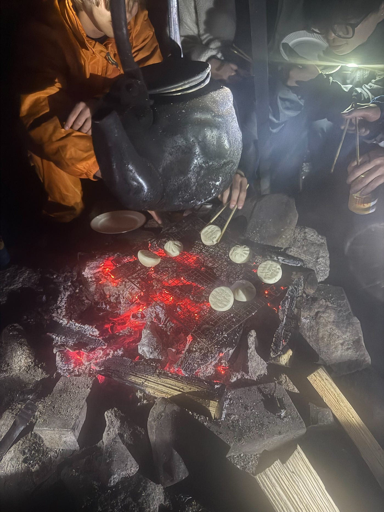
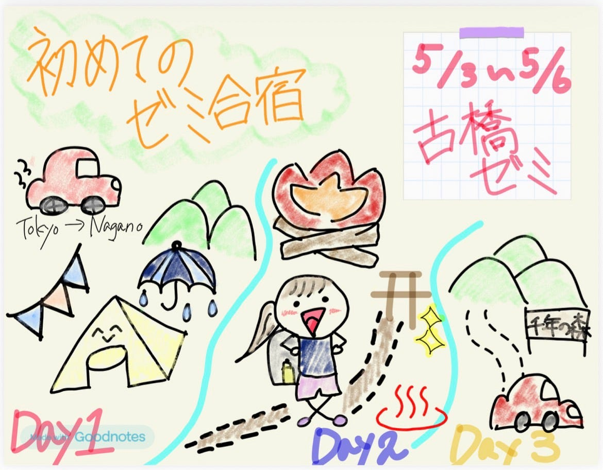
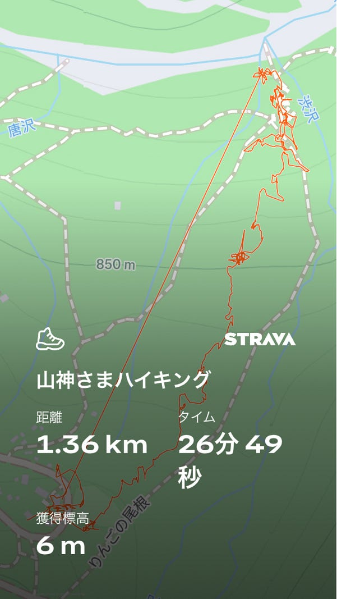

## 初めてのゼミ合宿！！

### 〜同期や教授と仲良くなりたい〜

こんにちは！三年の藤原です。

今回はゴールデンウイーク中の5月3日から5月5日までの2泊3日で長野県大町市にある「千年の森自然学校」に新3年生11名と古橋教授で行ってきました。そしてそこであった出来事やハプニング、気づいたことや自分の経験を活かした後輩たちへ向けたアドバイスなどについて書いていこうと思います。

#### ＜出発編＞

今回私たち3年生は大町まで東京出発組と淵野辺出発組の2つのグループに分かれて第一目的地である「わっぱらや」というお蕎麦屋さんを目指しました。

私は東京方面組だったのですが、まず集合時間が11時なこと、ゴールデンウイーク中で渋滞が予想されること、レンタカー代、東京組の待ち合わせ問題などいろいろなことを含めて考えて相談した結果、私たちは前日出発をすることにしました。

そして、今回私たち東京組の救世主ともいえるゆうへい君の登場です。なんとそれぞれのメンバーの家の近くまで迎えに来てくれたのです、、、！

そして深夜1時ごろに東京を出発し、首都高に乗ってみんなでお話をしたり、レインボーブリッジにみんなで感動したり、車内は終始女子3人のお喋り＋ゆうへい君への質問攻めなど楽しく時間は進んでいきました。そうこうしている間に、早朝3時ごろに双葉サービスエリアに到着し、一旦朝まで仮眠をとって休むことになりました。

#### ＜到着＆1日目スタート＞

サービスエリアで軽く朝食をとり、いよいよ集合場所へ出発です。向かっている途中きれいな富士山が見えたり、長野の自然豊かな山々やのどかな田んぼの風景を見ているうちにわっぱらやへ到着しました。その後すぐに教授が到着され、淵野辺組の到着を待つ間、近くを散歩して、なんと教授のBerealをゲットすることが出来ました！驚きと嬉しさでいっぱいでした（笑）。昼食にわっぱらやで本場長野の信州そばを食べてこれまた美味しくてびっくり！さすがグルメな先生一押しなだけある、、、。

そして教授案内のもと千年の森自然学校に到着。

～いざ、土地開拓ぞ～

開会式を終え、さっそく3日間過ごすテント設営のため平地づくりがいきなりスタート。初めはわけも分からずただひたすらに斜面を切り崩していたのですが、いつの間にかだんだん平らになっていき、掘れば掘るほど楽しくなっていきました。2時間ほど続けると大分平らになりました。

～初のテント設営～

さあ、土地を開拓し終えたら、いよいよテント設営です。今回私はAmazonでワンタッチのテントを購入しました。事前に家で練習したので意外とすんなり建てられました。

#### ＜2日目＞

2日目は朝食班としてみんなより少し早起きをして朝食づくりを手伝いました。朝食後は山神様にお参りしにハイキング。しかし、想像していたよりも斜め上を行くハイキングでした。その後、夕飯までの時間でツリーハウスを実際に見て登ったり、林道整備をしながら橋まで散歩をしました。

夕食では、教授が山菜ピザを振る舞ってくださいました！山の中で実際に窯で焼かれたピザはとても美味しかったです。

夕食後にはお風呂に入りに行き、その後みんなで焚き火を囲みながらパーティーをしました。一緒に話したり、人狼をやったりして仲を深められたと思います！！

そして人狼を朝4時までやって就寝😴

#### ＜最終日＞

最終日、なぜか私はみんなより1時間寝坊してさくらからの電話で起床。焦って下へ降りるとみんな朝食終わりかけ。私も大急ぎで朝ごはんを書き込みました。（あとで聞くと、教授がまだ起こさなくてもいいよとあえてゆっくり寝かせてくれたことを聞き、教授の優しさへの感動が止まりませんでした（笑））

そしてとうとう3日間過ごした千年の森自然学校ともお別れが近づいてきました。テントの片付け、ごみ回収などをして自分たちが過ごしていた場所をみると改めて平地になっていてやっぱりうれしくて誇らしかったです。今までお世話になった方々への挨拶と最後の掃除を終え、集合写真を撮り、本当のお別れ。3日間ありがとうございましたという気持ちで出発。

#### ＜3日間を通して感じたこと＞

現代の私たちの生活ではほとんどが文明に頼っていて、自給自足の生活がこんなに大変だとは思いませんでした。自分たちで水を汲んだり、火を起こしたり、寝床を一から作ったり、このゼミに入らなかったら中々経験できないことだと思ったので、今回の合宿は大きな気づきと日々の生活への感謝の気持ちが一層強くなりました。

あと、運転免許を早く取らないといけないと思いました。

#### ＜次の後輩たちへのメッセージ＞

テントや装備はきちんと先輩や教授に聞いてきちんとしたものを買いましょう。私はAmazonで低価格帯のテントを買って、タープがてっぺんにしかついていなかったがために1日目の雨でテント内に浸水してしまったので、買うならタープがしっかりかかっているものがおすすめです。あと、私はトレッキングシューズを履いて行ったのですが、とても歩きやすかったのでそれもおすすめです。夜も長野の山なので気温が大分低くなります。大体8〜10度くらいかな？それくらい夜は寒くなるので防寒対策をしっかりした方がいいと思います。

#### グラレコ

#### Strava

[https://strava.app.link/AOTZuvY2f3b](https://strava.app.link/AOTZuvY2f3b)
