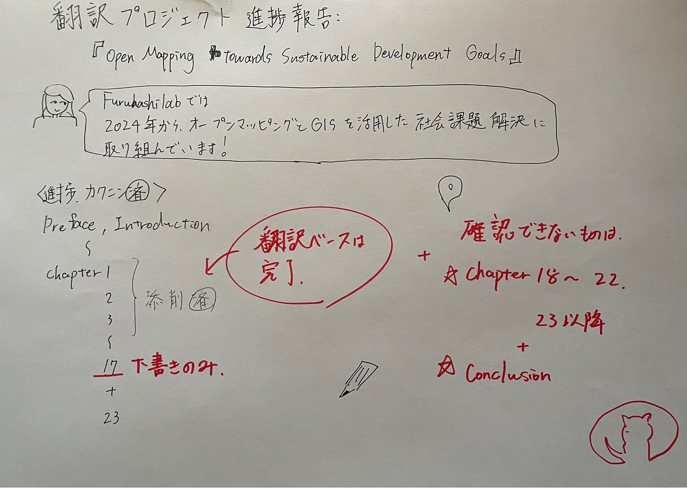

### 翻訳プロジェクト進捗報告：『Open Mapping towards Sustainable Development Goals』日本語翻訳の進捗状況について

こんにちは、古橋研究室（Futuhashilab）の佐藤です！

私たちの研究室では、2024年からオープンマッピングと地理空間情報を活用した社会課題解決（Mapping for SDGs）に取り組んでいます。その一環として、YouthMappersネットワークの歩みと学術的成果をまとめた書籍『Open Mapping towards Sustainable Development Goals』の日本語翻訳プロジェクトを推進しています。

今回の進捗確認にあたり、研究室に蓄積されている翻訳データ（1から順に大きくなっていく連載チャプター）とMedium上の下書き状況を、実際の書籍の章（Chapter）と照らし合わせて一覧表に整理しました。

#### 現在確認できる進捗

**書籍の実際の章（Chapter）とテーマ対応するお手元データ / Medium下書き現状とチームのタスク**

**Preface（序文）/ Ch.1**

（Introduction：理念と背景）

`No.1.docx` / Medium `No.1**`【完了・下書き済】**：書籍の導入パート。

→Ch.2–3も確認済み

**Ch.4**

（ガーナ：食糧安全保障）

`No.2.docx` / Medium `No.2**`【完了・下書き済】**：飢餓地域のベースラインマッピング。

**Ch.9**

（Everywhere She Maps）

`No.2 (1).docx` / Medium `No.3**`【完了・下書き済】**：ジェンダー平等と女性マッパー育成。

**Ch.10**

（コスタリカ：水・エネルギー・土地）

`No.3.docx` / Medium `No.4**`【完了・下書き済】**：火山流域のネクサスモデル評価。

**Ch.11 〜 Ch.15**

（各国のオープンマッピング事例）

連載データ内に集約 / Medium `No.5**`【完了・下書き済】**：連載形式のなかでベース翻訳が完了しています。

**Ch.16**

（ブラジル：ファベーラ・不平等）

`No.6 佐藤.docx` / Medium `No.6**`【完了・下書き済（佐藤担当）】**：都市アクセシビリティ。確認済みとして、ここから最終チェックとパブリッシュに進みます。

**Ch.17**

（中南米：環境レジリエンス）

`No.6 佐藤.docx`の後半 / Medium `No.7`〜**【完了・下書き済（佐藤担当）】**：パナマの生態学的ゾーニング。確認済みとして、最終パブリッシュの準備をします。

**Ch.23**

（フィリピン：農業と女性）

`No.10上原.docx` / Medium `No.10**`ベース完了・下書き済**：女性マッパーの役割と生産支援アクセスのデータ分析。

**Conclusion（終章：p.341〜358）**

（今後のイノベーションと提言）

`No.3.docx`（後半）/ `深水翻訳 のコピー.docx` / Medium `No.12**`ベース完了・下書き済**：シエラレオネの地方送電網マッピング事例、およびコミュニティの未来への提言。書籍のラストまで翻訳が完了しています。

私たちの新体制（チーム2）が「これからやること」

連載の№1〜№6、および後半パートの翻訳文も綺麗に揃っているため、ゼロから新しく翻訳を書き起こす作業はありません。これからは、この確認が取れた確かな翻訳資産（№1〜№12）を世に送り出すための「最終統合と仕組み化」に注力します。

1. 全12パートの一貫性チェック（表記ゆれ・専門用語の推敲） これまでに1から順に大きくなりながら蓄積されてきた全12パートの文章をチェックし、技術用語（トポロジーやデータ品質管理など）や表現のゆれを、読み物として最も美しい古橋研クオリティに最終調整します。

1. 担当章（第16章・第17章）の公式パブリッシュ 確認を完了したブラジルの都市アクセシビリティや、中南米パナマの環境レジリエンスの章について、最終推敲を経てMedium上での公式公開（パブリッシュ）を完了させます。

1. GitHubを活用した「特設翻訳アーカイブWebサイト」の構築 Mediumでの連載公開と連動し、翻訳されたドキュメントを未来のメンバーや外部のマッパーがいつでも検索・活用できるよう、GitHub上に特設Webページを構築して持続可能なオープンアセットとしてアーカイブ化します。

#### 補足：役割分担の新体制（Teams & Tasks）

▼ チーム1：実践・コミュニティ・発信担当 ・主なタスク：マッパソンの企画・運営 / SNS運用 ・狙い：すでに翻訳完了している世界各地の知見（ファベーラ、アクセシビリティ、農村インフラのマッピング手法）を、実際のイベント（マパソン）の企画に落とし込んでコミュニティに還元します。

▼ チーム2：翻訳推敲・構造化・Web担当（★私たちが担当します！） ・主なタスク：Medium連載の最終整理と順次公開 / Youth関連イベント参加 / GitHub特設サイト構築 ・狙い：私たちのチームは、揃っている全翻訳データのクオリティを最高レベルに引き上げ、GitHubと連動させて「研究室の公式アウトプットWebサイト」としてパブリッシュしていきます。

GitHubでやる予定です。

#### グラレコ

