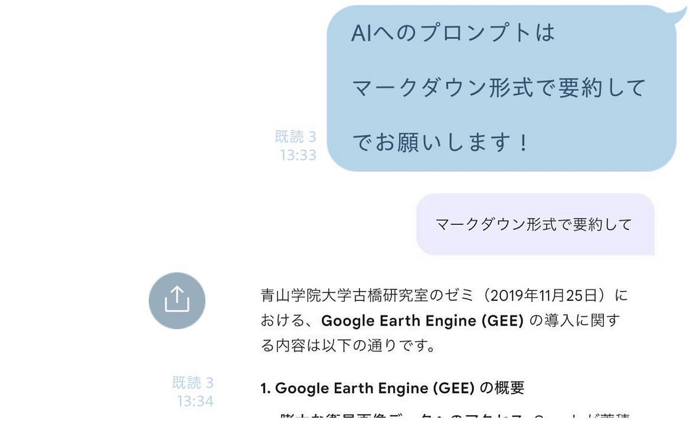
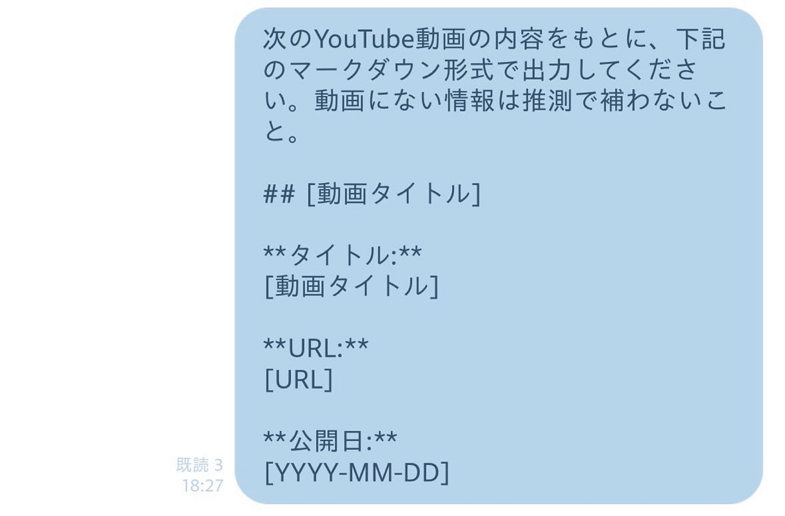
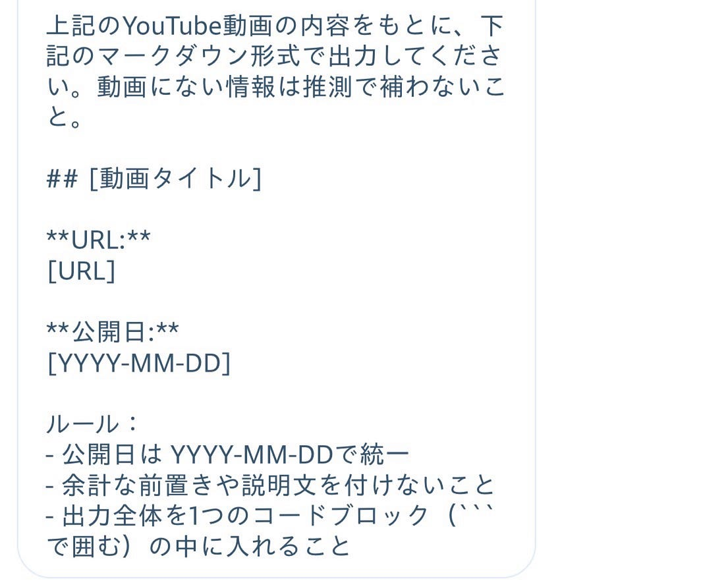
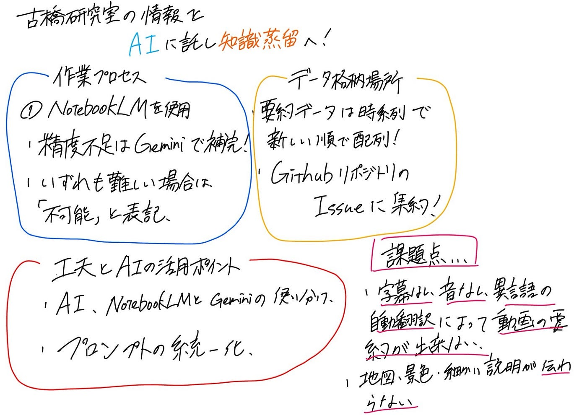

## 【デザイン2】古橋研究室YouTubeチャンネルの知見をAIでまとめる！

こんにちは。4年デザイン部の稲田です。

今回のハッカソンでは、古橋研究室がこれまでアウトプットしてきた膨大な情報をAIに託しながら知識蒸留させることを目標に努めました。

今週、私たちデザイン2は、古橋研究室の公式YouTubeチャンネルに投稿されている、ショート動画やライブ配信のアーカイブを含む159本の動画をAIを用いてマークダウン形式でまとめました。

### ハッカソン概要

古橋研究室の過去のアウトプットをAI（私たちはGoogle NotebookLM、Google Geminiを使用）を用いて要約し、GitHub上で誰でも検索・閲覧可能な形式で整理する。単なる情報の集約にとどまらず、将来の研究活動においても活用できる状態を目指す。

### 詳細・作業プロセス

YouTubeに公開されている159本の動画やショート動画、ライブ配信のアーカイブを対象に、以下の手順で要約を行いました。

#### 1. AIツールによる要約

- 効率性を考慮し、まずはGoogle NotebookLMを使用して動画の要約を試みる。

- 精度が十分でない場合はGoogle Geminiも活用して動画の要約を試みる。

- 要約においては、Google NotebookLM、Google Geminiを2重で試しても要約が困難な場合は「AIによる要約不可」と明記するという例外処理ルールを徹底する。

【使用したバージョン】

※ Google NotebookLM＝1.396, 2026–5–19~23

※ Google Gemini＝3.5Flash, 2026–5–19~25

#### 2. プロンプトの統一

全メンバーで統一したアウトプットにするため、AIへのプロンプトは

「マークダウン形式で要約して」に統一！

#### 3. メタデータについて

要約はGoogle NotebookLMを中心に使いましたが、メタデータについて質問した際は日付などの正確性が落ちたため、Google Geminiを使いました。

AIへのプロンプトは左(→上手くいかない場合に右)としました！要約の上にペーストしたことで、タイトルやURL、公開日が見やすくなりました。

#### 4. 分担体制の構築

4人のメンバーで、一先ずは動画を公開順（最新のものから）に分類し、効率的に進めました。

| 担当 | 公開順 |

| みわ | 1〜39個目の動画 |

| もえ | 40〜79個目の動画 |

| ゆうか | 80〜119個目の動画 |

| ゆうへい | 120〜156個目の動画 |

※ショート動画、ライブ配信のアーカイブも要約

### データ格納場所

作成した要約データは、時系列で新しい動画順に並べ、次にショート動画、最後がライブ配信のアーカイブとなるように並べ、以下のGitHubリポジトリのコードに、ファイルとして格納しました。

[KnowledgeDistillation2026/Design2_YouTube/Design2_YouTube.md at main ·…
古橋研究室の今までのアウトプットを知識蒸留(Knowledge Distillation) してAIカスタム用学習データを作る -…github.com](https://github.com/furuhashilab/KnowledgeDistillation2026/blob/main/Design2_YouTube/Design2_YouTube.md)

### 工夫とAI活用のポイント

デザイン部2は以下の点を工夫しました。

- AIツールの使い分け

Google NotebookLMではYouTubeのリンクをそのまま貼って要約させることができ、ChatGPTやGoogle Geminiと比較しても、指定したソースを要約してくれる点や何度も使用できる点に強みがあるため優先して使用し、上手く要約できない場合には回数制限のあるGoogle Geminiに切り替えるように気をつけました。また、要約とメタデータでも使い分けを行いました。

- プロンプトの標準化と分担

4名というチームで動くため、誰が作業しても同じ質のアウトプットが出るよう、プロンプトの統一を行うようにしました。また、初めからジャンルで分けずに動画数で区切ることで、作業の効率化を図りました。

### 課題点

AIによるYouTubeの要約は予想していたよりも正確であったものの、課題も感じました。

- 精度のムラや要約出来なかった動画

字幕無し動画や数十秒等の短い無音声動画、翻訳がスペイン語などの異なる言語に設定されている動画もあったため、AI特有のハルシネーションや重要部分の欠落リスクがあります。

- 動画の要約では伝わらない部分の損失

動画だからこそ伝わる細かい説明や実際の迫力、無音で地図や景色を眺めるような動画については、具体的な内容やニュアンスが伝わりにくくなってしまう可能性もあります。

### 今後の展望

今回の取り組みは、一先ず知識蒸留に向けた入り口の、要約作成と位置付けたいです。来週に続編を行う場合、整理したファイルを用いながら、「特定の部分について質問できる」など、今回の情報を即時に活用できるような方法を考えていけると良いのではないかと思います。

グラレコ（ゆうへい）

