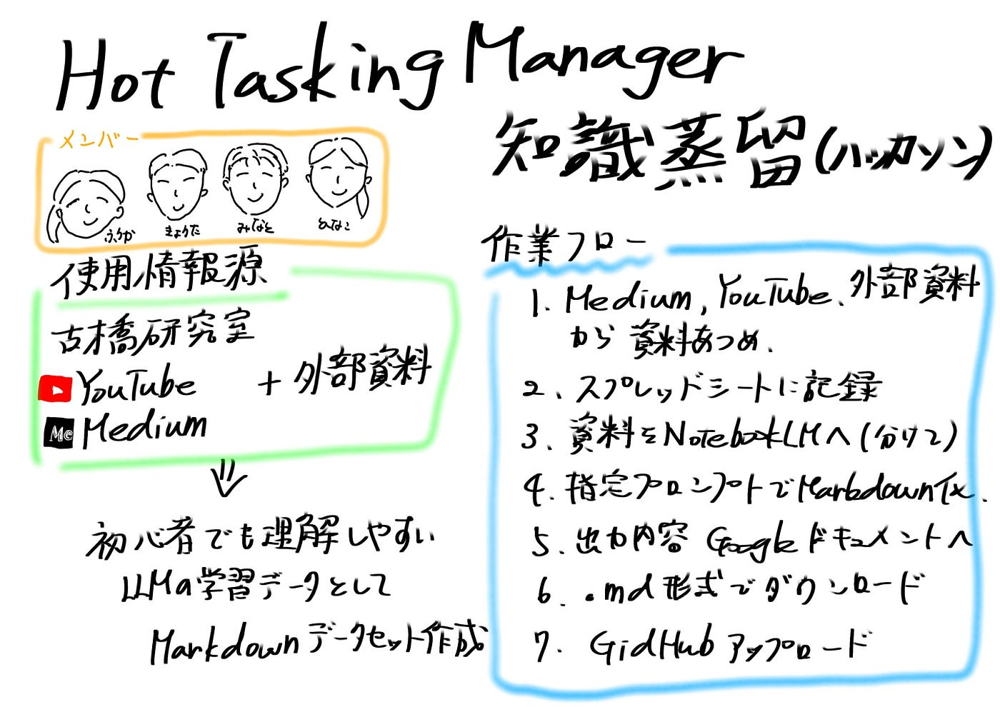

### 【5/26ハッカソン】HotTaskingManagerの知識蒸留(Mapping方法)

### ハッカソン概要

本ハッカソンは、古橋研究室がこれまで公開してきたMedium、動画、記事、その他資料を活用し、LLMカスタマイズ用の学習データセットを作成することを目的としている。

参加者はグループごとにテーマを決め、関連する資料を収集・分析する。そのうえで、AI等を活用して文字起こし、要約、手順化、言語化を行い、資料に含まれる知識を再利用しやすい形に整理する。

最終成果物は、メタデータ付きのMarkdownファイルとして作成。作成したMarkdownファイルは、テーマごとに整理し、成果物用GitHubリポジトリにアップロードする。

### 今回のグループテーマ

今回のグループテーマは、**HOT Tasking Managerのマッピング方法**。

古橋研究室のMedium記事、公式YouTube動画、外部資料をもとに、HOT Tasking Managerの使い方やマッピング手順を整理する。

最終的には、初心者でも理解しやすく、LLMの学習データとしても再利用しやすいMarkdownデータセットを作成。

メンバー

ふうか、きょうた、みなと、ひなこ

### 作業の流れ

1. Medium、YouTube、外部資料から、HOT Tasking Managerに関係する資料を探す。

1. 見つけた資料を[スプレッドシート](https://docs.google.com/spreadsheets/d/11Fo98ISUraaIvxyzl28JC5GBIinE2Zv49A_lIgLWO8E/edit?usp=sharing)に記録する。

1. 資料を媒体ごとのNotebookLMに追加する。

1. 指定プロンプトを使って、Markdown形式で要約・手順化する。

1. 出力内容をGoogleドキュメントに貼り付ける。

1. `.md`形式でダウンロードする。

1. GitHubにアップロードする。

### 資料の追加先

### YouTube

HOT Tasking Managerに関係する動画

YouTube用 [NotebookLM](https://notebooklm.google.com/notebook/00f09817-76ec-4444-97e3-deb236d87c83?authuser=1)

### Medium

古橋研究室のMedium記事

[Medium用 NotebookLM](https://notebooklm.google.com/notebook/194f442d-a466-4d40-b5f4-4fdfe5a337b7?authuser=1)

### 外部資料

公式ドキュメントや関連資料

[外部資料用 NotebookLM](https://notebooklm.google.com/notebook/4e0abd01-f8b5-4437-9a32-866c74cf60c8?authuser=1)

### YouTubeプロンプト

```markdown

このYouTube動画の内容をもとに、HOT Tasking Manager初心者向けの操作手順書をMarkdown形式で作成してください。

条件：

- 動画内で説明されている内容だけを使う
- 推測で補足しない
- 操作手順は番号付きで整理する
- 初心者が迷いやすい点を別セクションにまとめる
- 用語は簡単に説明する
- 最後に「この動画から得られる重要ポイント」を箇条書きでまとめる
- 出典として動画タイトルとURLを書く

構成：

各資料の冒頭に「作成日」「動画名」「主要キーワード」を明記し、情報の鮮度をAIが判断できるようにする。

# タイトル

## 動画の概要

## 操作手順

## 初心者が迷いやすい点

## 重要な用語

## NotebookLMに覚えさせたいポイント

## 出典
```

### Mediumプロンプト

```markdown
このMedium記事の内容をもとに、HOT Tasking Manager初心者向けの操作手順書をMarkdown形式で作成してください。

条件：

- 記事内で説明されている内容だけを使う
- 推測で補足しない
- 背景説明よりも、HOT Tasking Managerを使ったマッピング方法・操作手順・注意点を優先する
- 操作手順は番号付きで整理する
- 初心者が迷いやすい点を別セクションにまとめる
- 用語は簡単に説明する
- 記事内に手順情報が少ない場合は、「この記事から抽出できる手順は限定的」と明記する
- 最後に「この記事から得られる重要ポイント」を箇条書きでまとめる
- 出典として記事タイトルとURLを書く

構成：

- 作成日：
- 記事名：
- 情報源：古橋研究室 Medium
- URL：
- 主要キーワード：
- 関連ツール：
- 関連作業：

# タイトル

## 記事の概要

## 抽出できる操作手順

## 初心者が迷いやすい点

## 重要な用語

## NotebookLMに覚えさせたいポイント

## 出典
```

### GitHubファイル構成イメージ

```css
hot-tasking-manager/
├── README.md
├── medium/
│   ├── mapping/
│   │   ├── 01_josm-basic.md
│   │   └── 02_building-mapping.md
│   └── validation/
│       └── 01_josm-validation.md
├── youtube/
│   ├── mapping/
│   │   └── 01_mapping-flow.md
│   └── validation/
│       └── 01_validation-flow.md
└── external/
    ├── mapping/
    │   └── 01_mapping-guideline.md
    └── validation/
        └── 01_validation-guideline.md
```

### 三年生の疑問

全てのファイルを一つのNotebooklmに集め、3年生の疑問をフィードバック検証。

#### Quetion

悪意のある書き込みや品質が低いユーザーに対して、プロジェクトへの参加を制限する仕組みはありますか？

#### Answer

HOT Tasking Manager（TM）やOpenStreetMap（OSM）では、地図データの品質を維持し、悪意のある編集や低品質な作業を防ぐために、以下のような参加制限や品質管理の仕組みが備わっています。

1. ユーザーレベルによる権限の制限

1. プロジェクト作成者は、作業者の経験やスキルに応じて参加できるメンバーを制限することができます。

1. バリデーション（検証）権限の制限: 他のマッパーの作業をチェックする「バリデーション」作業は、通常、プロジェクト作成者によって権限が制限されています。一般的には、「中級マッパー（250回以上の保存実績）」以上に設定されることが推奨されています。

役割の分担: プロジェクトによっては、参加者を「バリデーションができる人（中級以上）」と「そうでない人（初心者）」に明確に分けて活動を管理することがあります。

2. バリデーション（検証）プロセスによる品質担保

全ての作業は、経験豊富なマッパー（バリデーター）によってチェックされる仕組みになっています。

「無効化（Invalidate）」による差し戻し: 作業内容が著しく低品質であったり、要件を満たしていなかったりする場合、バリデーターはタスクを「無効（No）」として差し戻します。

フィードバックの送信: 無効化する際には、「建物は直角にする必要がある」といった具体的な改善点やルールをコメントとして残し、ユーザーに直接フィードバックを行います。

品質維持のための厳格なチェック: バリデーション作業の約50%は、品質維持のために「無効」として差し戻される可能性があるとされており、不適切なデータが公開されないよう厳格に管理されています。

3. エラー検知ツールの活用

悪意がなくても発生しがちなミス（建物の重なりやタグ付け間違い）を特定するため、ツール側での制限・検知機能があります。

hot-validate スタイル: 検証ツール（JOSM）でこのスタイルを使用すると、エラーの可能性がある場所に赤い三角形などのアラートが表示され、バリデーターが即座に問題を特定できるようになっています。

標準ルールへの準拠: 「建物の直角化（Qキー）」や「地物同士の接着解除」などの基本的なマナーが守られているか、システム的なチェックとバリデーターによる目視の両面で確認されます。

このように、単に「誰でも自由に描ける」だけでなく、「経験者による承認制（バリデーション）」と「スキルに基づいた権限管理」によって、プロジェクトの品質が守られています。

### 成果物用GitHubリポジトリ

[KnowledgeDistillation2026/HotTaskingManager at main · furuhashilab/KnowledgeDistillation2026](https://github.com/furuhashilab/KnowledgeDistillation2026/tree/main/HotTaskingManager)


