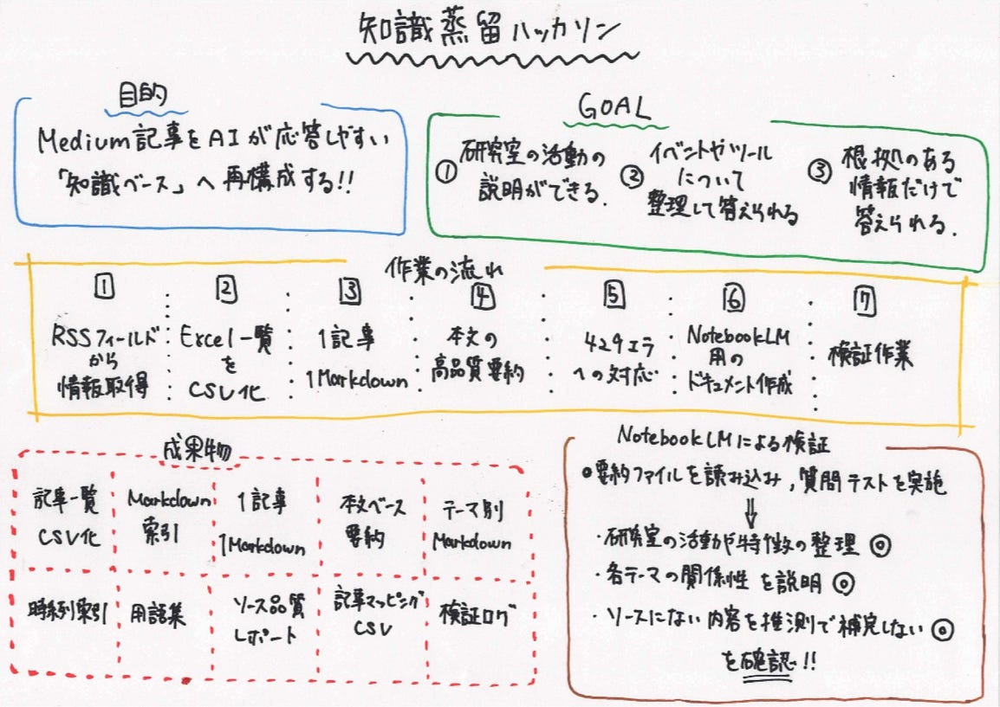

### 【youth 2】知識蒸留ハッカソン 作業概要まとめ

こんにちは。三年の加藤です。

今回の知識蒸留ハッカソンでは、古橋研究室の公式Medium記事を、NotebookLMやLLMで活用しやすい知識ベースへ再構成する作業を行った。対象となったのは古橋研究室公式Mediumに投稿された464件の記事であり、記事単位のMarkdown化、本文ベース要約、テーマ別ドキュメント生成、NotebookLMによる検証までを実施した。

### 作業の目的

目的は、Medium記事を単に保存するのではなく、AIが検索・要約・質問応答しやすい知識ソースへ変換することだった。NotebookLM上で、

- 古橋研究室ではどのような活動をしているか

- OpenStreetMap関連活動には何があるか

- FOSS4GやState of the Map参加記録はどこか

- 学生プロジェクトにはどのようなテーマがあるか

- GISツールやQGISを扱った記事は何か

といった質問に答えられる状態を目指した。

### 主な作業内容

①Medium記事情報の取得

最初に、MediumのRSSフィードから記事情報を取得する仕組みを作成した。Node.jsを用いてRSSを取得し、タイトル、URL、著者、公開日、タグ、本文HTMLなどを抽出してJSON化した。しかし、RSSでは最新記事しか取得できない問題があり、過去記事を十分に取得できなかった。

②Excelシートによる記事補完

不足分を補うため、古橋研究室のMedium記事一覧をまとめたExcelシートを利用した。約458件の記事情報を取り込み、CSV形式の記事一覧やMarkdown索引を作成した。

③1記事1Markdown化

取得した記事を、1記事ごとのMarkdownファイルへ変換した。各MarkdownにはYAML frontmatterを付与し、以下のものを整理した。

- 元記事情報

- 概要

- 重要ポイント

- 関連キーワード

- 研究室活動との関係

- NotebookLM向けメモ

④Medium本文取得と高品質要約

次に、各記事URLからMedium本文の取得を試みた。本文を取得できた記事については、本文内容を精査し、より高品質なNotebookLM用Markdownへ再生成した。

整理した内容は、

- 概要

- 重要ポイント

- 研究室活動としての意味

- 関連人物・イベント・技術・地名

- NotebookLMで答えられる質問例

- 抽出キーワード

などである。

⑤HTTP 429エラー対応

Mediumへの連続アクセス時にHTTP 429（レート制限）が発生したため、未取得記事のみ対象化、数秒待機しながら取得、小分け実行、失敗ログ保存などの対策を行った。その結果、464件中462件について本文ベースレビューを実施できた。

⑥NotebookLM用テーマ別ドキュメント生成

articles_fulltext/ のMarkdownをもとに、NotebookLM投入用のテーマ別ドキュメントを生成した。主な出力ファイルは、研究室概要、OpenStreetMap、Humanitarian Mapping、イベント記録、GISツール、学生プロジェクト、フィールドワーク、時系列索引、用語集、ソース品質レポートなどである。特に重視した点は、「代表記事だけでなく、464件すべてに要約を付与すること」だった。

⑦検証作業

生成結果について、全記事が反映されているか、全記事に要約があるか、品質情報が一致しているか、用語集に不要語が混ざっていないか、古いデータを参照していないかなどを検証し、ログとして記録した。

### 工夫した点

①本文取得済み記事と未取得記事を区別

本文を取得できた記事と、メタデータのみの記事を同じ精度で扱わないようにした

②全記事に要約を付与

代表記事だけではなく、464件すべての記事に短い要約を付与し、NotebookLMが全記事を参照できるようにした。

③NotebookLM向け構造化

記事単位だけでなく、テーマ別、時系列、用語別に再構成することで、質問応答しやすい構造を作成した。

③検証ログの記録

生成後に検証を実施し、記事数や品質情報の整合性をログとして残した。

### NotebookLMによる検証

作成した10個の要約ファイルをNotebookLMへ読み込み、古橋研究室の活動内容を整理させる検証を行った。

その結果、以下のことを確認できた。

- OpenStreetMapを活動の核として整理できている

- YouthMappers AGUやMapathonを説明できる

- FOSS4Gやクライシスマッピングを関連付けて説明できる

- 研究室の特徴や強みを整理できる

- 「ソースにない内容」を推測で補完していない

また、追加テストとして、古橋研究室とOpenStreetMapの関係、YouthMappers AGUとは何か、Medium記事から分かる研究室の特徴などを質問し、NotebookLMが適切に回答できることを確認した。

### 最終成果

最終的に、以下を成果物として作成した。

- Medium記事一覧CSV

- Markdown索引

- 1記事1Markdown

- 本文ベース要約Markdown

- NotebookLM用テーマ別Markdown

- 時系列索引

- 用語集

- ソース品質レポート

- 記事マッピングCSV

- 検証ログ

これにより、古橋研究室のMedium記事を、NotebookLMやLLMが検索・要約・質問応答しやすい知識ベースへ変換することができた。

### GitHubリポジトリ

使用したリポジトリ：

[Redirecting
Redirecting you to https://github.com/yudai1206/Hackathon_202605www.google.com](https://www.google.com/url?q=https://github.com/yudai1206/Hackathon_202605&sa=D&source=editors&ust=1779722879609565&usg=AOvVaw0C7GxNBNYo45DilbRJQS-m)

使用したAI：

Codex GPT‑5.5

最後にグラレコです

