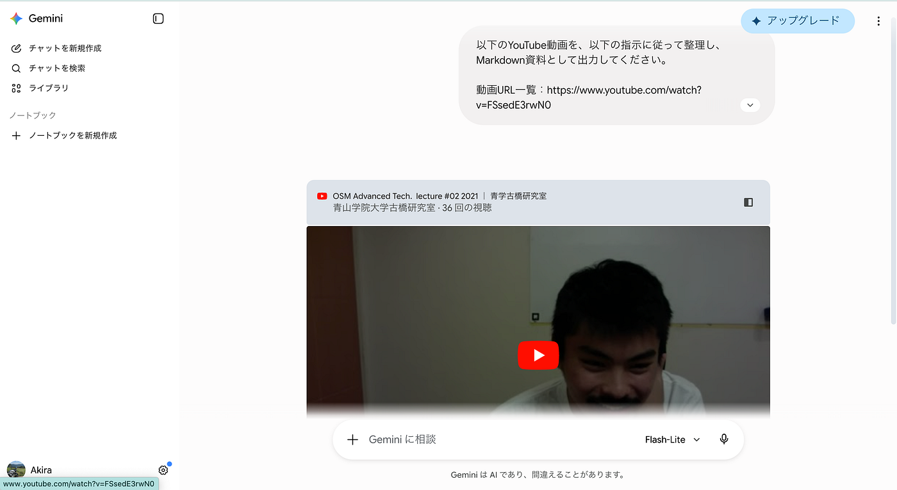
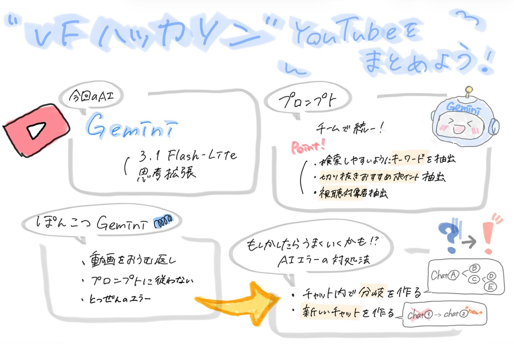

### ハッカソン 【VF】

こんにちは。ヤマッブと横瀬部にしか参加していないためにVFに吸収された本吉です。今回のハッカソンは古橋研の知識蒸留をしようということで、我々はYoutubeを担当しました。

### 最初に考えること

Youtubeを担当する班は他にもあったので、違いを出さなくてはいけません。まず考えたのは以下の二つです。

1. 違うAIを使うこと

1. 違うプロンプトをつかうこと

これらの違いから、どうした方がいいかの方向性や、2チームが同じことをすることの意義が生まれると考えたからです。しかし、1について考えたとき、以下のことが起こりました。

1. クレジット制限を気にせず使えるのはGemini, ChatGPT(古橋研アカウント)のみ

1. ChatGPTを試してみたがYoutube動画の内容まではアクセスできないという。

1. よって使えるものはGeminiのみ。

これらのことから、2チームとも共通でGeminiを使うこととしました。その中でも、無課金の中で最もスピードと精度が高いと思われるGemini 3.1 FLash-Lite 思考拡張を使うことにしました。

### プロンプト

プロンプトはチーム内の全員で共通させる必要があると考え、まず最初にその内容を話し合って決めました。

出来上がった。プロンプトは以下のとおりです。

```markdown
以下のYouTube動画を、以下の指示に従って整理し、Markdown資料として出力してください。
動画URL一覧：
1.
要件：
- 出力はMarkdown形式にしてください。
- 各動画について、必ず同じ項目構成で出力してください。
- 推測で書かず、動画内容に基づいて書いてください。
- 不明な情報は「不明」と書いてください。
- 映像内で確認できる内容と、音声・字幕から確認できる内容を区別してください。
出力形式：
# 古橋研究室 YouTube動画まとめ
## 1. 動画タイトル
**URL:**
…
**公開日:**
不明な場合は「不明」
**動画時間:**
不明な場合は「不明」
**概要:**
動画全体を200〜300字で要約してください。
**主な内容:**
-
-
-
**研究室らしさが出ているポイント:**
-
-
-
**対象視聴者:**
-
**動画の雰囲気:**
-
**印象的なシーン・発言:**
-
**ショート動画・切り抜きに使えそうな場面:**
-
**登場するキーワード:**
-
-
-
**関連する研究室活動:**
-
```

これはGeminiと話し合いながら、作成したプロントです。意識した点としては、検索しやすい様に(ハッシュタグなど)キーワードを抽出、のちに動画などでまとめやすい様に切り抜きおすすめポイントの抽出、視聴対象者の抽出です。

### いざ、やってみよう

我々のやることは簡単です。[古橋研究室のyoutubeチャンネル](https://www.youtube.com/@furuhashilabs)から授業動画を除くすべての動画リンクをコピーして、先ほどのプロンプトと共にGeminiに投げるだけです。

#### 何やってんだ！Gemini!



許せません。ほっとくと仕事を怠けて、動画をおうむ返しにしてきたり、プロンプトに沿わないことを返してきたり、エラーを起こしたり。とにかくこれにメンバー全員苦戦しました。これに対しての明確な対処法は見つかりませんでした。しかし、我々なりに試行錯誤した末にいくつかの「もしかしたらうまくいくかもしれない方法」が見つかりました。

1. 分岐を作る。

Geminiが意図に反することを送ってきた際に、うまく行っていたチャットまで戻りその内容を編集して新しいyoutubeリンクに書き換える方法です。詳しいことはｼｮｰﾀに聞いてください。

2.新しいチャットを作る。

ゼロからやり直す方法です。でも、これでも治らないこともたくさんありました。僕たちはAIの使い方を勉強する必要がある様です。

### 完成

苦労もありながら、一人3時間ほどの努力をすることで全員がなんとかmdファイルにまとめることに成功しました。

[成果はこちらから](https://github.com/furuhashilab/KnowledgeDistillation2026/blob/main/V%26F/furuhashilab_youtube1.md)

### 反省

今回はYoutubeチャンネルから指定期間内のすべての投稿動画のリンクをコピペする作業がかなり辛く、時間がかかりました。さらにGeminiの精度が悪く、その扱いにも困難を極めました。これらを防ぐために、我々はAIの使い方を今一度べんぎょうするべきなのかもしれないと考えました。AIを自分をトップとした作業員として使う、その組織を作り上げるやり方をやることで今後の作業の能率に貢献できるかもしれないと思いました。

### グラレコ


