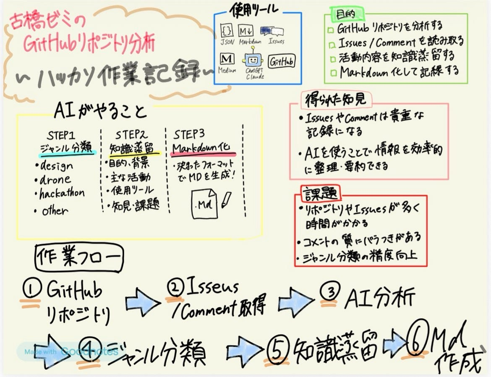

### 知識蒸留ハッカソン作業記録【design1】

こんにちは。4年の小崎です。

今回の知識蒸留ハッカソンでは、古橋研究室の公式Medium記事を、NotebookLMやLLMで活用しやすい知識ベースへ再構成する作業を行いました！

design1が担当したのはGitHub上に投稿されているレポジトリのうちゼミ論・卒論以外を対象とした投稿の要約、Markdown化です。

チームメンバーは以下の通り

みあ、ちはな、みひろ、かのこ

### 主な作業内容

#### STEP 1｜対象リポジトリの整理と API URL リスト化

`github.com/furuhashilab` 配下の対象リポジトリをページで担当分けし、各リポジトリの Issues コメント取得 API URL を生成。

全部で大体400件くらいありました。

#### STEP 2｜AIを用いたリポジトリの分析

生成AIを用いて各リポジトリの詳細と分類を行いました。

**リポジトリの詳細**

> -目的・背景： このリポジトリが何のために作られたか
- 主な活動・成果: issuesやcommentsから読み取れる議論・作業・決定事項
- 使用技術・ツール: 登場するソフトウェア・サービス・手法（`language`も含める）
- 得られた知見: 応用・転用できる知識・ノウハウ・教訓（必ず1つ以上）
- 未解決事項・課題: クローズされていない議論や残課題（なければ「特になし」）

**分類**

どのようなリポジトリがあるか不明だったため、ゼミ内サークル＋ハッカソン＋その他に分類(記事書いてる時にYouthのカテゴリ作るの忘れてたことに気づきました。。。😨)

**使用AI**

Claude sonnet4.6

Claudeを選択した理由は長文処理に長けているため

**手順**

１ プロンプトをClaudeを開いて左上のProjects→NewProject→手順の「手順」に格納

２ https://api.github.com/repos/furuhashilab/{リポジトリ名}とhttps://api.github.com/repos/furuhashilab/{リポジトリ名}/issues(issuesがあれば)にブラウザからアクセス

注意）{名}はリポジトリに応じて変更

３、２で開いたページの内容を全選択(ctrl＋A)してコピー(ctrl＋C)する

４、Claudeの１で作ったProjectからチャットを開いて、３の内容をペースト(ctrl＋V)して内容を出力

注意）幾つか出力させたら同じProject内でチャットを作り直した方がいいらしい(Claude談)

５、出力された文章をコピーして、GitHub内にジャンル別に貼り付ける

使用プロンプト

> # 知識蒸留タスク：古橋研究室 GitHubリポジトリ分析

> ## STEP 0｜データ取得
ユーザーが貼り付けた以下の2つのJSONを使用してください。
- 「## リポジトリ情報」以下のJSON → リポジトリメタデータとして使用
- 「## Issues/Comments」以下のJSON → 議論・作業内容として使用

> URLへの自己アクセスは行わないでください。

> 取得後、以下の項目を自動で読み取ってください。

> | 項目 | 取得元URL | フィールド名 |
| — -| — -| — -|
| リポジトリ名 | リポジトリ情報 | `name` |
| リポジトリURL | リポジトリ情報 | `html_url` |
| 説明文 | リポジトリ情報 | `description` |
| 作成日 | リポジトリ情報 | `created_at` |
| 最終更新日 | リポジトリ情報 | `updated_at` |
| トピックタグ | リポジトリ情報 | `topics` |
| 主要言語 | リポジトリ情報 | `language` |
| 関連サイト | リポジトリ情報 | `homepage` |
| 議論・作業内容 | Issues/Comments | 全コメント本文 |

> — -

> ## STEP 1｜ジャンル分類
`topics`・`description`・issuesの内容を総合的に判断し、以下の5ジャンルから**1つ**を選択してください。

> | ジャンルID | ジャンル名 | 判断の目安 |
| — -| — -| — -|
| `design` | デザイン | UI/UX、地図デザイン、カートグラフィ、スタイル、Mapbox、可視化 |
| `vf` | V&F（映像・動画） | 動画編集、撮影、YouTube、映像制作、ライブ配信、FFmpeg |
| `drone` | ドローン | UAV、フライト、空撮、DJI、測量、点群、SfM、フォトグラメトリ |
| `hackathon` | ハッカソン | ハッカソン、Hackathon、アイデアソン、開発イベント、Meetup |
| `other` | その他 | 上記いずれにも該当しない研究・教育・OSS活動など |

> > `topics`に明示的なキーワードがある場合はそれを優先してください。
> 複数にまたがる場合はissues内の中心的な議論内容を優先してください。

> — -

> ## STEP 2｜知識蒸留
以下の観点で内容を分析・言語化してください。
`description`が存在する場合は補足情報として活用してください。

> - **目的・背景**: このリポジトリが何のために作られたか
- **主な活動・成果**: issuesやcommentsから読み取れる議論・作業・決定事項
- **使用技術・ツール**: 登場するソフトウェア・サービス・手法（`language`も含める）
- **得られた知見**: 応用・転用できる知識・ノウハウ・教訓（必ず1つ以上）
- **未解決事項・課題**: クローズされていない議論や残課題（なければ「特になし」）

> — -

> ## STEP 3｜Markdownファイルの生成
以下のフォーマットで出力してください。前置きや説明文は不要です。

> ```markdown
 — -
repo_name: “{nameフィールドの値}”
repo_url: “{html_urlフィールドの値}”
genre: “{分類したジャンルID}”
genre_label: “{分類したジャンル名}”
repo_created_at: “{created_atの日付 YYYY-MM-DD}”
repo_updated_at: “{updated_atの日付 YYYY-MM-DD}”
distilled_at: “{本日の処理実行日 YYYY-MM-DD}”
language: “{languageフィールドの値、なければ null}”
homepage: “{homepageフィールドの値、なければ null}”
tags:
 — “{topicsの値1}”
 — “{topicsの値2}”
 — “{topicsの値3}”
※ topicsが空の場合はissues・descriptionの内容から関連キーワードを3つ推定してください。
※ tagsは必ずYAMLのリスト形式（ハイフン＋スペース＋値）で出力してください。*や番号は使わないでください。
confidence: “{high / medium / low （ジャンル分類の確信度）}”
 — -

> # {repo_name}

> ## 概要
{目的・背景を2〜4文で記述。descriptionがあれば冒頭に活用する}

> ## 主な活動・成果
{issuesやcommentsから読み取れた議論・作業内容・決定事項を箇条書きで記述}

> ## 使用技術・ツール
{登場した技術・ツール・サービスをリスト化。languageも含める}

> ## 得られた知見
{応用・転用できる知識・ノウハウ・教訓を記述}

> ## 未解決事項・課題
{残課題があれば記述。なければ「特になし」}

> ## 参考リンク
- リポジトリ: {html_url}
- Issues: {html_url}/issues
{homepageがある場合: — 関連サイト: {homepage}}
```

> — -

> ## STEP 4｜ファイル名の提案
以下の命名規則でファイル名を出力してください。

> ```
{ジャンルID}_{repo_nameを英小文字・ハイフン区切りに変換}.md

> 例:
 hackathon_unvt-hackathon-meetup-2022-youthmappers-agu.md
 drone_agri-survey-2023.md
 design_mapbox-style-guide.md
```

> — -

> ## 注意事項
- 出力はMarkdownファイルの内容とファイル名のみとしてください
- issuesが空・少ない場合はdescriptionとrepo_nameから補完してください
- 日本語で記述してください（技術用語・固有名詞は英語のままで可）

プロンプト作成までの道のり

[Claude
Claude is Anthropic's AI, built for problem solvers. Tackle complex challenges, analyze data, write code, and think…claude.ai](https://claude.ai/share/742ba33d-c724-45bf-b5c5-30fea99506fb)

### 苦労した点

github内に投稿されているリポジトリの中からゼミ論・卒論以外を抽出する作業を人力で行ったので若干大変だった。(全部で16ページあったため1人4ページで分担をしたが、1人100件弱になった)

AI（Claude）に実作業をさせるスタイルで進めたため、人間側の作業は「**何を、どの形で、どのように作らせるか**」を設計・指示・判断することが中心となったが、あまり経験がなかったため難しかった。

生成AIの有料プランに加入していない場合は制限が来てしまい、来た場合5時間空けないと作業が再開できなかった。

### 最終成果

[KnowledgeDistillation2026/GitHub_Knowledge at main · furuhashilab/KnowledgeDistillation2026
古橋研究室の今までのアウトプットを知識蒸留(Knowledge Distillation) してAIカスタム用学習データを作る - KnowledgeDistillation2026/GitHub_Knowledge at main ·…github.com](https://github.com/furuhashilab/KnowledgeDistillation2026/tree/main/GitHub_Knowledge)

### グラレコ


