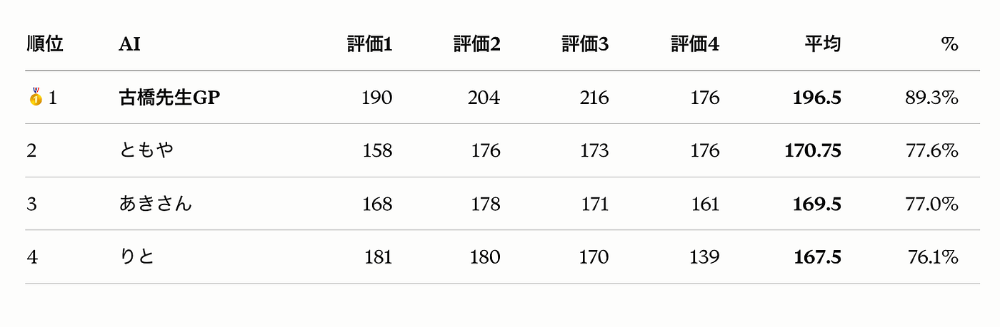
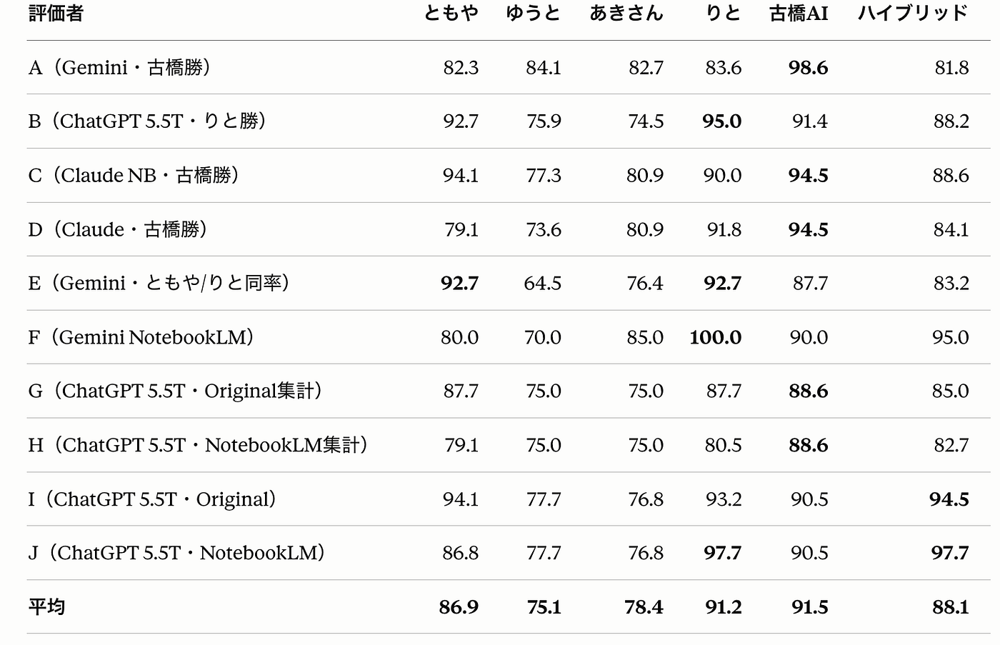
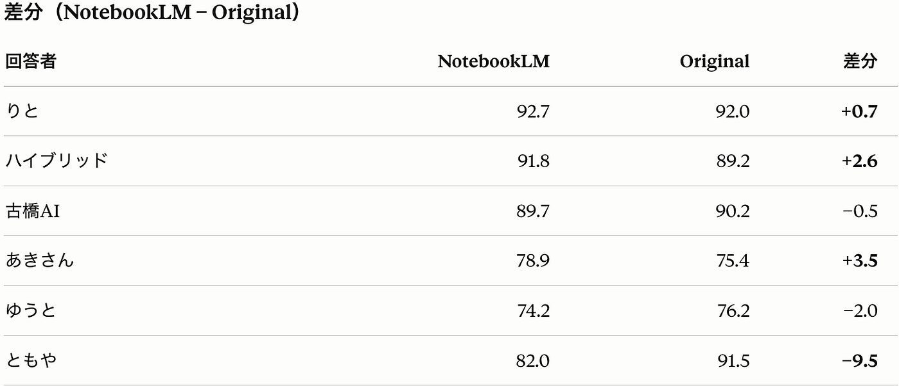
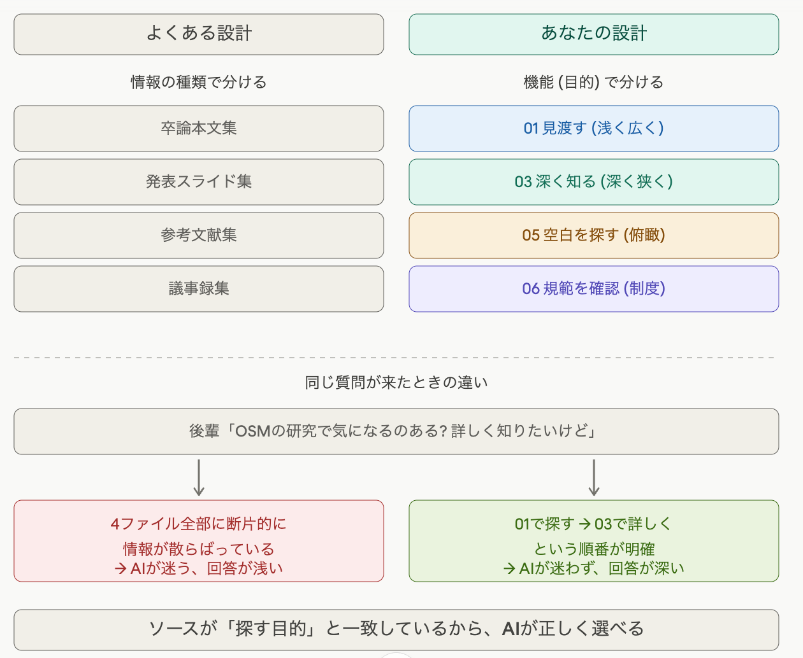
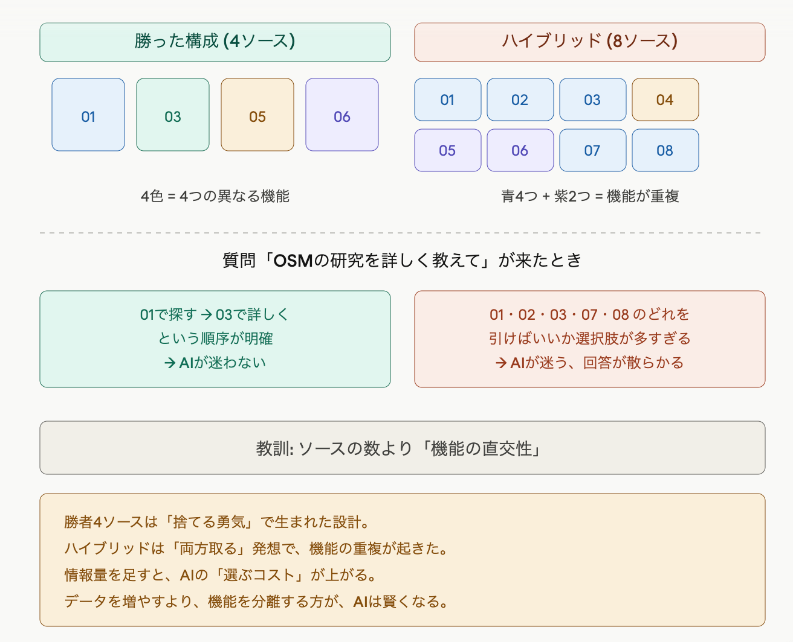
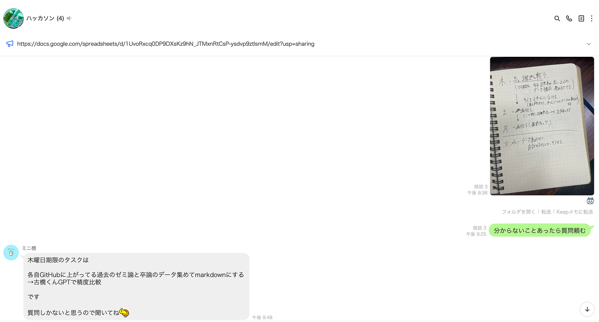
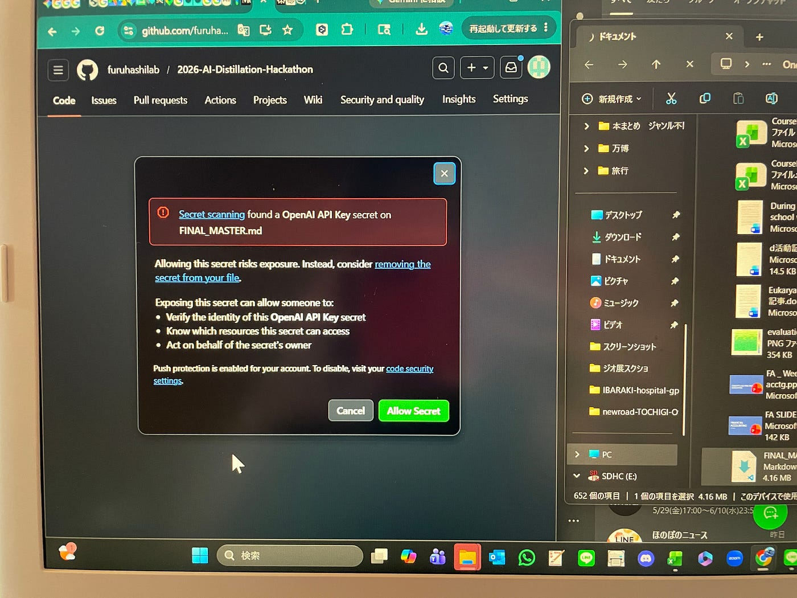
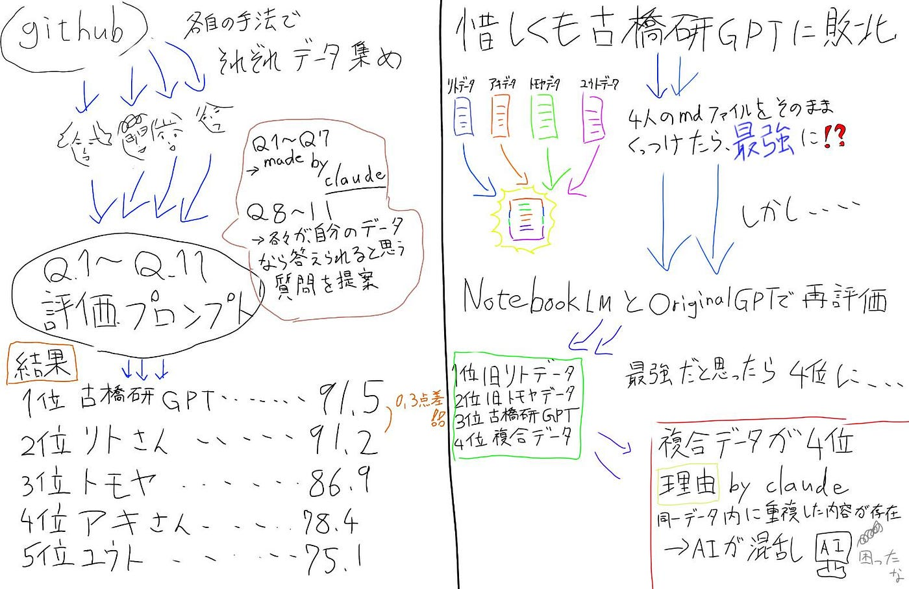

### 蒸留しちゃおう卒論・ゼミ論

こんにちは、山﨑です。今回は今年度初めて実施されたハッカソンに関して報告です。

おそらく、他のチームがハッカソンの概要や蒸留とは〜みたいなことを言ってくれていると信じて、何も書きません。

### チームメンバーと担当

ともや・あき・ゆうと・りとの４人
この４人が今年のハッカソンメンバーです！！

今回のハッカソンは色々なところに散らばっている情報を集めて精度の良いデータとしてまとめること、いろいろ選択肢がある中で自分たちはゼミ論、卒論を選択。実は、これからゼミ論を考えていく3年生に少しでも助けになればいいなと思った山﨑くんが**Github上のゼミ論・卒論担当**をやりたいと言ったのか言っていないのか、そんな秘話があるのか、またまた単に簡単そうだから選んだのか、どうなのか真相は闇の中です。

### 作戦会議

**１ユーザーの気持ちを考えよう**

本題に入ります。まずデータを集める際に自分たちが考えてみたことは実際に集めたデータを使う際にユーザーがどんな質問をするのかと想定した上でデータを集めること。

Github上にある卒論・ゼミ論データをまとめるからといって、実際に使う人が、「[0319–2004](https://github.com/0319-2004)のゼミ論について教えて」なんて言わないでしょうってことです。
実際は「街歩いたりするのが好きなんだけど、どんな研究がいいかな？」って使うはず

**２定期的な評価会をしましょう**

闇雲にデータを集めて、はい完成って言われても実際に使ってみてどうなんだい！ってことです

そこで自分たちが実践したのが実際にオリジナルGPTやnotebooklmに自分達のマークダウンファイルを入れて、同じ質問を解かせて、誰のLLMが強いかをみてみよう。

#### データ集め

ここは自分がどのように集めたか、一例です。

１ Claude 4.7 opusにgithubの古橋研のリンクを渡す
２ 卒論・ゼミ論に関するレポジトリを集めてエクセルにまとめてもらう
３ ハッカソンの説明＋データ構成を考えてもらう
４ それぞれのデータごとにプロンプトを作成
５ データ収集

一度で集めさせようと試みたのですが、抜けている部分もあった
そこら辺は自分で情報を少しずつ入れていきました

### テスト1回目

#### 質問票作成

まず初めに７個一般的な質問をClaudeに考えさせる
次に、メンバー１人１人に作ったデータが、得意とする質問を考えてもらい計11個の質問を作成して競わせました！

**評価で使ったやつ**
Chat GPT 5.5 thinking, Claude Opus4.7, Gemini Pro 3.1, Google AI studio, Perplexity

### テスト2回目

Chat GPT 5.5 thinking, Claude Opus4.7, Gemini Pro 3.1

#### NotebooklmとOriginal GPTで比較

#### 自分のデータ構成に関して説明

苦楽を共にしたClaudeに何が良かったの？って聞いてみたら

ってことらしいです
ちなみにハイブリッドは、この構成をもとに、みんなのファイルを入れてみたのです。

#### ハイブリッドがなぜ一位にならない？

ここで浮かび上がってくる疑問がこちら
ハイブリッドは山﨑のデータ構成をもとに、足りない情報やら、なんやらをみんなのデータから入れたものです。
何が悪かったのか
またClaude様に聞いてみました

らしいです。ふむふむふむふむふむふむふふむふむふむ

### 議論

ここからわかるように、何を評価に使うか、何でデータを使うかによって、評価は大きく変わるため一概に誰のデータが一番優れているとは言えないことが、この評価会を通して学んだことです。

トモヤの差分が-9.5という点を考えてみると、LLMの能力を引き出しやすいデータ構成がLLMによって違うのかなぁ？なんて思ったり、簡単な考察を挟んで終わりにします。

最初やった時は古橋君GPTの性能が高すぎて、普通に新しく作る必要あるのかよ！！って思うくらい

質問や各メンバーが作ったデータの回答は”[ここ](https://docs.google.com/spreadsheets/d/1OpJHRVuH8KIGq9mktB8XJPt05N0Xybl3QAeaNwuRV9U/edit?gid=994543749#gid=994543749)”(*^◯^*)

### 感想

**トモヤ**
md集めるのにPython苦戦したけど精度は先輩に肩を並べられて嬉しかった^^⇦なんて良い子なんだ（ ; ; ）

**ゆうと**
VScodeを筆頭に、今回使ったツールの殆どが初めて触るものだったので、使い方を理解するのに骨が折れた。また、より良いMarkdownにするためのアイデアが浮かんだとしても、それを実現するための技術的な障壁が大きく、自分のイメージを形にすることが一番難しかった。

いやぁこれは先輩二人の責任です
↓初日にリトとアキさんが送った内容

ひどいですね、こんな先輩は嫌だランキングにランクインします
1人はその場で殴り書きしたアイデアをそのまま送って、もう1人はなんでも聞いてねって言いつつ、何も聞く気がなさそうな絵文字を添えている。
これは、アサリ？口なのか、👍の手なのか
→これ、シュークリームな（byあき）

この後にトモヤとユウト二人が分からないことをしっかりと聞いてくれたのが大きかった。ありがとうございます。

**アキ**
今回の評価表を作成して、AIの精度は入れるデータの質に大きく左右されると感じた。クレジットを極力使わないようにしたい。

**りと
**卒論やゼミ論について知る機会になって面白かった。特にって言われたら、答えられないけど、面白かったんだ！！！！！！！

そろそろ、明日の別の課題をやらないと終わるので、mediumを終わります。
さようなら

#### **[リポジトリ**](https://github.com/furuhashilab/2026-)

#### 何が起きている！？

GitHubに弾かれたと
Allow secret選択してもアップロードはできなかった
ってのがある

### グラレコ

