### Blenderで自由自在に

【デザイン部2・週報】

こんにちは！3年の米久保です。

今週のデザイン部2は、前回の週報で計画したBlenderでの作品に制作に取り掛かりました。

今回は作品を週報4回分で完成させるべく、各自自分が進められる範囲で制作しました。

【みわ】

私は前回の週報でチョコレートケーキの作成を計画しました🍫🍰

今回はその土台となるスポンジ部分と溶けたチョコレートを再現させるところまでやってみました。

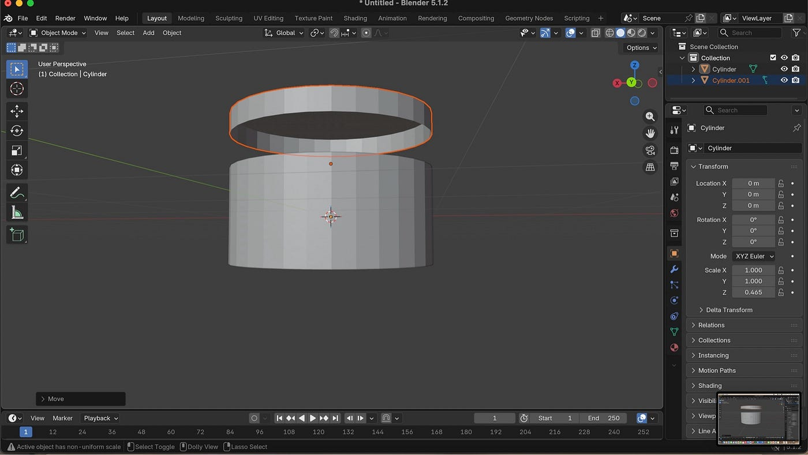

まずは土台で円柱を使用し、そこをControl＋Rで形状を切り取りました。そしてその切り取りを複製することで上のようなチョコレート部分を作り始めました。

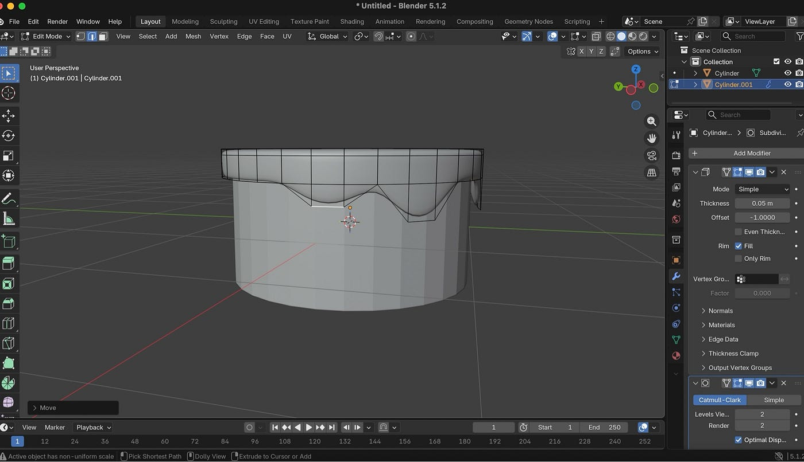

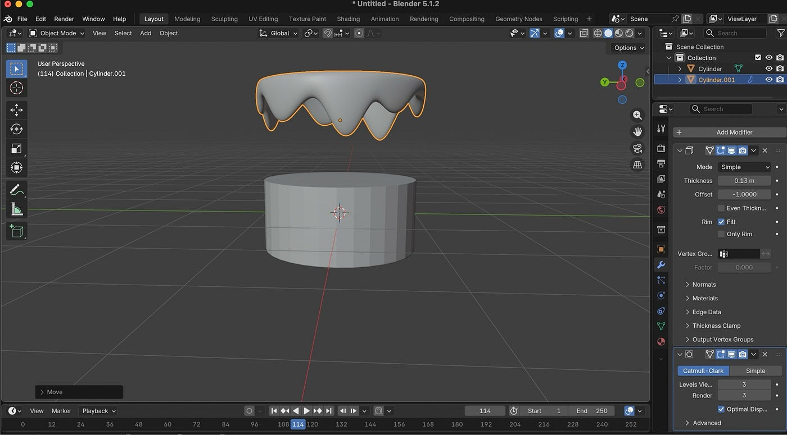

チョコレートが溶けているように見せるにはまず分厚さを再現しなければなりません。今回はモディファイアを追加してそこからソリッド化を選択することでより重みのあるチョコレートを再現できました。

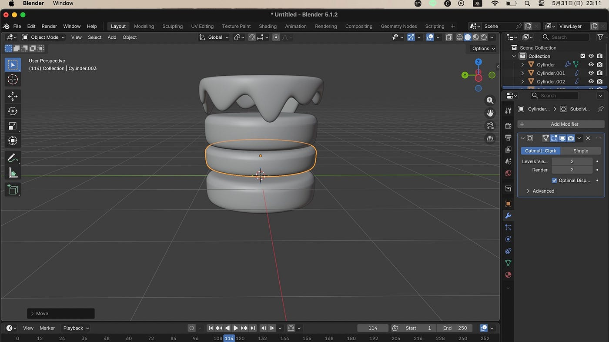

チョコレートを完成させた後はスポンジ作成に取り掛かりました。スポンジの間のクリーム部分も再現したのがポイントです。挟むスポンジの幅よりも薄くすることで色がついてなくてもクリームということが分かります。そしてスポンジも角張らないようにControl＋2でサブディビジョンサーフェス(細分割局面)を行いました。この機能を今回は特に多く使った気がします。

滑らかな丸い形状になるだけでケーキっぽくすることが簡単に出来たため、他のケーキや違う丸みのあるものを作成する際にも活用したいと思いました。

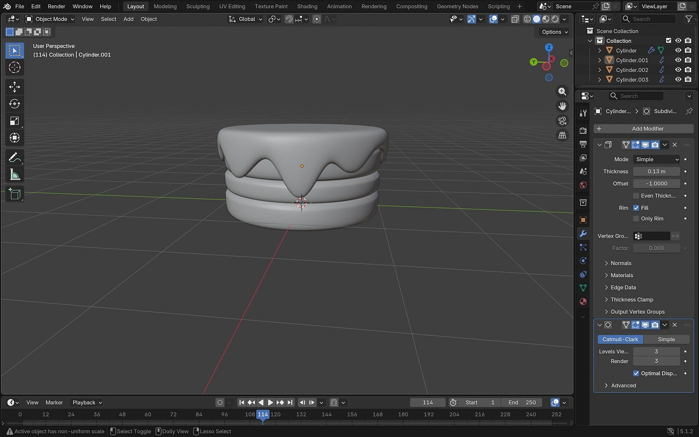

今回の完成はここまでです✨

次はホイップと色付けをやってみたいと思います！✊🏻

【ゆうかさん】

今回私は猫の頭と胴体を作りました！去年は色塗りやライトをあてて写真を撮る最後の作業で非常にパソコンが重くなり、苦戦してしまったので、今回は容量のある方のパソコンで挑戦しました。

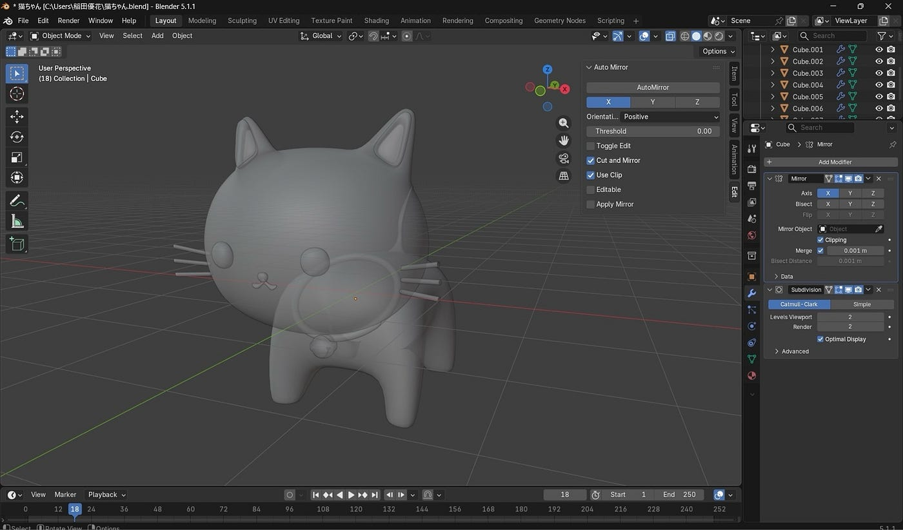

↓下記は今週はじめて気づいたキー動作です！

✨Rで物体を回転させることができるが、ミスした時Alt＋Rで、これまでの回転をリセットできる

✨ Alt やShiftを併用すると面、選択をする際に一回で1周、2行3行選択できる

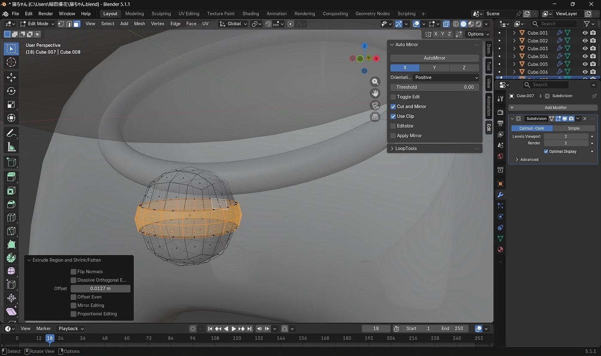

✨オブジェクトモードで編集したい物体だけを選択してキーボードの／(スラッシュ)を選択すると画面にその物体だけ大きく表示されて作業しやすい！(ローカルビューというそうです)

✨去年ドローン部1で苦戦したプロペラの切れ込み！Vキーで簡単に入れられる事が分かりました✂️

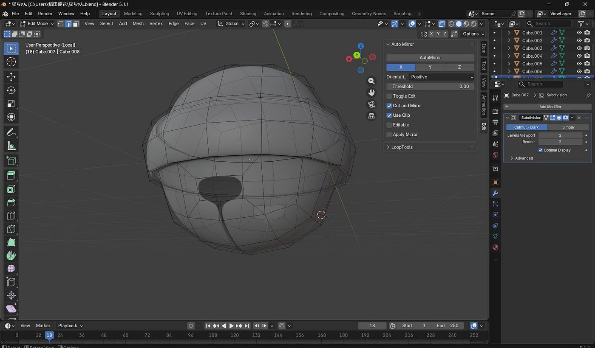

来週は、猫が乗っている缶詰やマテリアルの作業をがんばっていきたいです！

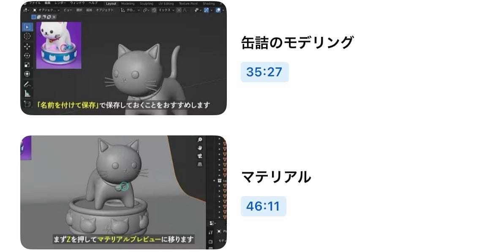

【もえさん】

今回はりんごの実とへた、葉っぱを完成させました🍎

まず最初にリンゴの実の部分を作り、そこにへたと葉っぱを足していく形で進めました。

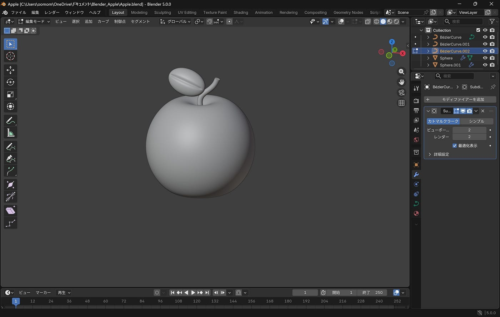

特にこだわったのは、ヘタの部分を「ベジェ曲線」を使って、滑らかに自然なカーブに仕上げたところです。

さらに、葉っぱの切れ込み具合や大きさ、角度などの細かい部分の作業は、納得がいくまで調整を重ねました🌱

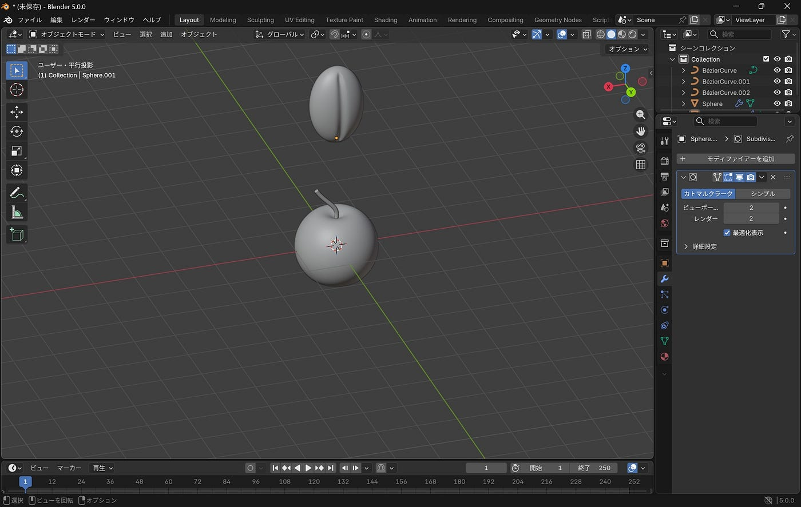

お手本の動画のものよりへたを短くして、葉っぱを大きめに、厚みをもたせたところがポイントです。また、全体的に表面を滑らかにさせるために、サブディビジョンサーフェスの機能を使いました。

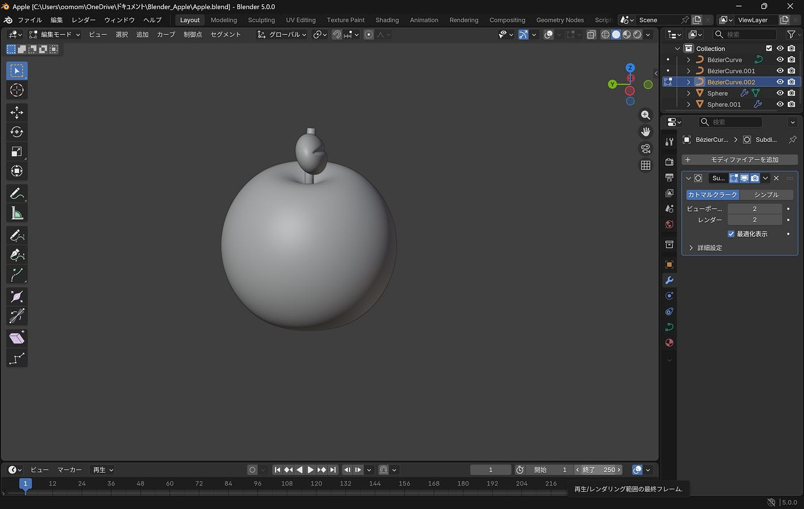

今回りんごのモデリングを完成させることができたので、次回は今回作ったリンゴに色を付ける作業に入りたいと思います。

Blender 初心者でも使いやすいショートカットキー

今回私はこの動画を参考にショートカットキーをいくつか使用しました✍️

まずは基本的な操作で出来そうな以下のショートカットキーを使って見ましたが、作成中何度かどのキーを押すのか忘れてしまったので、これから沢山活用して手に慣れさせたいと思います。

・Tabを押すとオブジェクトモードと編集モードの切り替えが可能

・Shift + C で全体表示 + 3Dカーソルをワールド原点にリセット

・Alt + G / S / Rで移動、スケール、回転をリセット

・Gで移動、Sで大きさの変更、Rで回転

⬆️Zで縦軸を保てるため、Zと一緒にこれらを使用すれば軸を保ったまま移動や大きさ、回転をスムーズに変更可能

上記の動画では、Blenderでどこまで作れるのかについてまとめていたので参考程度に視聴しました。

無料でここまで色んな形を作れることに驚いたと同時に、自分も色んなデザインを考えてモデリングしてみたいなと思いました。

まとめ

今回は各自で作業をしたのですが、3人とも全く違う作品なので徐々に完成に近づいていくと思うと凄く楽しみです。

ショートカットキーを使用すると作業効率が確実に上がるのと、上手く活用出来た時の達成感がありました。

またショートカットキーを使用する事で気付いたメリットやデメリットもあったので次回の制作でそこを上手く活用したり改善していきます✨

グラレコ

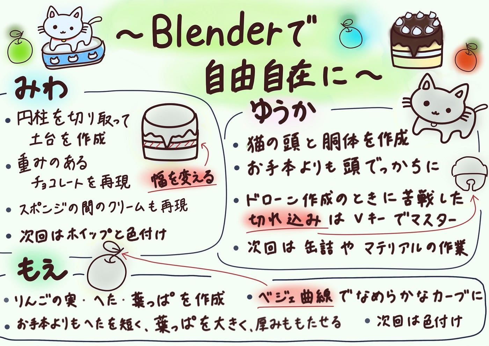
