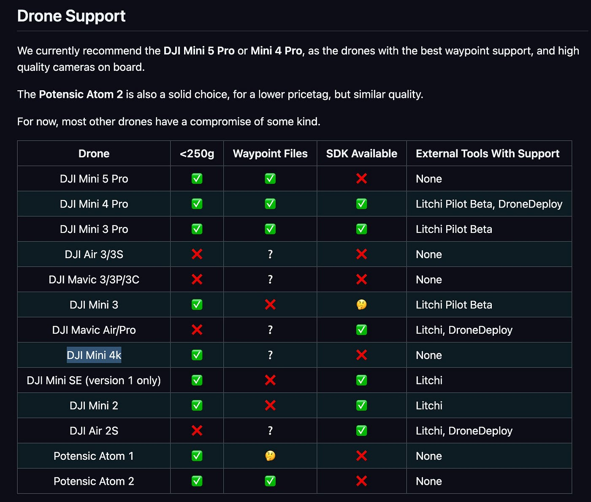
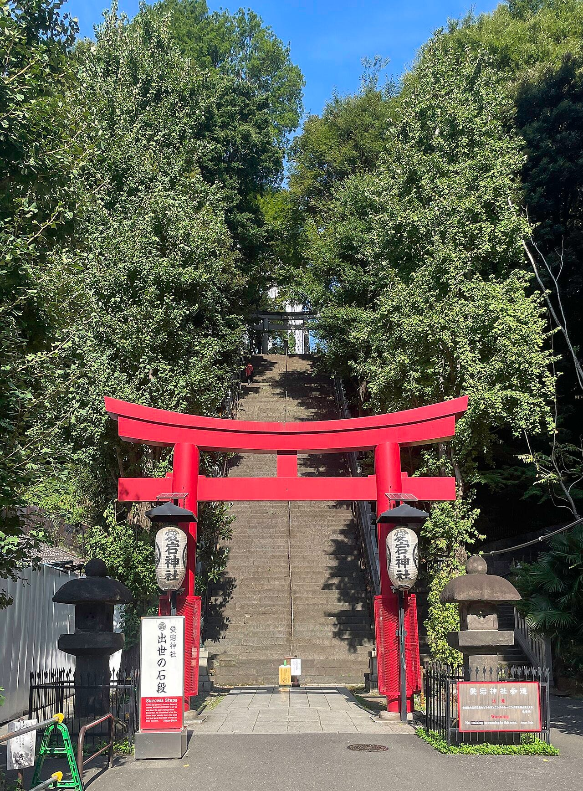
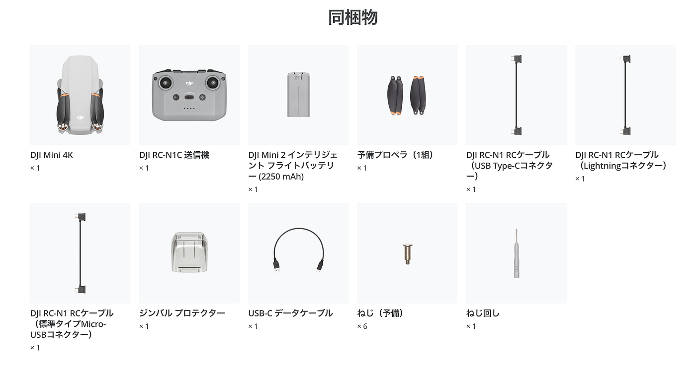
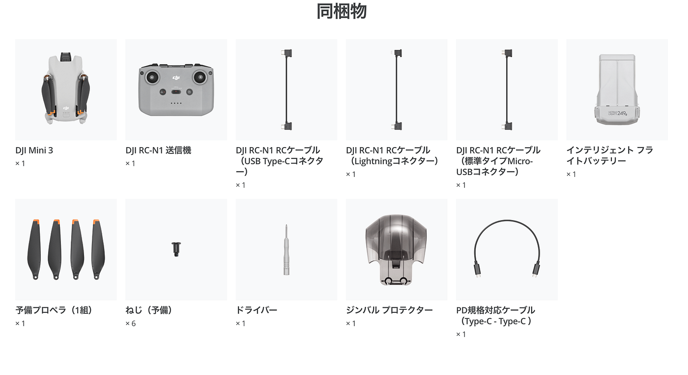
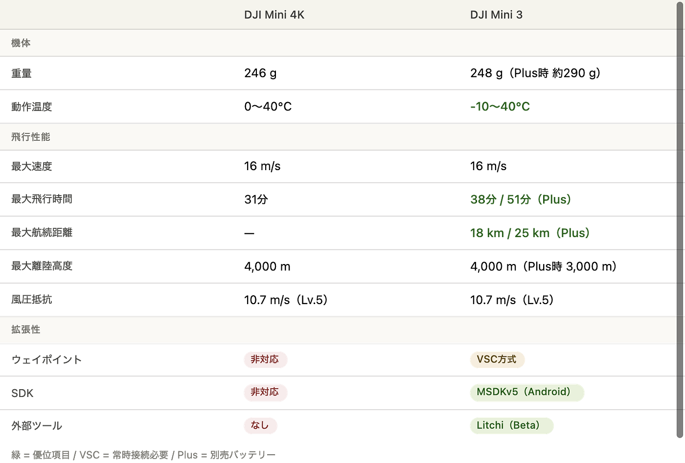
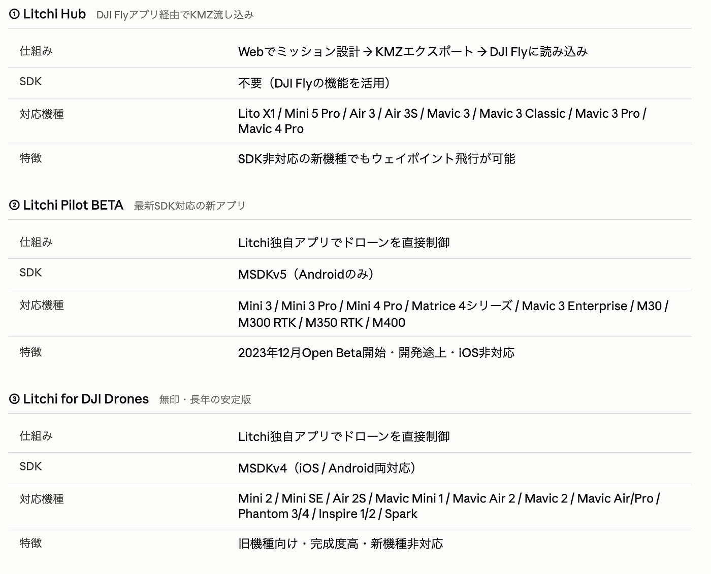
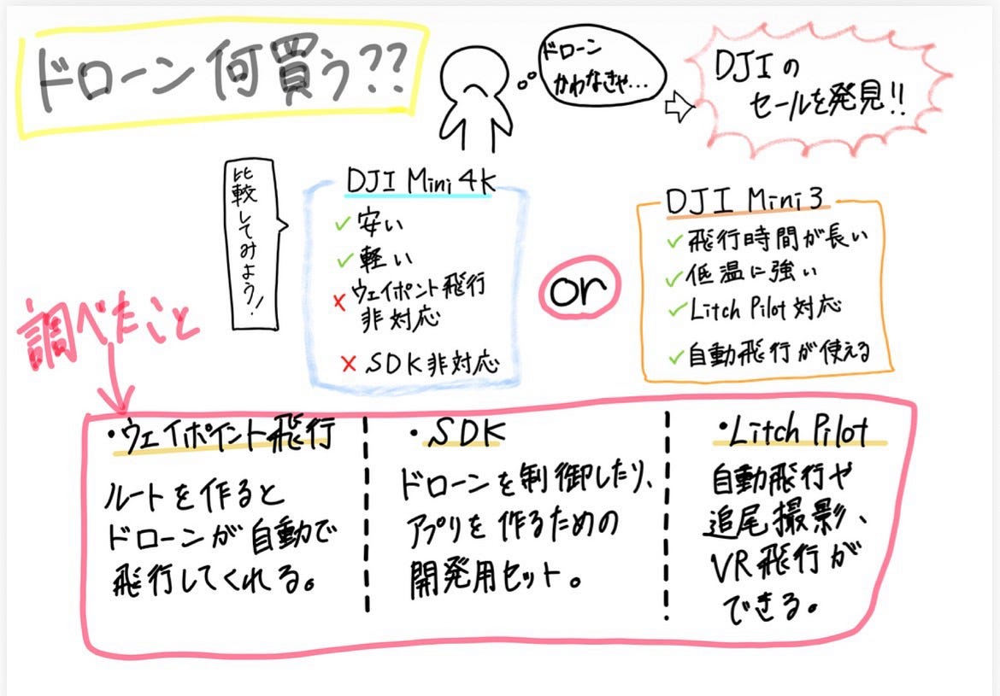

### ドローンどれ買う？

こんにちは、ドローン１の山﨑です。
土曜日は図書館まで歩いて向かうぞ！！って最中にPokémon GOを開いてみると、[Pokémon GO Fest 2026](https://pokemongolive.com/ja/gofest)なるものが開催されていて、街中でも[ミュウツー](https://zukan.pokemon.co.jp/detail/0150)、[ゲンシカイオーガ](https://zukan.pokemon.co.jp/detail/0382-1)、[ゲンシグラードン](https://zukan.pokemon.co.jp/detail/0383-1)のレイドバトルだらけで、夢中になっているとすっかり勉強をする気が消え失せていました。
そんなことはさておかないで、もう１つPokémon GOの運営さんに文句が言いたい！！
[ゲンシカイオーガ](https://zukan.pokemon.co.jp/detail/0382-1)のレイドに参加している最中にアプリが落ちちゃったんです😭
せっかく貯めたコインを使ってレイドパス？みたいなのも買って参加したのに、、コインだけでも返ってきて欲しい。

#### 本日の本題

横瀬の防災訓練前に私たちドローン部はドローンをひとつ買わないとだめなんです。そういったルールのもと、ドローン部に参加しているので。
高いなぁ、あの時入るなんて言わなければよかったと少し後悔をしている際に、舞い込んできたニュース！！

[DJI](https://www.dji.com/jp)（[英語名: Da-Jiang Innovations Science and Technology Co., Ltd.](https://ja.wikipedia.org/wiki/DJI_(%E4%BC%9A%E7%A4%BE))）

”**最大58％オフ**

**[心を込めたギフトセール**](https://store.dji.com/jp/event/heartfelt-gift-sale?from=site-nav)

**テクノロジーで想いを伝えるギフトを見つけましょう。**”

#### わーい、わーい

この中から買っちゃおう！！
でもでも、どれがいいのかってのもわからないので、調べてみました！

その前に先生が送ってくださった[Drone Tasking Manager](https://drone.hotosm.org/)に適しているドローン表がこちら

この中でセールになっているものは！！？？
DJI Mini 4KとDJI Mini 3でした！まずはこの二つを調べてみようかな🙂‍↕️

#### [DJI Mini 4K](https://store.dji.com/jp/product/dji-mini-4k?from=events-heartfelt-gift-sale&vid=166281)

セール価格
42,680円→33,220円

[スペック（機体に限定して簡単にまとめた）](https://www.dji.com/jp/mini-2-se/specs)

**離陸重量**：246g

**サイズ：** 折りたたみ時 138×81×58 mm／展開時 245×289×56 mm

**最大上昇速度：** 5 m/s

**最大下降速度：** 3.5 m/s

**最大水平速度：** 16 m/s（スポーツモード）

**最大離陸高度：** 4,000 m（プロペラガード装着時は 2,000 m）

**最大飛行時間：** 31分

**最大風圧抵抗：** 10.7 m/s（スケール 5）

**最大傾斜角度：** 40°
イメージつかなかったので調べてみると、
都内で一番高い天然の山（標高25.7m）”**愛宕山山頂（あたごじんじゃ）**”にある愛宕神社（港区愛宕）の男坂と同じくらいらしいです。

ドローンの気持ちを知るために、今度行ってみようかな
多分空でも、こんなに急に上がれないよぉ〜なんて言っているのかもしれません。

**動作環境温度：** 0℃〜40℃ 
（[高度が1000m上がるごとに-6℃くらいらしいから真夏でも上は氷点下になることもあるらしい](https://mazex.jp/blog/coldmeasures.html)😱）

**GNSS：** GPS + GLONASS + Galileo

**ホバリング精度：**

- 垂直：±0.1 m（ビジョン）／±0.5 m（GNSS）

- 水平：±0.3 m（ビジョン）／±1.5 m（GNSS）

**内部ストレージ：** なし

ドローンを使った[測量・マッピング用途で重要な
**ウェイポイント飛行と外部SDKの両方に非対応**](https://www.litchiutilities.com/docs/waypoint.php)ということも調べてわかりました。

これは無しかなぁ

#### [DJI Mini 3](https://store.dji.com/jp/product/dji-mini-3?from=events-heartfelt-gift-sale&vid=128001)

セール価格
44,220円→35,200円

[スペック（機体限定で簡単にまとめた）](https://www.dji.com/jp/mini-3/specs)

**離陸重量：** 248 g（バッテリーPlus使用時は約290 g）
**サイズ：** 折りたたみ時 148×90×62 mm／展開時 251×362×72 mm
**最大上昇/下降速度：** 5 m/s ／ 3.5 m/s
**最大水平速度：** 16 m/s
**運用限界高度：** 4,000 m（バッテリーPlus使用時は3,000 m）
**最大飛行時間：** 38分／51分（Plus）
**最大ホバリング時間：** 33分／44分（Plus）
**最大航続距離：** 18 km／25 km（Plus）
**最大風圧抵抗：** 10.7 m/s（スケール5）
**最大傾斜角度：** 40°
**動作環境温度：** -10℃〜40℃（Mini 4Kより低温対応）
**GNSS：** GPS + GLONASS + Galileo
**ホバリング精度：** 垂直 ±0.1m（ビジョン）／±0.5m（GNSS）、水平 ±0.3m／±1.5m
**内部ストレージ：** なし

比較表（機体のスペックで異なるとこだけを集中的に）

ここからは整備品を少し調べようかなって思ったのですが、ちょっと疲れてしまいました。もう勘弁してください。

**ここで！！！
山﨑勉強コーナーーー開催😄**

VSC方式、MSDKv5（Mobile SDK version 5）、Litchi（Beta）／Litchi Pilot
山﨑が全然知らない言葉が出てきたので調べます。

**[VSC方式とは！**](https://www.litchiutilities.com/docs/waypoint.php)

ウェイポイントの実装方法は2種類あって、その中の１種がVSC方式！

①ネイティブ方式
→飛行ミッションを**事前にドローン本体に読み込ませ**、ドローンが自律的に実行する方式で、通信が切れてもミッションを遂行できる。

②VSC方式（virtual-stick commands）
→コントローラーからドローンへリアルタイムに制御信号を送り続ける方式。**飛行中ずっと接続が必要**、通信が切れるとミッションが止まる。

**[Mobile SDK V5**](https://developer.dji.com/mobile-sdk/)

その前に**SDK（Software Development Kit）**とは？
SDK
→アプリ開発のスターターセットでAPIとかもセットとして入っている
ドローンでSDKを使うと、飛行の自動化とかができるらしい！
詳しくは**[ここ**](https://asolab.co.jp/blog/drone/drone-sdk-guide/)を参考にしてみてください。わかりやすいです。
SDKを使うことのメリットを見たい人は**[こちら**](https://www.koukoku.jp/service/suketto/marketer/marketing/%E3%80%902025%E5%B9%B4%E6%9C%80%E6%96%B0%E3%80%91sdk%EF%BC%88software-development-kit%EF%BC%89%E3%81%A8%E3%81%AF%EF%BC%9F%E5%88%9D%E5%BF%83%E8%80%85%E5%90%91%E3%81%91%E3%81%AB%E3%82%8F%E3%81%8B/)

その中にあるのが
Mobile SDK
→動作環境はスマホやタブレットでコントローラーに接続したアプリで動かす
[Mobile SDK V5](https://developer.dji.com/mobile-sdk/)はAndroidにしか対応していないらしく、iOSには対応していない！

#### **[Litchi（Beta）／Litchi Pilot**](https://flylitchi.com/)

Mobile SDKで接続できるアプリってことか！

主な機能
**ウェイポイント飛行** 
地図上にルートを描くだけで、ドローンが自動で同じ飛行を何度でも再現。PC・スマホ間でミッション同期可能。

**Focusモード** 
カメラの向きと旋回をアプリが自動制御。ユーザーは移動操作だけに集中できる。

**Trackモード** 
画面上の対象をタップするだけでAIが自動追尾。Orbit（周回撮影）やFollow（追従）も自動化。

**VRモード** 
スマホをゴーグルにセットしてFPV視点で飛行体験。

これも3種類くらいあって、それぞれサポートされている機種が違うこともあるので、参考までに
下の表をみてください

DJI Mini 3が対応しているLitchi Pilot（Beta）については→**[こちら**](https://forum.flylitchi.com/t/open-beta-litchi-pilot/10621)

### 結論

#### DJI Mini 3を買おうかな

って思っているが、本当にいいのか、先生の意見を待ってみましょう。

[風](https://drone-school.mobility-techno.jp/blog/drone-safe-wind-speed-guide)とか、[機体環境](https://www.drone-enterprise.com/blog/5542)とかについて調べたので、少しだけ詳しくなった気分です(⌒▽⌒) 
今日はここまで

