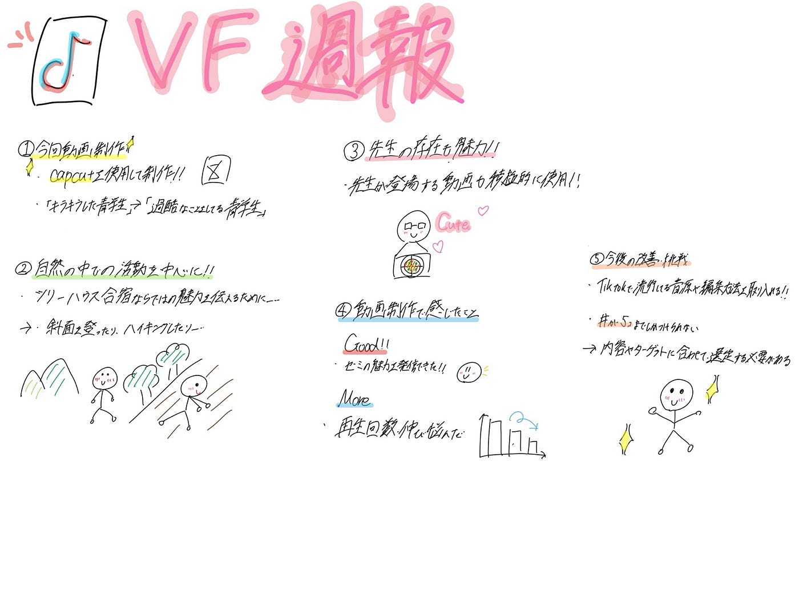

### 【VF週報】キラキラ青学生とのギャップ⁉️

こんにちは！中溝です。前回に引き続き、ツリーハウス合宿のvlogを作りました。

> **動画制作**

今回の[動画](https://www.tiktok.com/@furuhashilab?_r=1&_t=ZS-96ra02f9FS8)は、CapCutを使って制作しました。

動画では、世間が思う「キラキラした青学生」とは全く違う、ツリーハウス合宿の日常をvlog風に伝えたいと思い作成しました。そのため、土地整備をしている様子や、斜面を四つん這いになりながら登っている場面を使用し、過酷なことをしている青学生の雰囲気が伝わるよう工夫しました。

また、このゼミの魅力を伝えるうえで先生の存在は必要不可欠だと思ったため、先生が映っている動画も積極的に取り入れました。特に、ピザを持っている先生の姿がとても可愛らしく、ぜひ注目してみてください！！先生と学生の距離の近さやゼミの温かい雰囲気伝えられるように工夫しました。

合宿中の楽しい雰囲気や、自然の中で仲を深めながら活動するゼミの魅力が伝わる動画になったと思います。

> **今回の学び**

今回制作した動画は、合宿の雰囲気やゼミの魅力を伝えることができた一方で、再生回数は伸び悩む結果となりました。そのため、今後はTikTokで流行している音源や編集方法を積極的に取り入れ、より多くの人に見てもらえる動画制作に挑戦したいと考えています。動画の内容だけでなく、トレンドも意識しながら発信することで、より効果的にゼミの魅力を伝えていきたいです。

また、ハッシュタグは5個までしか設定できないため、動画の内容やターゲットに合わせて選定する必要があると感じました。今回は大学生活や青学生に関心のある人に動画が届くようなハッシュタグを中心に設定しましたが、今後はトレンドのハッシュタグも活用しながら、より多くの人に動画を見てもらえる工夫をしていきたいです。

> **TikTokのlink**

[こちら](https://www.tiktok.com/@furuhashilab?_r=1&_t=ZS-96ra02f9FS8)からぜひみてください！！

> **グラレコ**

