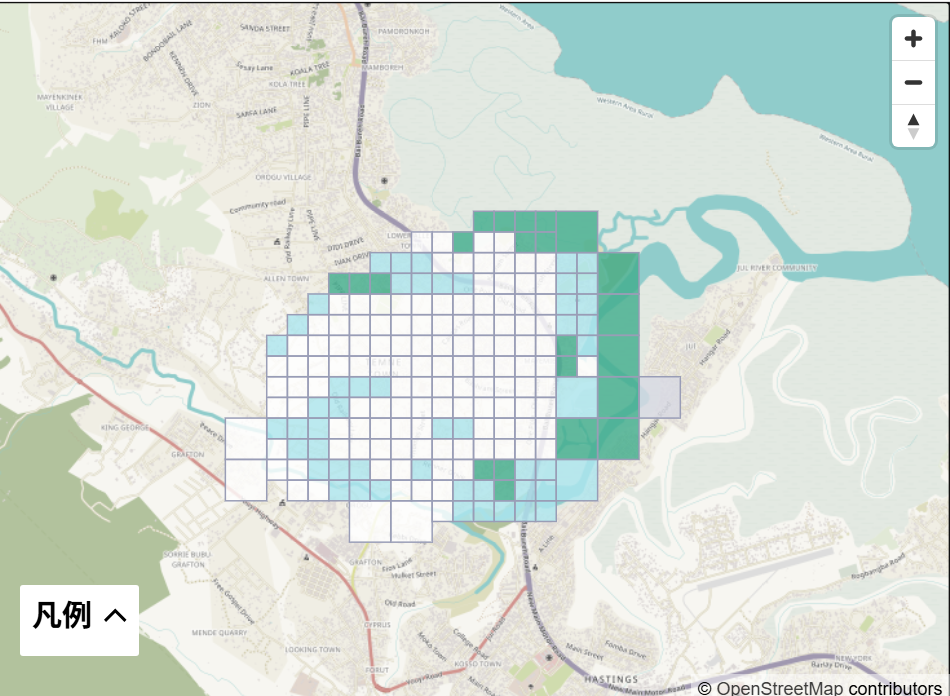
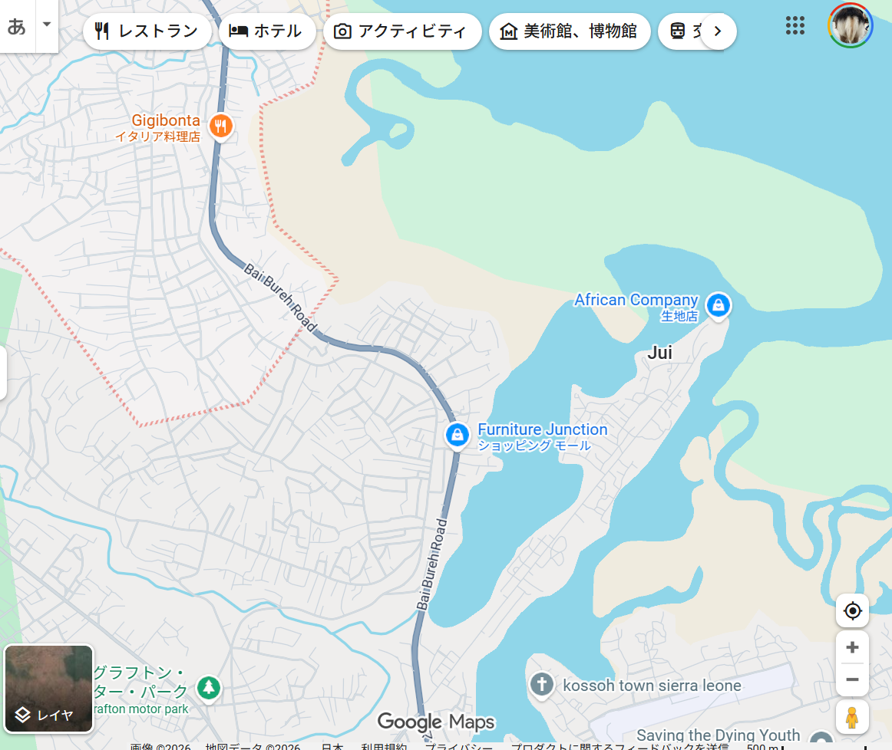
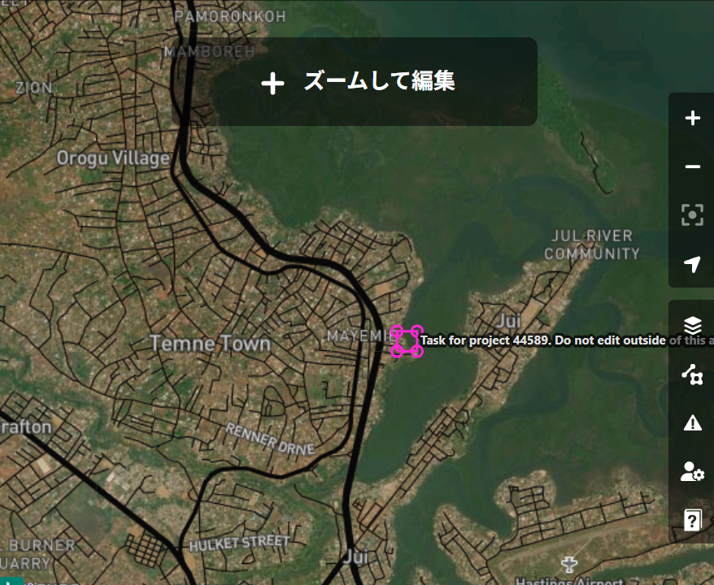
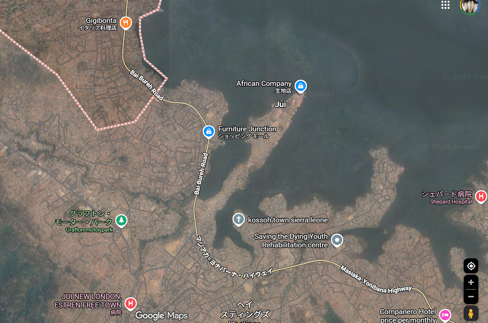
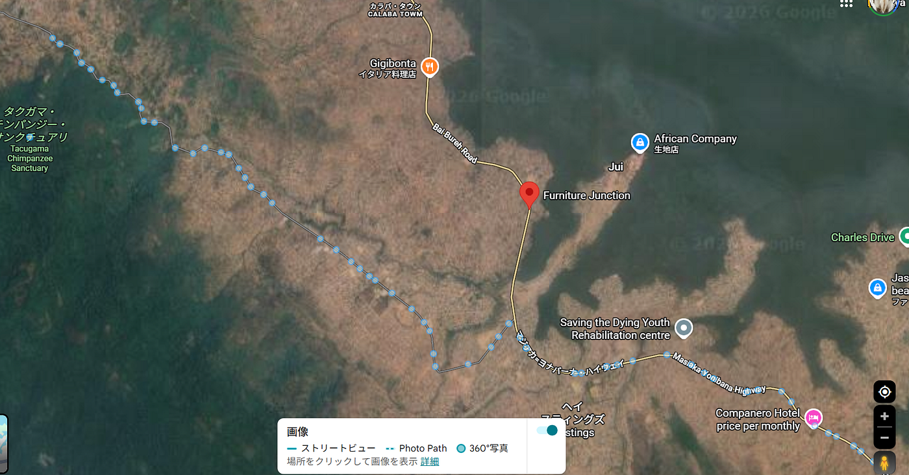
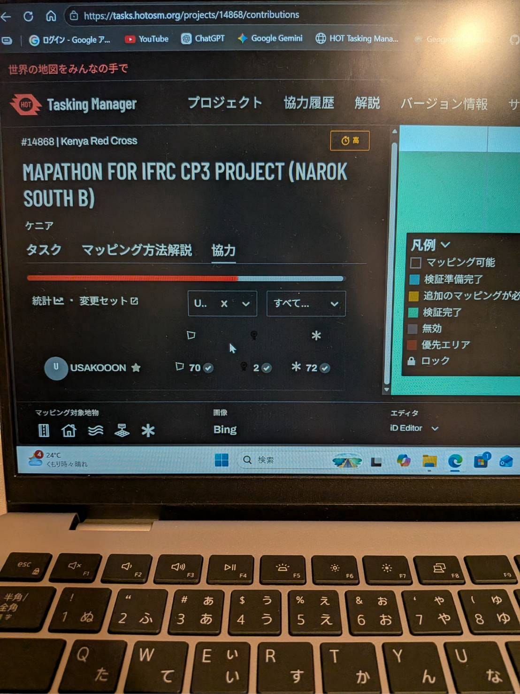
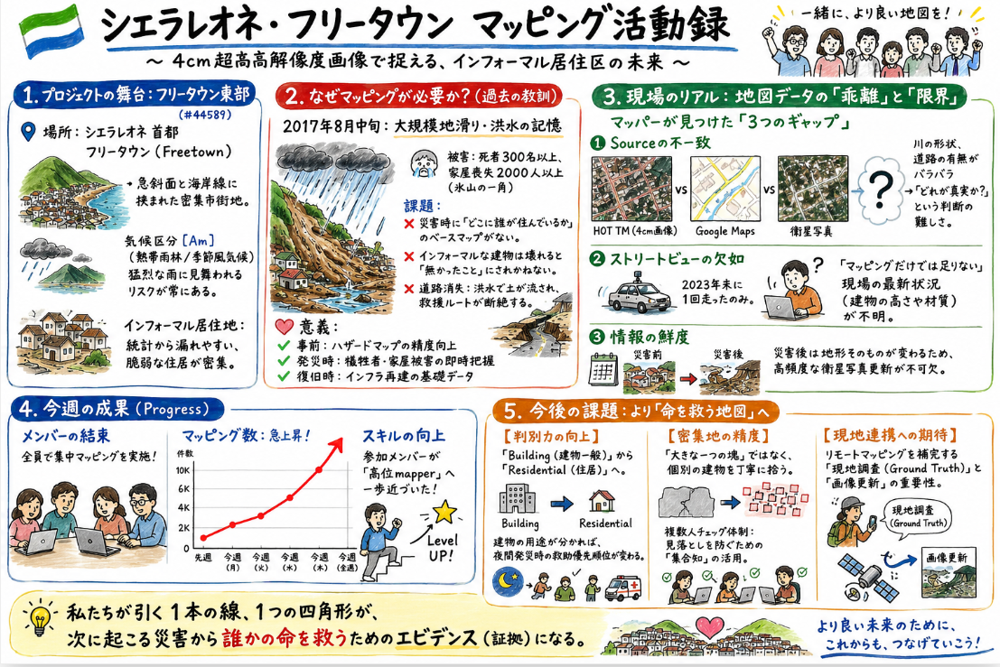

### 【Youth1 6/2週報】シエラレオネマッピング

３年の田邊です。

今週はメンバー全員でシエラレオネのマッピングを進めて、高位mapperに近づけました

[#44589: シエラレオネ：フリータウン東部 建物・道路マッピング（4cm 航空画像） — HOT Tasking Manager](https://tasks.hotosm.org/projects/44589/?fbclid=PARlRTSARowYNleHRuA2FlbQIxMABzcnRjBmFwcF9pZA8xMjQwMjQ1NzQyODc0MTQAAaeKGbb0weZQ0gWVvF1xkHby5oi2TrI8vVTjrNrP1Gi_iTnQQXx75YLMFya17A_aem_uTP4uJvIxVW5lRqMQkk23A#description)

題材に選ばれている理由の一つに、この地域にインフォーマルな居住地が密集しており潜在的な災害リスクを理解するというものがあります。

そこで、過去に発生したシエラレオネの自然災害を調べてみると、首都のFreetownにて2017年8月中旬ごろに大規模な地滑りと洪水が発生した歴史があることがわかりました。外務省によると、「少なくとも300人以上が犠牲になり，2,000人以上が家を失っている模様」（[シエラレオネにおける地滑り及び洪水被害について（外務報道官談話）｜外務省](https://www.mofa.go.jp/mofaj/press/danwa/page4_003198.html)）だそうで、マッピング的な視点では、家が数百から数千棟使えない状態となっていることが予想できます。また、インフォーマルな住居はその数字に足されないのでは？建物の一部が壊れてしまっているものなどを考えると、衛星写真はその災害の前後で役に立つのか？という疑問を持ちました。さらに下のリンクの動画を見るに、ほとんどの道が整備されておらず、洪水で地面の土が流され、新しくマッピングをしなければ交通にも影響があると思いました。

FreetownはAmの気候区分であるから、再び同規模の自然災害に見舞われる可能性があり、この活動は、災害前にハザードマップとしての応用ができる点、災害時にどれだけ人や建物が犠牲になっているのかを現状と照らし合わせて把握しやすくする点、災害後の復旧活動に役立てることができるという点などにおいて重要です。

なんとなくGoogle マップとHotTaskingManagerとを見比べてみようと思ったら、まず、画面右上の川がHotTaskingManagerとGoogle マップとその衛星写真とでちがいすぎて驚きました。なんなら衛星写真の道路にも違いがみられました。

そして、このストリートビューの少なさ。2023年の12月に1台のトラックが走っただけのよう

このマッピングだけでは災害時の情報がまだまだ足りないので、現地での活動や衛星写真の高頻度の更新が必要なのではと感じました

以前までの進捗状況に対し、全体的なマッピング数がかなり上昇しました。

今後の課題として、地物の種類を選択するときに、建物全般を選ぶことが多いのですが、住居を選べるように考察できる力があると、より災害時の行方不明者捜索の際などに役立つと思いました。また、建物が密集し過ぎており、見落としや、複数の建物をひとくくりにしている可能性があるので密集地区のマッピングは複数人での確認が必要だと思いました。

