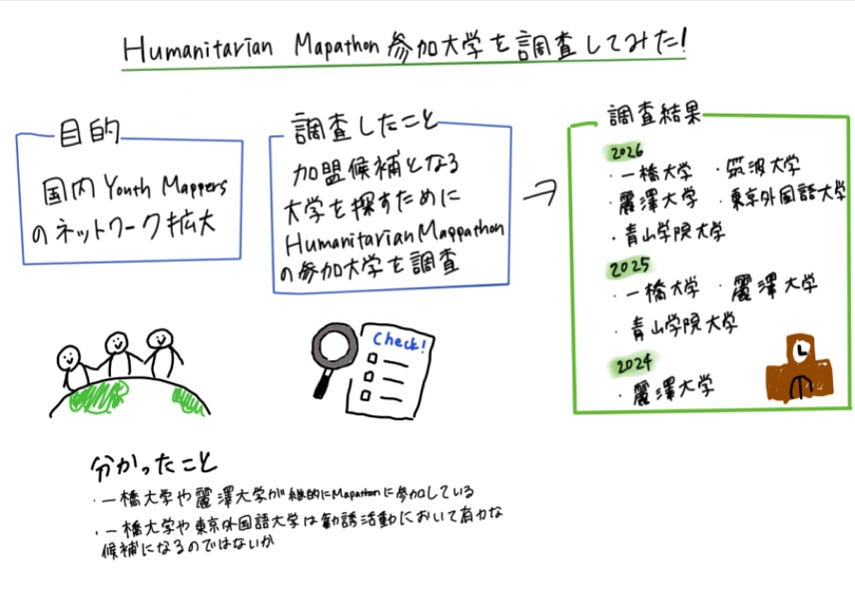

### 【youth②週報】YouthMappersの仲間を探して

こんにちは！三年の加藤です。

YouthMappers AGUでは、日本国内のYouthMappersネットワーク拡大を目標の一つとしています。そこで今回は、勧誘候補となる大学を探すため、Humanitarian Mapathonの参加大学を調査しました。

現在、日本でYouth Mappers Chapterが確認できる大学は、青山学院大学、筑波大学、麗澤大学です。

[YouthMappers Chapter Profiles
Explore the map of university chapters of YouthMappers, view their profiles and click on each record to find their…www.youthmappers.org](https://www.youthmappers.org/chapters)

### Humanitarian Mapathonとは

このイベントは、衛星画像やデジタルマッピングツールを使用して、災害支援、人道支援、都市計画などに役立つ地図を作成することを目的としています。

2024年から2026年の間で以下の大学がHumanitarian Mapathonに参加していることが確認できました。

- 2024年度

麗澤大学

- 2025年度

青山学院大学、一橋大学、麗澤大学

[Reitaku Global Seminar Kickoff: 2025 International Humanitarian Mapathon | 麗澤大学
1日目は 「クライシスチャレンジ：人々の物語をマッピング」をテーマに、 地震、洪水、山火事、紛争、難民危機などのデータを活用したマップ作成に取り組みました。…www.reitaku-u.ac.jp](https://www.reitaku-u.ac.jp/news/research/1777882/)

- 2026年度

一橋大学、麗澤大学、筑波大学、東京外国語大学

[2026 International Humanitarian Mapathon
Padletで作成されましたpadlet.com](https://padlet.com/tsasao/2026-international-humanitarian-mapathon-9wu45lb9w1ctx1w4)

今回の調査では、Humanitarian Mapathonへの参加実績を持つ大学を中心に確認を行いました。その結果、一橋大学や麗澤大学などが継続的にMapathonへ参加していることが分かりました。また、2026年度には筑波大学や東京外国語大学も参加しており、人道支援マッピングやOpenStreetMapへの関心が広がりつつあることがうかがえます。 OpenStreetMapや人道支援マッピングへの関心が既に存在しているため、一橋大学大学や東京外国語大学は今後の連携や勧誘活動において有力な候補になると考えられます。

今回はまずHumanitarian Mapathon参加大学を調査しました。今後は参加大学の研究室や学生団体についても調べ、YouthMappersの新規加盟につながる可能性を探っていきたいです。

最後にグラレコです

