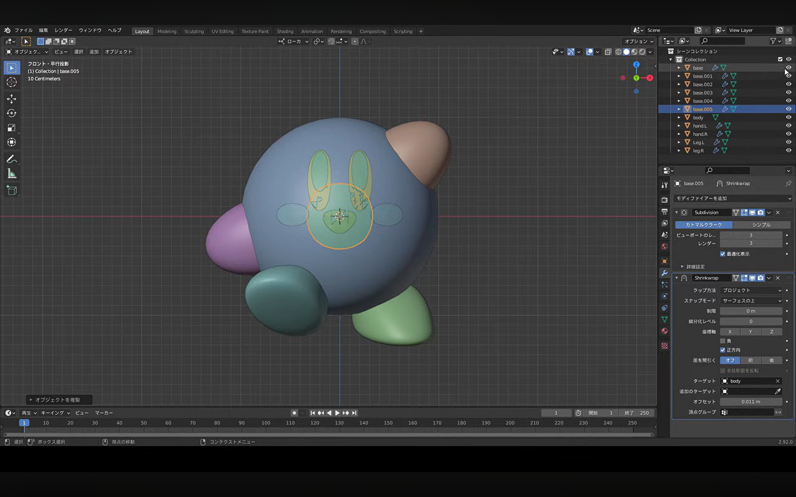
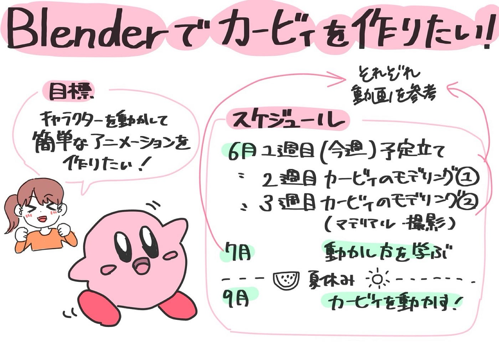

### Blederでカービィを作ってみよう！

こんにちは！デザイン部１の滝沢です！

今週は、まずチームとしての１年間の目標を立て、それに向けてどのように活動を進めるのかを話し合いました。

#### **【１年間の目標】**

デザイン部1では、この1年、**「キャラクターを動かして簡単なアニメーションを作る」**ことを目標に活動を進めることにしました。

#### 【目標に向けての今後の活動】

そのための第一歩として、Blenderを使用し、各自でカービィのモデリング制作を開始することにしました。キャラクター制作を通してBlenderの基本操作や立体物の作り方を学び、今後は完成したモデルに動きをつけてアニメーション制作に取り組む予定です。以下、スケジュールです。

6月 1週目 スケジュール立てる

6月 2週目各自でカービィのモデリング制作(モデリングの表情まで)

6月 3週目各自でカービィのモデリング制作完成

7月 完成したカービィの動かし方を学ぶ

9月アニメーションでカービィを動かす

#### 【カービィのモデリング制作】

参考にする予定のYouTube動画はこちらです↓

6月2週、3週目で、カービィのモデリングを完成させます。来週、2週では、各自でカービィのモデリング制作(モデリングの表情まで)を行う予定です。

#### 【アニメーションでカービィを動かす】

カービィのモデリングが完成したら、7月、9月に以下の動画を参考に、カービィを動かしてみようと思います。

参考にする予定のYouTube動画はこちらです↓

グラレコ

