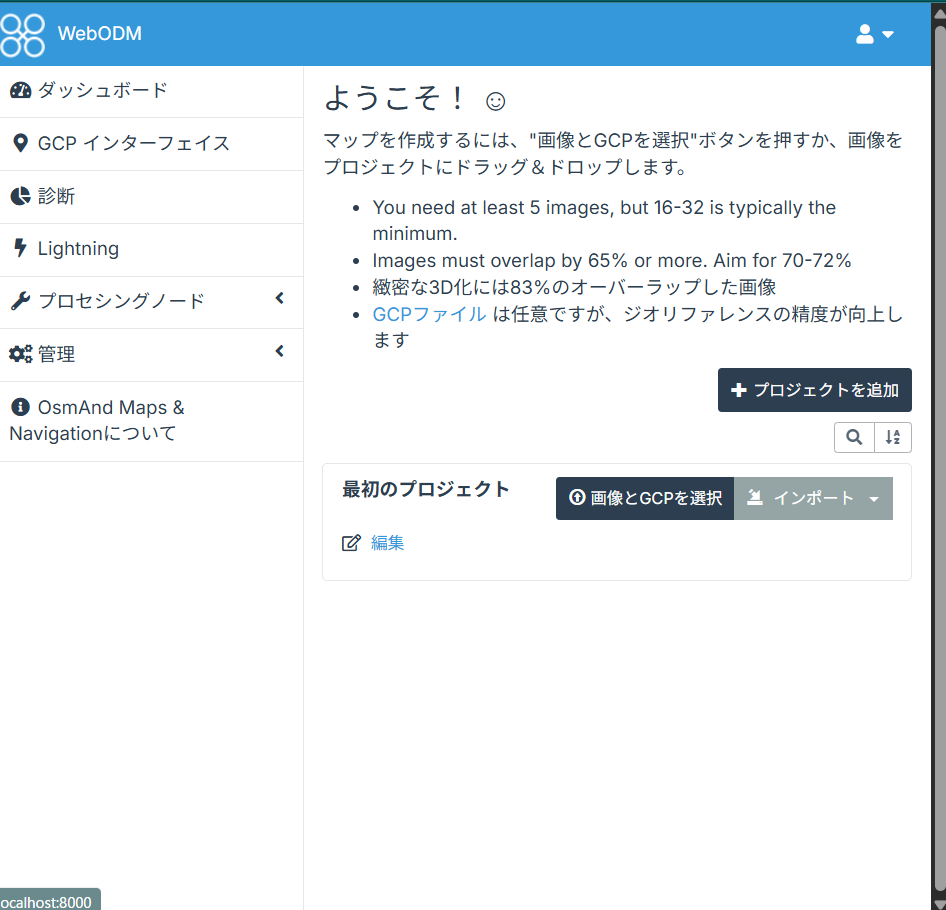
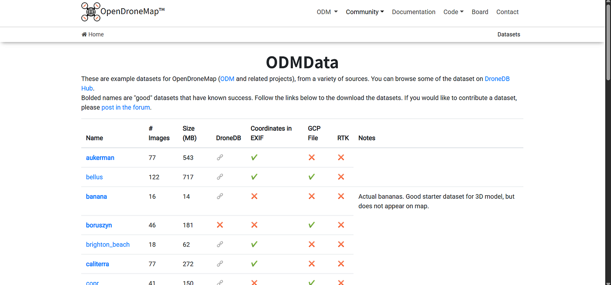
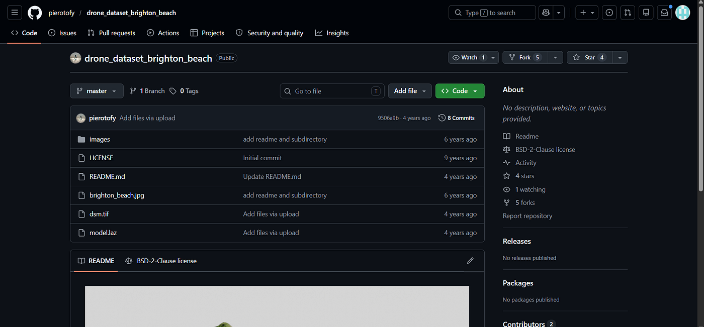
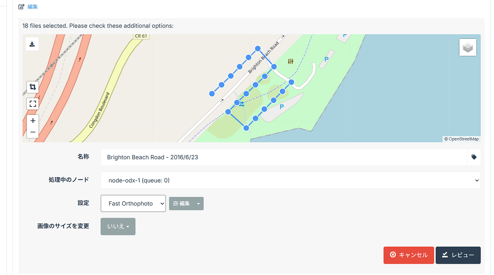
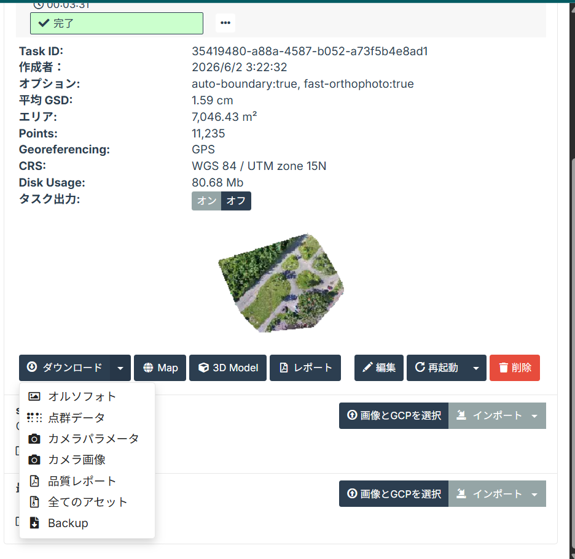
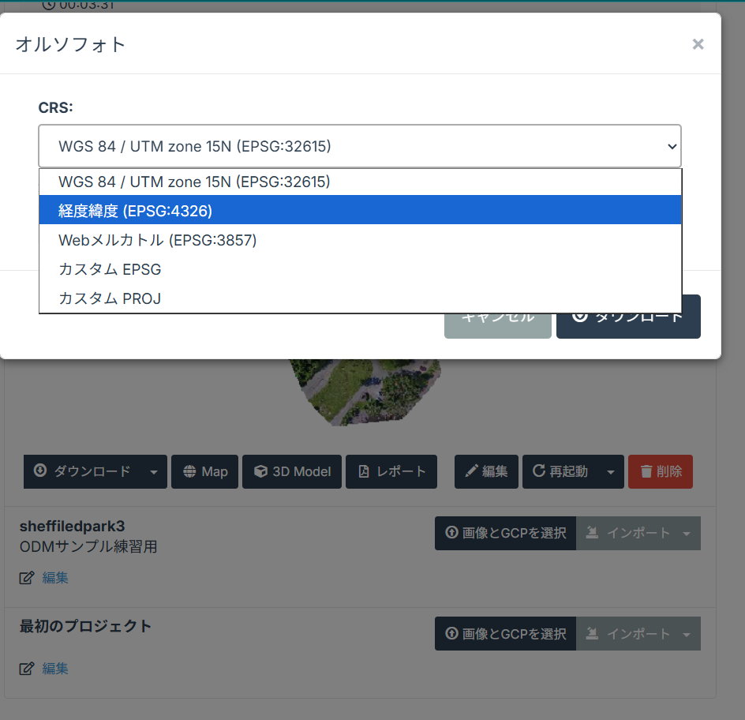

### WebODMを用いた画像処理の実践記録３

こんにちは！ドローン部２の佐藤です。

今日は前回のつづき、WebODMを用いたオルソ画像処理やっていきます。

来週以降のタスクはQGISメインなので、担当者あとはよろしく！でも、Dockerは動かしてみて。よろ。

### 1. 本日の目的

本日は、前回までに準備したDocker環境上でWebODMを起動し、サンプルのドローン画像データを用いてオルソ画像の生成まで行うことを目的とした。最終的には、QGISで表示可能なGeoTIFF形式のオルソ画像を取得するところまでを目標とした。

なお、Docker Desktopのダウンロードや初期設定は前回までに実施済みであるため、本記録では省略する。

### 2. WebODMの起動

まず、コマンドプロンプトからWebODMを起動した。起動後、ブラウザで `http://localhost:8000` にアクセスし、WebODMの初期画面が表示されることを確認した。ユーザー作成後、WebODMのプロジェクト画面に入ることができた。

作業中は、WebODMを起動しているコマンドプロンプトを閉じないようにした。コマンドプロンプトを閉じると、WebODMのコンテナも停止する可能性があるためである。

### 3. 使用したサンプルデータ

今回使用したサンプルデータは、OpenDroneMapのサンプルデータ一覧であるODMDataに掲載されている `brighton_beach` である。

情報源は以下である。

- OpenDroneMap ODMData
[https://github.com/OpenDroneMap/ODMdata](https://github.com/OpenDroneMap/ODMdata)

- OpenDroneMap Datasets
[https://www.opendronemap.org/odm/datasets/](https://www.opendronemap.org/odm/datasets/)

- Brighton Beach dataset
[https://github.com/pierotofy/drone_dataset_brighton_beach](https://github.com/pierotofy/drone_dataset_brighton_beach)

Brighton Beachは、OpenDroneMapのサンプルデータ一覧に掲載されているデータセットで、画像枚数が18枚、サイズが約62MBと比較的軽量である。また、EXIF GPS情報が含まれており、GCPやRTKは使用されていない。そのため、WebODMの基本的な動作確認や短時間でのオルソ画像生成の練習に適していると判断した。

### 4. サンプルデータの取得方法

GitHub上では、画像ファイルが1枚ずつ表示されていた。しかし、1枚ずつ画像を保存するのではなく、リポジトリ全体をZIP形式でダウンロードした。

手順は以下の通りである。

1. Brighton Beach dataset のGitHubページを開く

1. `Code` をクリックする

1. `Download ZIP` を選択する

1. ダウンロードしたZIPファイルを右クリックする

1. `すべて展開` を選択する

1. 展開後の `images` フォルダを開く

1. フォルダ内のJPEG画像をすべて選択する

今回WebODMにアップロードしたのは、`images` フォルダ内のJPEG画像である。

### 5. 注意点：アップロードするファイル

WebODMにアップロードするのは、ドローンで撮影された元画像である。今回の場合は、`images` フォルダ内の `.jpg` または `.jpeg` 形式の画像を使用した。

一方で、以下のようなファイルはWebODMに元画像としてアップロードしない。

- `dsm.tif`

- `model.laz`

- `brighton_beach.jpg`

- `json`

- `geojson`

これらは、処理済みの成果物、プレビュー画像、点群データ、または補助的な地理データであり、WebODMで最初に処理するための元画像ではない。

### 6. WebODMでのタスク作成

WebODM上で新規プロジェクトを作成し、展開したJPEG画像をまとめてアップロードした。

処理設定では、短時間でオルソ画像を生成するために `Fast Orthophoto` を選択した。今回の主な処理オプションは以下である。

- `fast-orthophoto:true`

- `auto-boundary:true`

画像をアップロードしただけでは処理済みにはならない。WebODMでは、画像アップロード後にタスクを作成し、処理を開始する必要がある。

### 7. 処理結果の確認

処理後、WebODM上でオルソ画像と点群が生成されていることを確認した。タスク情報では、タスクID、処理ノード、ディスク使用量などが表示された。

確認できた成果物は以下である。

- オルソ画像

- 点群データ

QGISで使用するため、オルソ画像は `GeoTIFF Raw` 形式でダウンロードした。

### 8. 注意点：GeoTIFF Rawの選択

QGISで利用する場合、単なるJPEGやPNGではなく、位置情報を持つGeoTIFF形式のデータを取得する必要がある。

今回の作業では、WebODMのダウンロード形式として `GeoTIFF Raw` を選択した。これはQGISで読み込むためのオルソ画像として利用できる形式である。

一方、`JSON` や `GeoJSON` は航空写真そのものではないため、QGISでオルソ画像として表示する目的には適していない。

### 9. 本日の到達点

本日は、WebODM上でサンプルのドローン画像をアップロードし、Fast Orthophoto設定で処理を実行し、オルソ画像と点群を生成するところまで完了した。また、QGISで利用するためのGeoTIFF形式のオルソ画像をダウンロードするところまで進めることができた。

QGISでの表示確認は次回行う予定である。

### 10. 次回の作業予定

次回は、今回ダウンロードしたGeoTIFF形式のオルソ画像をQGISに読み込み、背景地図との重ね合わせやCRSの確認を行う。あわせて、点群データについてもQGIS上で表示できるか確認する予定である。

具体的には、以下を行う。

- GeoTIFF形式のオルソ画像をQGISに読み込む

- CRSを確認する

- OpenStreetMapなどの背景地図と重ねる

- 点群データをQGISで表示する

- WebODMで生成した成果物がGISデータとして利用可能か確認する

### 11. 振り返り

今回の作業では、WebODMの処理そのものだけでなく、GitHubからのサンプルデータ取得、ZIPファイルの展開、JPEG画像の選択、処理済みデータと元画像の違いなどを確認することができた。

特に、WebODMではJPEG画像をアップロードしただけでは処理済みにはならず、タスクを作成して処理を開始する必要がある点を理解できた。また、QGISで利用するためには、単なる画像ではなくGeoTIFF形式のオルソ画像を取得する必要があることも確認できた。

本日の作業により、WebODMを用いたドローン画像処理の基本的な流れを一通り体験することができた。

#### 参考資料

使用データ：
Brighton Beach dataset
[https://github.com/pierotofy/drone_dataset_brighton_beach](https://github.com/pierotofy/drone_dataset_brighton_beach)

ライセンス：
BSD 2-Clause License

著作権表示：
Copyright © 2017, Piero Toffanin

BSD 2-Clause License は、再配布・利用・改変を認める一方で、著作権表示、ライセンス条件、免責事項を残すことを求めるライセンスである。該当リポジトリのLICENSEにも、ソース形式・バイナリ形式での再配布時に著作権表示・条件・免責事項を保持する条件が記載されている。

なお、ODMData自体は「OpenDroneMapと関連プロジェクト向けの例示データセット」で、複数の出典から集められているため、**データセットごとにライセンスを確認するのが安全**。今回のBrighton Beachは個別リポジトリ側でBSD 2-Clauseが確認できる。

#### 余談：ナショジオ、「２０２６年に訪れるべき世界の旅先」を発表 日本からは山形県

[ナショジオ、「２０２６年に訪れるべき世界の旅先」を発表 日本からは山形県
創刊から１３７年の歴史を持つナショナルジオグラフィックは、編集者と探検家たちがぜひ訪れたい旅先２５カ所を選んだ「２０２６年版ベスト・オブ・ザ・ワールド」を発表した。ＣＮＮは、同誌編集長ネイサン・ランプ氏を取材。選ばれた都市とその理由について…www.cnn.co.jp](https://www.cnn.co.jp/travel/35239583.html)

米有力誌ナショナル ジオグラフィック（National Geographic）が発表した「2026年に行くべき世界の旅行先25選（Best of the World 2026）」において、**日本国内から唯一、山形県が選出されました**。 [1]

オーバーツーリズム（観光公害）が課題となる東京や京都などの大都市とは対照的に、**「混雑を避け、静寂の中で上質な体験ができる日本の隠れた秘境」**として国際的に非常に高い評価を受けています。 [1, 2]

選出の背景と、同誌が絶賛した山形県の主な見どころは以下の通りです。

**なぜ山形県が選ばれたのか？（選出理由）**

- **「別世界のような静けさ」**：東京から新幹線一本で行ける距離にありながら、大都市の喧騒から完全に切り離された神秘的なアウトドア体験ができる点。 [1, 3]

- **知る人ぞ知る旅先**：訪日観光客の多くが東京や京都に集中する中、山形を訪れる外国人観光客は全体のわずか「約1%」に留まっており、「人混みを避けて、日本の原風景に出会える未開の地」として注目されました。 [4, 5]

- **自然と精神文化の融合**：何世紀も続く古い伝統、聖なる山々、伝統的な祭り、そしてトップクラスの食文化（日本酒やラーメン、米沢牛など）が通年で楽しめる点が評価されています。 [1, 4, 6]

**ナショジオが注目した山形県の具体名所・カルチャー**

同誌の公式特集や関連の観光誘致において、特にクローズアップされているスポットです。 [2, 6, 7]

- **銀山温泉（尾花沢市）**：大正ロマンの風情漂う街並みが、まるで「おとぎ話の世界から抜け出したよう」と絶賛されています。 [7, 8]

- **蔵王の樹氷（山形市）**：世界でも限られた気象条件でしか見られない「スノーモンスター（樹氷）」と、夜間の色鮮やかなライトアップが幻想的と紹介されました。 [2, 9]

- **山寺 / 立石寺（山形市）**：豊かな自然と歴史が調和し、精神的なハイキングや絶景を楽しめる場所としてピックアップされています。 [6, 7]

- **出羽三山（羽黒山・月山・湯殿山）**：古くから続く山伏の修行の地。マインドフルネスやスピリチュアルな体験を求める海外旅行客から関心を集めています。 [6, 7]

- **西川町**：国連世界観光機関（UN Tourism）から「ベスト・ツーリズム・ビレッジ（優良な観光の取り組みを行う農山漁村）」に選定された実績も、選出を後押ししました。 [4]

- **極上の食文化**：地理的表示（GI）保護制度に指定されている「山形の日本酒」をはじめ、米沢牛、芋煮、冷やしラーメンなど、独自の豊かなグルメも太鼓判を押されています。 [4]

**他にどんな国や地域が選ばれている？**

この「2026年に行くべき世界の旅行先25選」には、山形県のほかに以下のような世界の名だたるエリアが並んでいます。 [6]

- **アジア**：北京（中国）、マニラ（フィリピン） ※アジアからは山形を含め3箇所のみ

- **その他の地域**：マウイ島（アメリカ・ハワイ）、バスク地方（スペイン）、ラバト（モロッコ）など [6]

詳細は、[山形県公式ホームページ](https://www.pref.yamagata.jp/110011/ng-2026-25sen.html) や [山形県観光公式サイト](https://yamagatakanko.com/features/detail_570.html) からも選出記念の特設情報を確認できます。 [1, 10]

[1] [https://www.pref.yamagata.jp](https://www.pref.yamagata.jp/110011/ng-2026-25sen.html)

[2] [https://www.kosekikan.com](https://www.kosekikan.com/blog/blog/1867)

[3] [https://en.japantravel.com](https://en.japantravel.com/yamagata/yamagata-one-of-nat-geo-s-best-places-to-visit-in-2026/72024)

[4] [https://www.furusato-web.jp](https://www.furusato-web.jp/topics/p244776/)

[5] [https://www.furusato-web.jp](https://www.furusato-web.jp/topics/p244776/)

[6] [https://www.asahi.com](https://www.asahi.com/ajw/articles/16115083)

[7] [https://www.okaze-gatta.jp](https://www.okaze-gatta.jp/area/%E4%B8%96%E7%95%8C%E3%81%8B%E3%82%89%E5%B1%B1%E5%BD%A2%E3%81%B8%E3%80%81%E3%83%A9%E3%83%96%E3%82%B3%E3%83%BC%E3%83%AB%E3%81%8C%E5%B1%8A%E3%81%8D%E3%81%BE%E3%81%97%E3%81%9F%EF%BC%88%E7%A2%BA%E8%AA%8D/)

[8] [https://www.asahi.com](https://www.asahi.com/and/travel/article/16248436)

[9] [https://www.nationalgeographic.com](https://www.nationalgeographic.com/travel/best-of-the-world-2026/article/yamagata-japan)

[10] [https://yamagatakanko.com](https://yamagatakanko.com/features/detail_570.html)

ナショナル ジオグラフィック（National Geographic Traveller UK）の2026年フォトコンテストでは、ドローン空撮の普及に伴い**新部門「エリアル（Aerial）部門」が新設され、2026年5月28日に受賞者が発表されました**。 [1, 2, 3, 4]

本コンテストの空撮部門における結果と、2026年のドローン空撮に関連する最新情報は以下の通りです。

### 2026年ナショジオ・トラベラー フォトコンテスト結果

- **最優秀賞（Grand Prize）＆ エリアル部門勝者**：**Edward Hasler氏**

- **受賞作**：ナミブ砂漠（ナミビア）の上空からヘリコプターで撮影した作品。豪雨によって砂丘に川が流れ込み、まるで砂の上に木が描かれたような絶景を捉えました。

- **その他の空撮関連受賞**：同氏はベトナム・ハノイの醤油工場の伝統的な陶器の瓶をドローンで捉えた作品でも、フード（Food）部門の優秀賞（Highly Commended）を獲得しています。 [5, 6]

- **野生動物部門でのドローン活用**：**Felix Belloin氏**

- 氷の割れ目で眠るホッキョクグマの姿をドローンと望遠レンズを組み合わせて撮影し、野生動物（Wildlife）部門の勝者となりました。ドローンを十分に離して撮影することで、動物を驚かせずに自然な姿を収めています。 [6]

- **展示会情報**：入賞作品は2026年5月28日から7月12日まで、ロンドンのキングス・クロス駅（Granary Square）にて無料の野外写真展として一般公開されています。 [1, 7]

### その他の主要な2026年ドローン空撮コンテスト

ナショジオ以外にも、2026年に開催・締め切りを迎えた世界最大級のドローン空撮コンテストがあります。

**第11回 SkyPixel フォト＆ビデオコンテスト**

- **概要**：世界最大のドローンメーカーDJIとSkyPixelが主催する空撮の最高峰コンテスト。

- **スケジュール**：2026年3月10日に応募が締め切られ、現在審査・発表のフェーズにあります。 [8]

**ハッセルブラッド マスターズ 2026（Hasselblad Masters）**

- **概要**：高級カメラブランドのハッセルブラッドが主催。ドローンに搭載される中判カメラでの空撮作品も含め、圧倒的な画質と美しさを競う7部門で構成されています。 [9]

世界的な写真コンテストへの応募や、最新の受賞作アーカイブの閲覧を希望される場合は、[National Geographic Contests 公式ページ](https://www.nationalgeographic.com/contests) から過去の受賞作や今後の開催要項を確認できます。 [3, 10]

[1] [https://www.facebook.com](https://www.facebook.com/NatGeoTravelUK/posts/the-national-geographic-traveller-uk-photography-exhibition-2026-is-now-open-the/1484439627062007/)

[2] [https://www.facebook.com](https://www.facebook.com/NatGeoTravelUK/photos/1483844500454853/)

[3] [https://www.facebook.com](https://www.facebook.com/photo.php?fbid=1484439567062013&set=a.649985783840733&type=3)

[4] [https://www.natgeotv.com](https://www.natgeotv.com/uk/special/national-geographic-traveller-uk-photography-competition-2026)

[5] [https://www.instagram.com](https://www.instagram.com/p/DY687sjDStM/)

[6] [https://www.cnn.com](https://www.cnn.com/2026/05/29/travel/national-geographic-photo-competition-scli-intl)

[7] [https://www.nationalgeographic.com](https://www.nationalgeographic.com/travel/article/national-geographic-traveller-uk-photography-competition-winners)

[8] [https://www.dji.com](https://www.dji.com/jp/newsroom/news/dji-release-skypixei)

[9] [https://www.hasselblad.com](https://www.hasselblad.com/ja-jp/inspiration/masters/2026/)

[10] [https://www.nationalgeographic.com](https://www.nationalgeographic.com/contests)

2026年のナショジオ・コンテストで「エリアル部門」のトップに輝いた作品はヘリコプターからの撮影でしたが、同年の上位入賞者が使用し、現在プロ写真家の主流となっている**2026年の最新ドローン機材とスペック（画素数・価格）**は以下の通りです。

### 1. 2026年のプロ愛用ドローン（上位入賞クラス）

今年のコンテストや市場で「最高峰」とされているのは、DJIの最新フラッグシップモデルです。

- **機種名**：**DJI Mavic 4 Pro** [1]

- **実勢価格**：約 **277,200円**（税込）

- **カメラ画素数**：

- **メインカメラ**：**1億画素（100MP）**

- ハッセルブラッド（Hasselblad）製カメラを搭載し、従来の数倍の解像度を実現しています。

- **望遠カメラ**：4800万画素〜5000万画素（デュアル望遠）

- 野生動物部門の勝者（Felix Belloin氏）のように、動物に近づかずに大きく写すにはこの「望遠レンズ」が必須となります。

### 2. コンテスト勝者の撮影環境との比較

優勝作品のクオリティを生み出すための「機材」と「コスト」の内訳です。

撮影スタイル [2] 機材・方法画素数 / クオリティコスト感**今回の優勝作品**
(Edward Hasler氏)**有人ヘリコプター**
＋一眼レフ機材**約4500万〜6000万画素**
(Canon EOS R5など)**数万円〜数十万円 / 1時間**
(チャーター代が非常に高額)**入賞ドローン作品**
(Felix Belloin氏ら)**DJI Mavic 4 Pro**
(またはMavic 3 Pro)**約1億画素 (100MP)**
※トリミング耐性が高い**約28万円 (購入)**
(一度買えば維持費は安い)

**💡 ポイント
**今年のコンテストでは、「**ヘリコプターでしか撮れない高度・アングル」と**「**ドローンだからこそ撮れる接近・静音性」の**使い分けが勝敗を分けました。
特に野生動物（ホッキョクグマ）の撮影では、1億画素の高解像度を活かし、「**遠くから広角で撮って、後から必要な部分だけを切り抜く（クロップする）」と**いう手法が、画質を落とさずに使えるようになった点が2026年の大きな技術革新です。

これからドローン空撮を始める場合、予算15万円前後で5000万画素（50MP）が撮影できる**「DJI Mini 5 Pro」** など、より軽量で規制の緩いモデルも選択肢に入ります。

ご自身の用途（風景、動物、あるいは旅行の記録など）に合わせて、**最適なモデルの選び方**や**必要なアクセサリー（予備バッテリーなど）**について詳しく絞り込みましょうか？

[1] [https://www.thedronegirl.com](https://www.thedronegirl.com/2026/03/31/best-camera-drones/)

[2] [https://www.cnn.com](https://www.cnn.com/2026/05/29/travel/national-geographic-photo-competition-scli-intl)

#### グラレコ

ChatGPT5.5使用
