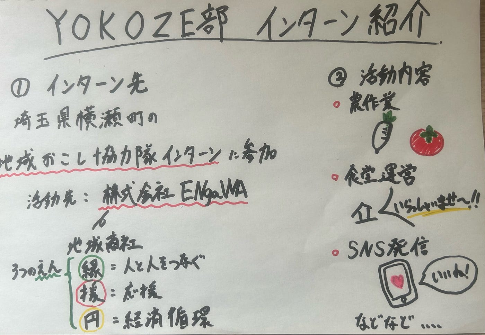

### 【YOKOZE部週報】横瀬町に地域づくりの現場を学びに行きます！

こんにちは、4年の井上です。先日久しぶりにサッカーをしたところ自分の体の急速な衰えに気づいてしまい、危機感を覚えております。これから健康を維持するためにも継続的な運動を心がけたいです。

さて、本日は我々YOKOZE部が参加するインターンについて紹介したいと思います。このたび、古橋先生の力添えもあって埼玉県横瀬町で行われる地域おこし協力隊インターンに参加することになりました。活動先は、横瀬町の地域商社である株式会社ENgaWAです。

> _**横瀬町とは_**

改めて横瀬町とはどんな所か確認したいと思います。

横瀬町は、埼玉県秩父地方に位置する人口約7,500人の町です。都心からのアクセスがよい一方で、自然や地域のつながりが残る**「ちょうどいい田舎町」**として紹介されています。また、**「日本一チャレンジする町」「日本一チャレンジする人を応援する町」**を掲げ、地域おこし協力隊や官民連携の取り組みに力を入れている点も特徴です。

> _**インターンの内容_**

今回のインターンでは、ENgaWAが行っている地域に関わる仕事を幅広く体験します。

インターンの詳細については[こちら](https://www.iju-join.jp/cgi-bin/recruit.php/9/detail/61278?fbclid=PAVERFWASK8-ZleHRuA2FlbQIxMABzcnRjBmFwcF9pZA8xMjQwMjQ1NzQyODc0MTQAAaeXj4Lp1-UejUM7UjN4-DDQAV1MKrlrbLck5UMflye6X6Y7rlPVfNrDflV2DA_aem_KPbLrDGtUvG1YS4jxJUnoQ)から確認できます。

具体的には、農作業、地元農産物を使った商品開発や販売、横瀬駅前食堂の運営、チャレンジキッチンENgaWAでのイベント企画、SNSでの情報発信などです。内容だけ見るとかなり幅広く、もはや「地域づくりの詰め合わせセット」みたいなインターンだなと感じています(笑)

> _**株式会社ENgaWAについて_**

そろそろ[株式会社ENgaWA](https://lit.link/kitchenengawa)ってどんな会社やねんという言葉が聞こえてきそうなのでこの会社についても説明しようと思います。

**株式会社ENgaWAは、横瀬町の地域商社として、地域に新しい経済循環を生み出すことを目指している会社**です。

ちなみに、ENgaWAという名前には、人と人との「縁」、チャレンジする人を支える「援」、地域の中でお金が回る「円」という意味が込められているそうです。

> _**意気込み_**

今回のインターンでは、地域資源をどのように見つけ、誰に向けて、どのように伝えていくのかを学びたいと考えています。また、外部から関わる学生として、地域の方々とどのように関係を築いていくべきなのかも大切にしたいと思っています。

資料を読むだけでは分からない、地域の空気感や人の思い、現場で起こる小さな課題を実際に感じられることが、このインターンの大きな魅力だと思いますので、まずは現地でしっかり動き、話を聞き、できれば農作業で腰をやられないように気をつけながら、横瀬町での学びを深めていきたいです！

最後にグラレコです。

