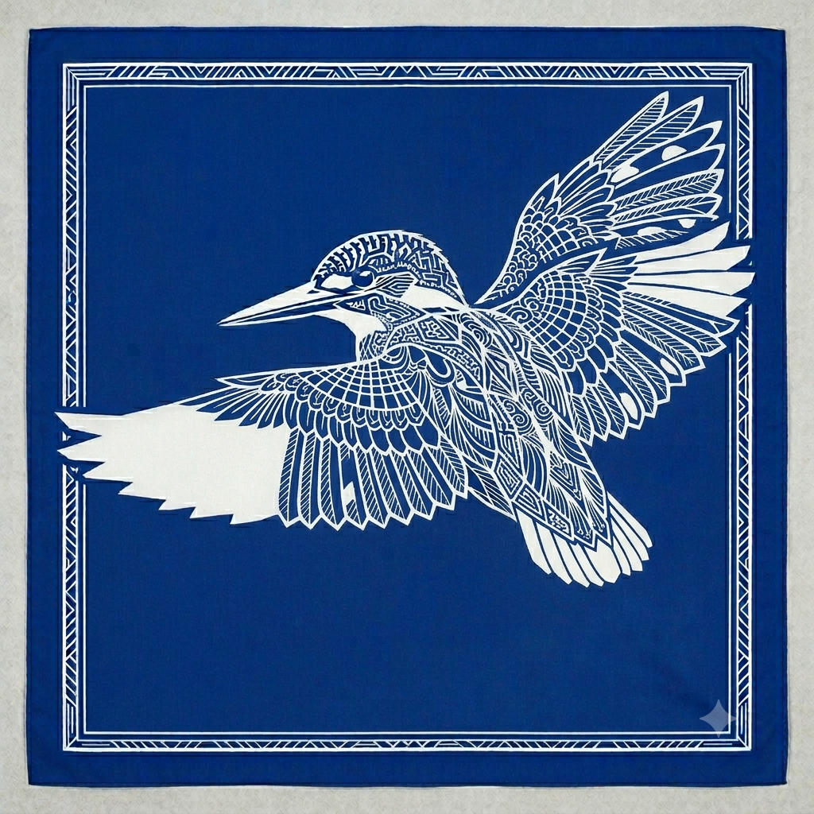
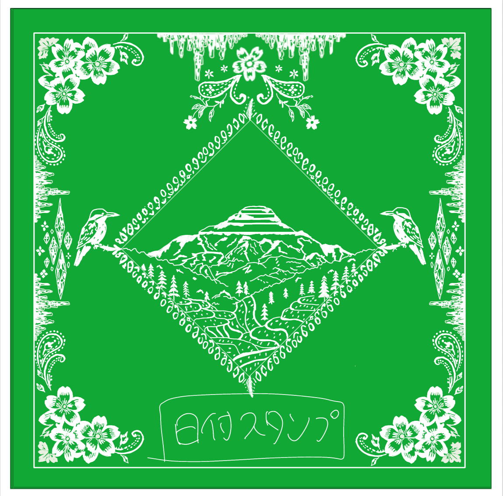
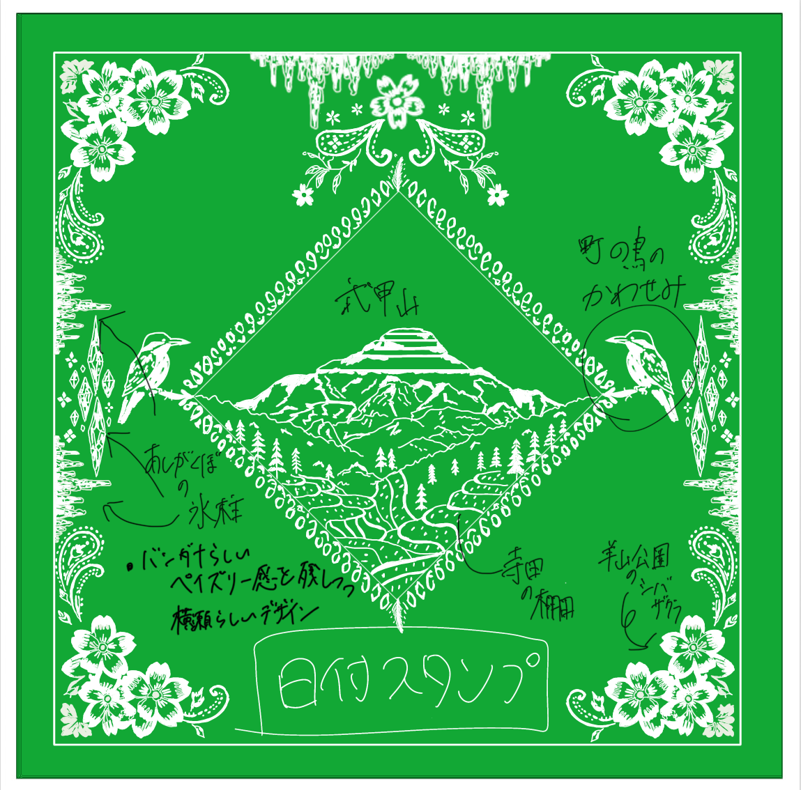
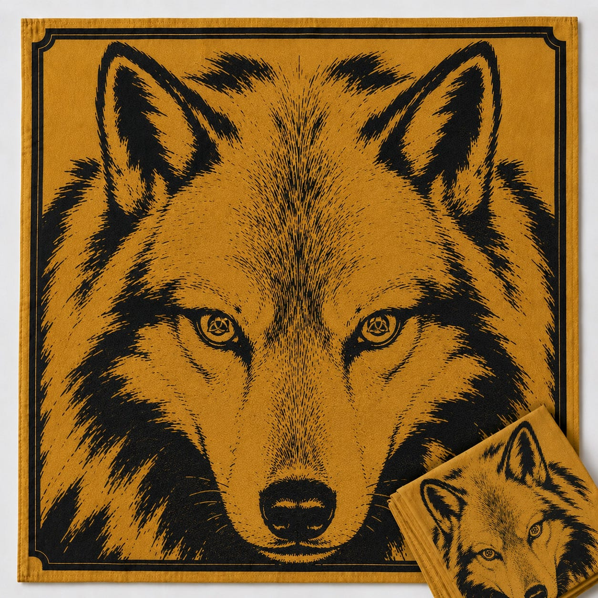
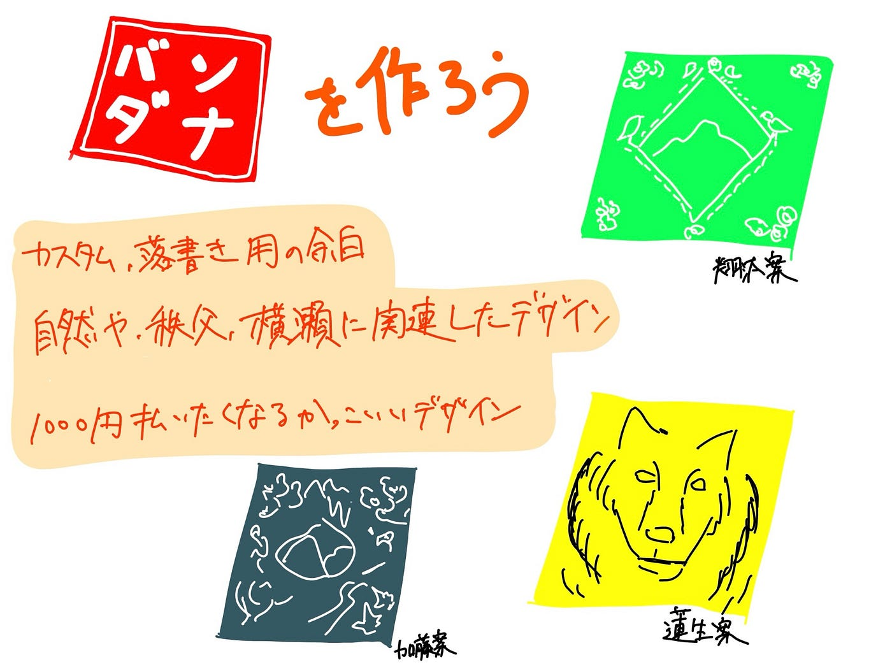

### 【横瀬部週報】バンダナを作ろう

### バンダナを作ろう

バンダナはネットを探したところ、[このサイト](https://www.prismacreative.jp/item/3215)が一番安くできることがわかりました。無地でもデザイン付きでも値段が変わらないため、こちらでデザインを作ってそれをオーダーすることにしました。

### デザインを作ろう

我々にはセンスがないのでデザイン部の人に投げようかと思いましたが、そうすると我々の成果がバンダナの発注だけになってしまうので横瀬部で行うことにしました。下手くそなりに頑張ったのでみてください。

#### 前提

1. ペンやハンコでカスタムされる余白

1. 自然や秩父に関連したデザイン

1. 1000円払いたくなるカッコイイデザイン

本吉案
Gemini3.5Flashを使用しました。秩父に生息するカワセミをデザインしました。芦ヶ久保にくる人の多くは自然好きだと思うので、カワセミに興味がある人も多いかと思います。自分で落書きやスタンプでカスタムできるスペースを多めに設けました。

あらしょう案

私はバンダナが結構好きなので、普段使う定番の柄を踏襲しつつ横瀬風にアレンジしました。

ChatGPT5.5を使用しつつ、細かなところは自身で調整しました。まだまだ余白があるのでデザインを追加予定ですが、なんかアキラがスタンプを押してオリジナリティを付け加えることができる仕様も面白いとつぶやいていたのでそこは調整かなと思います。

井上案

自分は普通のバンダナ風だとおもんないなと思い､ちょっと雰囲気の違うデザインにしました。

題材にしたのは、秩父・横瀬に生息していたとされる守り神“ニホンオオカミ”です。秩父にある三峯神社では「お犬さま」として信仰され、災いを遠ざける守り神として親しまれてきました。

このバンダナでは、秩父・横瀬の山に宿る強さと守りのイメージを、屏風風のデザインで表現しました。また目の中に市のマークを入れることで守り神感を演出しました。

自分もChatGPT5.5を使いながら作成したんですが、まだニホンオオカミぽさが足りないのでそこを付け足せたらなと思います。また､市のマークは実際に使えるかなどの課題も見えました。

あと､根本的にコンセプトとして横瀬よりも秩父市よりになっちゃってるのはどうなんだろと作りながら思いました笑

加藤案

私はデザインの才能がありすぎる（？）ので今回はGemini 3.5 Flash様に任せました^^

中央に武甲山や芦ヶ久保の氷柱など、横瀬町の観光地を置き、周りには横瀬町の自然を表現しました。とはいうものの横瀬らしさという点ではあまり出せていないと感じているのでその点に関してはブラッシュアップしていかなければならないです。

### グラレコ

