## Blenderの進捗状況！

こんにちは！4年の稲田です。

今週のデザイン部2は、先週の週報に引き続き、Blenderでの作品づくりを進めていきました。

今回は実際に各自スタートしてから2回目になります！では各自の進捗を報告していきます！

【ゆうか】

私は前回作成した猫が乗る缶詰の作成、マテリアルの作業までを進めていきました。

今回難しかったのは缶詰の模様作りです。猫柄を作るために、猫の頭を半分複製する作業やそれを缶に沿って複製するところが難しかったです。

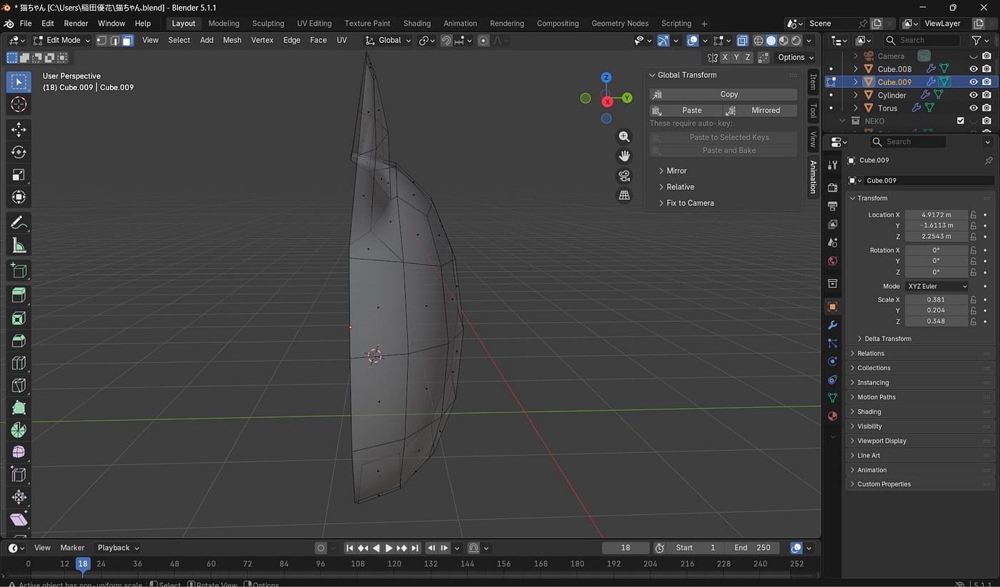

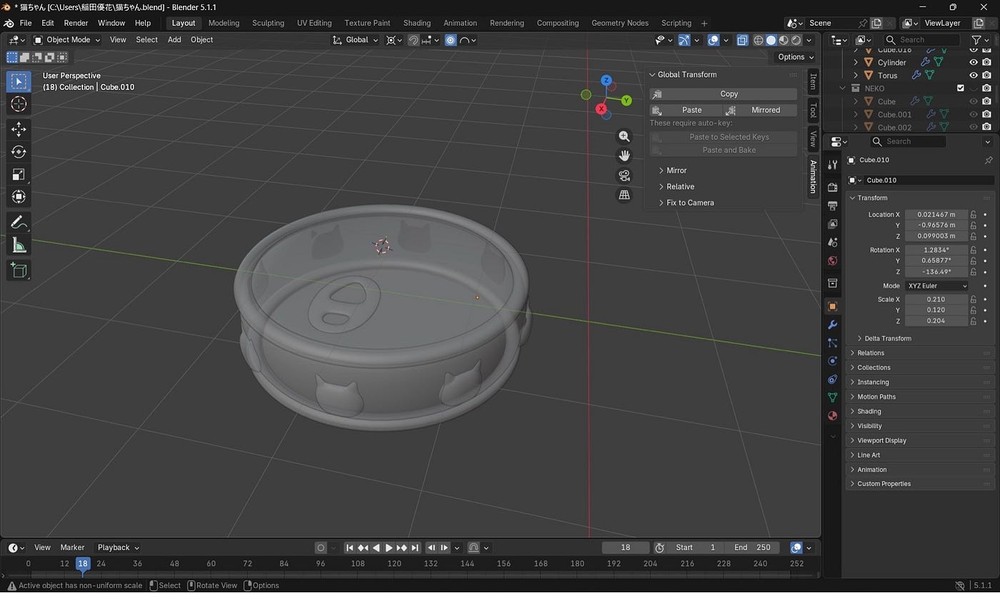

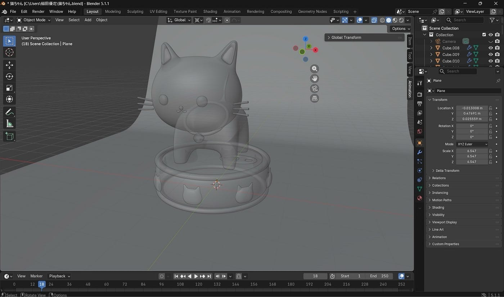

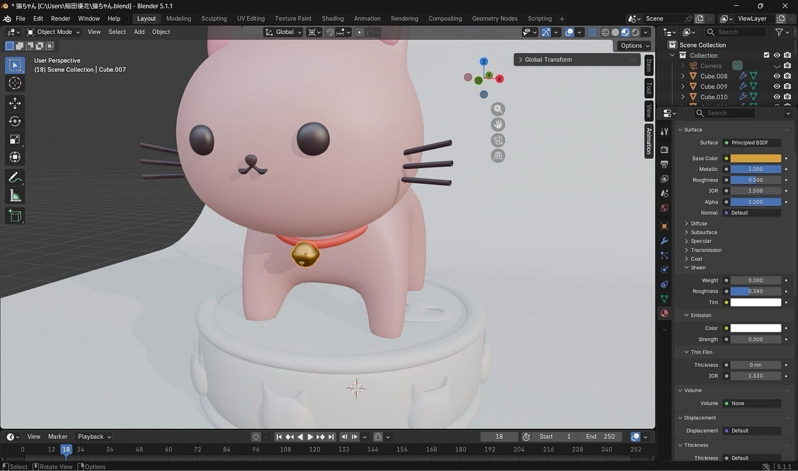

お手本と同じような質感にすることは気をつけながらも、違う色で作ってみました。

鈴や缶のツヤツヤした感じはMaterialの数値を変えると表現出来ると知り、これから違うものを作る時にも使ってみたいと思いました。

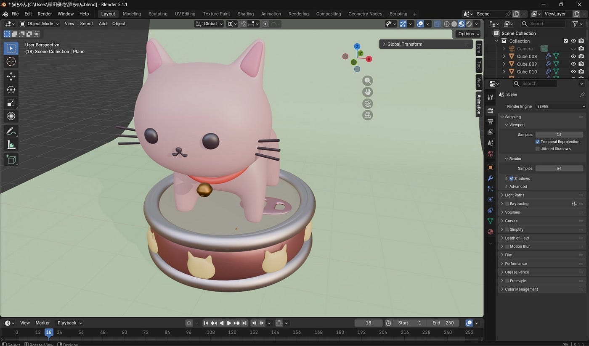

来週はライトを当てたり、向きを調整したりしながらカメラで撮影まで進めたいです！3年生の時は最後パソコンが重すぎて手こずったので、今度はしっかり保存できるように頑張ります。

【もえ】

今回は、光を当てて影をつける作業と、さらにリアルな質感を表現するマテリアルの設定を行いました。

1. 影をつける

今回は画面の左上から光を当てるようにライトを配置し、リンゴの右下に自然な影が落ちるように調整しました。このとき、「レンダーエンジン」という項目を「Eevee（イービー）」から「Cycles（サイクルズ）」に変更することで、よりリアルな影を表現することができます。

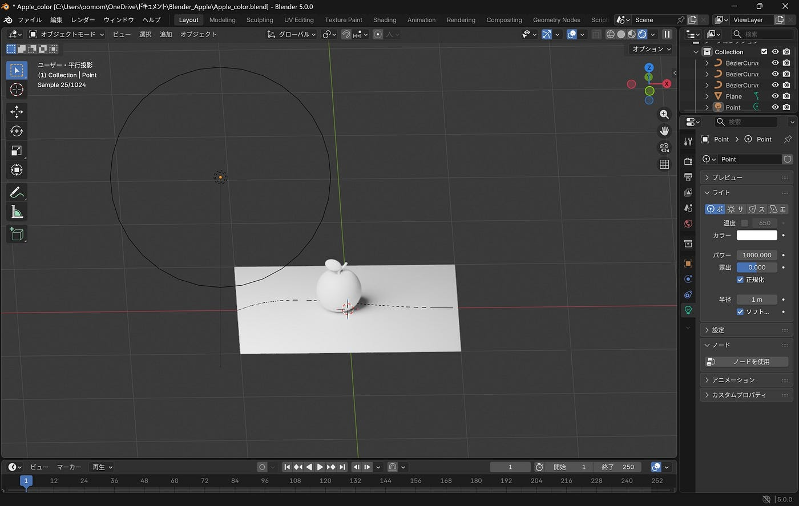

2. 1つ目のリンゴの色塗り

ライティングが完成したあと、まずはベースとなる1つ目のリンゴに色をつけました。実を赤色、葉っぱを緑色、へたを茶色にそれぞれ塗り分けています。彩度や明度を調節することで、お手本のものよりも少しパステル調にしたのがポイントです。

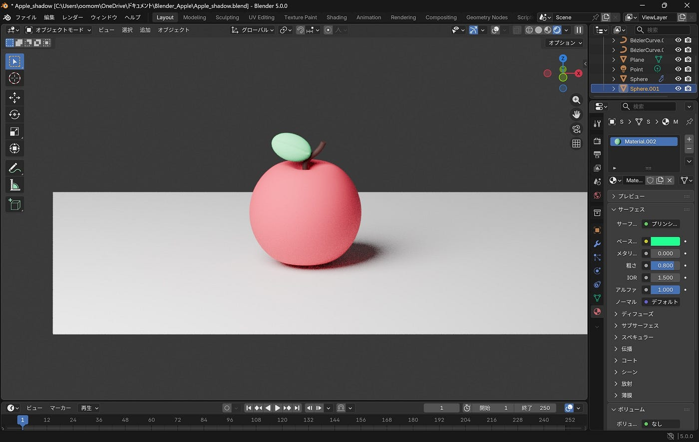

3. 「粗さ」の調整で質感を変更

マテリアル設定の中にある「粗さ」の数値を調整することで、見た目の質感が大きく変わります。

- 「粗さ」を 0 に近づけた場合：光を強く反射して、表面がツヤツヤとした質感になります。

- 「粗さ」を 1 に近づけた場合：光の反射が鈍くなり、粘土のようさらさらした質感が表現できます。

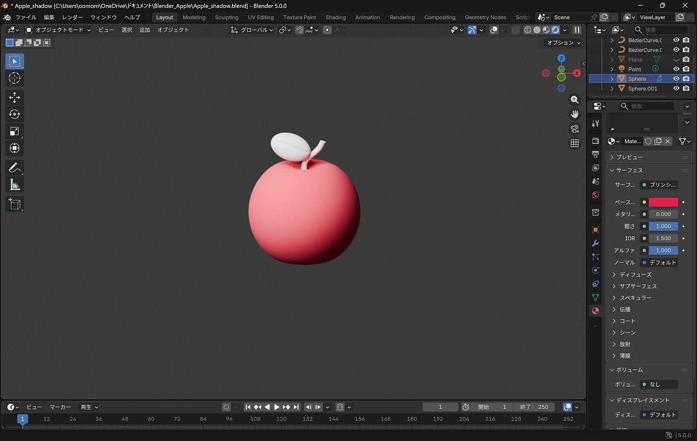

今回はさらさらの質感に設定しました。数値の違いでここまでリアルに質感が変わるのがとても面白かったです。

次回はこのりんごを複製してマテリアルを設定することで、さまざまな色や質感を表現していきたいです。

【みわ】

私は前回、チョコレートケーキの土台となるスポンジ部分を作りました。

今回はホイップクリームと色付けを進めてみました。

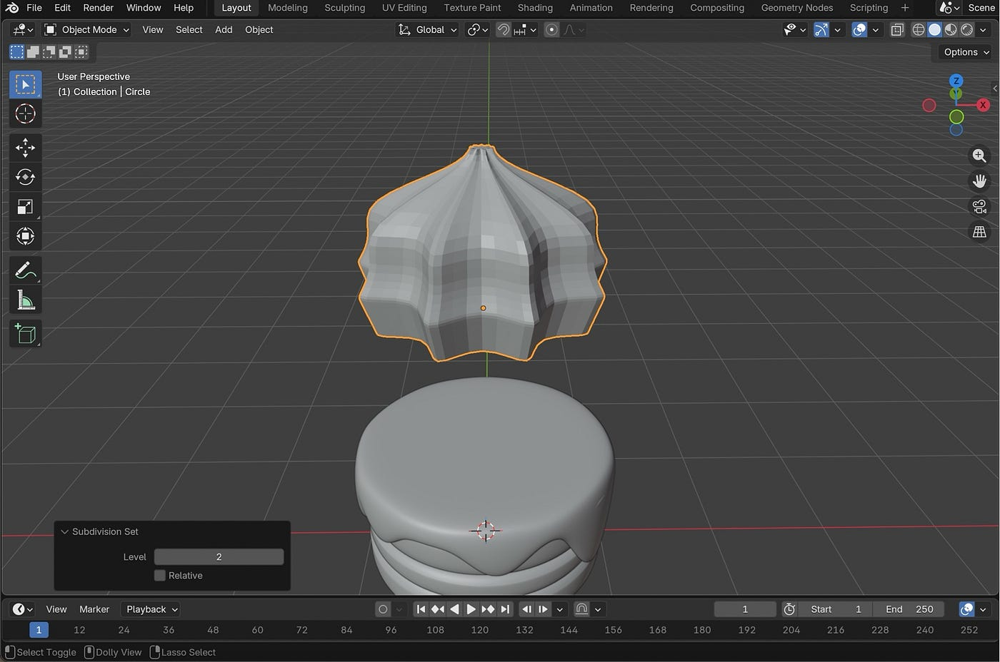

ホイップクリームのモデリングでは、クリームを巻いたような段を作る部分に少し苦戦しました。1段目の方が大きく巻かれるようにした分、2段目で変に段をつけすぎると粗さが出てしまうことに気付きました。

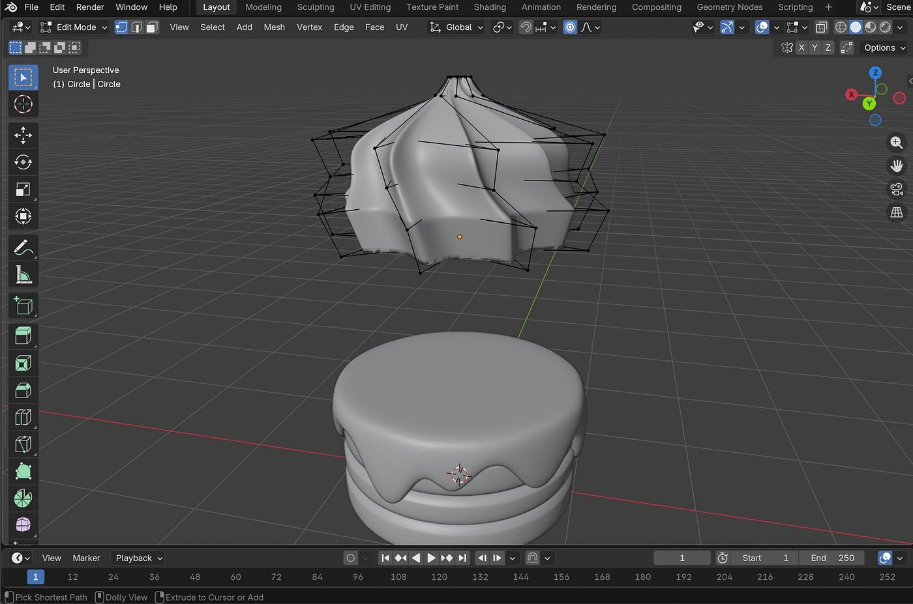

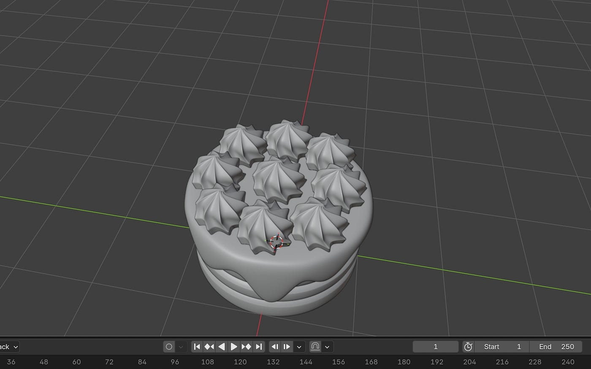

ホイップクリームにはねじりも加えました。（プロポーショナル編集をONにし、頂点をRキーで回転）大体半周〜1周の間にするとリアルな巻きが完成しました！

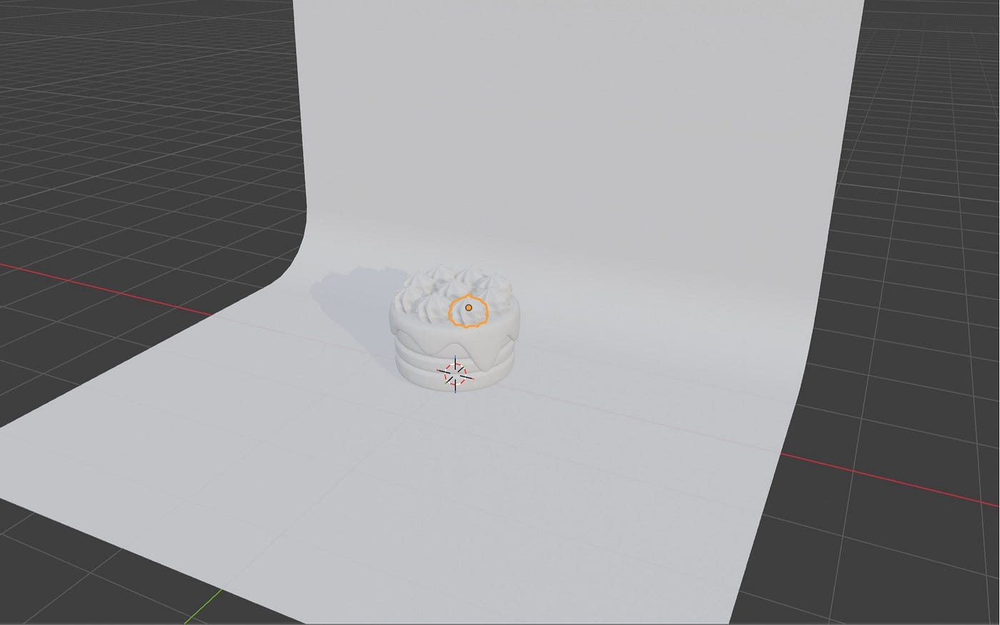

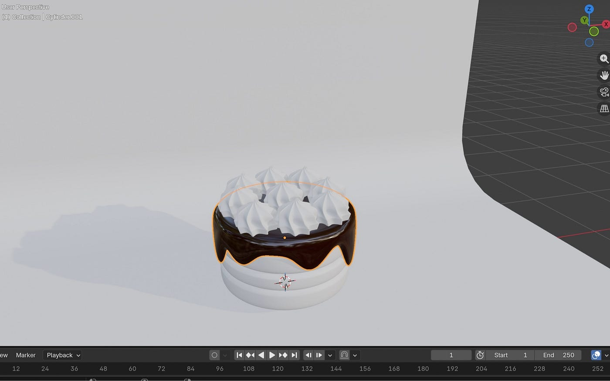

色付けの作業では、粗さをポイントにしてみました。

ツヤのある質感にしたいチョコレート部分は粗さを0.1に下げ、ホイップクリームやスポンジ部分は粗さを強くするために0.8にしてみました。

色付けは自分好みで調整できたので楽しかったです。次回はライトを当てる作業を進めてみようと思います！

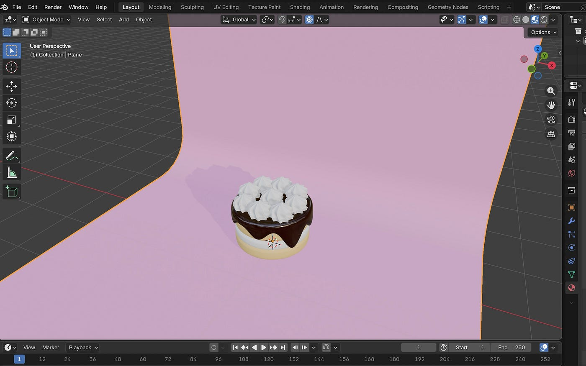

**今週の振り返り**

前回よりもさらに形が出来上がりつつあります！マテリアルの作業によって色がつくと、より一層完成形に近づいている感じがあり、それぞれの成果物ができあがるのがとても楽しみです。

来週も、これまでBlender操作で学んだ動かし方やショートカットキーなどを振り返りBlenderの作業をすすめていきます！

**グラレコ(みわ)**

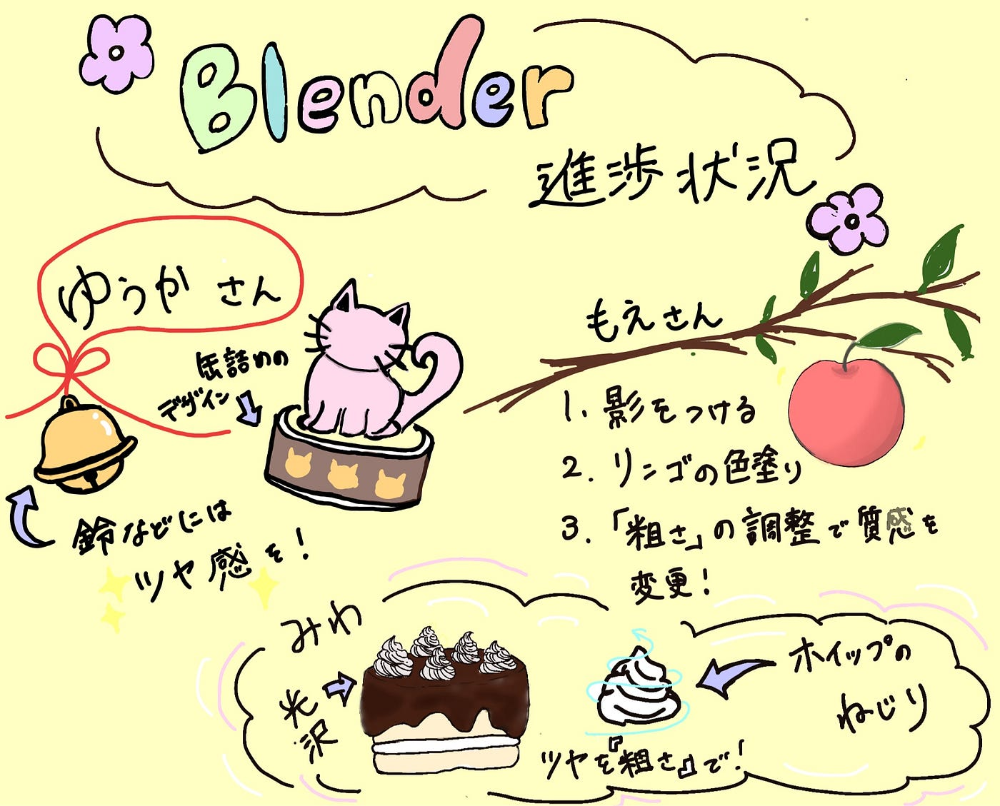
