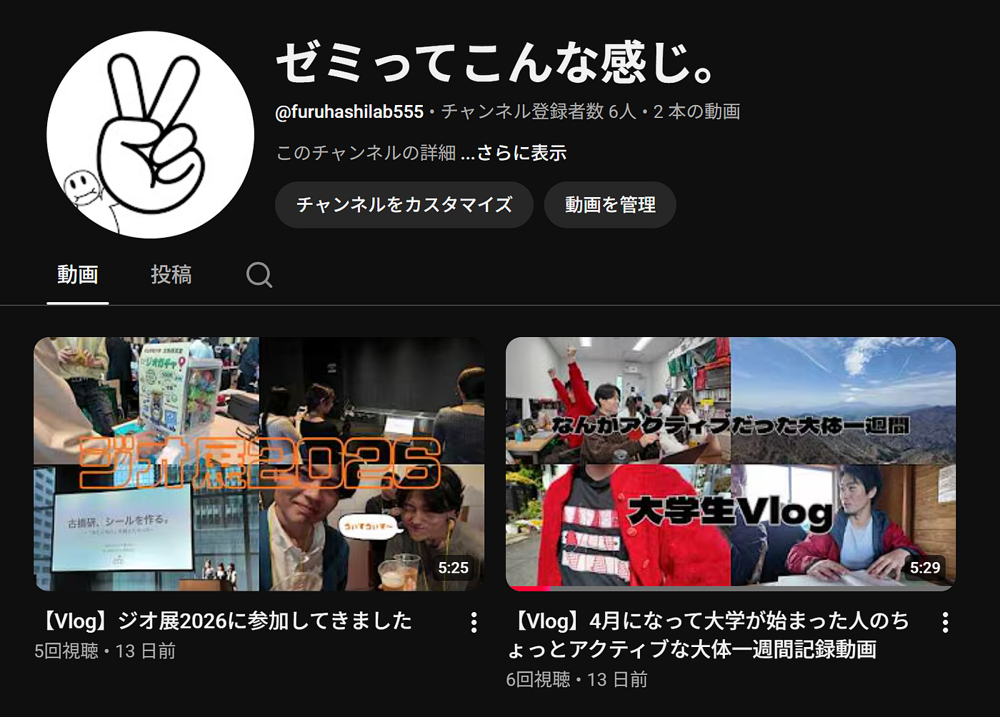
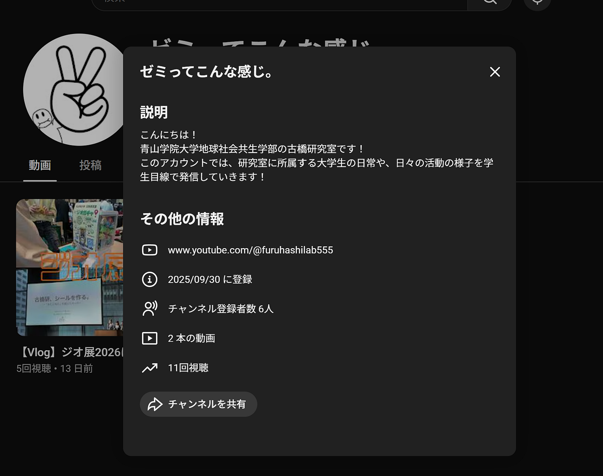
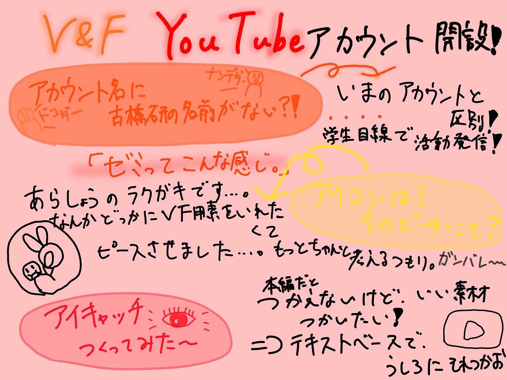

### 【6/8 V&F週報】YouTubeアカウント開設！したけどやらなきゃいけないことがたくさん、、、

こんにちは！V&Fの荒川です。気づいたら6月になっていて気づいたら前期の終わりも近くて、そのうち気づいたら卒業しているんだろうなと思うと寂しいので、1日1日をガムのように噛みしめて生きていきます。ハイ。

#### YouTube開設しました！

何本か動画を載せてから報告・拡散しようと思っていたのですが、一先ず報告です。

[アカウントリンク](https://www.youtube.com/@furuhashilab555)

タイトルにも書いた、やらなきゃいけないことがたくさんっていうのはこのアカウントの設定関連なんです。

アカウント名やアイコンをもう少し詰めていきたいと思っています。

アカウント名に関しては、既存の古橋研究室アカウントとの差別化を狙って、あえて「古橋研究室」の名前を使うのを避けています。ただ、普通に「誰こいつら？」とはなるのでチャンネルの説明欄であったり動画の説明欄にはちゃんと青学の古橋研究室だよーと記載しています。

アイコンはもう私のお絵描きです。これに関してはもっとちゃんと設定するつもりです頑張ります。一応今のアイコンは、V&FのVをイメージしてみていますが、もっとちゃんと作りたいなと思っていますはい。

#### アイキャッチ作ろうか

ここからは動画の内容の話に移ります。この前のゴールデンウイークの横瀬の動画を編集してみたときに感じたのですが、やっぱりアイキャッチが必要だなと。(横瀬の動画はすっごく適当に撮りすぎて作品にならなそうです本当にごめんなさい）私がよく撮るVlog形式の動画って、ずっとカメラを回しているわけではないので、シーンの切り替わりが突然なことが多いです。アニメーションを入れる手もあるのですが、クリップが短いと不自然な印象になるので、今回は簡単なアイキャッチを作ってみました。

アイキャッチって何？という方は、この方の記事を読んでみてください！

[【YouTuber必見】アイキャッチの重要性と作り方のコツ【現役ゲーム実況者が解説】｜とりつめブログ](https://torinotume.com/eye-catching/)

YouTubeでよく見かけるのは、1つのクリップとして作成しているものが多いのですが、今回は少し別のやり方で作ってみました。

いつも、「このシーン良いけど動画には使えないなー」ってものがあるので、それを活かせるようなものを簡単に作ってみました。

背景透過処理をしているので、1つのクリップとして重ねて使用できます。

使用イメージこんな感じです。

文字とSEだけの簡単なものですが、動画の雰囲気や流れを残したまま使用できるのは利点かなと思います。ただ、文字にエフェクト付けないと背景素材によっては見にくいので、そこは調整が必要です。

こんな感じで、ちょっとまだまだやらなきゃいけないことは多いですが、とにかくたくさん投稿していこうと思います！皆さん拡散お願いします是非！あと、動画の企画案とかもあったらください！結構ネタ不足。

