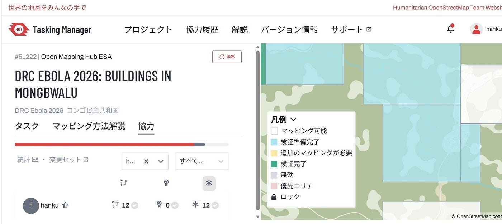
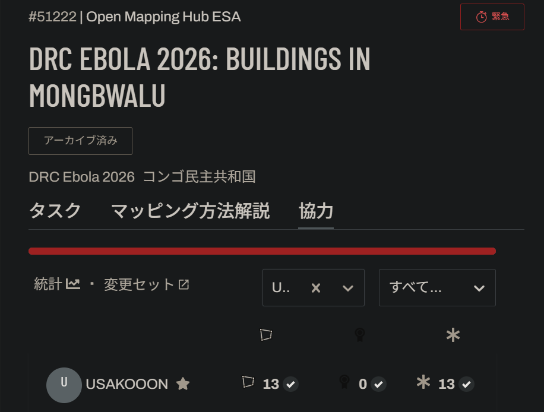
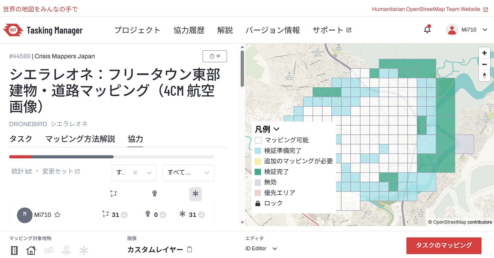
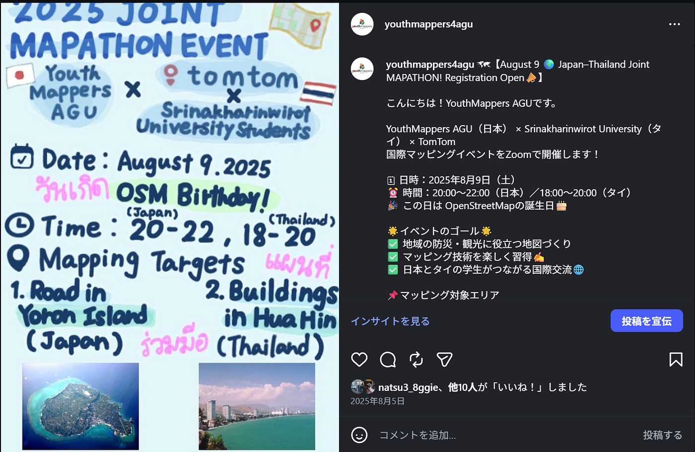
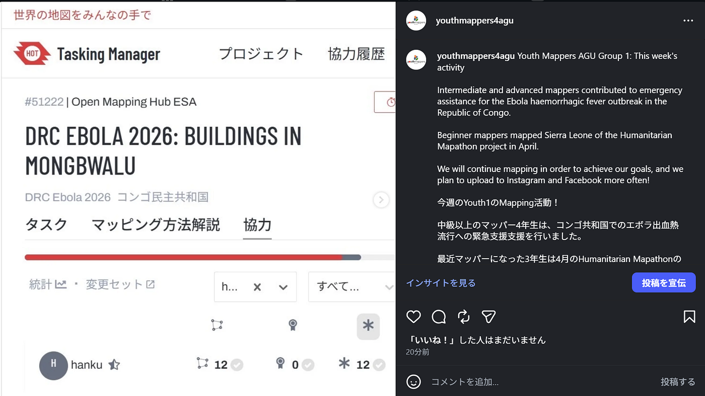
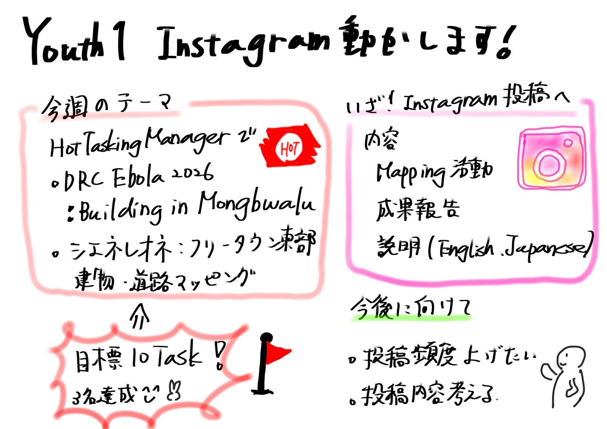

### 【6/8Youth 1】Instagram動かします！

今週も、Youth1はマッピング活動を行いました。その活動をInstagramに挙げて、もっと更新頻度を増やしていこう！というのが今週のテーマです

今回、マッピングした内容は以下の2つです。

### DRC Ebola 2026: Buildings in Mongbwalu

プロジェクト[URL](https://tasks.hotosm.org/projects/51222/)

#### 目的

2026年5月にコンゴ民主共和国（DRC）イツリ州で発生した **エボラ出血熱（Bundibugyo ebolavirus）流行への緊急対応支援**として、
 **Mongbwalu 周辺の建物を OpenStreetMap にマッピングするプロジェクト**。

MSF（国境なき医師団）が以下の用途で OSM データを活用するための基盤整備が目的：

- 物資配送ルートの最適化（道路アクセスの制約把握）

- セキュリティマッピング（移動経路・代替ルート）

- 患者の出身地・感染ホットスポットの特定

- 村落・コミュニティの位置補正

- 都市の基本地図整備（現地チームのオリエンテーション用）

#### 背景

- 2026年5月：DRC で **17回目のエボラ流行**が発生

- 5か月前に終息したばかりの前回流行から短期間で再発

- イツリ州から北キブ州、さらにウガンダの首都カンパラにも輸入症例

- Bundibugyo株のため **有効なワクチン・治療法が確立されていない**

- WHO は 2026年5月16日に **PHEIC（国際的公衆衛生上の緊急事態）**を宣言

- 6月2日時点で **61名の死亡**が確認

#### マッピング内容

- 対象：**建物（Buildings）**

- 画像：Bing

- マッピングレベル：Intermediate 以上

- プロジェクトはすでに **100% マッピング・検証済み**

#### 運営

- 作成：SColchester

- コーディネート：Open Mapping Hub ESA

- 検証：HOT Global Validators、MSF Validators など

### シエラレオネ：フリータウン東部 建物・道路マッピング（4cm 航空画像）

プロジェクト[URL](https://tasks.hotosm.org/projects/44589#description)

#### 目的

シエラレオネの首都フリータウン東部において、
 **超高解像度（4cm）航空画像を用いて建物と道路を詳細にデジタイズすること**が目的。

このマッピングは以下の取り組みを支援：

- 急速に拡大するインフォーマル居住地の把握

- 洪水・地すべりなどの災害リスク評価

- インフラアクセスの分析

- 都市計画・防災計画の基礎データ整備

- コミュニティ主体のレジリエンス向上

#### 対象地域

- **Youyi Highway × Bai Bureh Road 付近のフリータウン東部**

- 丘陵地と低地に沿って高密度居住地が広がるエリア

- OSM では未マッピングの建物が多く、詳細なデータ整備が必要

#### マッピング内容

- **建物（すべて）**

- **主要道路・副次道路**

- 使用画像：**4cm 航空画像（HOT & 現地パートナー撮影）**

- マッピングレベル：Beginner 以上

- 検証レベル：Intermediate 以上

#### 教育・コミュニティ面での意義

- CrisisMappers Japan のもと、
 **青山学院大学の学生に体系的なマッピング経験を提供する教育プロジェクト**

- シエラレオネのオープン地理空間データ整備にも貢献

#### 運営

- 作成：MAPconcierge

- コーディネート：Crisis Mappers Japan

### 成果報告

ふうかとひなこは中級以上のマッパーなのでコンゴのプロジェクトに挑戦！

みなと、さくらは4月のHumanitarian Mapathonのシエラレオネのプロジェクトをマッピング。

目標：10 Task

ふうか

ひなこ

みなと

さくら：トラブル発生(´;ω;｀)、来週頑張ります！

### いざ！Insatagram投稿へ

前回の投稿が、、、？

2025年8月5日！！

今年はもっと更新頻度高めたいです！

そこで早速、Youth1のマッピング活動をあげてみることにしました。

それぞれの協力数のスクリーンショットと活動内容を簡単に英語と日本語で説明というシンプルな内容になりました。

今後は、どのような内容で投稿するべきか考えてあげていこうと思います。

グラレコ

