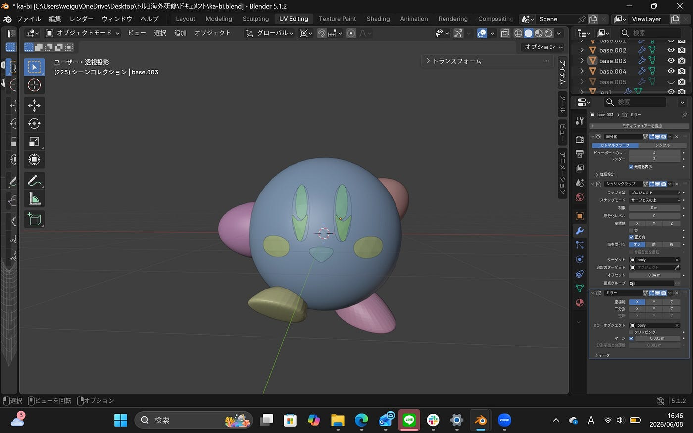
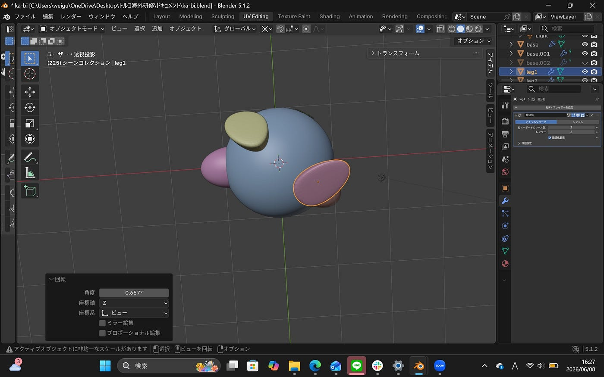
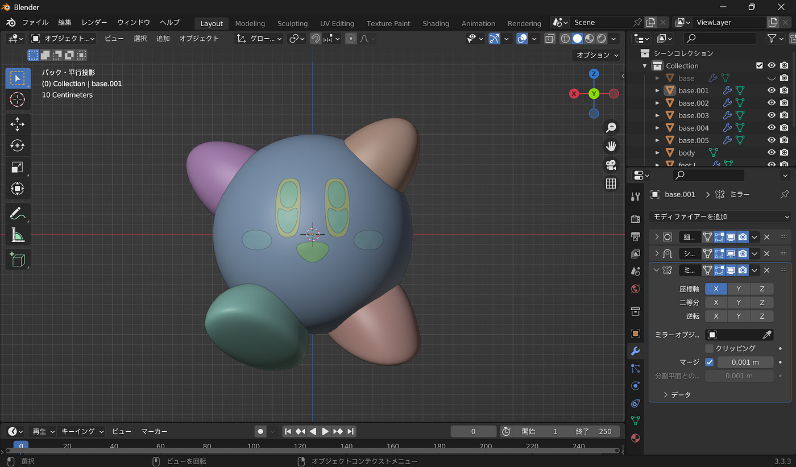
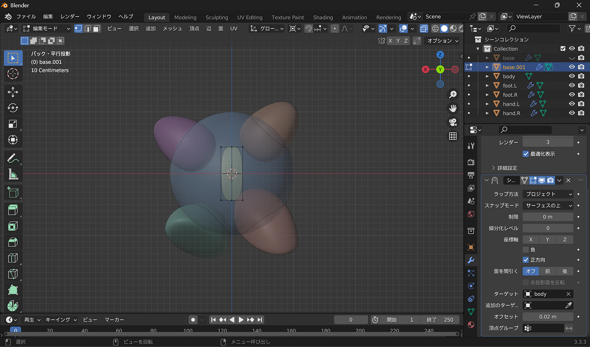
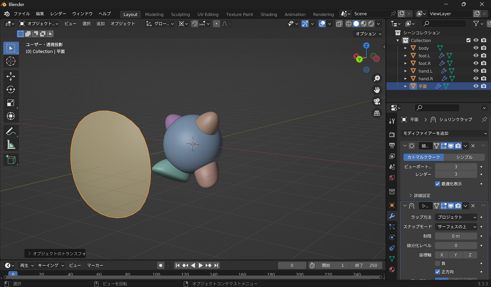
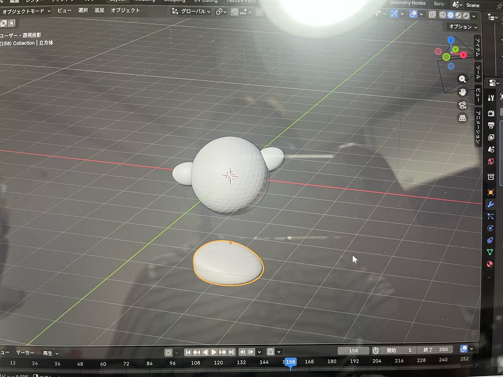
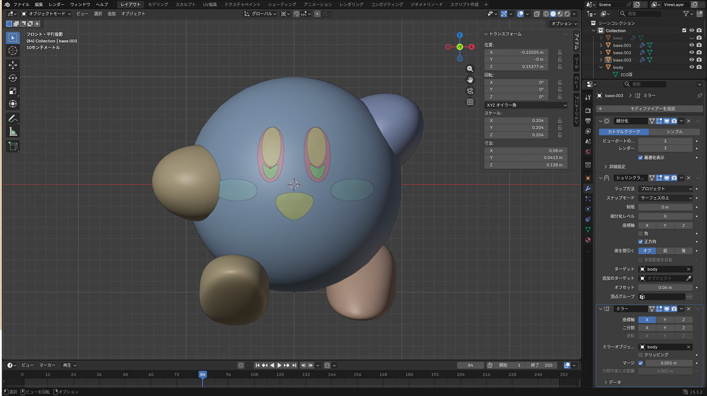
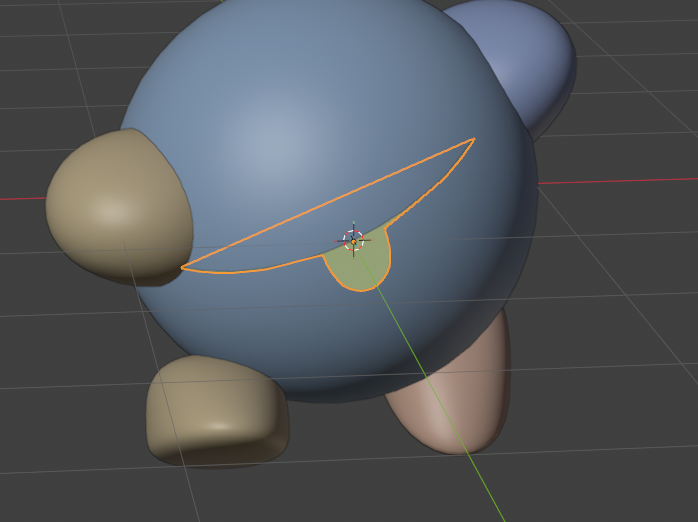
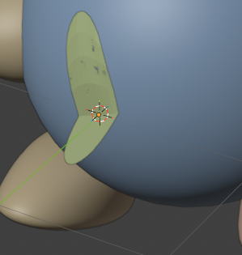
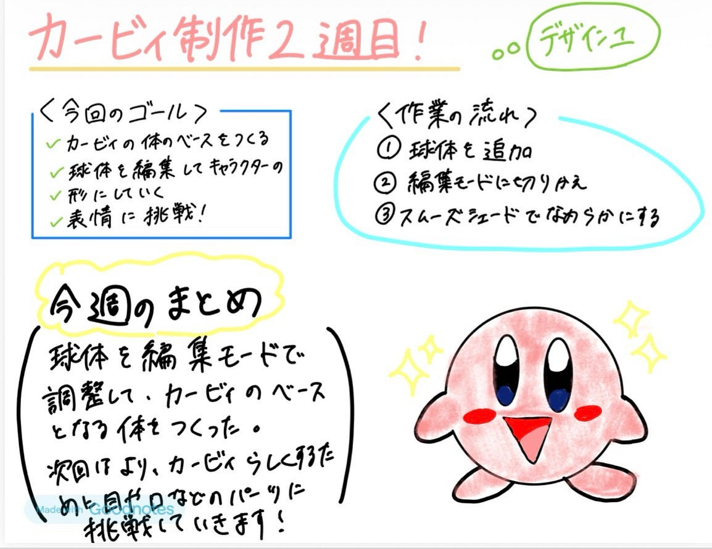

## 【design1】カービィ制作2週目！

こんにちは。4年の小崎です。design1では数週間にかけてそれぞれカービィをBlenderで作ってみよう！というプロジェクトを行っています。

今週はその進捗報告です。

**みひろ**

今週はカービィのモデリングと表情まで進めました。完成系は以下の通りです！

カービィっぽくできているのでしょうか……？ 他の人の完成作品を見ると、自分のカービィはどこか違うような気がしています…

制作中はカービィのイメージがあまり湧かず、YouTubeの解説を見ながら作業を進めていたため、公式のカービィとの違いが出てしまったのかもしれません…

しかし、実際に作ってみたことで、シンプルに見えるキャラクターほど細かなバランスや形の調整が重要であることを学びました。今後は公式のデザインも参考にしながら、よりカービィらしい表現を目指していきたいです。

足のモデリングに苦戦し、左右で大きさが違ってしまいました。YouTubeを見ながら作業に集中していると、カービィ全体のバランスを見る余裕がなくなり、気付かないうちに足の大きさや位置に差が出てしまいました…

今回の制作を通して、部分だけでなく全体を見ながら調整することの重要性を学びました。

**ちはな**

今週の完成形はこちらになります。

中々上手くできた気がします！

こだわりポイントは、カービィの公式イラストを見ながらパーツを似せた所です。

[星のカービィポータル
「星のカービィ」の公式ポータルサイトです。www.kirby.jp](https://www.kirby.jp/)

↑の星のカービィポータルのトップに表示されているカービィの目は、作品により多少異なりますが、楕円というより角がかなり丸い長方形のイメージです。

そこで、目のパーツを分割することによってサイトに載っているカービィに近い形で再現しました。

以前ブレンダーに触れたことがあったので、操作にはそこまで苦労しませんでしたが、表情を作る場面で、ctrl+A→「回転-スケール」を選択した所でなぜかパーツが体の表面に沿わなくなってしまうという事態に陥りました。

結局何度か作り直して、最初に平面を90度回すときに回す向きを変更したら上手くいきましたが、原因が分からず大変でした。

来週は色付けになるので、更にカービィがかわいくなるように頑張りたいです！

**かのこ**

今回、私は初めてBlender を使いました。

初めてのことだらけでものすご〜く苦戦しました。笑　まず、あまりにも画面表示の多さに驚き、どこを見ればいいのか、何を操作したらいいのかで動画を見つつ作業したものの、体と手足をつけるまでに2時間以上かかりました。そもそも私のパソコンはノートパソコンなのでテンキーをどこで代用するかから始まったり、右クリックしてもなかなかオブジェクトの表示が出てこなかったりで初期の時点でいっぱいいっぱいになりました。

特に足を作る作業が大変で足の角度や画面の見え方を変えたいのに全然違う表示になったりと混乱しました。

その後の表情の型を作るところでもなかなか動画の通りにならず、つまずきながら何度も何度もやり直してやっと今週の目標まで終わりました。

私はこのカービィを作るのと同時にBlender の基本操作からも学ばないといけないと思い、これからカービィ作成と同時に進行していきたいと思います。

**みあ**

今週の進捗はこちらです。工夫したところは、目のハイライトを少し横長に伸ばしてハートっぽくしたところです！全体的にパーツに丸みをつけたことで本家よりもちょっと幼い感じになった気がします。かわいい！

私もちはなと同じで、目のパーツを作るときにうまく表面に沿ってくれずに1時間くらい格闘しました（ ; ; ）

原因はカーソルを途中で動かしてしまっていたことだったので、原点に戻してやり直したらうまくいきました。

今後の予定

来週は色付けを各自好きな色で行おうと思います！

グラレコ

