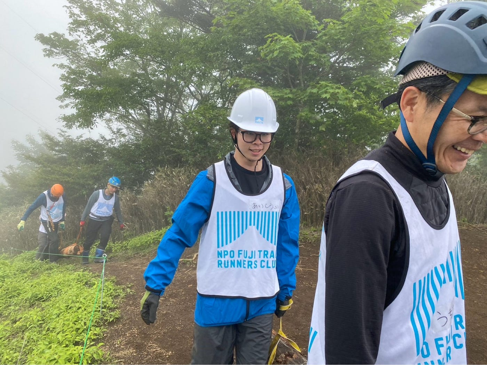
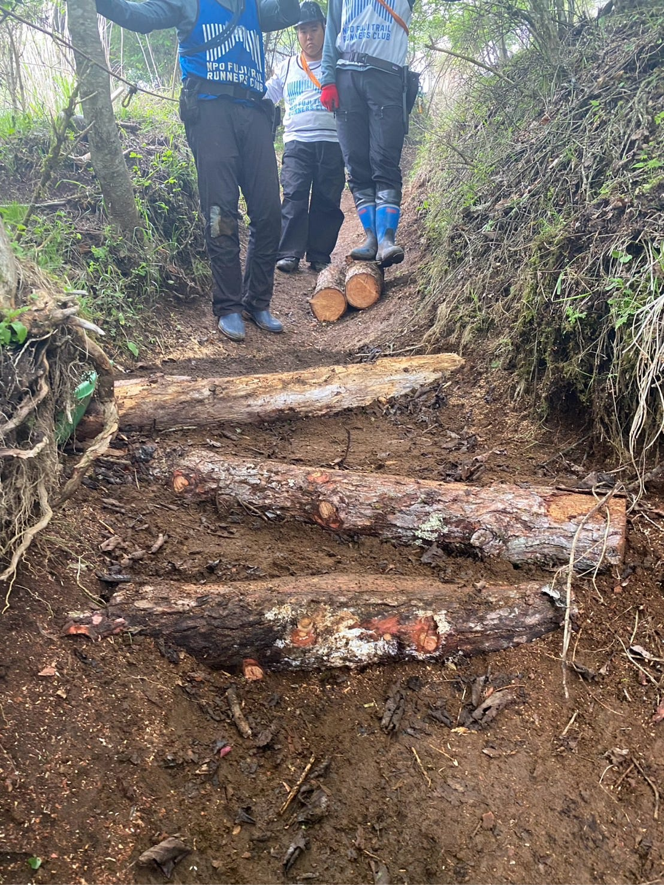
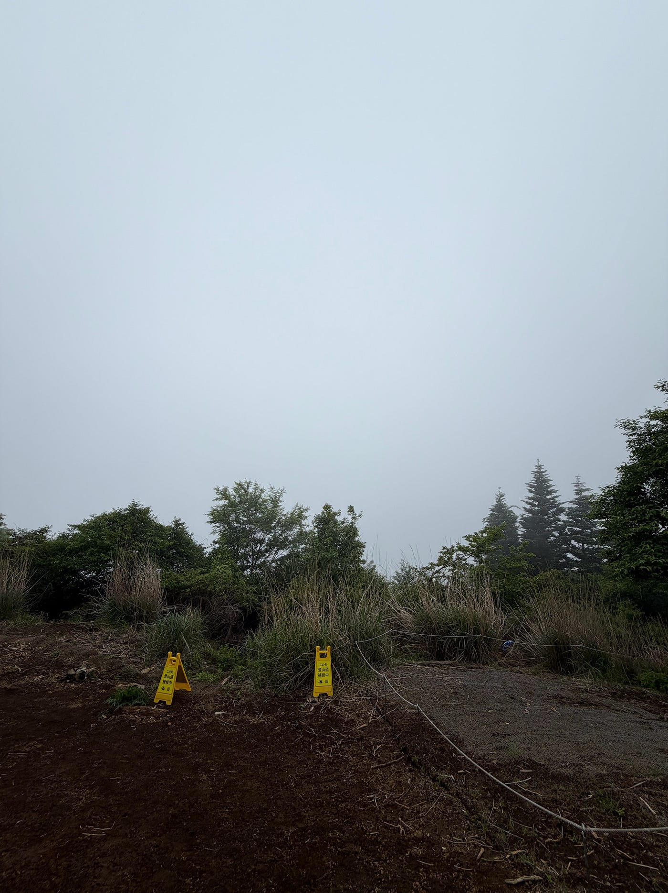
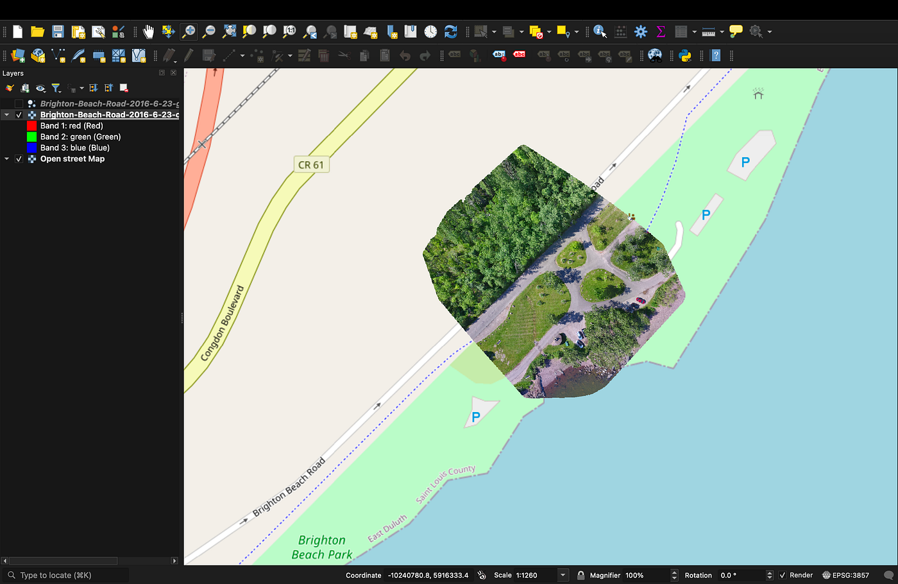
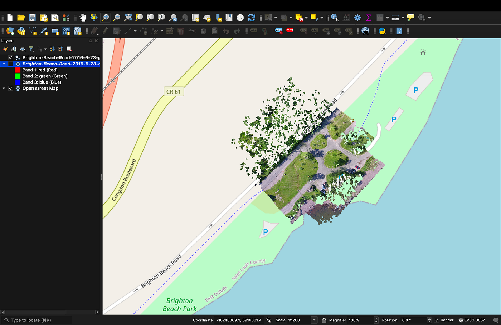
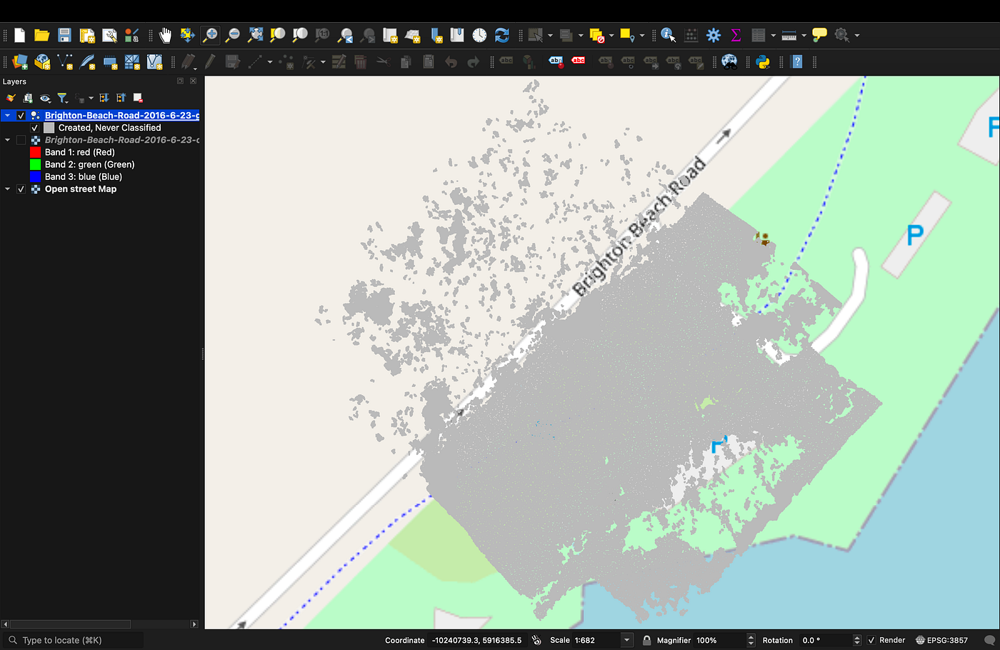
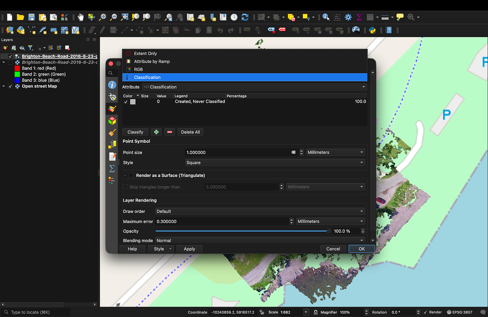
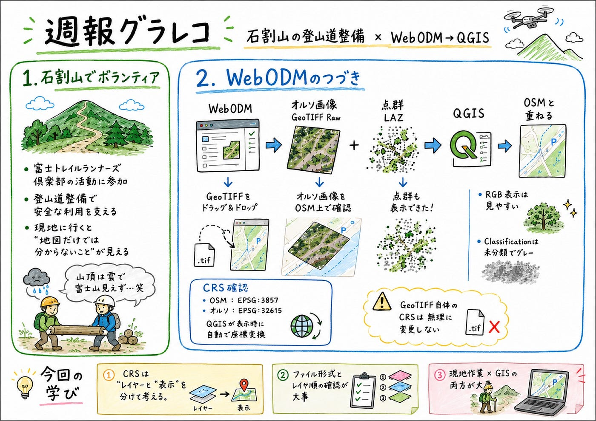

### WebODMで生成したオルソ画像・点群データをQGISに読み込んでみた

こんにちは！ドローン部2の愛甲です！

**突然だけど山に行ってきました！**

先週末、富士トレイルランナーズ倶楽部の方々が実施している石割山の登山道整備活動に、ボランティアとして参加しました。今回は、父が専門家として活動にお声がけいただいたことをきっかけに、自分も同行する形で参加しました。

(ツリーハウス合宿ぶりの丸太運び。)

[NPO法人 富士トレイルランナーズ倶楽部
「富士トレイルランナーズ倶楽部」は、富士山麓の自然環境を守り、登山道の整備や保全活動に取り組むNPO法人ですfuji-trailrunnersclub.com](https://fuji-trailrunnersclub.com/)

石割山(山梨百名山:標高1,413m)は登山者に限らず、トレイルランナーにも多く利用される山であり、多くの人が安全に通行できる環境を維持するためには、登山道の整備が欠かせません。今回は、実際に現地に入り、登山道の状態を確認しながら、利用者が歩きやすくなるように整備作業を行うのが主な活動でした。

普段、登山道や自然の中の道を利用する際には、整備された状態を当たり前のように感じてしまいがちです。しかし、今回の活動を通して、その道が地域の方々やボランティアの継続的な作業によって支えられていることを実感しました。また、自然環境を守りながら、人が安全に利用できる道を維持することの難しさや重要性についても学ぶことができました。NPOの方の、「この活動を始めてもう5年になるが、登山道整備によって周辺の植生が徐々に回復していく姿、変化を体感できるのはとてもおもしろい。」という発言が、今まで自分になかった視点だったので共有してみます^^

たった1日の経験でも、現地の状況を実際に歩いて確認することは、地図やデータだけでは分からない課題を理解するうえでとても重要であることを再認識できました。今後も、現地での活動やフィールドワークを通じて、地域の環境やインフラを支える取り組みについて理解を深めていきたいです。

(山頂から正面に富士山が見えるはずが一面雲に覆われてた泣)

[朝のウォーキング | Strava
View Tomoya Aiko's Walk on June 7, 2026 | Stravawww.strava.com](https://www.strava.com/activities/18819056855)

#### さて、先週の続き↓

先週はあきさんが、WebODM上でサンプルのドローン画像をアップロードし、Fast Orthophoto設定で処理を実行し、オルソ画像と点群を生成するところまでやっていただいたので、今回は、オルソ画像をQGISに読み込み、OpenStreetMapの背景地図と重ね合わせて表示できるかを確認しました。あわせて、WebODMから出力された点群データであるLAZ形式のファイルについても、QGIS上で表示できるかを確認しました。

今回の作業では、以前自分のMac上で作成していたQGISプロジェクトを使用しました。このプロジェクトにはすでにOpenStreetMapが背景地図として追加されており、プロジェクトCRSはEPSG:3857（WGS 84 / Pseudo-Mercator）として表示されていました。

**CRSとは、地理空間データを地球上の位置に対応させるために、測地系・投影法・座標単位などを定義した座標参照系。**

その状態で、WebODMから出力したGeoTIFF形式のオルソ画像をQGISにドラッグ＆ドロップで読み込みました。読み込んだオルソ画像は、GeoTIFFに含まれている座標情報によって、**EPSG:32615（WGS 84 / UTM zone 15N）**として自動的に認識されました。

このとき、OpenStreetMapは**EPSG:3857**、オルソ画像は**EPSG:32615**という異なるCRSでしたが、QGISが表示時に自動で座標変換を行うため、オルソ画像をOpenStreetMap上に重ねて表示することができました。つまり、GeoTIFF自体のCRSをEPSG:3857に変更したわけではなく、元データのCRSであるEPSG:32615を維持したまま、QGIS上で表示確認を行いました。

このことから、OpenStreetMapと重ねて確認する場合でも、オルソ画像自体のCRSを無理に変更する必要はなく、QGISがプロジェクトCRSに合わせて表示上の変換を行ってくれることを確認しました。

次に、QGIS上でオルソ画像が正しく表示されているかを確認しました。読み込んだGeoTIFF形式のオルソ画像は、レイヤパネル上でOpenStreetMapより上に配置しました。QGISでは、上にあるレイヤほど前面に表示されるため、オルソ画像を上、OpenStreetMapを下にすることで、背景地図の上にWebODMで生成したオルソ画像を重ねる形にしました。

オルソ画像を表示した結果、OpenStreetMap上の道路や海岸線と重ねて確認することができました。完全に一致しているかを測量精度で判断するのではなく、今回はWebODMから出力されたGeoTIFFがQGIS上で位置情報を持ったGISデータとして扱えるかを確認することを目的としました。そのため、オルソ画像がOpenStreetMap上の対応する場所に表示されたことから、WebODMの成果物をQGISに取り込む基本的な流れを確認できました。

次に、WebODMから出力されたLAZ形式の点群データもQGISに読み込みました。LAZファイルは、WebODMのダウンロード項目から取得し、QGISの画面上にドラッグ＆ドロップする形で追加しました。読み込み後、左側のレイヤパネルに点群レイヤが追加され、オルソ画像と同じ範囲に表示されました。

点群データは、オルソ画像のような一枚の画像ではなく、地表や樹木、道路などを点の集合として表すデータです。そのため、QGIS上では面として表示されるオルソ画像とは異なり、細かい点が集まったような見た目になりました。今回、点群データがオルソ画像と同じ位置に表示されたことから、WebODMで生成されたLAZ形式の点群データもQGIS上で扱えることを確認できました。

また、点群レイヤの表示方法も変更して確認しました。点群レイヤを右クリックして「プロパティ」を開き、「シンボロジ」から表示方法を変更しました。RGB表示では、点群に写真の色が反映され、木や道路、芝生などの様子が比較的分かりやすく表示されました。

一方で、Classification表示に変更すると、点群全体がグレーで表示されました。Classification表示では、本来であれば地面、樹木、建物などの分類ごとに色分けされる場合があります。しかし、今回の点群データでは分類情報がすべて「Created, Never Classified」となっており、地面や樹木などの分類が付与されていませんでした。そのため、Classification表示では全体が単一色で表示されました。

このことから、LAZ形式の点群データ自体はQGIS上で表示できる一方で、分類情報が含まれているかどうかによって、表示や分析のしやすさが変わることが分かりました。今回のデータでは分類情報が付与されていなかったため、Classification表示よりもRGB表示の方が視覚的に分かりやすいと感じました。

今回の作業手順を整理すると、以下のようになります。

1. 以前作成していたQGISプロジェクトを開く

1. 背景地図としてOpenStreetMapが表示されていることを確認する

1. WebODMから「オルソ画像 / GeoTIFF Raw」をダウンロードする

1. GeoTIFF形式のオルソ画像をQGISにドラッグ＆ドロップする

1. オルソ画像のCRSがEPSG:32615として認識されていることを確認する

1. OpenStreetMap上にオルソ画像が重ねて表示されることを確認する

1. WebODMからLAZ形式の点群データをダウンロードする

1. LAZファイルをQGISにドラッグ＆ドロップする

1. 点群データがオルソ画像と同じ範囲に表示されることを確認する

1. 点群レイヤの表示方法をRGBやClassificationに変更して確認する

今回の作業を通して、WebODMで生成した成果物をQGISに読み込む基本的な流れを確認することができました。特に、GeoTIFF形式のオルソ画像については、元データのCRSを維持したまま、QGIS上でOpenStreetMapと重ねて表示できることを確認できました。また、LAZ形式の点群データについても、QGIS上で読み込み・表示が可能であることを確認しました。

今回の作業では、WebODMで生成したデータをQGISに落とし込む際に、ファイル形式、CRS、レイヤ順、点群の表示方法などを一つずつ確認しながら進めました。単にデータを読み込むだけでなく、GISデータとして扱うためには、各データがどのCRSを持ち、QGIS上でどのように表示されているのかを確認することが重要だと感じました。

#### ドローン展のみんなの感想！

れあら
私はドローン展でSoraBaseのブースが印象に残りました。遠隔地から有資格者が操縦し、リアルタイムで映像やデータを提供できる点に驚きました。災害時の状況確認や河川・水道施設の点検など、社会に役立つ活用方法が多いことを知りました。今回の展示を通して、改めてドローンは空撮だけでなく、防災やインフラ管理にも大きく貢献する技術だと分かりました。

ゆうと
ドローンと聞いてまず思い浮かぶのは、4つのプロペラを備えたラジコンのような機体だ。しかし、ドローン展では巨大な固定翼機や、プロペラの角度を自在に変えられる機体など、用途ごとに特化した多様なドローンが展示されており、そのフォルムを見てるだけでも面白かった。
中でも特に印象に残ったのは、建築物の外壁点検を行うドローンである。従来は人が足場や高所作業車を用いて実施していたが、このドローンは建物周辺の障害物の影響を受けにくく、効率的かつ安全に点検を行えるという。今後も思いがけない分野で活用が広がっていくのだろうと感じた。

あき

Japan Drone展に参加し、ドローン産業の広がりを実感した。特に印象的だったのは、物流・測量・点検といった民生用途だけでなく、監視や警備など軍事転用も可能な製品が増えていた点である。また、アジアパビリオンが充実しており、各国企業の技術力や市場拡大への意欲を感じた。ドローンが社会インフラとして定着しつつある一方で、安全保障や規制の重要性も強く意識した展示会だった。初日の台風後に行ったので風と格闘した。

#### 来週

来週は横瀬ドローン合宿に向けての準備

Aiでどこまで作業短縮できるか検証

#### グラレコ

ChatGPT（GPT-5.5 Thinking）でグラレコ化
