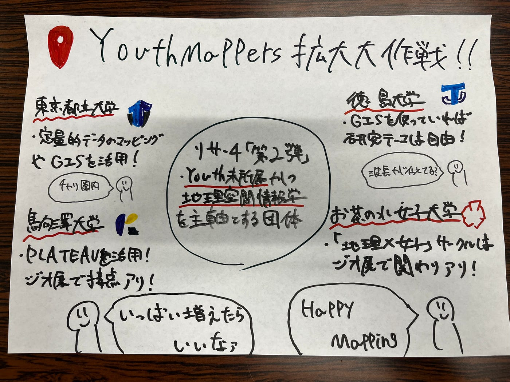

### 【Youth2週報】勝手に他の大学調べてみた件

みなさんこんにちは！Youth2、4年の加藤です。Spotify for Developersが改悪アップデートを起こしたせいで僕の考えていた卒論にピンチが迫っています。助けてください。マジで。本気で。

ということで我々は日本国内のYouthMappersを増やそう大作戦をひしひしと遂行しているわけですが、先週の週報ではれあらがYouthMappers Chapterに所属している大学であったり、International Humanitarian Mappathonに参加した大学を調べてくれました。ということで今回は第二弾、YouthMappers に所属していないかつ日本国内でGIS・地理空間情報・地理学をメインに扱っている研究室や学部を勝手に調べてみました。

1. [東京都立大学 都市環境学部 地理環境学科](https://lagis.fpark.tmu.ac.jp/)

一つ目は何を言おうが我らが古橋先生の母校である東京都立大学です。今は都市環境学部地理環境学科という名前で活動しているみたいです。特に地理情報学研究室ではフィールドでの調査・観測に基づいて事実を実証的に示そうとするアプローチを組み合わせて研究を進めており、このため、定量的データの収集・マッピング・統計解析・数値モデル・GIS（地理情報システム）などが主要な研究手法となっているそうです。ただ、主に，地形・気候・水文・植生などから構成される自然環境についての総合的理解を目指している。ということなのでちょっと私たちと方向性が違うのかもと思ったりもします。まあ淵野辺から南大沢はチャリで行けるので簡単に交流できそうですね。

2. [徳島大学 総合科学部 地域デザインコース](https://www.ias.tokushima-u.ac.jp/faculty/chiikidesign/)

続いては徳島大学の総合科学部地域デザインコースです。このコースは地域社会の課題を自ら発見し、解決策を創り出す力を育む学びの場であり、本コースの最大の特徴は、学問の枠を超えた横断的なフィールド実践が可能なことです。とのこと。軽くウェブサイトを見させてもらいましたが、個性派な先生が勢揃いでめちゃくちゃ面白そう。普通に自分がもう一回受験して入学したいくらいです。まあまずは青学を卒業しますよ。という余談は置いておいて実際にこのコースには夏目宗幸先生の空間情報科学研究室があり、なんとこの研究室では「GISを使っていれば、研究テーマは自由」。ん？なんか私たちにとっては心地の良い響きが。もう一回読んでみましょう。「GISを使っていれば、研究テーマは自由」。我々とそっくりではないですか。この研究室は僕達とすごく同じ波長を放っている気がするので個人的イチオシです。

3. 駒澤大学 文学部 地理学科

次は駒澤大学文学部地理学科です。この地理学科には[地域文化研究専攻](https://think.komazawa-u.ac.jp/faculty/letters/geo-cult/)と[地域環境研究専攻](https://think.komazawa-u.ac.jp/faculty/letters/geo-env/)という二つの専攻があり、前者では地域に隠された秘密を様々な方法を駆使して解き明かす学びを深めており、授業でPLATEAUやさまざまなGISを使っているとか。一方後者は人と自然の関わりを多様な視点から総合的に捉えるそうで、どちらかというと自然地理学がメインなのかな。また、地理学科の支援のもと結成されたサークル「地理学研究会」はジオ展にも参加しており、何かと関わりは他と比べるとあるのでコンタクトしやすそうですね。

4.[お茶の水女子大学 文教育学部 人文科学科 地理学コース](https://www.li.ocha.ac.jp/ug/hum/chiriog/index.html)

最後に紹介するのはお茶の水女子大学文教育学部人文科学科地理学コースです。お茶大といえば古橋先生が授業を持っている？持っていた？大学になります。そんなお茶大の地理学コースは少人数制の授業を通したフィールドワークや都市地理学、GISを用いた授業など地理学を幅広い視点から学べるカリキュラムを用意しているそうです。このコースの4年生はなんと11人しかいないとか。びっくり！また地理好きのお茶の水女子大生が運営する学内公認サークル「地理×女子」もジオ展に出展しておりここに関しても比較的容易にコンタクトは取れそう。

ということで今回は計4校を勝手に調べて紹介させていただきました！いかがだったでしょうか？勝手に調べたらのはいいものの、取り上げた4校実際に普段はどのような活動を行なっているのか、OpenStreetMapを使ったことがあるかなど詳しい情報に関してはまだまだリサーチ不足なので、他の大学の情報も調べつつ、先生からの助言など参考に選定していきたいと思います。

