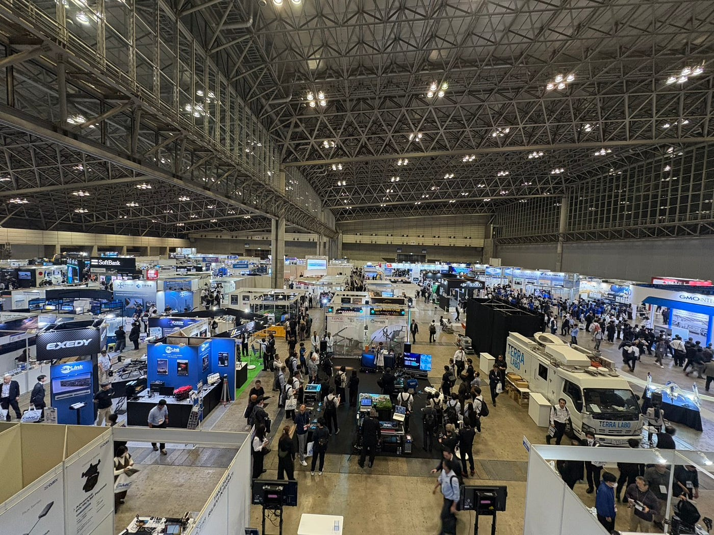
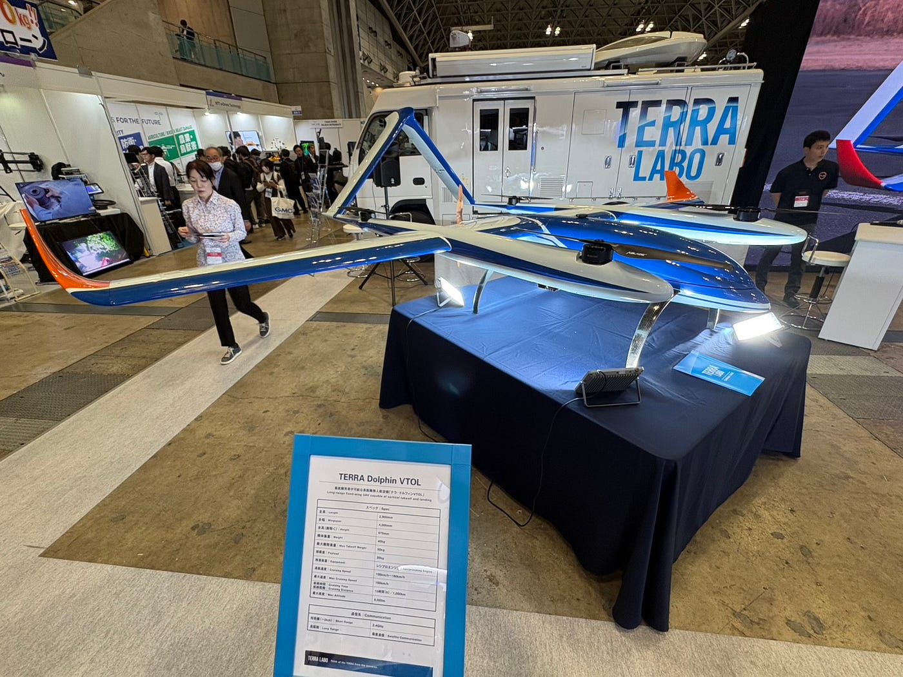
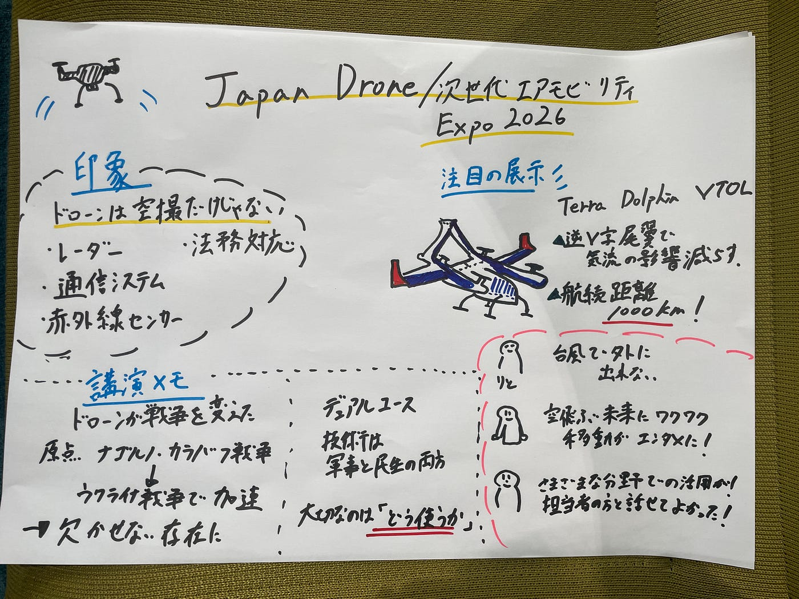

### ドローンをたくさん見てきたよ

こんにちは！

ドローン2からドローン1へ移籍した中川です。

週報の前に、、【ご報告】外貨取引大会の開会式が6月6日に行われ、今月末から大会が始まるので、noteのフォローといいねをよろしくお願いします！！

ではでは、今週のドローン部は6月3日〜5日に幕張メッセで開催された「Japan Drone/次世代エアモビリティEXPO 2026」についてです！

３年生みんなそうだと思いますが、参加する前の私は「ドローン合宿に向けて機体でも見てみるかぁ」くらいの軽い気持ちでした。

DJIの新機種が並んでいて、各社のドローンを見比べられるイベントなのかなと思っていたのですが、実際に会場へ行ってみると想像していたものとはかなり違っていて、展示の中心は機体だけではなく、、、

- レーダー

- 赤外線センサー

- 通信システム

- バッテリー

- 板金技術

- 法務・制度対応

など、ドローンを社会で運用するための技術やサービスばかりで、どちらかというとtoB？のものが多い印象でした！！

↑こちら会場の幕張メッセ。私が参加したのは6月5日です！

入場してすぐ目に入ったのは、GMOインターネットグループのかわいい人型ロボット。そしてその隣には、ひときわ存在感を放つ巨大ドローンが展示されていました！ ↓ ↓ ↓

### TERRA LABOの大型ドローン

「これ本当にドローンなのか？」というような見た目で、飛行機のような流線型をしており、一般的なドローンとは全く違う印象です。

担当者の方に話を聞くと、この機体は長距離飛行を目的として設計されているとのこと。

流線型の機体形状によって空気抵抗を減らし、さらに逆V字型の尾翼は、後方のプロペラによる乱れた気流の影響を受けにくくするために採用されているそうです。

航続距離は1000km！航空部でグライダーに関わっている身としては、こうした空力設計の話だけでもかなり面白かったです！

### 「ドローンが戦争を変えた」という話

展示を見ていると、ちょうど14時30分からTERRA LABOによる講演が行われるとのことで参加してみました。

テーマは軍事分野におけるドローン活用です。

講演の中で特に印象的だったのが、

「ドローン戦争の原点はウクライナではなく、2020年のナゴルノ＝カラバフ戦争だった」

という話でした。当時、ドローンはまだ現在ほど一般的な存在ではありませんでした。しかし、アゼルバイジャン軍は無人航空機を積極的に投入し、赤外線カメラによる偵察や敵部隊の追跡を実施しました。

その結果、劣勢ながらも制空権を獲得し、大きな戦果を挙げたとされています。その後、ウクライナ戦争ではさらにドローン活用が進み、今では現代戦を語るうえで欠かせない存在になっています。

### 技術は「軍事」と「民生」の両方で使われる

講演の中でもう一つ印象に残ったのが、「デュアルユース」という考え方です。これは軍事技術を民間利用へ転用したり、逆に民間技術が軍事利用されたりする考え方を指します。

例えば、ドローンやGPSなどがその代表例です。

ニュースでドローンを見ると軍事利用の側面が注目されがちですが、一方で災害対応や物流、インフラ点検など、私たちの生活を支える用途も数多く存在します。

技術そのものに善悪があるのではなく、どう活用するかが重要なのだと改めて感じました！

### 大学の研究ブースもかなり面白かった

企業だけでなく、大学の研究展示も数多く出展されていました。

私が発見した３大学をご紹介します！

### 東京理科大学

壁面工事向けのドローンを研究していました。なんと、ドローンで壁に穴を開ける作業を行えるというものです。

高所作業車や足場が不要になる可能性があるとのことで、建設業界の人手不足解決にもつながりそうだと感じました。ただ、話を聞いていると、このドローンを動かすための装置を壁の上部に取り付けないといけないとのことで、まだ改善の余地があるように感じました。

### 信州大学

昆虫の触角を利用して匂いを検知するドローンを開発していました。

「生きたカイコガの触角をドローンに搭載し、においの濃度と匂いが来る方向を識別しながら匂い源を探索する」という既存の技術を利用し、今回の研究ではそれを強化することを目的としていたようです！

下水やガス漏れなど、人間が近づきにくい場所の異常検知に応用したり、視界の悪い環境で匂いをもとにドローンの誘導ができるようになるとのこと。

すごい！

### 電気通信大学

インフラ点検に関する研究を展示していました。

従来の赤外線カメラだけでは分かりにくかった損傷について、3Dモデルと組み合わせて解析することで、

- 損傷箇所

- 内部構造

- 劣化メカニズム

まで可視化できるそうです。

ドローンはただ空撮するだけじゃなくて、点検とか工事もできるようになるんだ～と他大学の展示を見て感じました！

### みんなの感想

りとさん「台風がすごくて外に出るのを諦めてしまった、、」

きょうた「三菱地所の展示で空飛ぶクルマの移動時間をエンタメへ変えるビジョンに感銘を受けました！空という新たな視点を得ることで、街づくりや私たちの暮らしがどう進化するのか期待が高まりました！」

かのこ「初めてジャパンドローン展に参加し、会場の広さと来場者の多さに驚いた。一般的なドローンだけでなく、軍事利用向けのドローンや関連するコンピュータ・システムも展示されていた。普段は見たり聞いたりする機会のない技術に触れることができ、新鮮で面白かった。
ドローンは空撮だけでなく、災害対応、インフラ点検、測量、物流など幅広い分野で活用されていることを知った。
企業の担当者と直接話す機会があった。
最初は緊張したが、担当者の方が丁寧に説明してくれたため理解を深めることができた。展示を見るだけでなく、実際に話を聞くことで技術の活用方法や社会的な役割を学ぶことができた。
ドローン技術の可能性の大きさと、新しい技術を学ぶことの重要性を感じた。」

以上！

**グラレコ**

