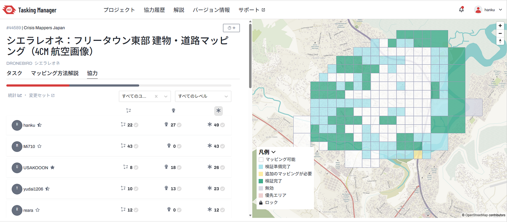
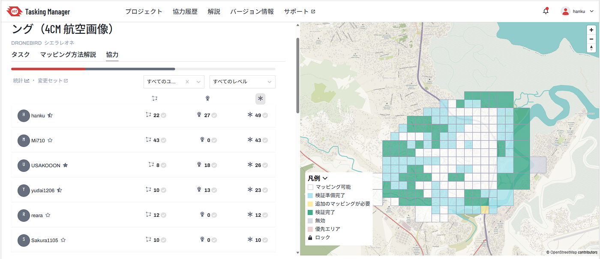
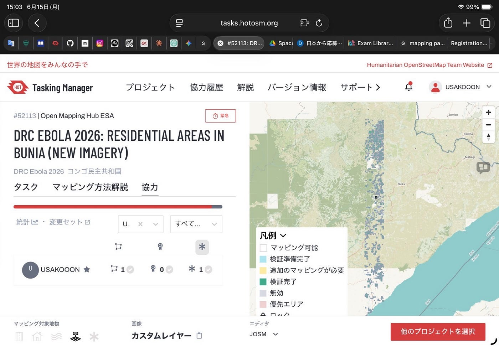
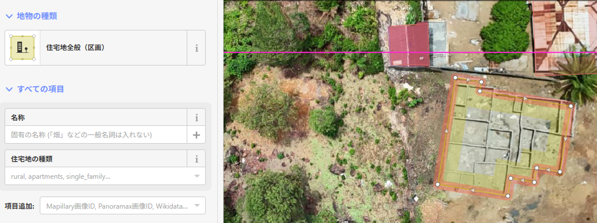
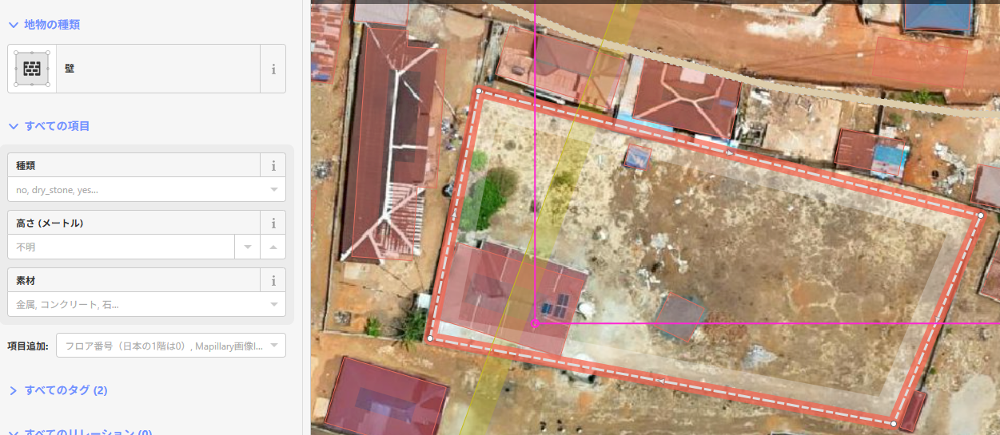
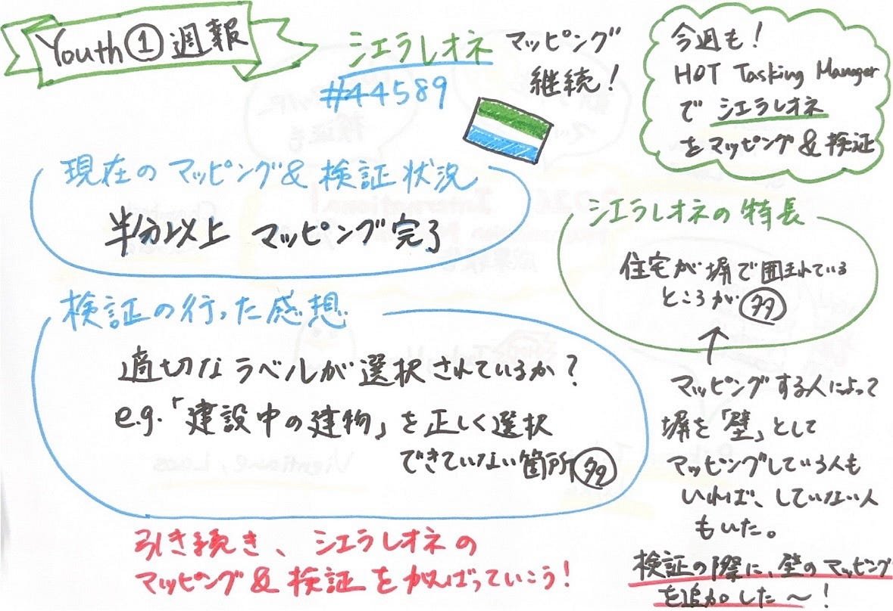

### Youth1①シエラレオネマッピング継続

こんにちは。岡村です。

今週のYouth1の週報では、先週に引き続き、[Hot Tasking Manager](https://tasks.hotosm.org/projects/44589/contributions)でシエラレオネをマッピングしました。。

#### 現在のシエラレオネのマッピング状況＆検証状況

[#44589: シエラレオネ：フリータウン東部 建物・道路マッピング（4cm 航空画像） — HOT Tasking Manager](https://tasks.hotosm.org/projects/44589/instructions)

#### メンバーの協力

#### 検証を行った感想

・適切なラベルが選択されているか、確認することが大切。
 e.g.「建設中の建物」のラベルを選択、「壁」を適切なラベルでマッピングできていないことが多くみられた。

今回、マッピング＆検証したシエラレオネの特徴として、住宅が併で囲まれているところが多かった。

マッピングする人によっては、その塀を「壁」というラベルを選択してマッピングしている人もいれば、していない人もいました。
検証の際に、壁のマッピングを追加していきました。

#### グラレコ

