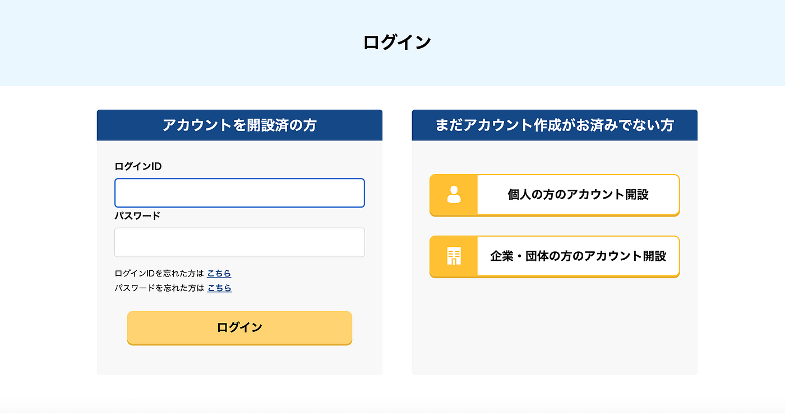
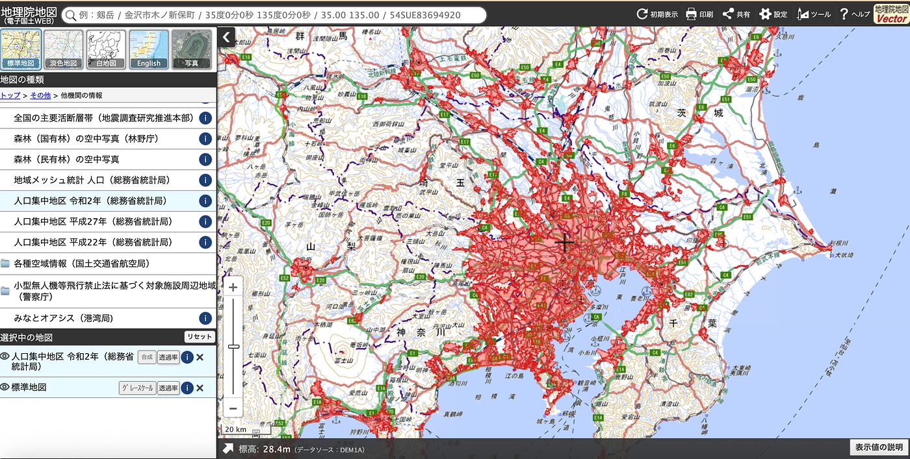
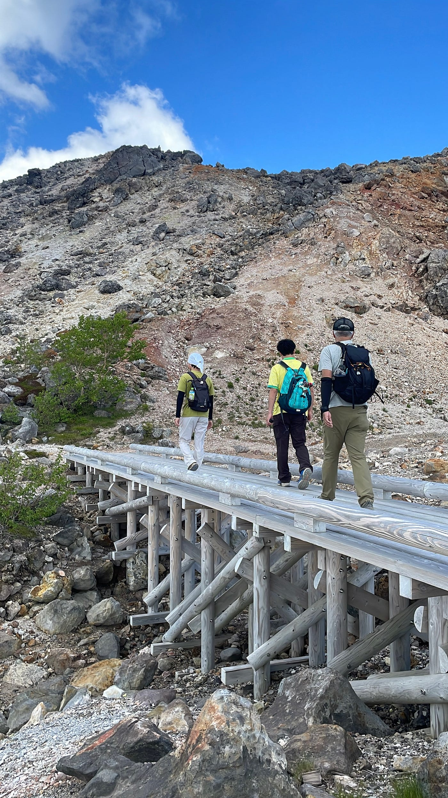
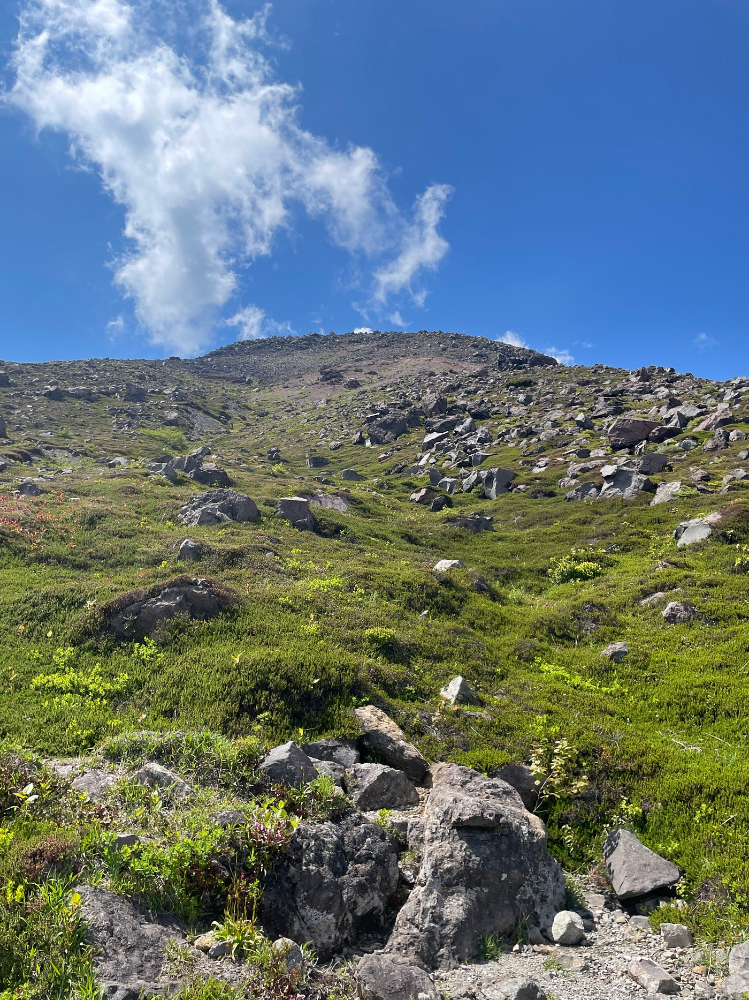
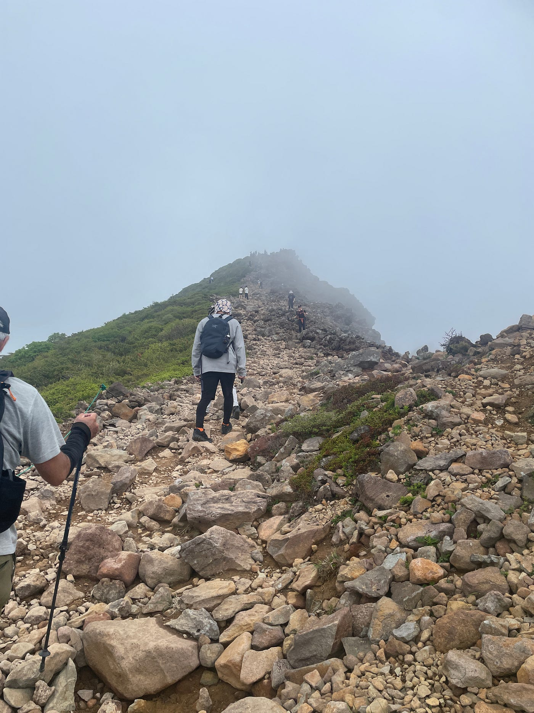
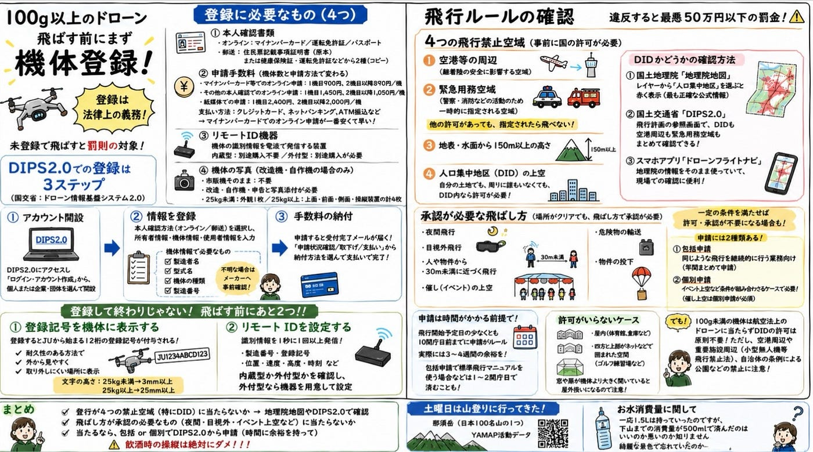

### 飛ばす前に何を見る？

こんにちは、ドローン部１の山﨑です。
いよいよドローン合宿が来週に迫り、天気が晴れると良いなと思っている最近でございます。

今回のドローン部１の投稿はドローンを実際に飛ばす前に何を確認するべきなのかをまとめていきたいと思います！
ドローン部全体の最終的成果物の一つにマニュアル作成があり、今回の内容も事前準備の項目の中に入れていきたいと思います。
早速始めます！

#### まずは機体登録

100g以上のドローン、飛ばす前にまず「機体登録」。
DIPS2.0（ドローン情報基盤システム2.0）でやることまとめ

ドローンを手に入れて最初にやるべきは、飛行練習でも空撮でもなく**機体登録**。
100g以上の機体を屋外で飛ばすなら登録は法律上の義務で、未登録のまま飛ばすと罰則の対象！。
ここでは登録に必要なものから、DIPS2.0での手順、登録後にやることまでを一気に整理しちゃいます。
記事なんてどうでもいいから気になる人は**[こちら**](https://sainichi-drone.com/column/dips)

**なぜ登録が必要か**

100g以上（バッテリー込みの重量）のドローンを屋外で飛ばす場合、所有者には機体登録が義務づけられています。**趣味でも仕事でも関係なく**、また**機体ごとに登録が必要**です。3台持っていれば3台とも登録します。逆に、屋内だけで飛ばす機体や今後使わない機体は対象外です。

登録に必要なもの

準備するのは大きく4つです。

1. **本人確認書類
** オンラインの場合はマイナンバーカード／運転免許証／パスポート。郵送の場合は住民票記載事項証明書（原本）、または健康保険証・運転免許証などから2種（コピー）。

1. **申請手数料（機体数と申請方法で変わる）**
 ・マイナンバーカード等でのオンライン申請：1機目900円、2機目以降890円／機
 ・その他の本人確認でのオンライン申請：1機目1,450円、2機目以降1,050円／機
 ・紙媒体での申請：1機目2,400円、2機目以降2,000円／機
 支払いはクレジットカード、ネットバンキング、ATM振込などなど。
**マイナンバーカード**でのオンライン申請が一番安くて早いらしい。

1. **リモートID機器**
 機体の識別情報を電波で発信する装置で、内蔵型と外付型があります。内蔵されている機種なら別途購入は不要、内蔵されていなければ外付型を用意します。

1. **機体の写真（改造機・自作機の場合のみ）**
 **市販機をそのまま使うなら不要。**改造・自作機は申告と写真添付が必要で、25kg未満は外観1枚、25kg以上は上面・前面・側面・操縦装置の計4枚です。

**[DIPS2.0](https://www.ossportal.dips.mlit.go.jp/portal/top?lang=ja)での登録は3ステップ**

機体登録は国交省の「ドローン情報基盤システム2.0（DIPS2.0）」から行います。

**ステップ1：アカウント開設**
 DIPS2.0にアクセスし「ログイン・アカウント作成」から、個人または企業・団体を選んで開設します。

**ステップ2：機体・所有者・使用者の情報を登録**
 ログイン後に「新規登録」を選び、本人確認方法（オンライン／郵送）を選択。所有者情報・機体情報・使用者情報を入力します。機体情報では製造者名・型式名・機体の種類・製造番号が必要なので、不明ならメーカーへ事前確認しておくとスムーズに行ける。

ここで問題発生
前々からマイナンバーをスキャンするのがうまくいってなかった山﨑は月曜に区役所に行って何かをしないといけないらしいです😮‍💨

区役所に行ったところ、マイナンバーのスキャンではなく自分のPWが間違えてたみたいでしたのでリセット完了！早く登録しなきゃ、、、

**ステップ3：手数料の納付**
 申請すると受付完了メールが届くので、「申請状況確認/取下げ/支払い」から納付方法を選んで支払えば完了！！

登録して終わりじゃない。（まだ申請できてない）

**飛ばす前にあと2つ！！**

#### **登録記号を機体に表示する**

登録するとJUから始まる12桁の登録記号が付与されます。これを機体に、耐久性のある方法で・外から見やすく・取り外しにくい場所に表示します。文字の高さは25kg未満なら3mm以上（25kg以上は25mm以上）。油性マジック、ステッカー、プレートが一般的。

#### リモートIDを設定する

リモートIDは識別情報を1秒に1回以上発信し、製造番号・登録記号に加えて位置・速度・高度・時刻などを送ります。内蔵型か外付型かを確認し、外付型なら機器を用意して設定します。

まとめ

#### 機体登録の流れはシンプル

1. 必要なもの（本人確認書類・手数料・リモートID）を準備

1. DIPS2.0でアカウント開設 → 情報登録 → 手数料納付

1. 登録記号を機体に表示 → リモートID設定

ここまで終えて、ようやくスタートライン。

スタートラインにすら立てなかった、、、、、

次は「どこで・どんな飛び方なら飛ばしていいのか」という飛行ルールの話になります。

機体登録が終わっても、まだまだ確認することはあるよん

ドローンには「**飛んではいけない空域**」と「**やってはいけない飛び方**」が法律で決められていて、これに当てはまると国の許可・承認が必要になります。ここを押さえずに飛ばすと、**最悪50万円以下の罰金**です。順番に見ていきます。

#### [４つの飛行禁止空域](https://www.mlit.go.jp/koku/koku_fr10_000041.html#houhou)

航空法では、次の4つの空域でドローンを飛ばすには事前に国の許可が必要。

・空港等の周辺（離着陸の安全に影響する空域）
 ・緊急用務空域（警察・消防などの活動のため一時的に指定される空域）
 ・地表・水面から150m以上の高さ
 ・人口集中地区（DID）の上空

注意したいのは緊急用務空域で、ほかの許可を持っていても、ここが指定されたら飛べません。災害や事故のときに突然設定されるので、飛ばす直前に必ず確認しよう！

**DID（人口集中地区）とは**
国勢調査をもとに「人口密度がおおむね1平方kmあたり4,000人以上の地域が連なり、合計5,000人以上」になるエリアとして設定される地域です。
**5年ごとの更新**されます。

**自分の土地でも、周りに誰もいなくても、DID内なら許可が必要となります🙂‍↕️
**どろー墜落時に地上の人や建物に被害が及ぶリスクが高いため、土地の所有権とは無関係に一律で規制されます。
実際にD**ID内の自宅で飛ばして通報された例もあ**ります。

DIDかどうかは、下のやつから簡単に確認できます。

**[国土地理院「地理院地図」**
](https://maps.gsi.go.jp/#7/34.253066/140.213957/&base=std&ls=std%7Cdid2020&blend=0&disp=11&lcd=did2020&vs=c1g1j0h0k0l0u0t0z0r0s0m0f1&d=m)レイヤーから「人口集中地区」を選ぶと赤く表示されて、最も正確な公式情報。

〜他にも〜
** [国土交通省「DIPS2.0」](https://www.ossportal.dips.mlit.go.jp/portal/top?lang=ja)
**飛行計画の参照画面で、DIDも空港周辺も緊急用務空域もまとめて確認できるらしい！
**スマホアプリ「[ドローンフライトナビ](https://droneflightnavi.jp/)」
**地理院の情報をそのまま使っていて、現場での確認に便利。

#### 承認が必要な飛ばし方

場所がクリアでも、**飛ばし方によっては別途「承認」が必要**です。
代表的なのは、**夜間飛行、目視外飛行、人や物件から30m未満に近づく飛行、催し（イベント）の上空、危険物の輸送、物件の投下**など。
最大離陸重量25kg未満で立入管理措置をとり、技能証明・機体認証を備えるなど一定の条件を満たせば、許可・承認が不要になる場合も。
例
通達「[航空法施行規則第236条の82第１項第２号の規定により飛行の方法に係る承認が不要な飛行の取扱い](https://www.mlit.go.jp/common/001990796.pdf)」に定める要件を満たして行う農薬等の空中散布などの飛行については、飛行の承認が不要となる。

申請には**包括申請**と**個別申請**がある。

**包括申請
**同じような飛行を継続的に行う業務向け。年間を通してまとめて許可をとれる。
 **個別申請
**イベント上空での撮影や、DIDでの夜間飛行など条件が組み合わさるケースで必要。

**催し（イベント）の上空は包括申請ではカバーできず、個別申請が必須です。
**防災訓練やお祭りなど人が集まる場所の上空を撮るなら、ここに該当します。

申請は時間がかかる前提で

**許可は、飛行開始予定日の少なくとも10開庁日前までに申請するのがルール。
**書類の不備で追加確認が入ることもあるので、**実際には3〜4週間の余裕を見ておくのが安全**です。
包括申請で航空局の標準飛行マニュアルを使う場合などは1〜2開庁日で済むこともあります。

#### **許可がいらないケース**

DID内でも、次のような場合は**航空法の許可が不要**です。

・**屋内（体育館、倉庫など）**
 ・**四方と上部がネットなどで囲まれた空間**（ゴルフ練習場など）

外に飛び出せない環境だから、というのが理由。
でも**窓や扉が機体より大きく開いていると屋外扱いになっちゃう‼️**。
だから去年のドローン展の時、あみあみの中でドローン飛ばしたのか。

**100g未満の機体は航空法上のドローンに当たらずDIDの許可は原則不要ですが、空港周辺や重要施設周辺（小型無人機等飛行禁止法）、自治体の条例による公園などの禁止には引き続き注意が必要**です。

まとめ

#### 飛ばす前に確認すること

1. 場所が4つの禁止空域（特にDID）に当たらないか → 地理院地図やDIPS2.0で確認

1. 飛ばし方が承認の必要なもの（夜間・目視外・イベント上空など）に当たらないか

1. 当たるなら、包括 or 個別でDIPS2.0から申請（時間に余裕を持って）

実際に申請をしたい人は詳しくまとめている**[こちら**](https://www.mlit.go.jp/koku/koku_fr10_000042.html)を見てください！

#### 飲酒時の操縦は絶対にダメ！！！

まだまだ準備マニュアルに入れる内容を網羅しきれていないので、引き続き調べていって完璧なものになるように頑張ります！😤

土曜日は山登りに行ってきた
那須岳（日本100名山の１つ）
[YAMAP活動データ](https://yamap.com/activities/49083554)
お水消費量に関して
一応1.5Lは持っていったのですがみんなレベルアップしたのか、綺麗な景色で忘れていたのか、下山するまでの消費量が500mlで済んだのはいいのか悪いのか知りません。
毎回湯口さんが登山計画を立ててくれるのですが、さすがというかほぼ計画通りに行ける。いつか自分たちで作った計画で湯口さんと登山をしてあげたい。

グラレコ

※本図は2026年6月時点の国土交通省の公開情報に基づいている

ChatGPT（GPT-5.5 Thinking）でグラレコ化
