## Blender作品ついに完成！

こんにちは！4年の安生です。

今週も、先週に引き続き Blenderの進捗報告をしていきます。今週で、ついに全員完成させることができました〜！

**【ゆうか】**

今週は最後まで進めることができました！

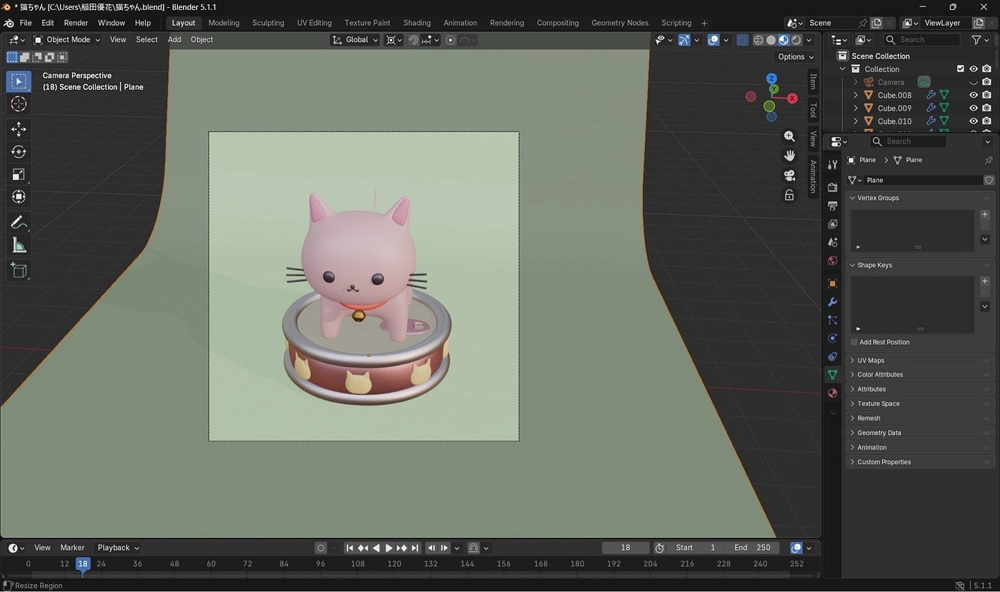

写真にする部分を決めて、2画面にしてライトの位置や色を調整しました。前回普段使用しているWindowsでくまを作った時はこの辺りでかなり重くなり、何度も落ちて何時間もかかりましたが、今回は簡単にライトが動かせて良かったです。また、写真も1.2分で保存することができました。

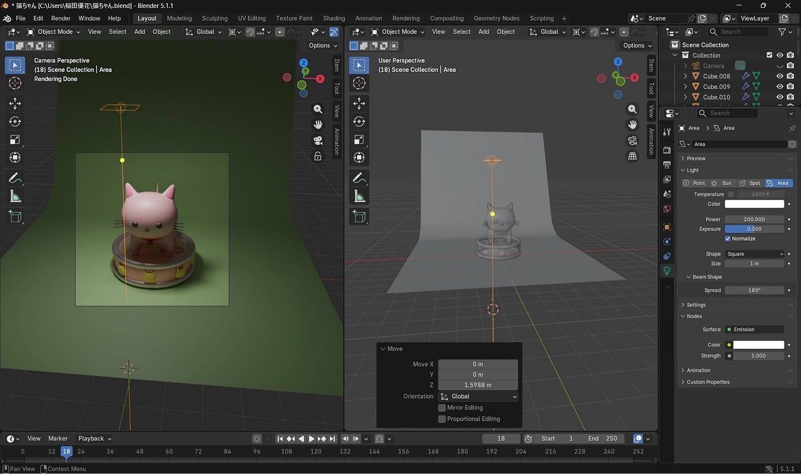

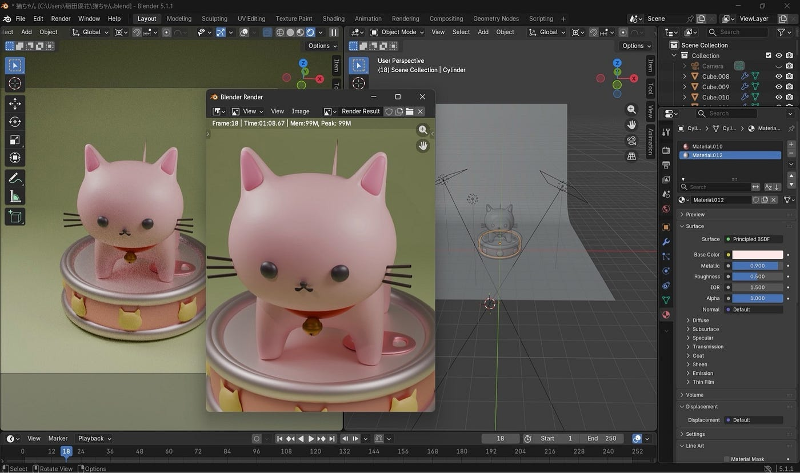

そして完成品はこちらです！

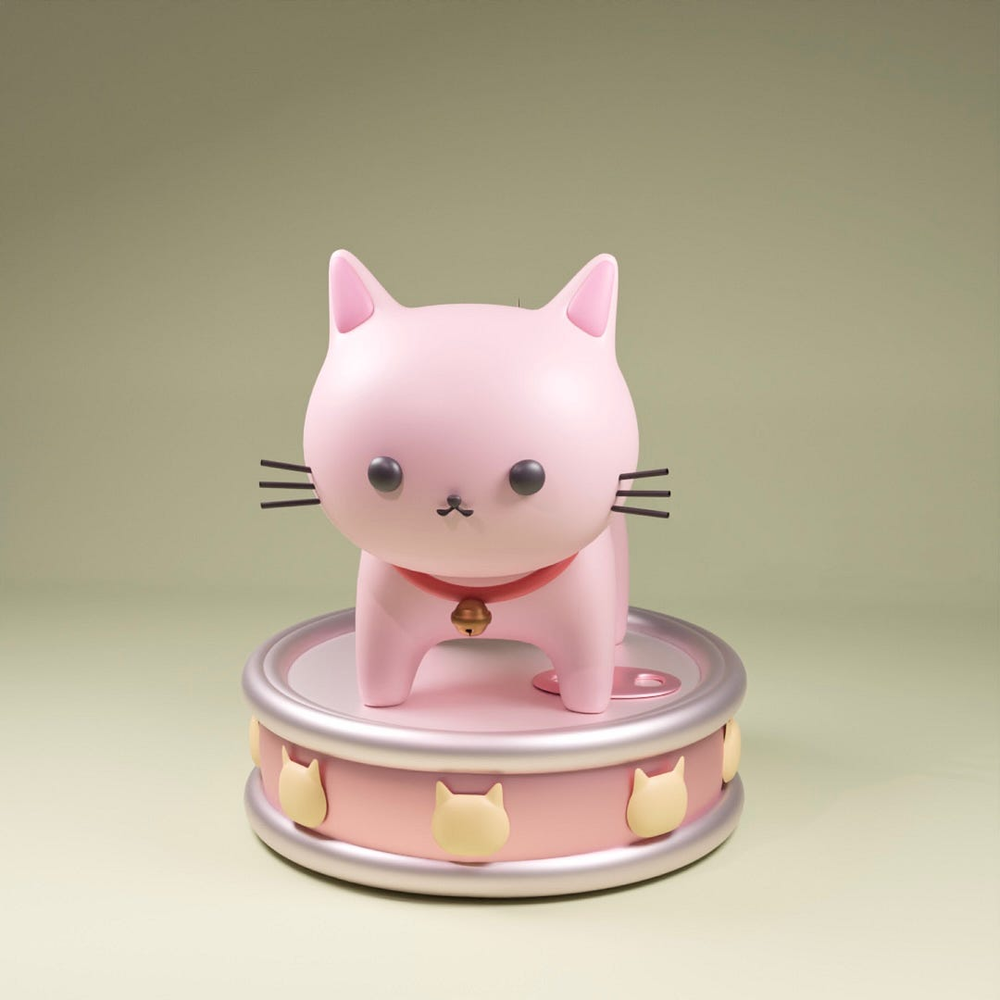

動画より若干顔を大きくし、撮影前には光に合わせて缶詰の配色や質感も変えてみたので、雰囲気の違う猫ちゃんに仕上げることができました。

> 課題

この写真を見て気づいたのですが、若干缶詰の左側部分がズレて、重ねた下の円柱とくい込んでしまっていました。今度作る時はパーツとパーツを組み合わせる時、360°綺麗にくっついているか確認してから色塗りなどに取り掛かりたいです。

これからBlenderを使って何かを作る時も、今回学んだ工夫やショートカットキーを活用して効率よく作れるようにしていきたいです。

**【みわ】**

今週は私も最後まで終わらせることができました！

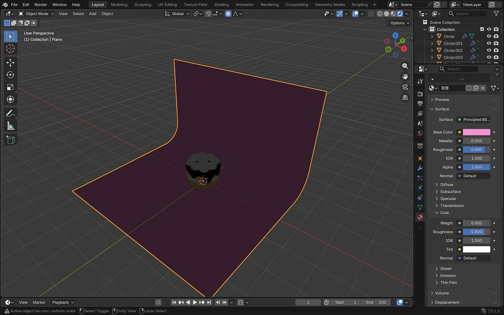

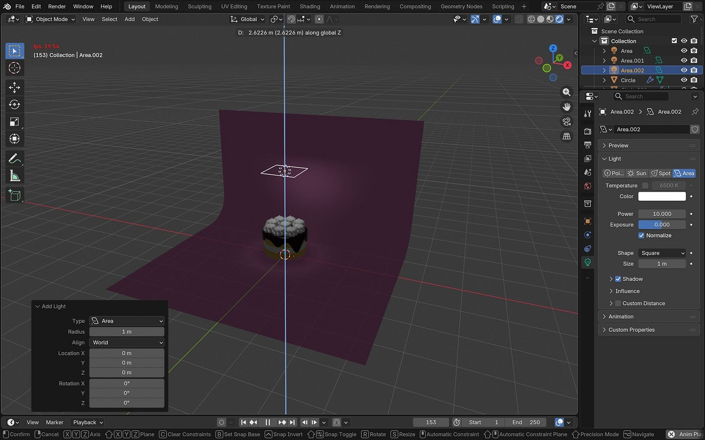

まずライティングの作業を行いました。

カメラで撮影した際にどう影が入るかを意識しながら付けてみました。

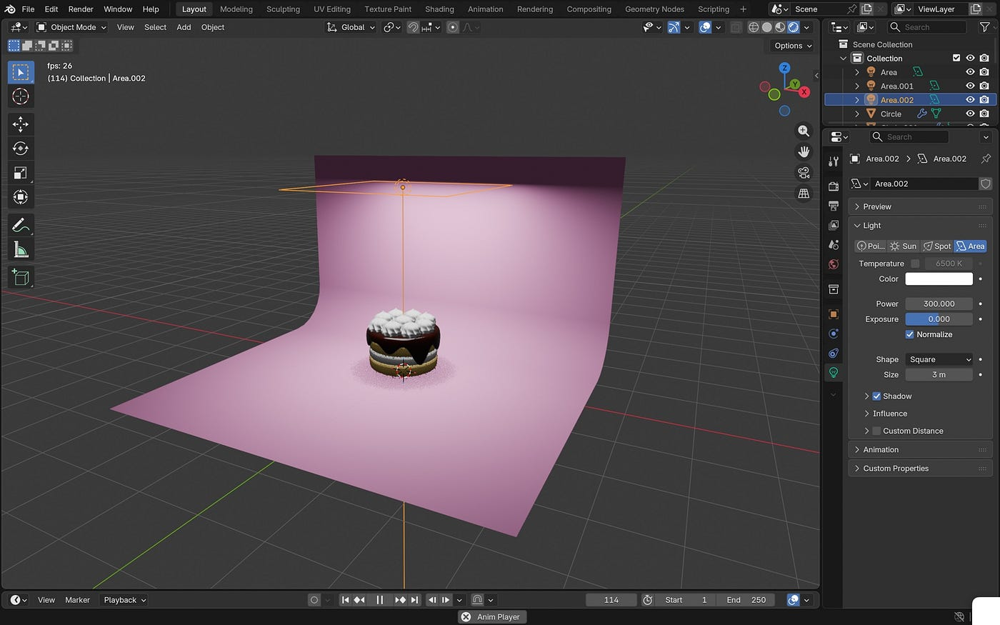

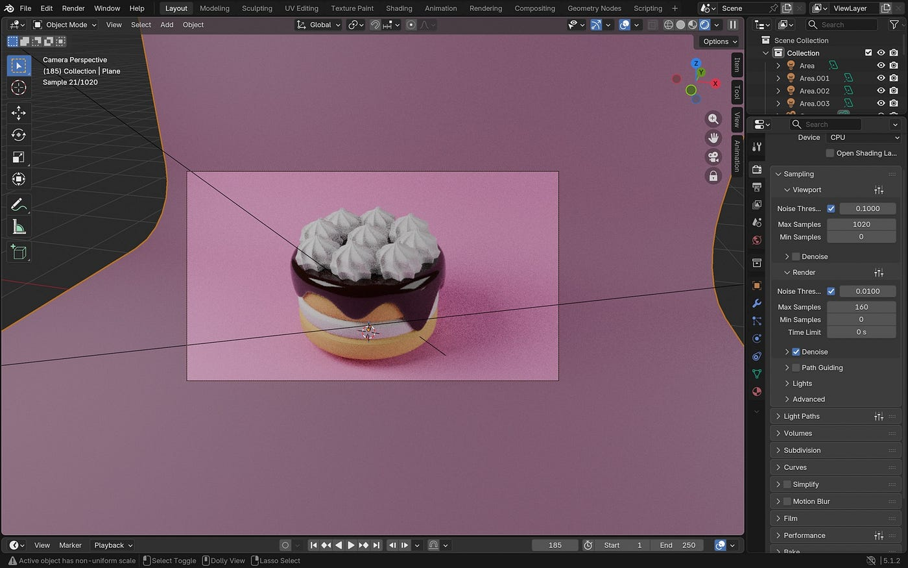

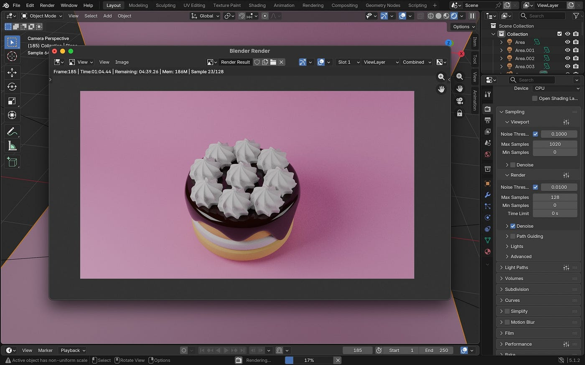

最後にカメラで撮影をしました。影の入り方が上手くいったのでとても綺麗に撮れた気がします。ライトを2種類使ったのもポイントです！💡

今回のチョコレートケーキは、最初にしては難しすぎる作品かと思いながら始めたのですが、動画の内容をしっかり確認して作成したので、思っていた以上にスムーズに行えました。

> 課題

カメラで撮影された作品を見ると、ホイップクリームの部分に粗さが出ていることに気づきました。滑らかにしたつもりでしたがライトを付けることでその粗さにも気づいたので、数値の微調整が必要だと思いました。次の作品での課題です。

一つ一つ完成されていくのが凄く楽しかったので、Blenderをより上手く活用できるようにこれからも色んな作品を作ってみたいです。

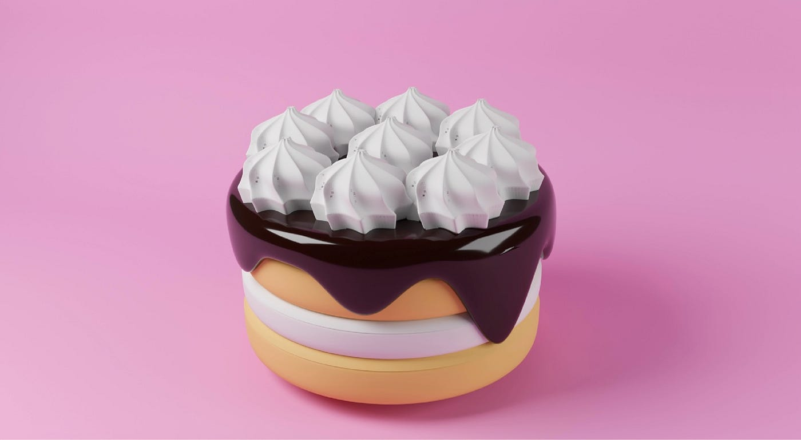

**【もえ】**

私も今週で完成させることができました！

最初に、前回作ったりんごを５つに複製しました。その際、この２つの機能が役立ちました。

- **Shift + D → X **で**平行移動**：複製した直後にXキーを押すと、軸が固定されて並行に並べられる！

- **Shift + R** で**等間隔**に複製：複製して隣に配置したあと、そのまま ⁠Shift + R⁠ を押すと、連続で等間隔にりんごを複製できる！

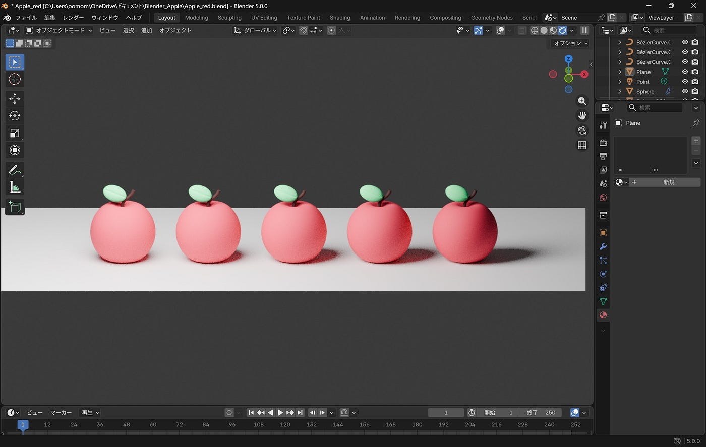

次に、それぞれのりんごを様々なマテリアルに設定しました。「テクスチャ座標」や「マッピング」、「波テクスチャ」、「カラーランプ」など、さまざまな機能を繋ぎ合わせることで、粘土のようなものや、すりガラス、クリア、ライトなど、それぞれ印象の違ったりんごに仕上げることができました。

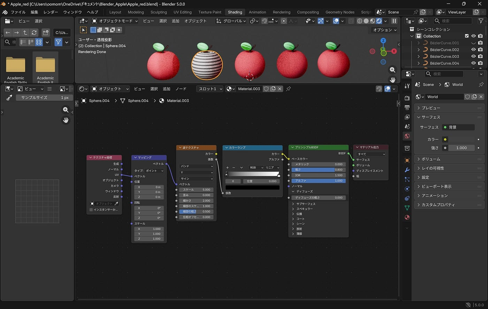

左から4つ目と5つ目のりんごのへたと葉っぱを金と銀のメタリックにしたのがポイントです。

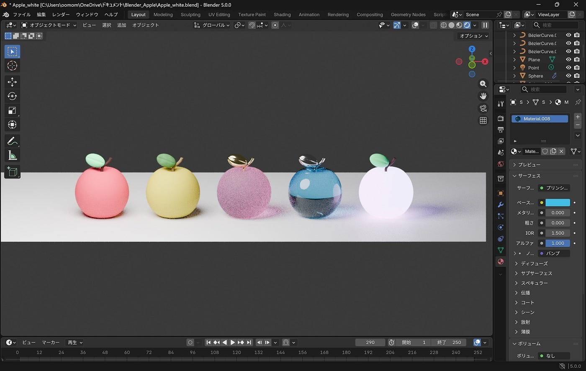

作業途中にパソコンが重くなってしまい、マテリアルの変更が上手く反映されなかったのですが、もう一度やり直して、こまめに保存して新しく開き直して作業することでスムーズに完成まで進めることができました。今後もこまめに保存することを意識して作業を進めていきたいです。

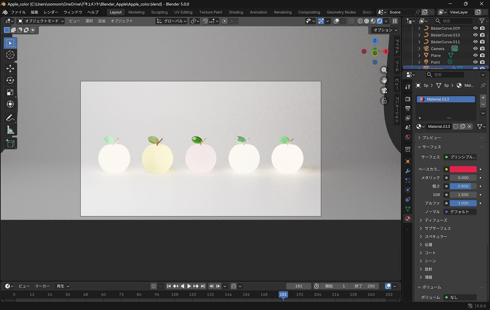

また、画像を出力する際に、**レンダープロパティ**の**最大サンプル数**の数値を高くしすぎないように気をつけることもポイントです。画質を高くし過ぎると、画像の保存に数時間から数日かかってしまうこともあるそうです。今回私は128に設定したところ、数分で保存することができました。

> 課題

左から2つ目のりんごのグラデーションがあまり上手く出せず、1番左のりんごとのテクスチャの違いがわかりにくくなってしまったため、これからより細かいマテリアルの設定ができるようになりたいです。

背景は白に設定することで、カラフルなりんごが際立つようにしました。

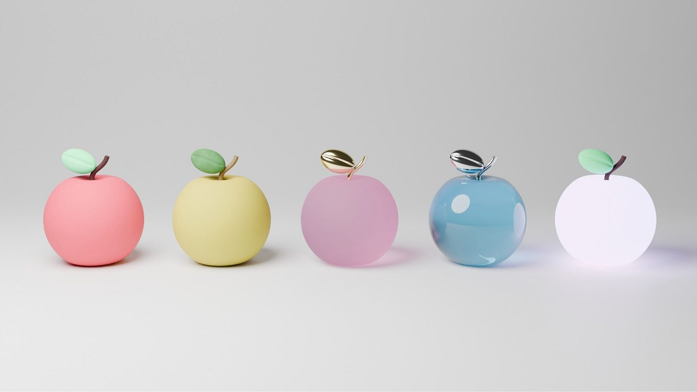

今週で、全員無事に作品を完成させることができました！それぞれ思い思いの作品をつくることができてとても楽しかったです。

来週からは、今回学んだことを活かしながら、アニメーションにチャレンジしてみようという話になっているので、よりパワーアップした作品を目指してみんなで頑張っていきます！

グラレコ

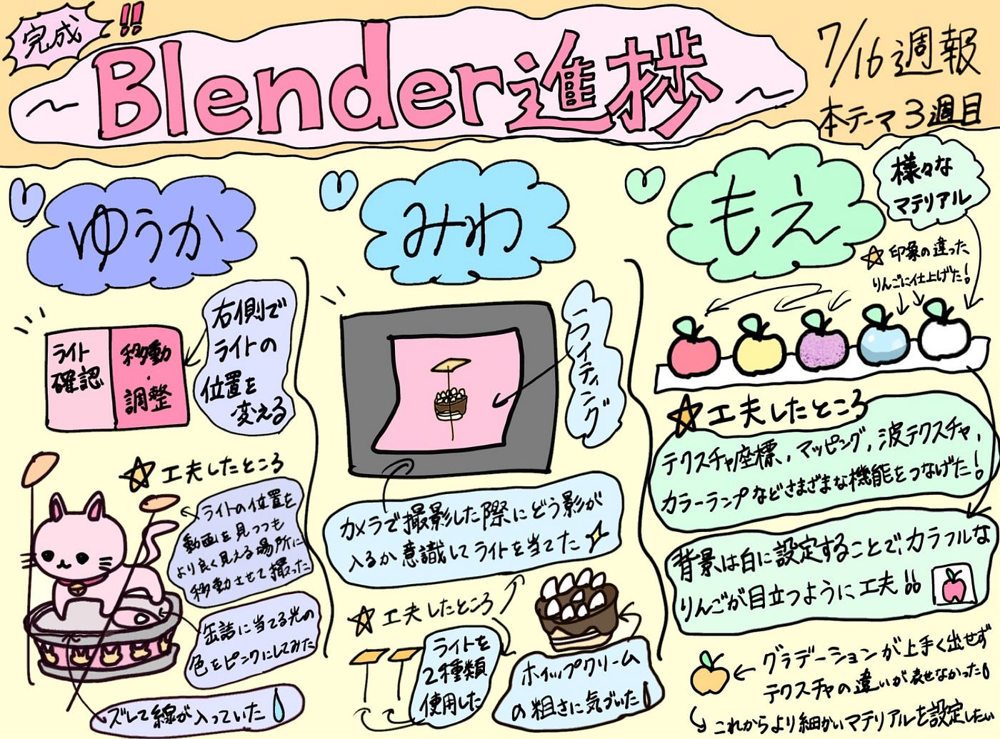
