### Blenderでカービィ作り、第２回！【デザイン１週報】

こんにちは、臼井です。

今週も前回に引き続き、動画を参考にカービィを作っていきます！

参考にしている動画

前回はカービィの体と表情を付けるところまで終わりましたが、操作に慣れていないメンバーはかなり大変だったので、元々立てていた計画を遅らせることにしました。

具体的には今週は撮影設定、書き出しまで終わらせる予定でしたが、マテリアルの設定のみを行うようにしました。

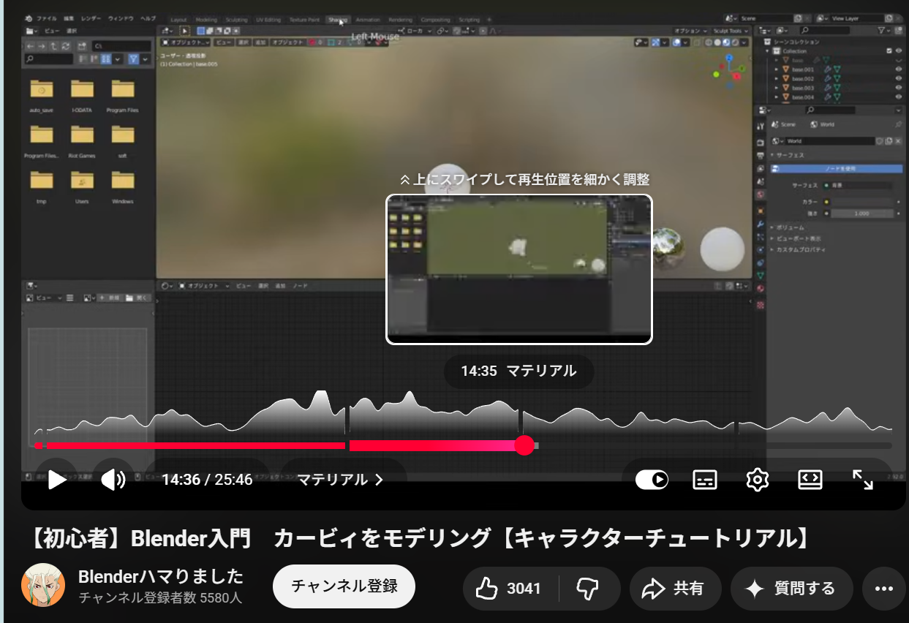

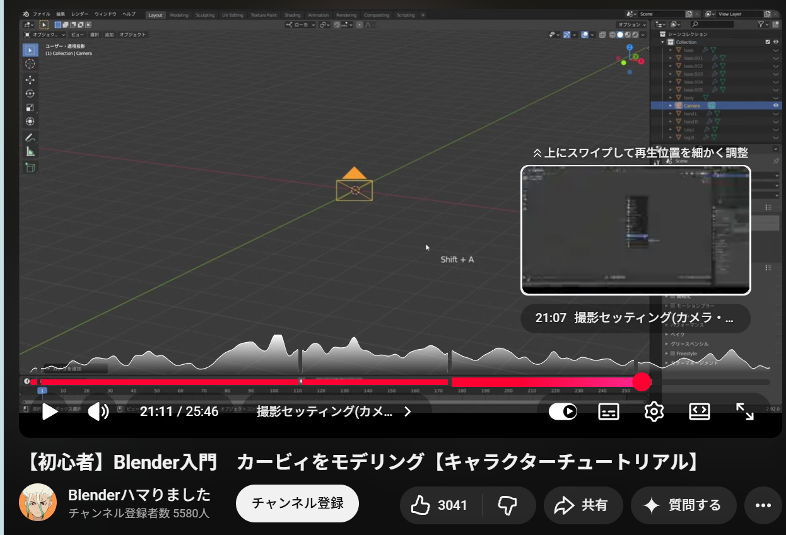

**みひろ**

今週の完成品はこちらです↓

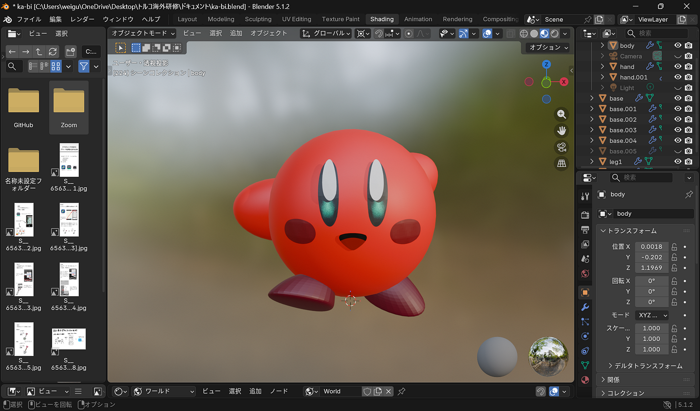

チーム内で各々好きな色のカービィ作れたら面白いよねということで、私は好きな色である赤色のカービィを作ることにしました！！！実際に赤色のカービィがいるかはわかりませんが！（笑）

我ながら、かわいいカービィを作ることができたと思います！どうでしょうか？赤色でもかわいいですよね？（笑）

**＜工夫した点・学び＞**
 動画の内容をそのまま再現するのではなく、現在使用しているBlenderのバージョンとの差を考慮しながら操作する必要がありました。特に、オブジェクト選択後のマッピングや追加機能の表示位置が動画と異なり、最初は操作に戸惑う場面がありました。対処法としては、ショートカット「Shift + A」で検索メニューを開き、追加機能を検索して対応しました。Aでもその中で「チュートリアル通りに進むだけではなく、UI、User Interfaceの(人がソフトやアプリを操作するときに見る画面や操作部分のこと)違いを理解しながら対応することが重要である」と学びました。

**＜課題＞**
 バージョン違いによる(動画で使用していたバージョンはBlender2.9、私が5.1.2を使用)UIや機能配置の差により、目的の操作を見つけるのに時間がかかることがありました。

**ちはな**

最初に今週の完成形です。

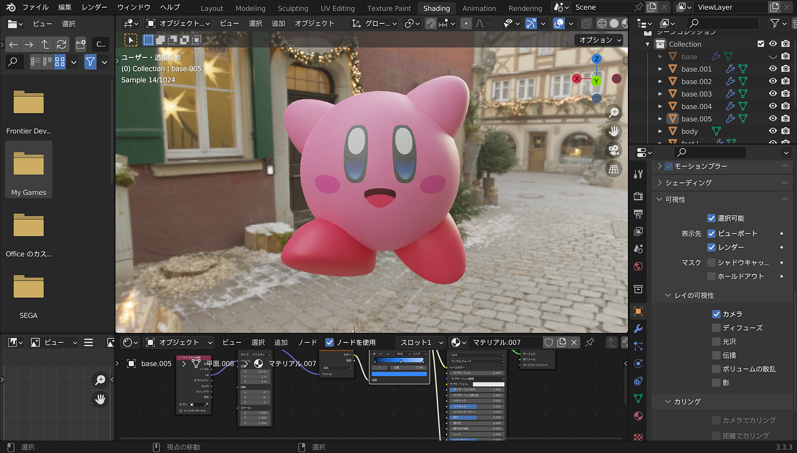

モデリングの時点では上手くできたと思っていたのですが色がつくとちょっと顔が下の方に付きすぎかな？と感じました。

ただ、色合いはゲームに近くできたかなと思います！

制作途中、環境テクスチャを設定する段階で、動画では背景が黒なのに私の画面では入れた背景が表示されたり……

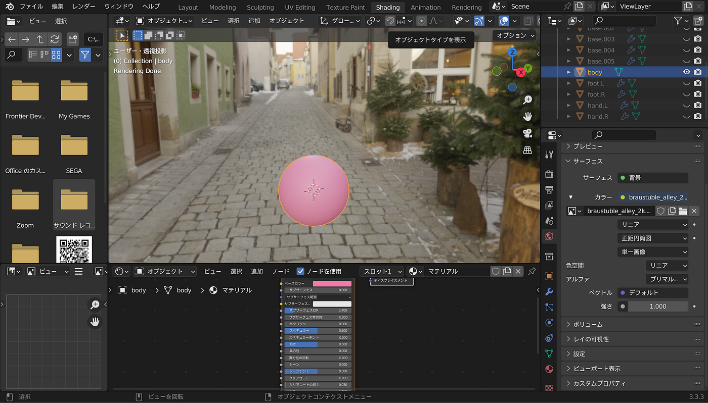

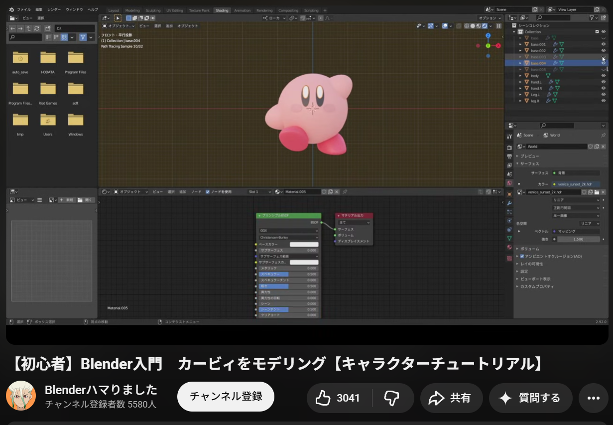

バージョンが違うからか、設定できない項目があったり……

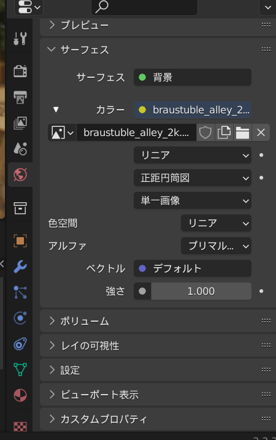

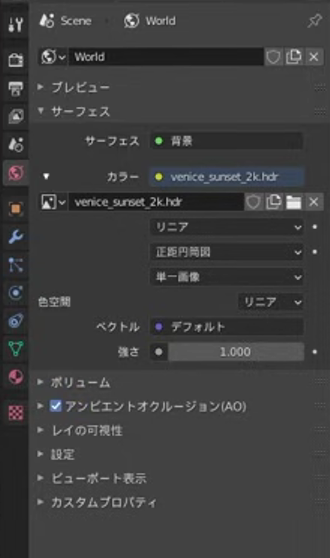

口の設定が上手くいかず、色が逆転してしまったり……

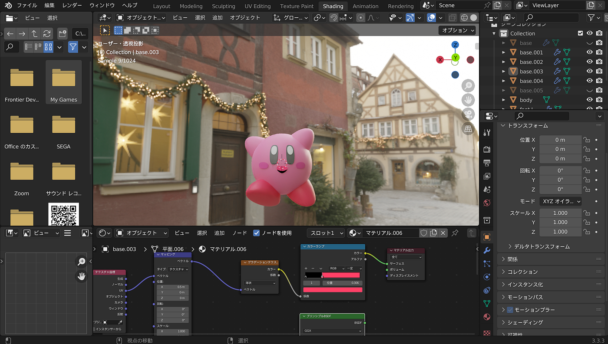

動画通りいかない部分は多々ありましたが、個別に調整して完成させられました。

**みあ**

今週の進捗です！

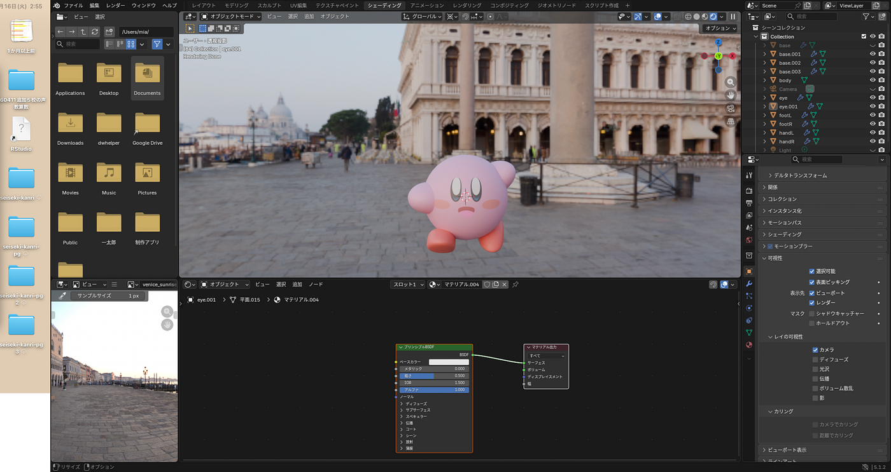

解説動画と使用しているBlenderのバージョンが異なる箇所があり、動画通りに進められない場面が何度かありました。その際は自分でUIを探索し、該当する設定項目がどこに移動しているかを調べながら対応しました。バージョン差異に自力で対処できたことで、Blenderの画面構成への理解も深まった気がします！

マテリアル設定自体の作業難易度はそこまで高くなかったのですが、PCのスペック(MacBook Air M1 / メモリ8GB)的にBlenderが重くなる場面があり、作業が止まってしまうことがありました。再起動をして他に開いていたタブを消すことでで対処しましたが、何回かやり直しになったのが悔しかったです。。

**かのこ**

苦労したこと

・目の下のハイライトが表示されなかった

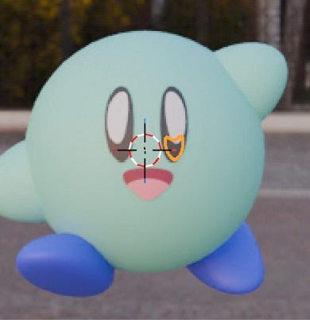

目の下のハイライトを作成したのに、白目の上に表示されず、埋まっているような状態になっていました。

原因

ハイライトに設定した Shrinkwrapモディファイアのオフセット値が小さすぎた ため、ハイライトが顔や白目の面に重なってしまい、正しく表示されなかったの原因でした。

解決策

Shrinkwrapモディファイアの オフセット値を大きく調整 しました。

- 調整前：0.011m

- * 調整後：0.03m

オフセットを増やしたことで、ハイライトが表面に表示されるようになりました。

苦労したこと

・Ambient Occlusion（アンビエントオクルージョン）が見つからなかった

動画ではAmbient Occlusionにチェックが入っていたのですが、自分のBlenderにはその項目が表示されていませんでした。

原因

参考動画とバージョンが異なっていたことが原因でした。この参考動画は2021年に作成されたものでバージョンは、Blender 2.9で私が使っているものはBlender 5.1でした。

今週の完成品はこちらです。

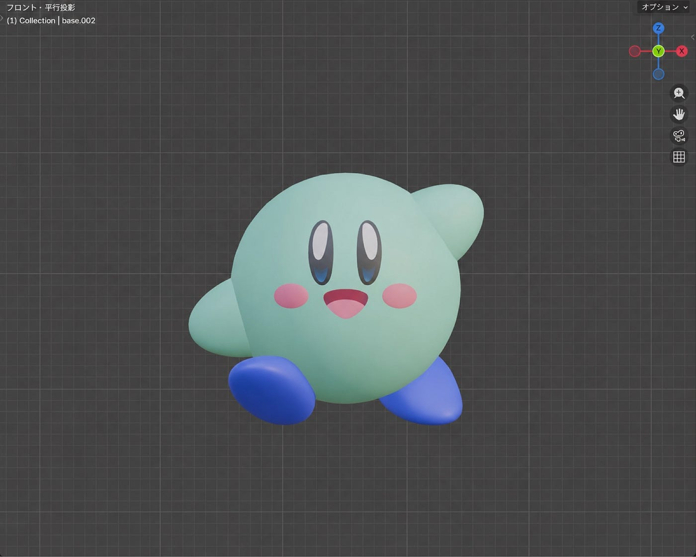

次回は撮影設定と書き出しを行いたいと思います！お楽しみに

グラレコ

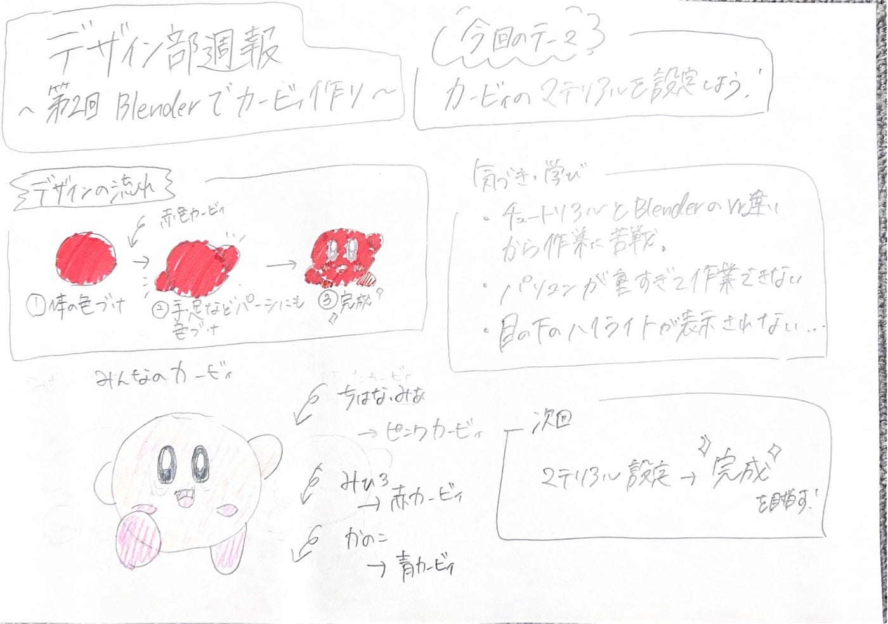
