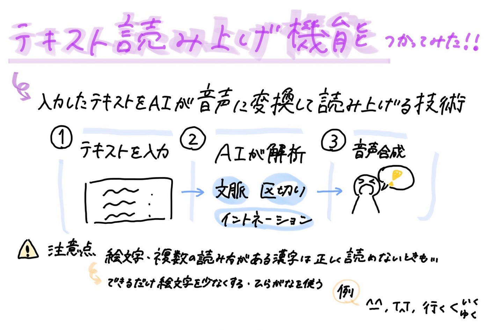

## 【V&F週報】TikTokのVlog作成！

こんにちは！3年の野中です。

今回もTikTokの動画作成を行いました。

今週は動画作成できそうなゼミでの活動が特にありませんでした。

そこで今回は、私の休日Vlogを撮影しました。

6月14日(日曜日)に日産スタジアムで行われた、backnumberのライブに参戦した1日をVlogにしてみました。

今回は、最近TikTokやInstagramのVlog動画でよく見かける、｢テキスト読み上げ機能｣を使用してみました。

> テキスト読み上げ機能とは？

入力したテキストをAIが自然な音声に変換して読み上げる技術

正式名称は **Text to Speech** 、略して **TTS**

この機能の仕組みは、主に3つのステップで成り立っています。

1、テキスト入力

動画上に表示させたいテロップ（字幕）を入力する

2、AIによる解析

入力された文章の文脈、単語の区切り、イントネーションを解析

3、音声合成

事前に学習させた膨大な音声データをもとに、人間のように自然な声色で音声を生成

> 使ってみた感想

CapCutの編集画面にある｢テキスト読み上げ｣のボタンを押すだけで、動画編集初心者の私でも簡単に使用することができました。

しかし、絵文字や複数の読み方がある漢字などを使用すると、意図しない読み方をする場合もありました。

そのため、できるだけ絵文字を少なくしたり、ひらがなを使ったりして対応しました。

この機能を使うことで、視覚だけでなく、聴覚でも動画を楽しむことができるのではないかなと思いました！

> TikTokのリンク

動画は[こちら](https://vt.tiktok.com/ZSQ49eVLK/)から！

> グラレコ

