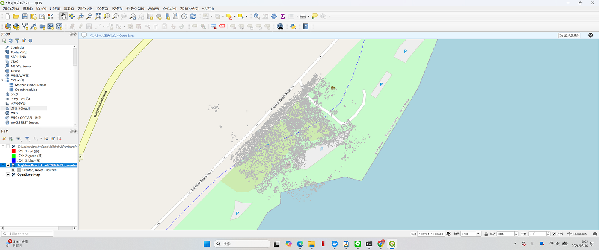
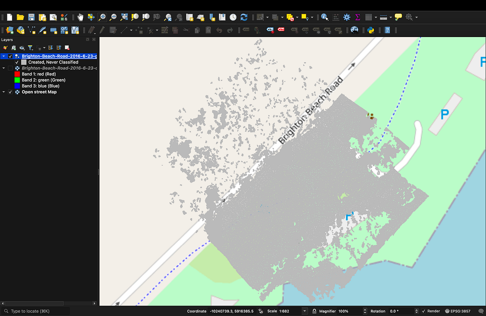
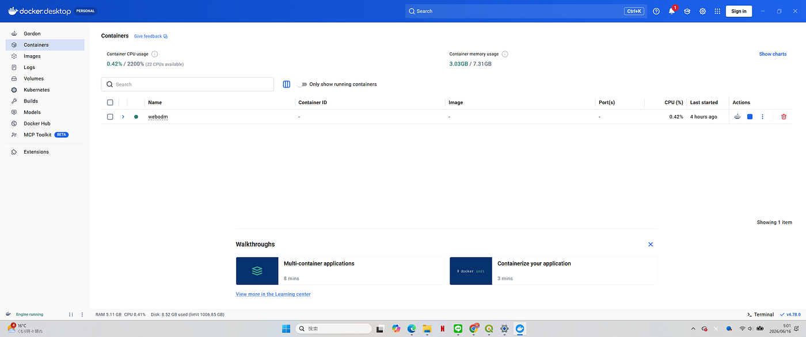
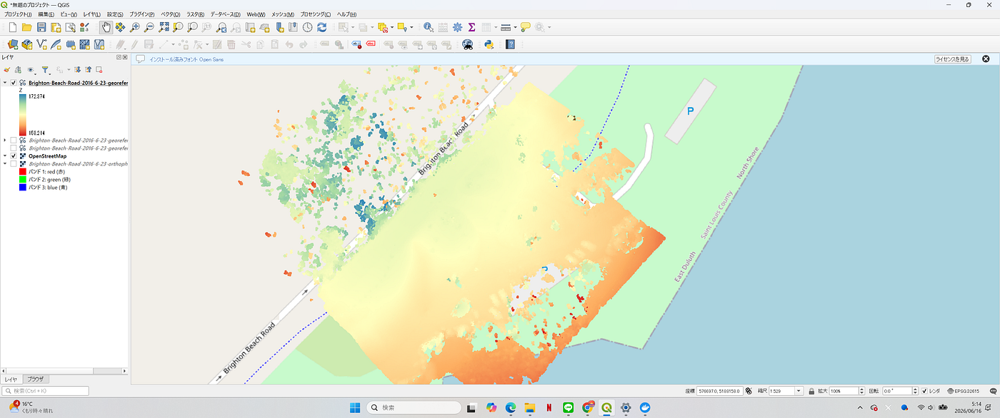
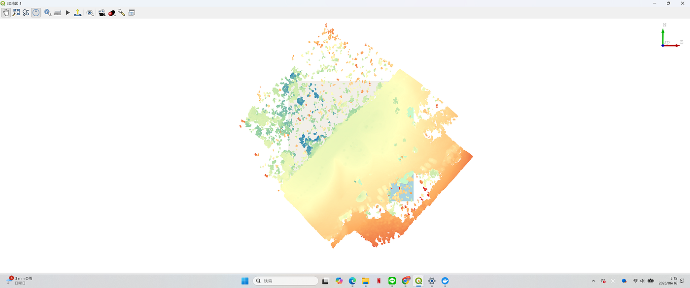
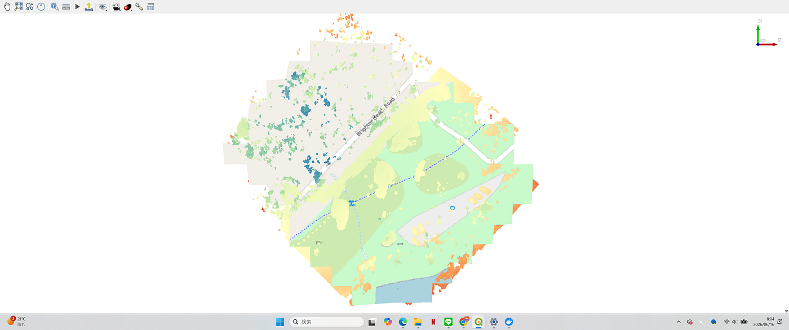
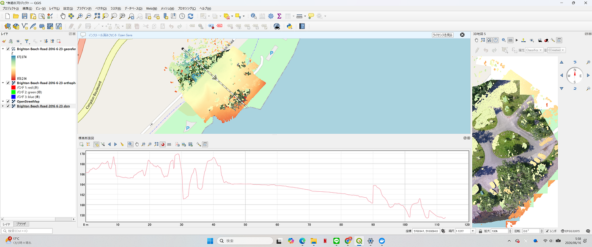
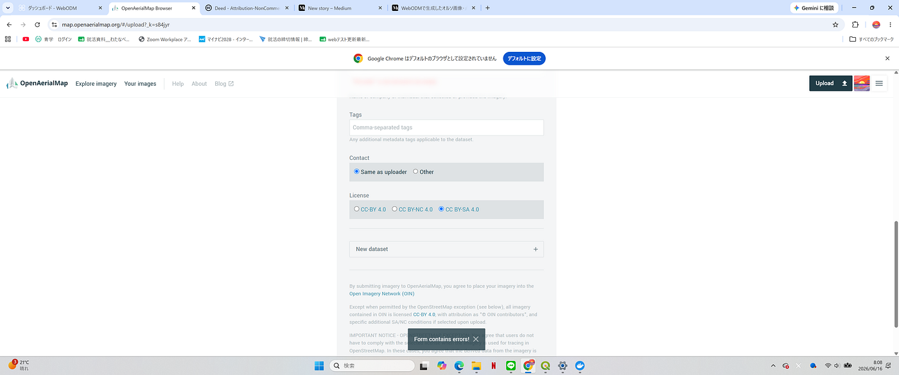
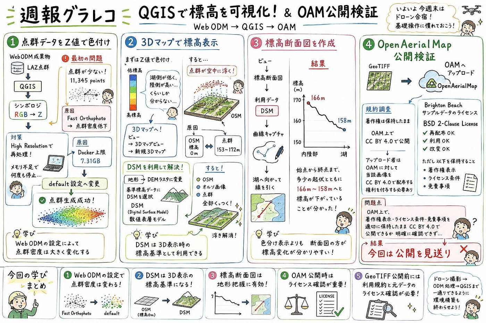

### ドローン部２ 週報

こんにちは。ドローン2の渡辺です。
いよいよ今週末はドローン合宿ですね！
合宿前にドローンの試運転を行い、基礎操作に慣れておこうと思います！

また、ドローン部2は大丈夫だと思いますが、ドローン撮影 → ODM処理→ QGISといった基本の流れを各自行えるように、環境構築など一通り終わらせておきましょう。

さて、前回はともやが、サンプルデータを基にWebODMで出力したGeoTIFF形式のオルソ画像及びLaz形式の点群データを、QGIS上でOSMに重ねるまでの一連の流れを確認してくれました。

今回は、
①前回はRGBで表示していた点群データを、Z値を用いた色付けを行えるか確認する
②OpenAerialMap(以下OAM)に実際にアップロードし、共有ができる状態にできるか確認する
の2つの目標を設定して行っていきたいと思います。

初めに、前回のともや同様にQGIS上に点群データを表示するところまで進めたのですが、前回ともやが上げていた画像と異なり、なぜか点群データが少なく見え、レイヤー情報を確認するとポイント数が11,345しかないとのこと。調べてみると、一般的な点群データと比較してポイント数が著しく少ないことが分かりました。
原因を考えたところ、WebODMでのタスク実行時にFast Orthophotoを選択していたことを思い出しました。これにより点群密度が低下したとみて間違いなさそうです。

ということで、折角色付けするのだからと今度はHigh Resolutionに設定しWebODMでの処理に再チャレンジ。

しかし、今度はメモリー不足で何度も処理が止まってしまいます。私のPCはRAM16GBなのにダメなのかとガッカリしたのですが、どうやらWebODMがDocker上で動いているため、Dockerに割り当てられたメモリ上限を超えることで処理が止まってしまうみたいです。

Dockerを確認したところ、たしかに上限が7.31GBとなっていることが確認できます。

時間も無いので仕方なくHigh resolutionからdefaultに落として作業を再開することにしました。

そして今度は無事点群データを生成することが出来ました！

次は、Z値での色付けです。
レイヤーを右クリックし、プロパティ→シンポロジから前回はデフォルトのRGBが選択されていたところを、「連続値による定義」へと変更します。次に、属性をIntensityから「Z」へと変更。
最小値と最大値が正しく設定されていることを確認し、適用。
すると、高度に応じて色が異なるように表示されるようになりました。
しかしこれでは湖に近い方が標高が低く、離れるほど高くなるといった微妙な情報しか分かりません。

ということで、3Dマップ機能を用いてより詳細に標高を表示にチャレンジしてみます。
ビュー→3Dマップビュー→新規3Dマップビューを開くと、3Dマップが見れるように！
しかし今度はOSMの地図から完全に浮いて見えます。
どうやら、OSMには標高データが含まれておらず、標高0mと判断されている一方で、点群データは標高を持っており、これがプロパティ→シンポロジから確認すると153m〜172mの範囲で、この差によって浮いて見えています。

そこで、3Dマップで設定を開き、地形から型をDEMラスタ(標高データ入りの地形)に変更します。また、基準とする標高データとして、先程のWebODM成果物の中からDSMデータ(Digital Surface Model（数値表層モデル)をダウンロードし選択。
すると、オルソ画像とOSMがDSMの座標に張り付き、浮かなくなりました。
とはいえこれでも視覚的に高度が分かりやすいとは言えない、、

ということで、お次は標高断面図の機能を使ってみます。ビュー→標高断面図を選択。
標高断面図に利用するデータとしてDSMにチェックし、曲線キャプチャで、断面図を取得したい二点間に線を引きます。今回は、内陸部から湖にむかって一直線に線をひいてみました。
すると、非常に高度変化の分かりやすいグラフができました。始点から終点まで、多少の起伏と共に166m〜158mと推移して高度が下がっていることが分かりました。

今回はQGISの機能を触ってみましたが、高度に関する機能だけで色々あり、使いこなすには時間がかかりそうです。

次はOAMへの公開です。

OpenAerialMap(OAM)とは

OpenAerialMap（OAM）とは、ドローン・航空機・衛星などで取得した航空写真やオルソ画像を公開・共有するためのオープンプラットフォームである。GeoTIFF形式の地理空間データを扱うことができ、災害対応や地図作成、研究活動などに活用されている。また、OpenStreetMap（OSM）の編集において背景画像として利用されることもある。

らしいです。by ChatGPT

ちなみにOAMはGoogleアカウントでログインできるのでラクチンです。
アップロードの際、色々と選択項目がありますが、下にスクロールすると、Licenseの項目があり、CC BY 4.0、CC BY-NC 4.0、CC BY-SA 4.0の3つしか選択できませんでした。

ここでライセンスについて確認

OAMの法務ページを確認したところ、アップロードされた画像は著作権を保持したままOpen Imagery Network上でCC BY 4.0ライセンスにより公開されることが分かりました。

また、アップロード者はOAMに対して当該画像をCC BY 4.0で配布する権利を付与する必要があることを確認しました。

一方で、今回使用したBrighton BeachサンプルデータセットのリポジトリにはBSD 2-Clause Licenseが適用されていました。BSD 2-Clause Licenseは、再配布・利用・改変を認める一方で、再配布時に著作権表示、ライセンス条件および免責事項を保持することを求めています。しかし、OpenAerialMap上でこれらの情報を適切に保持したままCC BY 4.0ライセンスで公開できるかについては明確に確認できませんでした。そのため、ライセンス上の問題がないと判断できる十分な根拠を得られず、今回はSubmitボタンを押す直前でOpenAerialMapへの公開を見送ることとしました。

※OAMライセンス規約
[https://openaerialmap.org/legal/?utm_source](https://openaerialmap.org/legal/?utm_source)

※BSD 2-Clause ライセンス規約
[https://opensource.org/license/bsd-2-clause?utm_source](https://opensource.org/license/bsd-2-clause?utm_source)

※CC-BY 4.0 ライセンス規約
[https://creativecommons.org/licenses/by/4.0/legalcode.en?utm_source](https://creativecommons.org/licenses/by/4.0/legalcode.en?utm_source)

※データセット参照元
[https://github.com/pierotofy/drone_dataset_brighton_beach](https://github.com/pierotofy/drone_dataset_brighton_beach)

ライセンス：BSD 2-Clause License
Copyright © 2017, Piero Toffanin

Copyright © <年>, <著作権所有者>
All rights reserved.

ライセンス文・原文(日本語訳)
以下の条件が満たされる場合、修正の有無にかかわらず、
ソースおよびバイナリ形式での再配布および使用が許可されます：
1. ソース コードを再頒布する場合は、上記の著作権表示、このライセンス文、
 および下に記述する免責事項を保持する必要があります。
2. バイナリ形式で再頒布する場合は、上記の著作権表示、このライセンス文、
 および下に記述する免責事項を、頒布物とともに提供されるドキュメントおよび/または
 その他の資料に転載する必要があります。

このソフトウェアは、<著作権所有者>によって「ありのまま」で提供され、
明示的か黙示的かを問わず、商品性および特定目的への適合性の暗黙の保証を含む、
またそれらに限定されない、いかなる保証もしません。
いかなる場合も<著作権所有者>は契約に沿った行為か否かを問わず、
損害発生の原因如何を問わず、
かつ責任の根拠が契約か厳格責任か（過失その他の）不法行為か否かを問わず、
仮にそのような損害が発生する可能性を知らされていたとしても、本ソフトウェアの使用によって発生した
（代替品または代用サービスの調達、使用の喪失、データの喪失、利益の喪失、業務の中断も含む、またそれらに限定されない）
直接損害、間接損害、偶発的な損害、特別損害、懲罰的損害、または結果損害について、
一切責任を負わないものとします。

