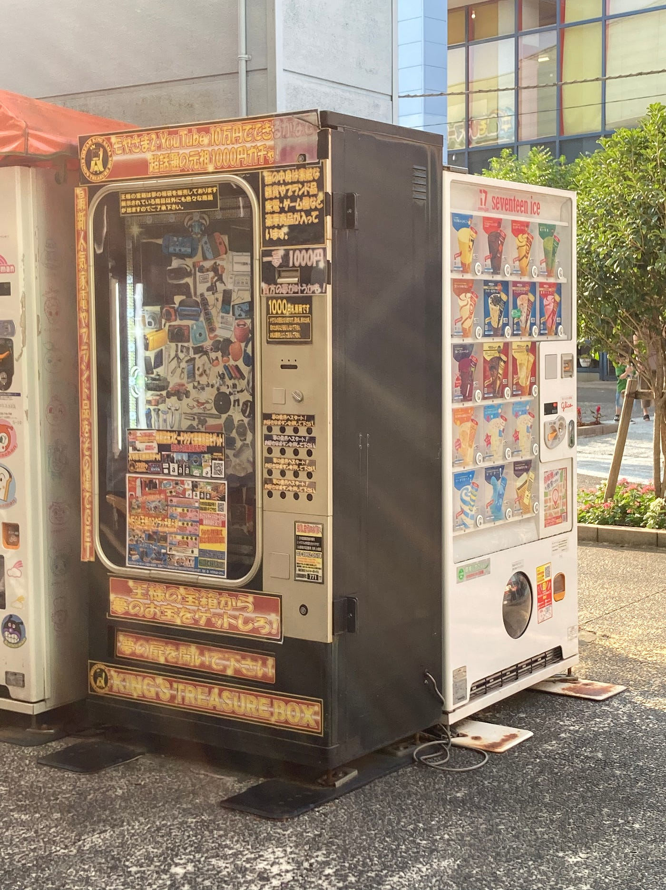
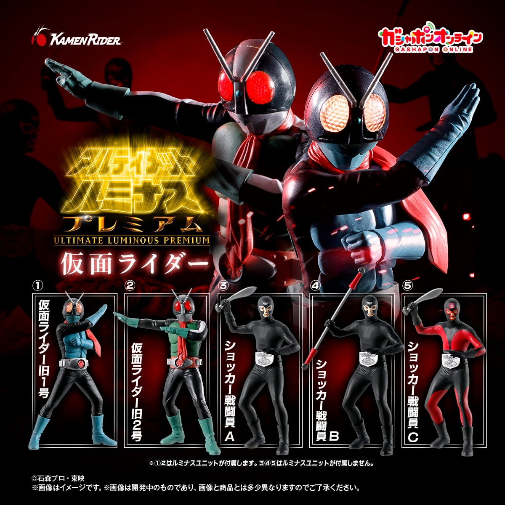
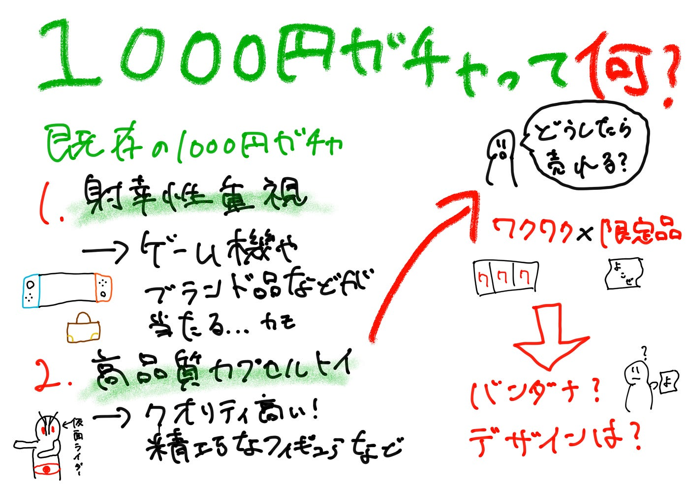

### 【横瀬部週報】いや、「そもそも1000円ガチャって何なんだ」について調べた件

こんにちは！横瀬部の4年加藤です。いよいよワールドカップが始まりましたね。僕は3時間睡眠でオランダ戦に臨みました。浦和サポーターとして彩艶が活躍してくれて嬉しいですね。鈴木彩艶は浦和が育てました。グループステージ第2戦、対チュニジアは日本時間21日（日）13時キックオフです。日テレでやるみたいです。全員見ましょう。鈴木彩艶は浦和が育てました。

というわけで今回は私たちが芦ヶ久保に展開する1000円ガチャについて、競合を知ろうというわけで現在展開されている1000円のガチャについて調べてみました。

1. Switchやブランド品が当たるかもしれない1000円ガチャ

まずはみなさんの馴染みにも深い？もしかしたら高額景品が当たるかもしれない1000円ガチャです。一時期某YouTuberが取り上げて話題になりましたね。販売機の中には任天堂Switchなどのゲーム機など、1000円を超す高額景品が入っていることもあり当たれば非常に魅力的！ですがアクセサリーや小物入れなどの一般的な雑貨がハズレとして多く含まれておりギャンブルのような体験をすることができることが特徴です。設置場所については商業施設、サービスエリア、ゲームセンター、街中のさりげない道端など誰でも手軽に体験できるというところも魅力があるといえますね。

2. 実際に1000円を払って回すカプセルトイ型

もう一つの1000円ガチャとしては、芦ヶ久保のA_Sta.Baにも設置を予定している実際に1000円を払ってカプセルトイとしてガチャガチャを回すタイプです。皆さんが想像するようなカプセルトイの場合300円や500円など比較的手頃で回せるタイプを連想するかと思います。じゃあ何が違うのと思ったそこのあなた。1000円のカプセルトイは通常の商品よりも高品質で大型の商品を扱っています。

実際の商品の例は[こちら](https://parks2.bandainamco-am.co.jp/category/GASHAPON_PRICE_1000/PRE_A4570118197016.html)

この商品はハイクオリティな造形・彩色と独自の発光ギミックが特徴のフィギュアブランド『アルティメットルミナス』が仮面ライダー生誕55周年を記念して『仮面ライダー』を作成したそうです。大きさも約13cm前後と通常のカプセルトイよりも大きく、『仮面ライダー旧1号』『仮面ライダー旧2号』には専用の発光ユニットが付属し、劇中で印象深い複眼の発光状態を自由に再現可能です。

このように1000円のカプセルトイとなるとかなりクオリティの高い商品が展開されています。

> じゃあ実際にバンダナは1000円で売れるのか、、、

このようにどちらの1000円ガチャもユーザにとって非常に魅力的な特徴を有しており、我々の現在の案である横瀬町をモチーフにしたデザインのバンダナは果たして1000円で回してくれるのだろうか。1000円でも回して貰えるオリジナリティはあるのか。現在の1000円ガチャは、Switchや家電などの高額景品を狙う「射幸性重視型」と、1000円相当の高品質・限定グッズをカプセルで販売する「体験型・物販型」に分けられます。芦ヶ久保で展開する場合は、前者の“何が出るかわからないワクワク感”を取り入れつつ、後者のように地域限定のお土産・記念品として価値を持たせる方向性が適しているのではないかと感じました。

