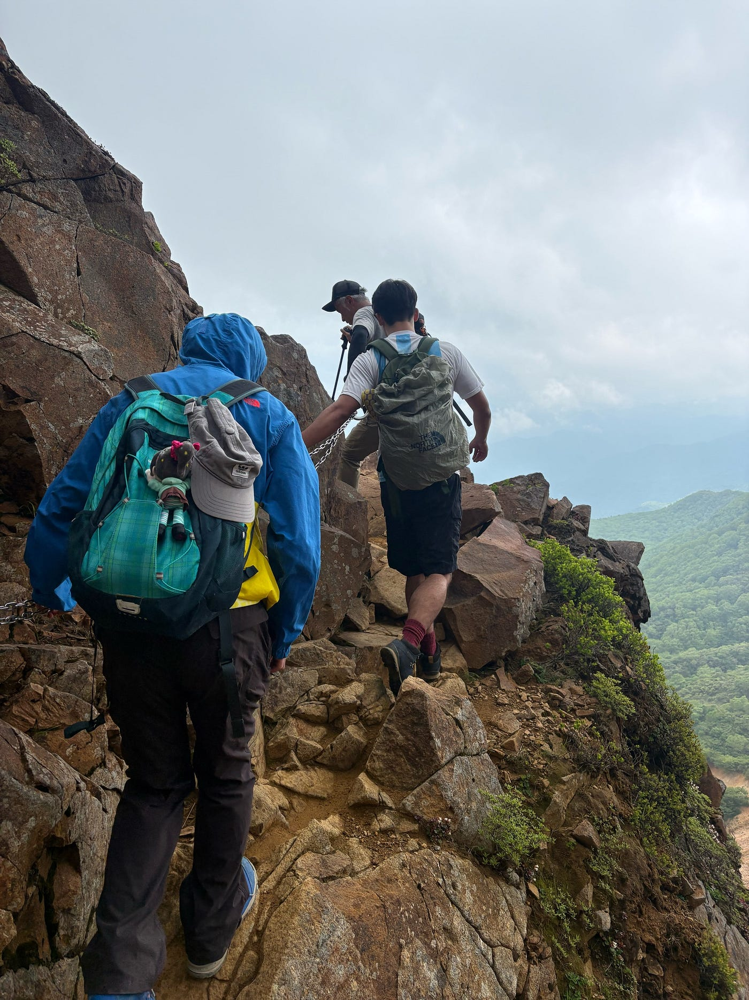
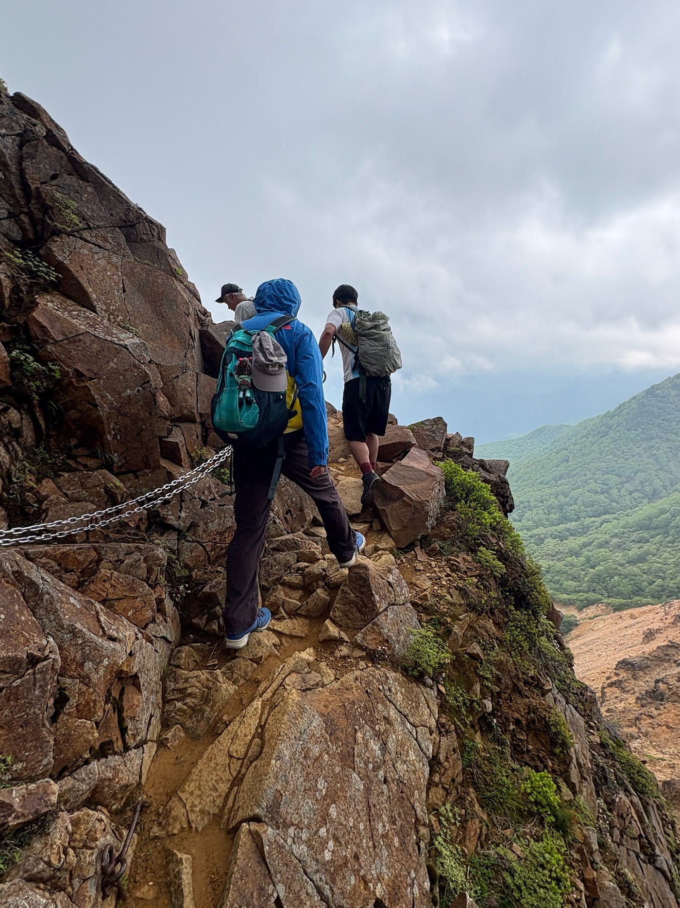
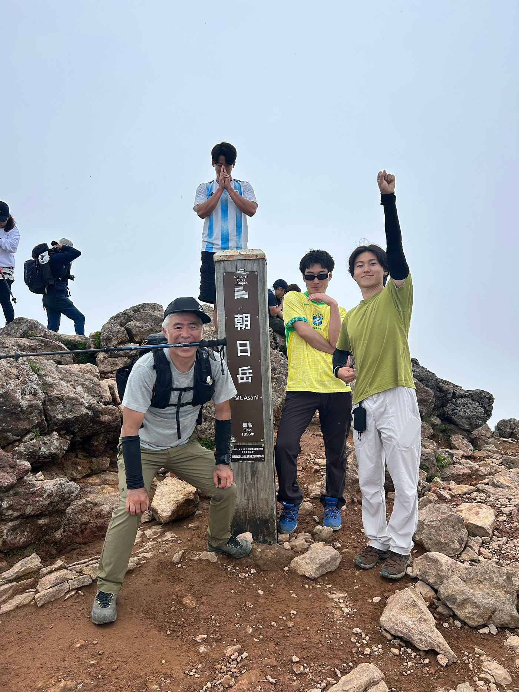
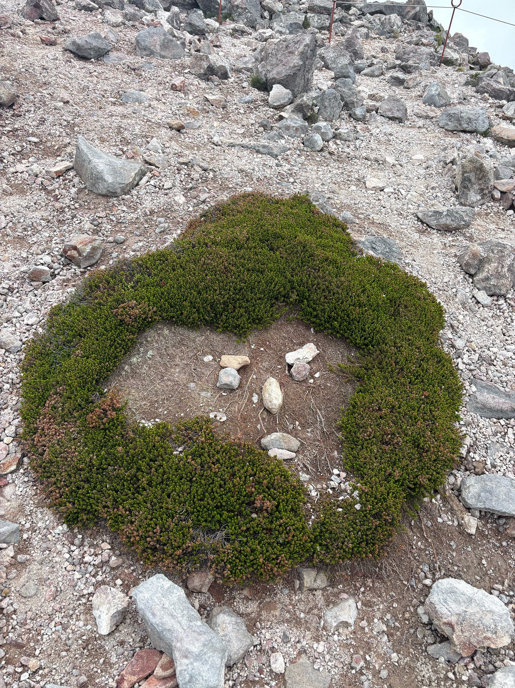
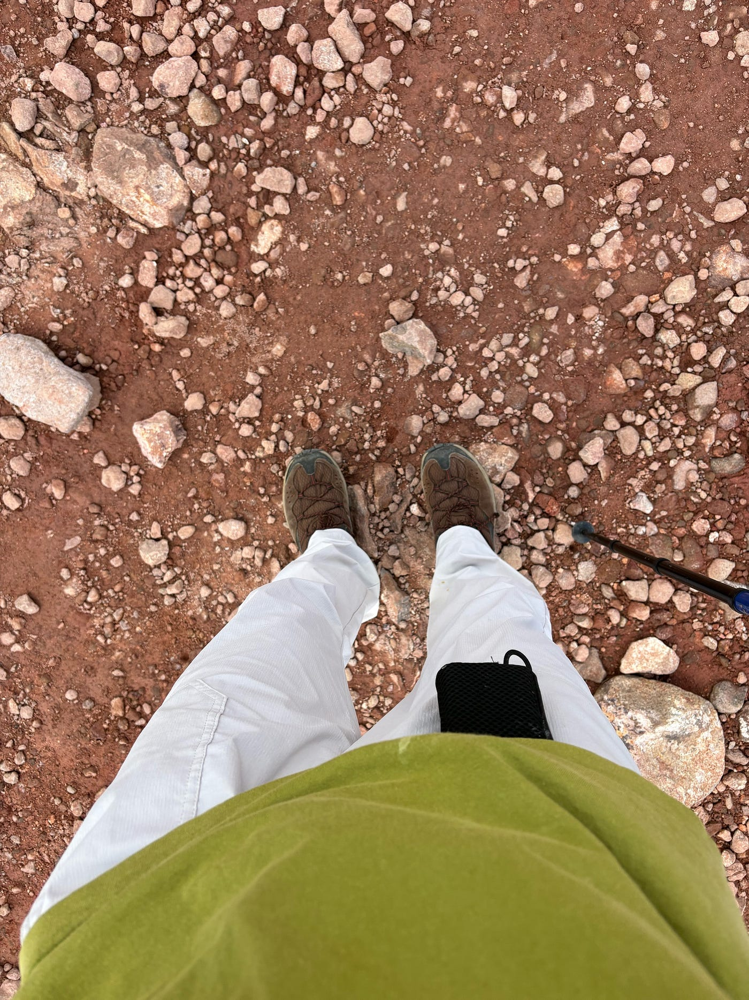
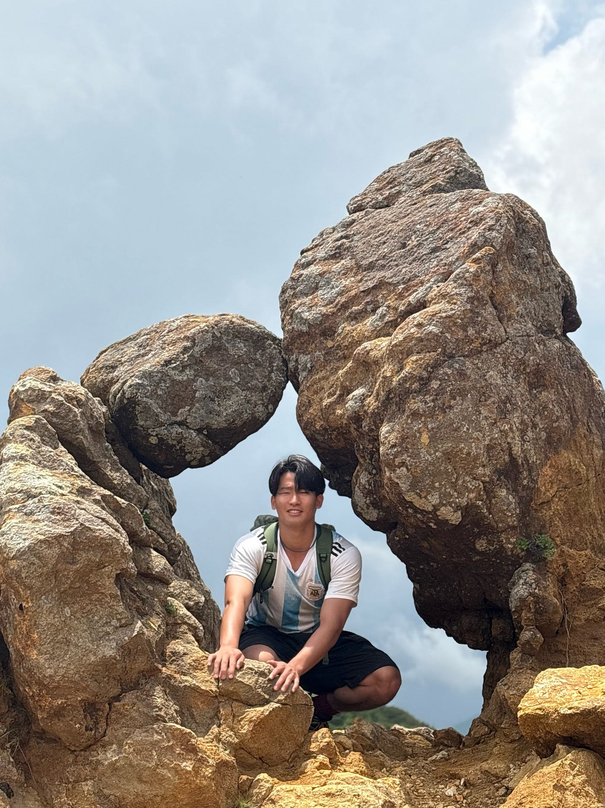

## 那須岳🍆【ヤマッブ週報】

こんにちは。

ヤマッブの活動としていいかわかりませんが、山に行ってきたので自慢します。

### スタート

那須岳は栃木県にある朝日岳、茶臼山などの総称です。今回我々が登ったのはこの二つの山。日本百名山にも認定されており、登山者にとって人気の高い山です。

ユグチさん曰く、百名山は人気なため、整備がされているとのことでした。

ガレ場を歩き、山肌を沿うようにして山を登ります。今までやってきた尾根歩きとは違い、新鮮でした。

### 朝日岳

登頂。かなりあっさり。アップダウンが非常に少なく、ひたすらに景色がいいコースなので気分のいいお散歩気分で楽しめました。

次は茶臼山を目指します。雲に飲み込まれ、小雨に降られながらもぐんぐん進みます。

